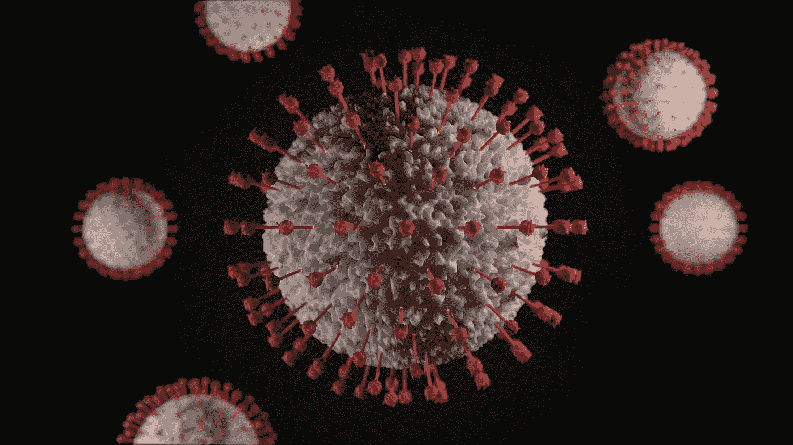
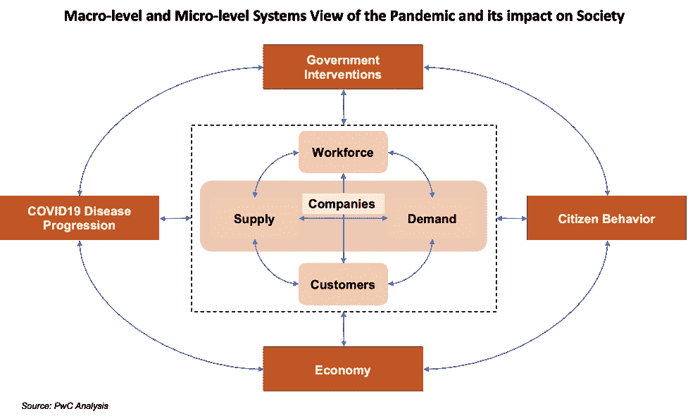

# 思考不确定时代建模的新方法

> 原文：<https://towardsdatascience.com/a-new-way-to-think-about-modeling-for-uncertain-times-34d5dafb4a63?source=collection_archive---------40----------------------->

**不确定时代的建模:方法、行为和结果**

由[维克多·福加斯](https://unsplash.com/@sonance?utm_source=unsplash&utm_medium=referral&utm_content=creditCopyText)在 [Unsplash](https://unsplash.com/s/photos/covid19-virus?utm_source=unsplash&utm_medium=referral&utm_content=creditCopyText) 上拍摄的照片

疫情或新冠肺炎的传播——首先在中国和南韩，然后在欧洲和美国——非常迅速，让大多数政府、公司和公民措手不及。这场全球健康危机在几周内发展成为经济危机和供应链危机。2020 年 3 月初，全球确诊病例不到 10 万例，截至 1 月 28 日，已激增至 1.01 亿多例，死亡人数超过 210 万。

这个星球上几乎每个人生活的方方面面都受到了新冠肺炎的影响。从直接影响(如死亡、住院、感染)到间接影响(如失业、在家工作、精神健康)，病毒几乎影响了这个星球上的每个人。不确定性触及了新冠肺炎统治下生活的方方面面——从健康、行为到经济影响。不确定性往往会助长恐惧、愤怒和沮丧等情绪反应，这种情绪驱动的行为[Firth-Butterfield-etal-2020]往往优先于理性的决定和行动。

除了不确定性之外，个人、公司、决策者和政府都不得不在很少或没有经验、很少历史数据的情况下，在很短的时间内做出决定。高级分析和人工智能模型已被广泛用于帮助解决这些不确定性[Rao-etal-2020]。模型是一种正式的数学表示，可以应用于或校准以适应数据，已被广泛使用。在人类历史上，也许没有任何数据模型比新冠肺炎的感染和死亡曲线更容易辨认。几乎每个人，从印度的农民到美国疾病控制和预防中心(CDC)的主任，都对它们很熟悉。但是这些模型也因其预测的不一致性而招致批评。

那么，模型想要捕捉什么呢？他们能帮助我们做什么决定？我们用什么技术来建立这些模型？

# **covid 19 影响的系统视图**

新冠肺炎的影响是广泛的，全球性的，涉及生活的许多方面，也深刻地影响着我们的生活和生计。对影响的所有不同方面进行建模的最佳方式是采用系统级视图，并隔离关键系统以及这些系统之间的交互。一旦我们有了宏观层面的视图，我们就可以构建那些与我们想要在消费者、公司或国家层面做出的具体决策直接相关的系统的更精细的微观层面的视图。这将使我们变得有弹性——考虑到来自其他相关系统的关键驱动因素，同时也是动态的，我们可以专注于手头的即时决策。图 1 显示了所考虑的所有宏观和微观因素的系统级视图。

图 1:疫情的宏观和微观系统观及其对社会的影响

**新冠肺炎疾病进展**无疑是影响所有其他宏观层面系统的关键系统。许多疫情水平的不确定性，如疾病的不确定性(例如，感染率、潜伏期、扩散过程、增长率、住院率和死亡率)、测试(例如，诊断测试、抗体测试、准确性)、数据(例如，住院人数、死亡人数)和治愈(例如，治疗药物——其功效和何时可用、疫苗——其功效、试验、批准和规模化可用性)都会影响疾病的进展。这些不确定性具有很强的局部性和时间依赖性，例如，在不同的时间对不同的国家、州甚至是邻近地区产生不同的影响。

疾病的发展无疑会影响**政府干预**，这是我们的第二个宏观体系。基于国家的社会距离、经济活动的缩减和启动，如学校、酒吧、餐馆等的开放和关闭。实施或解除封锁的时间和持续时间都会对经济活动和人们的行为产生影响。

**令人惊讶的是，公民行为已经成为疫情最重要的宏观层面系统组成部分之一——疾病的传播和经济活动反弹或停滞的能力【Firth-Butterfield-etal-2020】。虽然一些国家和美国的一些州在执行行动限制方面非常成功，其公民遵守了政府的干预措施，但其他州要么没有实施限制，要么公民没有遵守。当我们通过消费者需求、劳动力安全以及最终公司的财务可行性来考虑其对公司的微观影响时，这种宏观层面的动态变得极其重要和具有挑战性。**

**由政府干预推动的经济是另一个主要的宏观体系组成部分，由于疫情、其公民的行为以及政府为减轻公民和公司的经济痛苦而实施的财政刺激，政府干预抑制或促进了经济活动。**

**所有这四个宏观层次的系统组件都与微观层次的系统组件相互作用。**客户**、**劳动力**、**公司**、**需求**和**供给**是四个关键的微观层面的组成部分。客户和员工是公民的微观变体。一个地区或邮政编码内的公民在参与消费产品和服务时被视为客户，在参与为公司工作的经济活动时也被视为劳动力。公司满足消费者的需求，同时也生产商品或中间产品，为其他公司供货。公司也雇佣劳动力来生产商品和服务。所有这些互动都是通过支撑经济的现金来实现的。**

**在微观层面，需求的不确定性(例如，对航空旅行和旅游等一些产品和服务的需求大幅下降，或对卫生纸等产品的需求大幅增加)、供应链中断、劳动力安全、生产率和时间安排是经济活动的主要影响因素。这些因素加上政府是否提供财政支持，决定了公司的财务可行性(即利润、利润率、流动性和破产)，以及个人的购买力、收入水平和就业状况。**

**制定战略或运营决策不仅需要了解系统层面的观点和组件之间的相互作用，还需要了解关键驱动因素和这些相互作用的性质(例如良性或恶性反馈循环)。考虑到需要做出决策的速度，高管们需要关注疫情的显著影响，以及疫情如何改变正常的反馈回路。**

# ****新冠肺炎建模与决策****

**确定了新冠肺炎系统的关键系统级组件后，我们现在来看看已经构建的特定模型，以及它们帮助我们做出的决策。**

****疾病进展:流行病学模型****

**模拟传染病发展的经典方法被称为 SIR 模型。这三个字母记录了一个人在感染过程中的不同状态，例如，变得 **S** 易受感染，然后 **I** 被感染，最后 **R** 从中恢复。这种类型的建模的进一步改进捕获额外的状态，如 SEIRD 模型(易感、暴露、感染、恢复和死亡)捕获暴露和死亡状态。新冠肺炎疫情已经产生了许多这样的模型-为不同的国家构建-捕获更多的国家。例如，一篇论文[Khalil-etal-2012]记录了上述 SEIRD 状态以及接触、隔离、未隔离和免疫状态。其他一些[Kompella-et al-2020；Silva-et-al-2020]记录有症状前和无症状前、有症状和无症状状态、住院和危急状态。一个模型捕获的感染状态越多，就越有利于精细的决策制定。这确实使模型更加复杂，并且需要更多的数据来校准模型。**

**对疾病进展进行建模的原因是为了能够进行不同的干预，以帮助减少感染、住院、死亡等。以及重返工作岗位和重启经济。这就引出了下一组模型。**

****政府干预&效果:行为模式****

**行为模型捕捉可以实施的不同限制和干预，以及它们在减少疾病传播方面的有效性。这些模型模拟干预措施，如居家命令(SHOs)或社会距离限制，并评估它们如何影响流行病学模型所描述的疾病进展。许多这些模型[Chen 等人-2020]具有时空维度，并且可以通过位置和政治关系来估计对这些命令的遵守情况。来自智能手机的移动数据可以帮助跟踪公民的移动，而不一定要识别他们，以评估封锁甚至社交距离干预的有效性。错误信息[Leitner-2020]对个体依从性和疾病进展的作用也可以使用这些方法进行研究。**

****经济影响:经济模型****

**当与行为模型结合时，流行病学模型也可以用于分析不同干预的经济影响。这些模型[Silva-etal.2020]允许政策制定者分析社会距离干预的不同情景，这些情景具有不同的流行病学和经济影响。Silva 等人在他们的模型中考虑了七种不同的情景:(1)什么也不做，(2)一级防范，(3)有条件的一级防范，(4)垂直隔离，(5)部分隔离，(6)使用面罩，以及(7)使用面罩以及 50%的社会隔离坚持率。**

**这些模型不仅有助于通过各种干预机制减少疾病的传播，还可用于以安全的方式重返工作岗位。例如，王等人的论文评估了纽约市的分阶段重新开放策略及其对城市内公共交通、小汽车交通和微观交通方式的影响。**

# ****不确定时间的建模方法****

**三种特定的建模方法或技术已被用于建立这些流行病学、行为和经济模型。历史上，**基于方程的方法**已被用于传染病传播的建模【段等-2015，亨特等-2018】。微分方程用于定义每个状态(例如，易感、传染性等)中的群体随时间变化的速率。然后随着时间的推移求解这些方程，以了解疾病的动力学。模型中更多的状态意味着需要更多的方程来捕捉相互作用的动力学，因此模型更复杂。基于方程的方法也被称为系统动态(SD)模型。**

**用于建立流行病学模型的第二种方法是基于主体的模型(ABM)。在基于代理的模型中，每个个体被表示为一个代理，他们与其他代理和环境交互。媒介从一种状态(例如，易感、传染性等)变化到另一种状态，并且运行许多这些媒介提供了疾病传播的总体动态。基于等式的方法将每个状态中的所有个体视为单个“隔间”，并且不允许任何个体差异。然而，在基于代理的模型中，每个代理都是独一无二的，这使得我们可以更自然地对前面讨论过的行为方面进行建模。**

**最近，机器学习——**深度学习和强化学习**——被用来建立这些模型。最近的方法是将新冠肺炎病例和死亡与地方层面的社会经济、健康和行为风险因素相结合，并使用深度学习[Fox-etal-2020]来更好地预测疾病进展。同样，强化学习[Kompella-etal-2020]正被用于优化缓解政策。**

**总之，理解疾病发展的动力学及其对个人行为和经济的影响的必要性导致了基于主体、系统动力学和机器学习模型的复兴。假设、数据、模型、政府干预和人类行为之间丰富的相互作用使得这些模型很难建立，但对于以系统的方式评估不同的策略非常有用。**

****参考文献****

**来自新冠肺炎建模的教训:数据、模型和行为的相互作用。“世界经济论坛。全球议程，2020 年 5 月 12 日。**

**Rao，a .和 Firth-Butterfield，k .“[3 种方式——正在转变高级分析和人工智能”](https://www.weforum.org/agenda/2020/07/3-ways-covid-19-is-transforming-advanced-analytics-and-ai/)世界经济论坛。全球议程，2020 年 7 月 23 日。**

**埃及疫情流感基于主体的建模智能系统参考图书馆(2012):205–218。**

**莱特纳斯蒂芬。"[关于流行病和信息流行病产生的动力](https://arxiv.org/pdf/2004.08917.pdf)"心灵&社会(2020 年):**

**陈，m .等.[传播居家医嘱的因果估计](https://arxiv.org/pdf/2005.05469.pdf)ArXiv abs/2005.05469 (2020)。**

**Silva，Petrô nio C.L .等人，" [COVID-ABS:一种基于主体的新冠肺炎流行病模型，用于模拟社会距离干预的健康和经济影响。](https://arxiv.org/pdf/2006.10532.pdf)“混沌、孤子&分形 139 (2020): 110088。**

**[行为惯性对纽约市公共交通重开策略的影响](https://arxiv.org/pdf/2006.13368.pdf)abs/2006.13368 (2020)。**

**AICov:一个用于人口协变量新冠肺炎预测的综合深度学习框架。ArXiv abs/2010.03757 (2020)。**

**Kompella，v .等.“[优化新冠肺炎减缓政策的强化学习。](https://arxiv.org/pdf/2010.10560.pdf)*ArXiv*ABS/2010.10560(2020)。**

**传染病流行病学基于主体的模型和基于方程的模型的比较 *AICS* (2018)。**

**段文伟，范，周刚，郭炳忠，邱，:[传染病模型的数学和计算方法:综述。计算机科学前沿](https://europepmc.org/backend/ptpmcrender.fcgi?accid=PMC7133607&blobtype=pdf) p. (2015)。[https://doi.org/10.1007/s11704-014-3369-2](https://doi.org/10.1007/s11704-014-3369-2)**