# 一种构建知识图的无代码方法

> 原文：<https://towardsdatascience.com/a-no-code-approach-to-building-knowledge-graphs-ce5d6b244b2b?source=collection_archive---------19----------------------->

## 利用像 KgBase 这样的无代码平台从关系数据中获得新的见解

Niklas Ohlrogge 在 [Unsplash](https://unsplash.com/s/photos/knowledge?utm_source=unsplash&utm_medium=referral&utm_content=creditCopyText) 上拍摄的照片

我们周围的世界充满了不同实体之间丰富的关系。我们可以在我们的社交网络、企业内部的组织结构图，甚至维基百科上的所有出版物中找到有意义的链接。

这些联系中的数据包含丰富的信息，从中可以得出深刻的见解，这就是**知识图**擅长捕捉这些关系的地方。

本文深入探讨了我们如何利用**无代码**平台，如 [KgBase](https://www.kgbase.com/?utm_source=blog&utm_medium=KL&utm_campaign=medium) 来创建知识图，并给出了一个涉及药物副作用分析的例子。

# 目录

> ***【1】****[*快速知识简介图表*](#b706)***(2)***[*无代码平台的崛起*](#41fa)
> ***(3)***[*创建我们第一个无代码知识图表*](#0fba)*

# ***(1)知识图表快速介绍***

*知识图组织来自现实世界**实体**(例如，对象、事件、概念)网络的数据，并捕捉它们之间有意义的(又名**语义** ) **关系**。*

*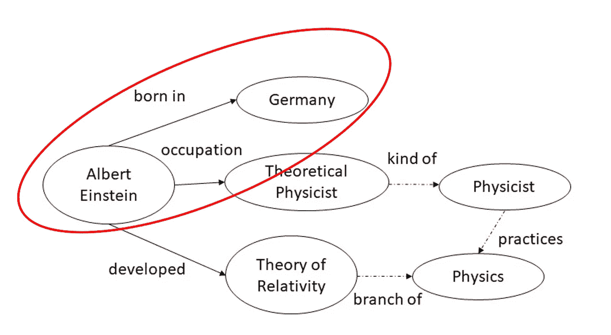*

*样本知识图|图片来源:[斯坦福 CS 520](https://web.stanford.edu/class/cs520/2020/notes/What_is_a_Knowledge_Graph.html)*

*在其最简单的形式中，知识图是一个**有向带标签图**，它由**三个**部分组成:节点、边和标签。*

*我们来看上面知识图中用红色圈出的例子(`**Albert Einstein**` → `**Germany**`)。**节点**是阿尔伯特·爱因斯坦(人)和德国(国家)**边**是这一对节点之间的连接，**标签**代表关系的含义(即阿尔伯特·爱因斯坦出生在德国)。*

*由于知识图在大规模表示实体和关系方面的可靠性，以及企业在从蓬勃发展的数据存储中提取价值方面日益增长的需求，知识图最近受到了欢迎。*

*它们目前广泛用于研究和行业的许多应用中，例如聊天机器人、搜索引擎和产品推荐。*

**

*奥马尔·弗洛雷斯在 [Unsplash](https://unsplash.com?utm_source=medium&utm_medium=referral) 上拍摄的照片*

# ***(2)无代码平台的崛起***

*尽管对编程大肆宣传，但大多数人确实**不**(也不需要**不**)知道如何编码。重要的是，组织需要那些知道如何用正确的工具解决问题的人。*

*无代码解决方案的**可用性使数据科学民主化**，允许非技术用户执行复杂的分析任务，而无需编写任何代码。*

*这些解决方案围绕用户友好的用户界面构建，用户只需**单击、拖放**元素，即可执行一系列自动化功能。*

*[**KgBase**](https://www.kgbase.com/?utm_source=blog&utm_medium=KL&utm_campaign=medium) 是专门为知识图构建的无代码平台的一个例子，它提供了一个即插即用的系统，使用户能够以不同的方式查看各种关系和实体中的数据。*

# *(3)创建我们的第一个无代码知识图*

*让我们探索一下如何用 KgBase 在仅仅**五个步骤**中创建图形。我们将对 13 种常用处方药的副作用进行探索性分析。*

*数据来源于斯坦福网络分析项目( [**SNAP**](http://snap.stanford.edu/) )。具体来说，我们有三个数据子集(来自原始 [ChChSe-Decagon](http://snap.stanford.edu/biodata/datasets/10017/10017-ChChSe-Decagon.html) 数据集)要处理:*

1.  *[***drugs . CSV***](https://github.com/kennethleungty/KgBase-Drug-Side-Effect-Analysis/blob/main/data/DRUGS.csv)→该组 13 种药品的药品名称和药品代码*
2.  *[***副作用. CSV***](https://github.com/kennethleungty/KgBase-Drug-Side-Effect-Analysis/blob/main/data/SIDE-EFFECT.csv)*→副作用名称及对应代码(MedGen 概念 ID)**
3.  **[***匹配-药物-副作用. csv***](https://github.com/kennethleungty/KgBase-Drug-Side-Effect-Analysis/blob/main/data/MATCH-DRUG-SIDE-EFFECT.csv) →药物及相应副作用的表格数据**

**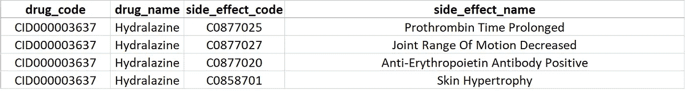**

**match-drug-side-effect.csv |图片作者**

## **步骤 1 —创建项目**

**登录后，我们将看到仪表板登录页面。点击空白文件夹(带有 **+** )，使用空白模板开始一个新项目，并给项目命名，例如**药物副作用**。**

**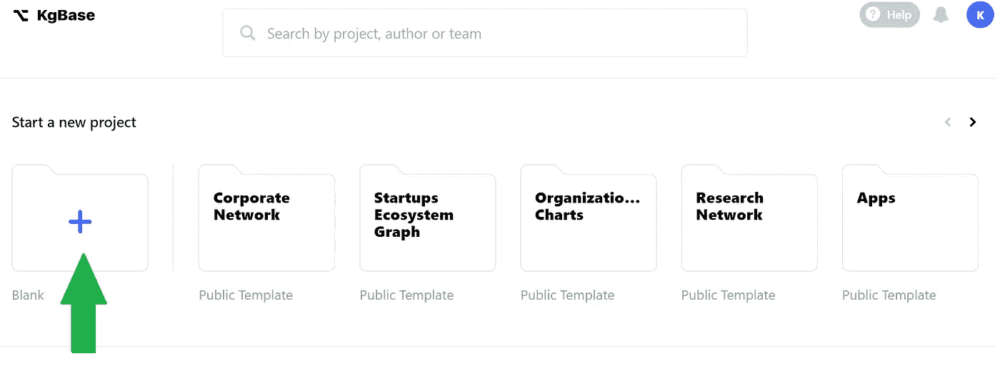**

**作者图片**

****步骤 2 —导入数据****

**在项目创建之后，已经有一个默认的**节点**标题为表 1。现在的目标是为三个数据集中的每一个创建一个节点。**

**我们首先通过点击表 1 名称旁边的省略号()菜单将默认节点重命名为*药品* ，并选择**编辑**以更改节点标签。**

**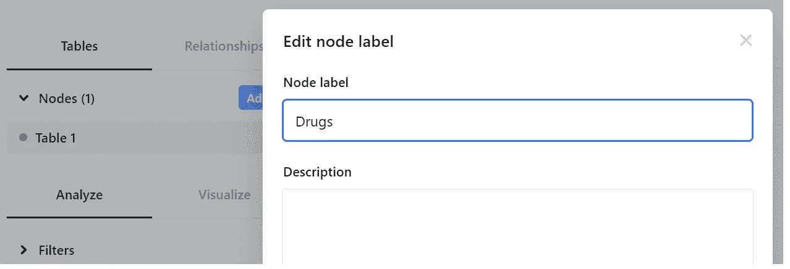**

**作者图片**

**从这里，我们可以导入数据。在**数据**选项卡中，点击**齿轮图标**并从菜单中选择**导入数据**。**

**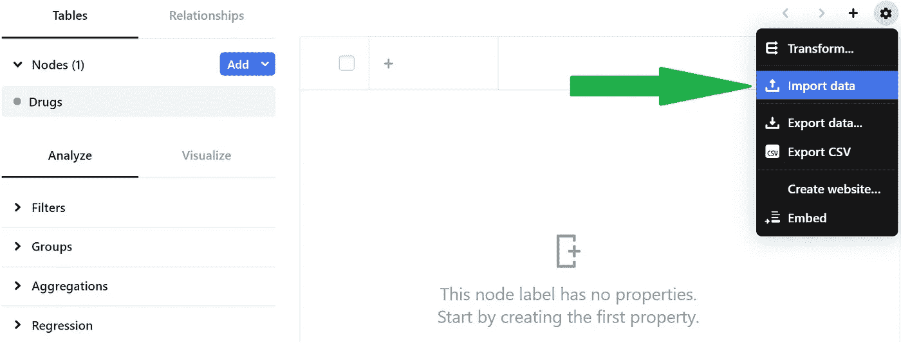**

**作者图片**

**找到 *DRUGS.csv* 进行上传，然后在随后的**配置 csv 文件**部分勾选**包含标题行**和**创建列**两个复选框，然后点击**继续**。**

**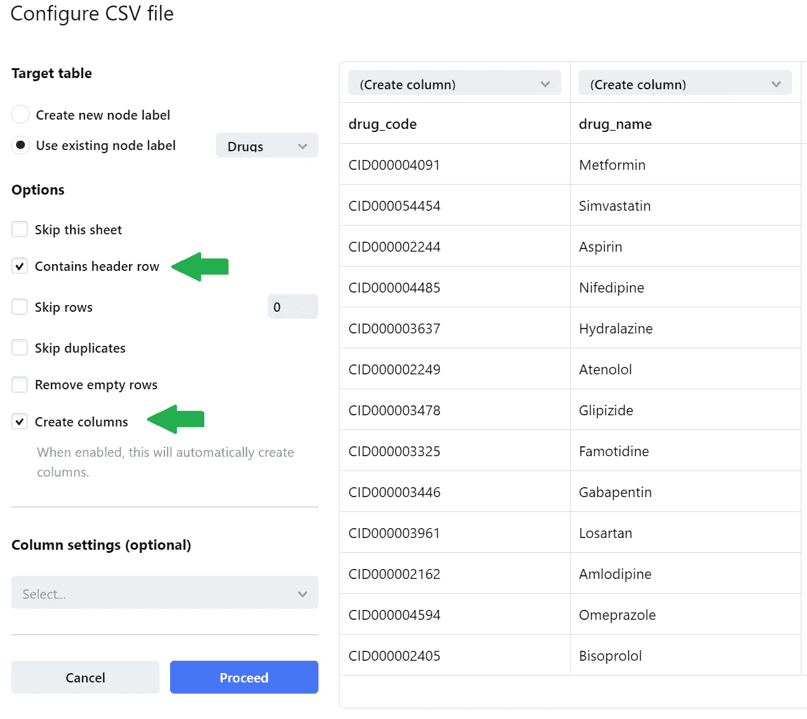**

**作者图片**

**至此，我们完成了包含 *DRUGS.csv* 数据的第一个节点。然后我们再添加**和**两个节点，并对剩下的两个数据集重复上面的指令。**

**我们通过点击**添加**按钮来添加节点，我们可以将这两个节点命名为*副作用*和*匹配表*。**

**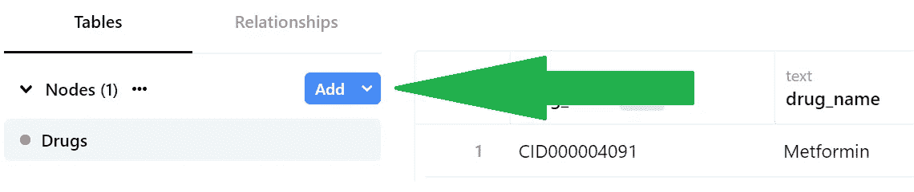**

**作者图片**

**这样做好之后，我们就要有**三个**节点:*药物*、*副作用*、*匹配表。***

## **步骤 3 —设置标签**

**我们将标签**设置为药物和副作用的名称，这样我们的图表将显示名称而不是难以理解的代码。****

**我们首先从列标题旁边的省略号下拉菜单中选择“**用作标签**”。确保对所有三个节点的**执行此操作，以便*药物名称*和*副作用名称*列最终会在旁边有一个灰色的“**标签**指示器。****

**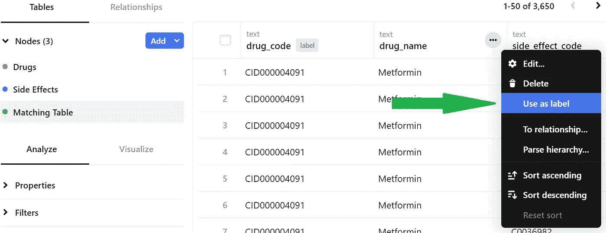**

**作者图片**

## **步骤 4 —定义节点之间的关系**

**转到'*匹配表*'节点，定义所有节点之间的关系。我们点击*药品名称*栏旁边的省略号菜单，选择“**到关系”**。**

**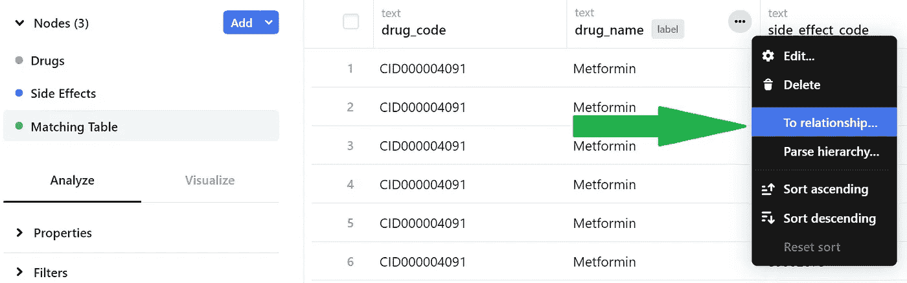**

**作者图片**

**我们选择“**一对一关系**”按钮(因为这是一对一的名称映射)，然后单击下一个的**。****

**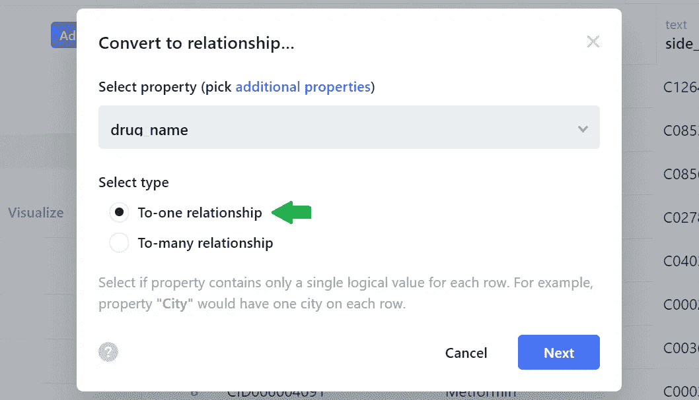**

**作者图片**

**在下一页，我们将被要求指定一个目标节点标签。我们的目标节点标签( *drug_name* )已经存在于*药品*节点中，所以我们在点击 **Convert** 之前从现有的表格中选择合适的标签。**

**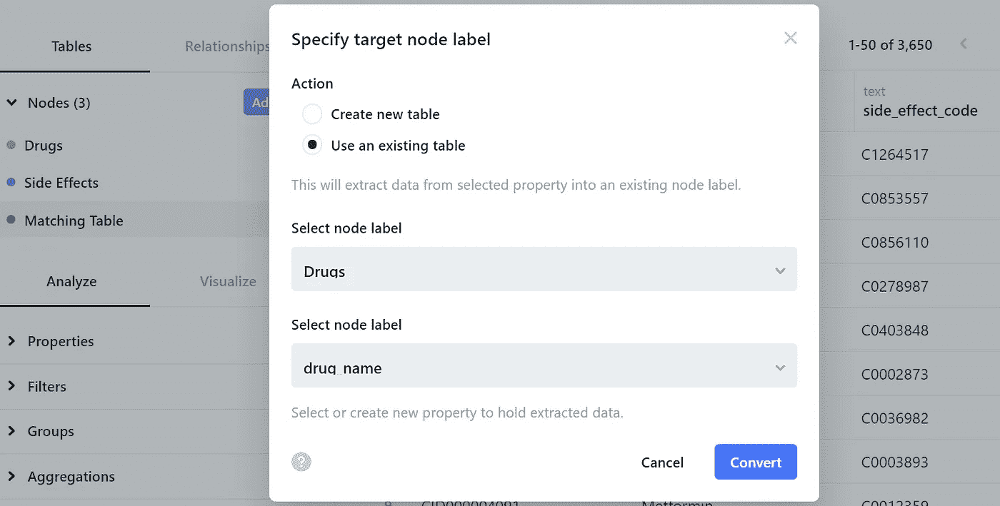**

**作者图片**

**我们对副作用重复这一步骤，其中我们为*匹配表*节点中的 *side_effect_name* 与*副作用*节点中的匹配 *side_effect_name* 创建了一个**对一关系**。**

**当该步骤成功完成时，我们将看到标签在*匹配表*中以浅蓝色突出显示。**

**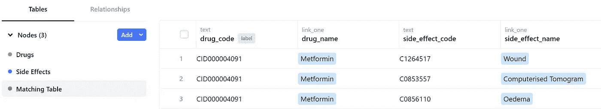**

**作者图片**

## **步骤 5—将表转换为关系**

**最后一步是根据源列和目标列将整个匹配表转换成**关系**。来源是*药物名称，*，目标是*副作用名称*，因为我们希望将每种药物与其副作用联系起来。**

**我们通过点击*匹配表*节点的省略号菜单并选择**‘To relationship’**来执行此转换。**

**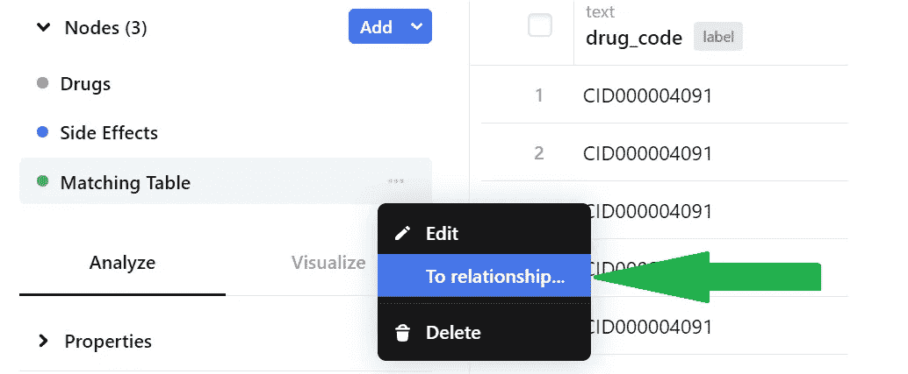**

**作者图片**

**在下一页，我们定义相应的源和目标列，然后选择 **Convert** 。**

**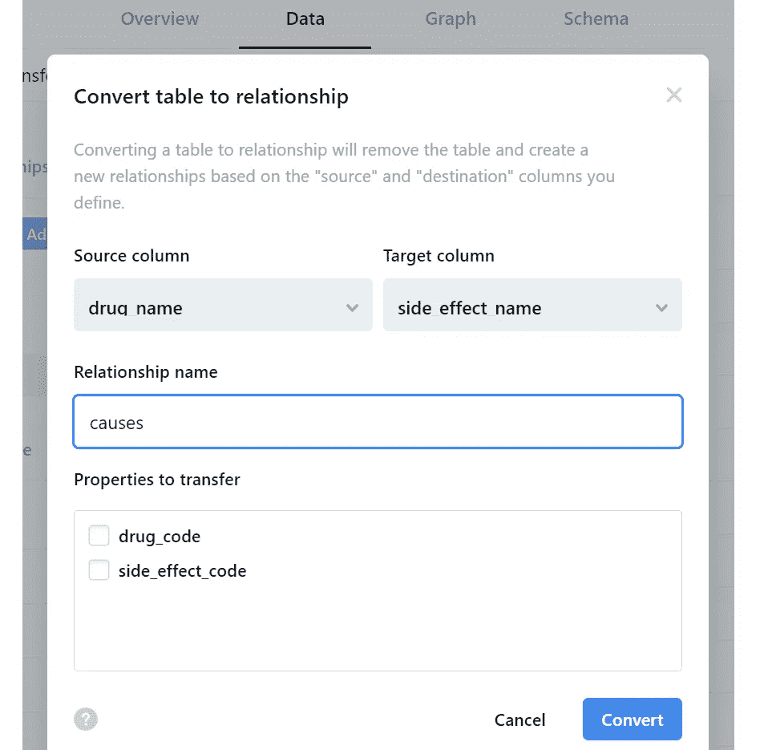**

**作者图片**

**在转换时(需要 5 到 10 分钟)，我们将完成我们的知识图，而无需编写任何代码！**

# **(4)可视化知识图**

**让我们来看看我们构建的知识图的可视化。我们通过点击顶部栏的**图表**选项卡来完成，页面将显示图表(基于整个网络的随机样本)。**

**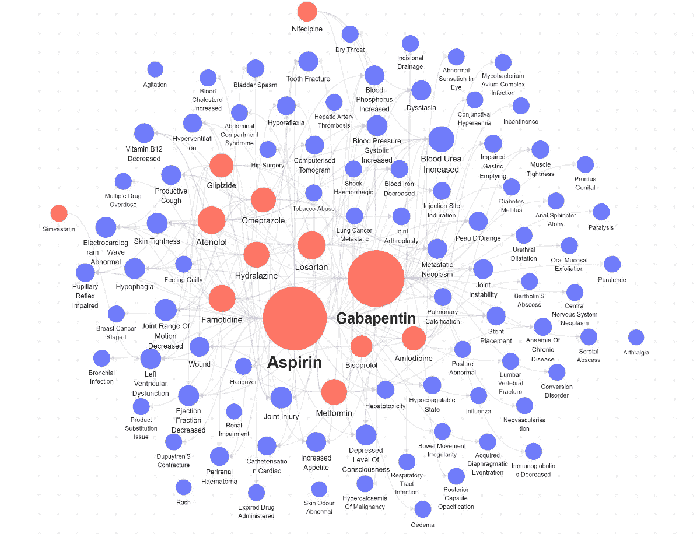**

**作者的知识图|图像的可视化**

**红色节点代表药物，而蓝色节点代表副作用。我们可以很容易地看到，根据淋巴结大小，**阿司匹林**的副作用数量最多。**

**当我们选择单个副作用时，例如**反射减弱**，我们可以看到哪些药物可能会导致特定的副作用。**

**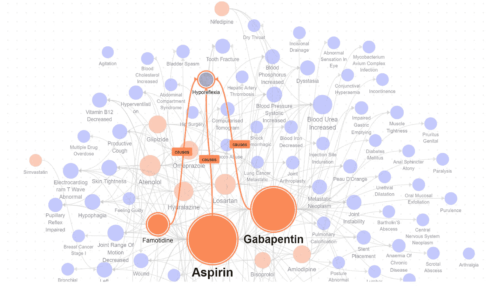**

**作者的知识图|图像的可视化**

**用户界面中还有大量选项可用于更深入的分析。这些选项包括将图形限制为特定属性的过滤器和基于预定义约束定位路径的复杂查询。**

**你可以在 [**这里**](https://www.kgbase.com/data/kleung/drug-side-effects/ctx-MoEldw_BfeOcmvD-ZgB/graph) 浏览这个项目的公共文件夹。**

# **(5)用业务元数据丰富分析**

**除了创建知识图表， [KgBase](https://www.kgbase.com/?utm_source=blog&utm_medium=KL&utm_campaign=medium) 还是一个开放协作的**知识图表库**的所在地，其中包含全球 10 万多家公司的业务数据。这个丰富的数据库使用户能够将分散的数据符号联系在一起，并消除冗余的映射过程。**

**例如，对医药公司' *Amgen'* 的简单搜索会返回其通用业务标识符( **UBID** )和相应的元数据，如品牌映射和财务标识符(例如，CUSIPs、ISINs、DUNS、FIGI 编号等)。)**

**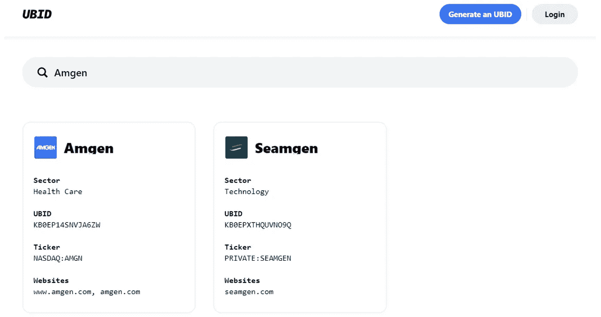**

**UBID 知识库中的搜索结果|作者图片**

**本着开源协作的精神，用户可以通过贡献尚不存在的业务元数据来丰富这个数据库。**

**例如，“*列克制药*”的 UBID 是由一名投稿人提供的，该信息随后被批准和添加。**

**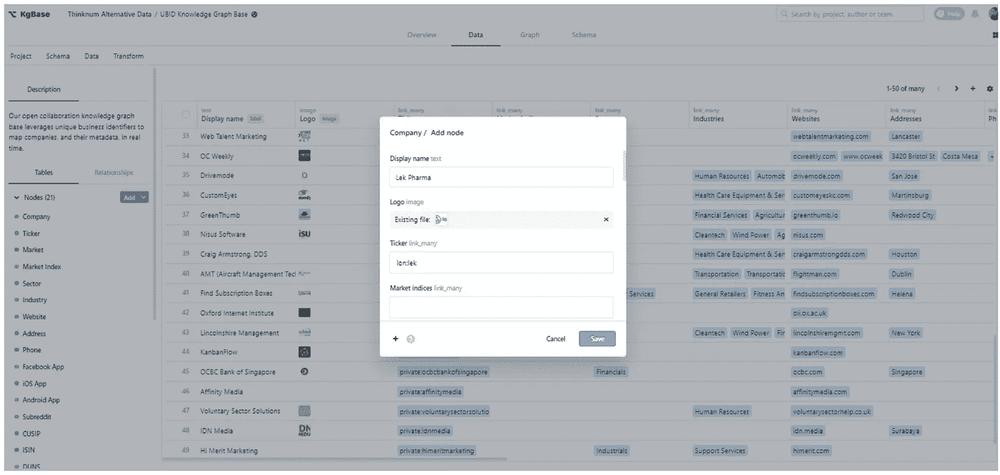**

**向 UBID 知识图谱库添加元数据|作者图片**

# **(6)结论**

**关于知识图的能力，我们只看到了冰山一角。例如，企业还可以使用知识图创建[通用数据源](https://www.kgbase.com/pages/resources/the-rise-of-no-code-knowledge-graphs)来连接跨不同领域的多个数据源。**

**在过去，构建知识图需要大量的工作，但是无代码平台使得非专家创建、集成和维护这样的系统变得更加容易。**

**因此，看到这些平台继续变得越来越主流并帮助使用知识图表的好处大众化就不足为奇了。**

# **在你走之前**

**欢迎您来到**，与我一起踏上数据科学学习之旅！**关注我的[媒体](https://kennethleungty.medium.com/)页面和 [GitHub](https://github.com/kennethleungty) 以了解更多精彩的数据科学内容。同时，享受构建知识图表的乐趣！**