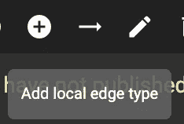
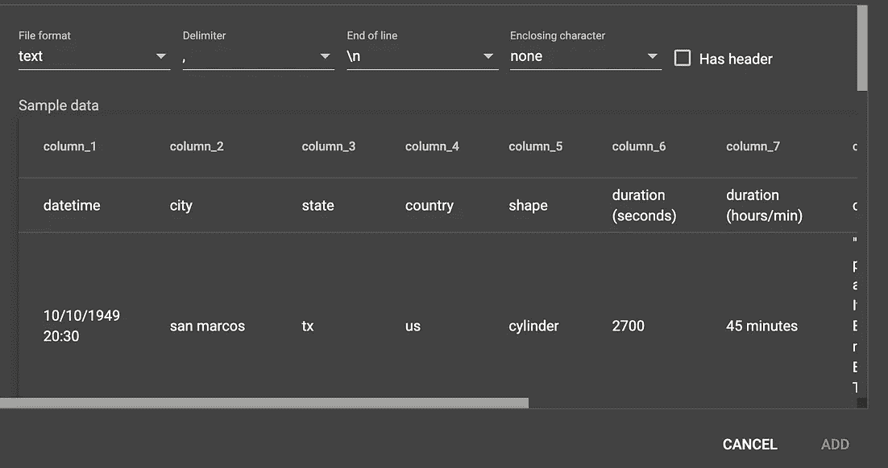

# 使用 TigerGraph 的地理空间布局功能绘制 UFO 目击图的无代码方法

> 原文：<https://towardsdatascience.com/a-no-code-method-of-mapping-ufo-sightings-with-tigergraphs-geospatial-layout-feature-a7676ea2c074?source=collection_archive---------32----------------------->

## 将 TigerGraph 的地理空间布局功能用于自定义数据集

# 介绍

## 概观

在[之前的博客](/introducing-tigergraph-3-2s-new-geospatial-layout-feature-mapping-covid-19-travel-events-fe05b2b1d1e9)中，我们利用 TigerGraph 的新冠肺炎入门套件，通过地理空间布局功能来绘制旅游事件地图。现在让我们看看如何为自定义数据集使用地理空间布局功能。在这种情况下，我们将使用 Kaggle 的 UFO 目击数据集。让我们投入进去吧！

## 旅程

*   介绍
*   设置 TigerGraph 3.2 解决方案
*   创建模式
*   准备并加载数据
*   绘制目击地图
*   后续步骤

## 工具和资源

*   [TigerGraph 云](https://tgcloud.io/)
*   [Kaggle](https://kaggle.com/) (特别是 [UFO 数据集](https://www.kaggle.com/NUFORC/ufo-sightings))

# 第一步:建立一个 TigerGraph 3.2 解决方案

首先，我们将推出一个免费的 TigerGraph 3.2 云解决方案。为此，导航至[https://tgcloud.io/](https://tgcloud.io/)并登录或注册。

 [## TigerGraph 云门户

### 创建免费的 TigerGraph 云解决方案

tgcloud.io](https://tgcloud.io/) 

在左侧边栏中，选择“我的解决方案”,然后按蓝色的“创建解决方案”按钮。

点击“我的解决方案”，然后点击“创建解决方案”(图片由作者提供)

在第一页上，确保您的版本是 3.2，并选择空白的初学者工具包。按下一步。

创建一个空白的 3.2 解决方案(图片由作者提供)

不要更改第二页上的任何内容。本质上，这只是为你创造了一个免费的解决方案。

第二页保持原样(图片由作者提供)

在第三页上，更新特定解决方案的信息。

将此更新到您的解决方案中(图片由作者提供)

最后，在第四步，确认一切正常，然后点击“提交”

仔细检查一切并提交！(图片由作者提供)

等到你的状态变成绿色，然后按下四个方块并从下拉菜单中选择“GraphStudio”来启动 GraphStudio。

当你的状态变成绿色时，按下四个方块，然后从下拉列表中点击“GraphStudio”

完美！现在您已经准备好创建您的模式了。

# 第二步:创建模式

让我们首先基于数据创建模式。为此，点击“全局视图”，然后创建一个新的图表(我称之为不明飞行物)。

点击“全局视图”并从下拉菜单中点击“创建图表”(图片由作者提供)

输入 Graphname(如“UFO”)(图片由作者提供)

要开始设计模式，请按“设计模式”选项卡。

点击进入“设计模式”标签(图片由作者提供)

要添加(局部)顶点，请按顶部的加号按钮并适当编辑属性。

按加号添加一个局部顶点(图片由作者提供)

适当地更新属性。(图片由作者提供)

要添加边，请单击箭头，然后单击要连接的两个顶点。

用箭头添加一条局部边，然后单击要连接的两个顶点(图片由作者提供)

根据需要编辑属性(图片由作者提供)

至于模式设计，虽然我们可以使它更复杂，但我选择将国家、州和城市分成顶点(用它们的值作为主 id 和属性),并将其余数据添加到主 id 为 DateTime 的景点顶点中。

图表的模式(图片由作者提供)

瞄准顶点的属性(图片由作者提供)

一旦创建了模式，按向上键发布模式，您就可以进入下一步了！

按向上箭头发布模式(作者图片)

# 第三步:准备和加载数据

接下来，我从 Kaggle UFO 目击数据集下载了 [complete.csv](https://www.kaggle.com/NUFORC/ufo-sightings?select=complete.csv) 文件，并上传到 GraphStudio。为此，导航到“将数据映射到图形”选项卡，然后单击“添加数据文件”选项。

导航到“地图数据”选项卡，然后单击“添加数据文件”选项。(图片由作者提供)

按加号，上传 CSV，然后添加。

选择 CSV，然后按“添加”按钮。(图片由作者提供)

然后，我将 CSV 映射到适当的顶点和边。为此，您可以单击 CSV，按下带有“将数据文件映射到顶点或边”悬停数据的交叉箭头，然后适当地映射数据。

绘制数据图(图片由作者提供)

最后，我通过导航到“Load Data”并按下 play 按钮将数据加载到图表中。

转到“加载数据”选项卡并按下播放按钮。(图片由作者提供)

之后，在图表统计中，您应该会看到图表中所有的顶点和边。

您应该可以看到图中的顶点和边(图片由作者提供)

完美！现在我们可以绘制数据。

# 第四步:绘制景点地图

最后，使用“Explore Graph”选项卡，我绘制了数据。我首先选择了 100 个景点。

导航到“探索图”并选择 100 个观察点。(图片由作者提供)

接下来，我单击强制并选择地理空间地图选项。这样，顶点就就位了！

测绘结果(图片由作者提供)

从这一点，我可以说大多数的 UFO 目击事件，至少从这个样本来看，是来自美国的。我探索了更多的数据，并放大了美国，以了解更多关于这些目击事件的信息。

只有美国地图(图片由作者提供)

从这里，我可以在 GraphStudio 中微调我的数据探索等等，而无需编写任何代码。

# 第五步:下一步

完美！既然您已经在这个自定义图表上使用了地理空间映射功能，那么您现在可以轻松地在自己的项目中使用它。如果您有任何问题或遇到任何错误，请随时在社区论坛上发表。

 [## 老虎图

### 话题回复浏览量活动 1 808 2020 年 2 月 20 日 11 月 22 日-26 日每周更新:Graph+AI 纽约视频，AMC…

community.tigergraph.com](https://community.tigergraph.com/) 

此外，你可以和更多的 TigerGraph 开发者在社区 Discord 上聊天。

 [## 加入 TigerGraph Discord 服务器！

### 查看 Discord 上的 TigerGraph 社区-与 725 名其他成员一起玩，享受免费的语音和文本聊天。

不和谐. gg](https://discord.gg/gRHWBZNpxW) 

祝你在你的项目中使用这些地图好运，我迫不及待地想看看你创造了多么棒的项目！

## 数据源

使用的数据来自 Kaggle [这里是](https://www.kaggle.com/NUFORC/ufo-sightings)，没有指定许可证。西格蒙德·阿克塞尔[在这里](https://github.com/planetsig/ufo-reports)从 NUFORC 数据中搜集、地理定位和时间标准化了这个数据集。