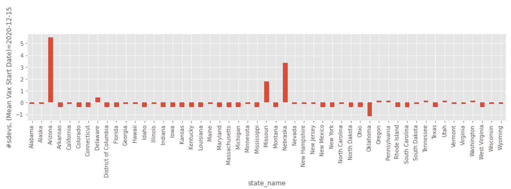
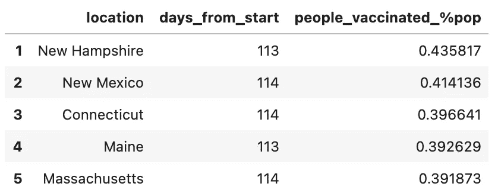
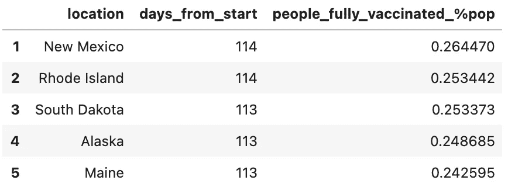
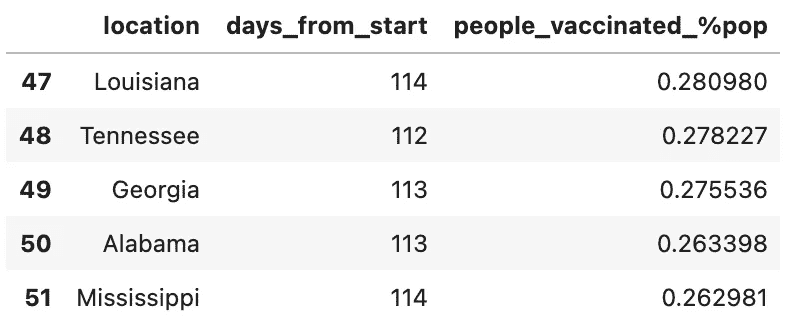
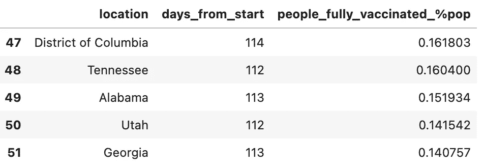
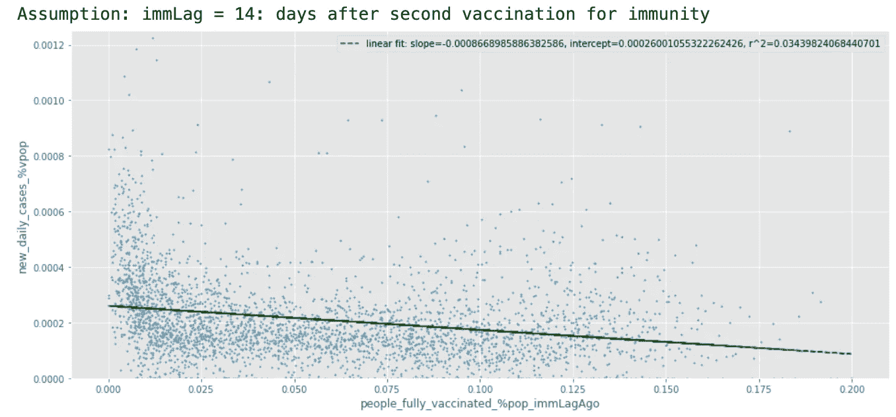
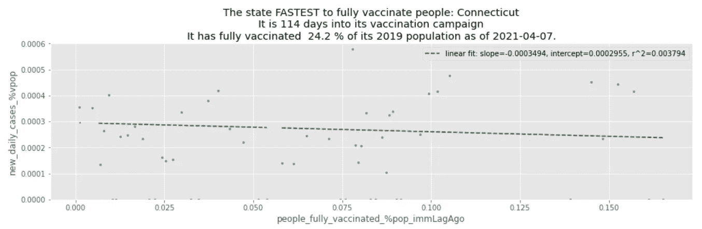
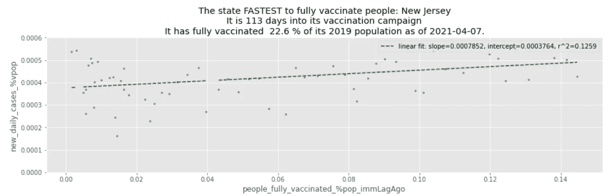
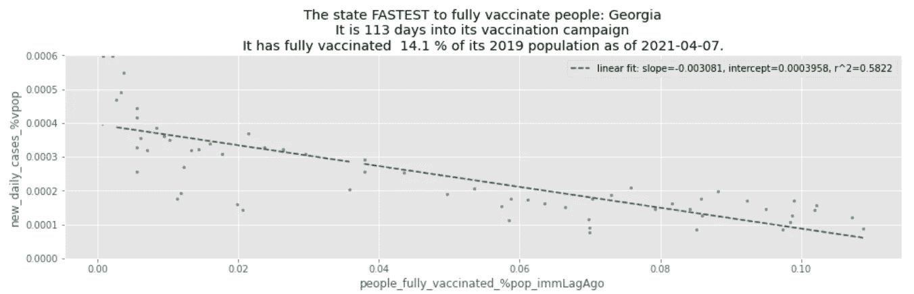
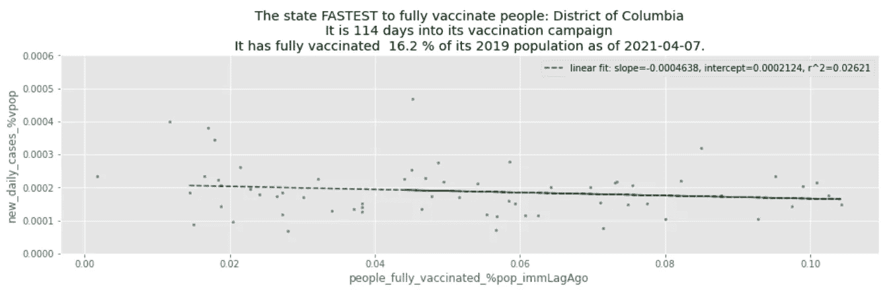

# 一个非流行病学家对美国新冠肺炎疫苗接种公开数据来源的统计检查

> 原文：<https://towardsdatascience.com/a-non-epidemiologists-statistical-examination-of-us-state-level-open-data-sources-on-covid-19-788c37683966?source=collection_archive---------33----------------------->

## 试图合成一个复杂的数据集网络


图片作者:[尼克·费因斯](https://unsplash.com/@jannerboy62)

2021 年 3 月 29 日，我收到了印第安纳州卫生部的电子邮件邀请我接种新冠肺炎疫苗。我没有密切关注疫苗的推出，我正在寻找经验。我的目标是更好地理解疫苗接种运动。在本文发表时，大约 25%的美国人口已经接种了疫苗。我试图获得一些背景资料，并在新冠肺炎的误传世界中梳理出什么是事实，什么是虚假的。从我对 COVID 数据集的早期研究中，我希望看到数据实践的发展。这是跟踪一个非常重要的现实世界现象的一个资金充足的最佳尝试，因此它是数据结构和“最佳实践”的一个很好的例子。作为一个数据猴，很难忽视。所有的代码都是公开的，可以在这里找到:

*   [公开回购](https://github.com/free-soellingeraj/blog/blob/master/_notebooks/coronavirus_vaccine_effect.ipynb)

# 数据源

1.  《纽约时报》新冠肺炎州级病例跟踪系统(`cvd`)维护着州级每日新增病例和死亡人数[数据](https://raw.githubusercontent.com/nytimes/covid-19-data/master/us-states.csv) [定义](https://github.com/nytimes/covid-19-data)
2.  牛津新冠肺炎政府响应跟踪系统(OxCGRT，又名`oxf`)描述了与政府政策相关的事件时间表，但不太详细。[数据](https://github.com/GoogleCloudPlatform/covid-19-open-data) [定义](https://github.com/OxCGRT/covid-policy-tracker/blob/master/documentation/codebook.md)
3.  OWID ( `vax`)结合多种来源[数据](https://raw.githubusercontent.com/owid/covid-19-data/master/public/data/vaccinations/us_state_vaccinations.csv) [定义](https://github.com/owid/covid-19-data/tree/master/public/data/vaccinations)维护每日接种疫苗和完全接种疫苗的人数
4.  美国人口普查州级人口(`pop`)是基于美国人口普查工作[数据](https://api.census.gov/data/2019/pep/charagegroups?get=NAME,POP&for=state:*) [定义](https://www.census.gov/data/developers/data-sets/popest-popproj.html)对美国人口最全面和最纯粹的估计

连接这些数据源需要清理转换。这些转换的代码在这个博客中进行了总结，在这里我就不赘述了。然而这些代码都可以在[公开回购](https://github.com/free-soellingeraj/blog/blob/master/_notebooks/coronavirus_vaccine_effect.ipynb)中找到。

# 数据质量报告

## 新冠肺炎纽约时报

开始:2020–01–21
结束:2021–03–31
今天:2021–04–01
**接种反应变量全状态记录:**

*   开始时间:2020 年 3 月 13 日
*   结束时间:2021 年 3 月 31 日
*   未满:【<=2020–03–12]
*   subset of states always reporting: [Washington]

Conclusions:

1.  We remove the data prior to 2020–03–13.

## OxCGRT

Starts: 2020–01–01
结束:2021–03–30
今日:2021–04–01
接种反应变量全状态记录:

*   开始时间:2020 年 9 月 14 日
*   结束时间:2021 年 3 月 29 日
*   未满:[2020–12–08，> = 2021–02–12]

结论:

1.  我们假设在 2020 年 9 月 14 日之前，没有已知的疫苗接种，因此这些人实际上是 0

## OWID 疫苗接种数据(州级数据)

开始:2020–12–20
结束:2021–03–31
今天:2021–04–01
**接种反应变量全状态记录:**

*   开始时间:2020 年 9 月 14 日
*   结束时间:2021 年 3 月 29 日
*   未满:[2020–12–08，> = 2021–02–12]

结论:

*   除了每个州何时开始提供疫苗之外，这个数据集可能对一些问题有用。
*   不能用于确定疫苗接种活动的早期时间表，即开始日期。
*   反映了疾病预防控制中心如何将疫苗接种归属于各州的政策变化，该政策从 2021 年 2 月 19 日开始实施。这将在这篇博客中一瞥而过，但是解释这个噩梦所需的策略值得在第二篇文章中讨论。代码可在 github 中获得。

## 清洁任务的非详尽总结

1.  我们将连接数据集的关键索引是日期和州名，因此我们在数据集之间符合日期和州名
2.  牛津数据集要求将关键变量编码为类别，该数据集描述了与政府政策实施相关的大致时间表，包括美国各州的疫苗接种活动
3.  由于疫苗接种数据集在 COVID 病例跟踪数据集之后开始，因此我们在疫苗接种数据集可用之前用 0 填充日期。
4.  异常移除。在 OWID 数据集中，起始观测值是异常的。我认为这是因为数据实际上没有涵盖真正的开始日期，所以第一次观察从零开始进行了不合理的跳跃。
5.  人口调整。每个源数据集可能已经提供了人口调整后的估计值，也可能没有。我们选择使用疫苗接种、新增病例和死亡的非调整来源观察，所有人口估计都始于独立来源的 2019 年美国人口普查。

# 调查目标

问题在一开始就被定义，以集中工作并避免迷失在数据的海洋中。可能目前有 1000 多个数据源，它们形成了一个复杂的相互依赖的网络。尝试以某种有意义的方式来度量这种相互依赖性将是一项有趣的后续任务。选择 4 个数据集来回答我们的问题，但它们也包括许多其他变量。所以专注是关键。

## 调查将围绕 3 个主要问题展开:

1.  每个州什么时候开始接种疫苗，谁是第一个，最后一个，平均水平？统计显著？
2.  哪些州在给人们接种疫苗和完全接种疫苗方面最快、最慢、一般？统计显著？
3.  哪些州看到了疫苗接种对减少新病例的最大、最小和平均影响？统计显著？

## 该调查将试图解释以下主要混淆因素:

1.  在开始接种疫苗时，冠状病毒检测呈阳性的人口比例是多少？(例如，合格人口的规模有多大？)
2.  人群中发生了多少个人之间的高风险活动？
3.  发生了多少误诊？数据集中有多少噪音？哪些州最擅长报告病例？
4.  接种了哪种疫苗？
5.  与疫苗相比，行为改变在多大程度上影响了病例/死亡的减少？

# 每个州从哪一天开始接种疫苗，谁是第一个，最后一个，平均？统计显著？

冠状病毒疫苗的采购在州一级进行，并非所有的州都同时开始。这里，我们考虑每个州的疫苗接种日期变为非零(“0-不可用”)。统计显著性的度量基于日期的分布，我们将描述异常和统计显著性异常。绘制密度图，每天，我们计算开始接种疫苗的州的数量。所以，我们需要计算疫苗首次出现的日期。

如果你知道更多关于这个过程是如何运行的，以及为什么一些州比其他州更慢地实施他们的第一批疫苗，请随时留下评论。作者也没有排除牛津数据集在具体日期上出错的可能性。

## 疫苗接种的早期、正常和晚期状态

> *第一个州:俄克拉荷马州(2020–12–11)
> 最后一个州:亚利桑那州(2021–01–05)
> 平均日期:(2020–12–15)
> 中位数日期:(2020–12–15)
> 标准差:3.74 天*

## 异常和统计显著性

典型的州于 2020 年 12 月 15 日开始为其人口接种疫苗。有 3 个州起步较晚，从最晚的开始:亚利桑那州、内布拉斯加州和密苏里州(按此顺序)。亚利桑那州和内布拉斯加州可被视为统计显著异常，因为它们超过平均值的 3 个标准偏差。

```
vax_start_dates_oxf = []
for state, data in oxf.df.groupby('state_name'):
    a = data[data['vaccination_policy'] != 0.0]
    b = a.sort_values('date').iloc[0]
    c = b.to_dict()
    vax_start_dates_oxf.append(c)  
vax_start_dates_oxf = pd.DataFrame(vax_start_dates_oxf)
first_vax = vax_start_dates_oxf.date.min()
vax_start_dates_oxf['days_from_first'] = vax_start_dates_oxf['date'].apply(lambda x: (x-first_vax).days)
vax_start_dates_oxf['days_from_first'].hist(
    bins=vax_start_dates_oxf['days_from_first'].max(), 
    figsize=(16,3), grid=True,
)
```



州疫苗接种开始日期的 z 分数(图片由作者提供)

# 接种疫苗的速度:哪些州在给人们接种疫苗和完全接种疫苗方面最快、最慢、一般？统计显著？

加载了两个数据集，其中包含有关全州推广速度的信息。目标是尽快为尽可能多的公民接种疫苗。所以每天我们都会考察一个“步伐排行榜”。我们将为每个日期计算一个函数，该函数根据接种疫苗的受试者和完全接种疫苗的受试者的数量返回各州的有序列表。为此，我们将使用 OWID 数据集，其中包含已接种疫苗的数量。我们将向数据集添加两个新值:

1.  各州 2019 年人口普查人口实施的疫苗接种
2.  从开始算起的天数

首先，我们观察接种过疫苗的受试者，然后详细讨论等级排序背后的分布，以检验显著性。

我们研究的变量来自 OWID 中的底层数据。

```
adj_vax['adj_total_vaccinations'] = adj_vax.apply(
    lambda x: x['total_vaccinations'] / float(state_to_pop[x['location']]),
    axis=1
)
adj_vax['people_vaccinated_%pop'] = adj_vax.apply(
    lambda x: x['people_vaccinated'] / float(state_to_pop[x['location']]),
    axis=1
)
adj_vax['people_fully_vaccinated_%pop'] = adj_vax.apply(
    lambda x: x['people_fully_vaccinated'] / float(state_to_pop[x['location']]),
    axis=1
)
adj_vax['days_from_start'] = adj_vax.apply(
    lambda x: (x['date'] - state_to_start[x['location']]).days,
    axis=1
)
```

## 速度领先和统计显著性

为了确定领先是否具有统计显著性，我们将使用“领先步速”的分布作为步速测量的`(k-1)-th`和`k-th`观察值之间的%差异。因此每天会有 50 次观察，`N=40*50=2000`接近于一个显著样本量的观察来检验这个问题。因为我们是根据每日排名的有序列表计算领先速度的，所以我们通过顺序统计进行建模，并将通过比较`j-th`和`k-th`“领先速度”的分布来检验“领先就是领先”的假设，其中`j != k`。

## 疾病预防控制中心政策变化引起数据质量问题

[(彭博，2021–01–21)](https://www.bloomberg.com/news/live-blog/2021-01-21/methodology-and-analysis-for-the-covid-19-vaccine-tracker#60319089B2240006)描述了我们观察到的`people_vaccinated`和`people_fully_vaccinated`的累计和在减少的问题。影响 OWID 数据集的 CDC 政策变化的生效日期并不完全相同，因此这使得各州疫苗制度之间的比较变得复杂。我最初是通过寻找变化大到足以导致接种疫苗的人数少于政策变化前一天的例子来发现这一政策变化的影响的。对于该系列变得非单调的州来说，那一天肯定是开始，华盛顿特区将经历巨大变化是有道理的，因为它是联邦雇员相对于人口最集中的地方。然而，这很可能不是影响的程度-其他国家可能有更微妙的影响，但仍然很大。有没有人开发出方法来解释和量化 CDC 政策变化的影响？

应对疾病预防控制中心政策变化的一些挑战包括:

*   各州在不同的日子开始了新的 CDC 计数程序
*   各州经历了不同的影响大小，其中一些很难检测到，而华盛顿特区经历了巨大的影响，因为 CDC 开始以不同的方式计算联邦管理的疫苗，其他州可能影响很小。那么这个怎么衡量呢？

因此，对策以一个规则为中心，该规则可以确定 cdc 政策的开始生效日期，因此我们可以根据各州是在政策之前还是之后对它们进行分组。我们通过计算 CDC 政策宣布生效后的标准差来检查`dod_%diff_state_people_vaccinated`的异常情况，并发现数量大于平均值的 2 个标准差`dod_%diff_state_people_vaccinated`。最合适的日期是 2021 年 2 月 17 日

## 当前排名

自然，疫苗的首次展示在一些地方比其他地方进行得更好。最大的问题是为什么一些州比其他州快得多，以及一些瓶颈是否基于政治地位。

**最快的疫苗推广速度**

至少接种一次疫苗



最快的是至少接种一次疫苗，占 2019 年美国人口普查人口的百分比。(截至 2020 年 4 月 7 日)(图片由作者提供)

完全接种疫苗



最快全面接种疫苗占 2019 年美国人口普查人口的百分比。(截至 2020 年 4 月 7 日)(图片由作者提供)

**疫苗推出最慢**

至少接种一次疫苗



在 2019 年美国人口普查中，接种疫苗至少一次的比例最慢。(截至 2020 年 4 月 7 日)(图片由作者提供)

完全接种疫苗



按 2019 年美国人口普查人口的百分比计算，最慢到完全接种疫苗。(截至 2020 年 4 月 7 日)(图片由作者提供)

当我们观察完全接种疫苗的人口百分比与至少接种一次疫苗的人口百分比时，疫苗接种的领导者发生了变化。虽然新罕布什尔州和康涅狄格州在至少给人们接种一次疫苗方面做得很好，但他们在给人们接种疫苗方面做得不够好。特别是在新罕布什尔州，该州在至少接种一次疫苗方面排名第二，但在完成接种方面排名第 22。落后者也会改变。例如，密西西比州在全国至少给人口接种一次疫苗方面是第三慢的，但在完成疫苗接种方面仅是第八慢的。其他值得注意的变化包括华盛顿特区，它不算太差，在至少接种一次疫苗方面排名第 15，但在完成接种疫苗方面排名第 5。当然，最极端的对比是新罕布什尔州，该州在接种一次疫苗方面表现出色，但在完成接种方面还可以。

# 哪些州见证了全面接种疫苗对减少新发病例的最大、最小和平均影响？统计显著？

据称，Moderna 和辉瑞公司的疫苗在预防该病毒方面有大约 90%的有效性。因此，我们将绘制已完全接种疫苗的人口百分比相对于新增病例数的图表。我们希望看到一个直接和明显的趋势来加强这些说法。我们可以看看在完成疫苗接种方面最有效的州，比如新墨西哥、南达科他和阿拉斯加。然而，在这种情况下，前 3 名的人口密度都很低。康涅狄格和新泽西可能是很好的例子，因为他们在为人口全面接种疫苗方面做得很好，并且人口相对密集和活跃。

解决方案设计:

1.  将纽约时报的`cvd`数据集与`adj_vax`数据集连接起来。我们想要一个右连接，所以我们保留来自`cvd`的索引，并添加来自`adj_vax`的观察值
2.  看专栏:纽约时报的`cases`和 OWID 的`people_fully_vaccinated_%pop`

## 说明现有的免疫力、畜群和疫苗接种

免疫的两个主要来源导致易感染新冠肺炎病毒的人群显著减少。群体免疫发生在人们感染病毒后，他们在一段时间内是免疫的。根据在伦敦英国公共卫生主办的塞壬研究的 Susan Hopkins[在《自然》杂志(2021 年 1 月 14 日)](https://www.nature.com/articles/d41586-021-00071-6)上总结的说法，患有新冠肺炎病毒的人几乎不可能在几个月内患病。疫苗免疫是指人们不太可能因为被戳而感染病毒。

将疾病时间表考虑在内导致实施了 3 个数量，这使得能够对每个州的弱势人群进行估计。数据集的聚合使分析变得复杂，因为我们缺少关键信息。也就是说，我们不知道当时有多少患者被诊断为`t`死亡或康复。在这种情况下，数据很难解释，因为我们不知道疾病最初被发现后几周的结果。但是，即使在“有人应该知道”检测呈阳性的病人是康复了还是死了的情况下，我们也没有这些信息。也许有，但是在发表的时候，这个数量还不知道。

我们使用 3 个假设来控制免疫人群，如下所示:

*   `vax_imm_lag = 14`:接种疫苗的人在完全接种后`vax_imm_lag`天开始免疫
*   `case_incub_pd = 10`:人们感染新冠肺炎病毒并开始出现症状的间隔天数
*   `case_imty_pd = 4`:一个人拥有 covid 几个月后，他们可以再次获得它

我们利用以下这些量实现逻辑:

```
cvd_and_vax = pd.merge(
    left=cvd.df, right=adj_vax, 
    how='left', left_on=['date', 'state'], 
    right_on=['date', 'location']
).copy()
cvd_and_vax[['total_vaccinations', 'total_distributed', 'people_vaccinated',
       'people_fully_vaccinated_per_hundred', 'total_vaccinations_per_hundred',
       'people_fully_vaccinated', 'people_vaccinated_per_hundred',
       'distributed_per_hundred', 'daily_vaccinations_raw',
       'daily_vaccinations', 'daily_vaccinations_per_million',
       'share_doses_used']] = cvd_and_vax[['total_vaccinations', 'total_distributed', 'people_vaccinated',
       'people_fully_vaccinated_per_hundred', 'total_vaccinations_per_hundred',
       'people_fully_vaccinated', 'people_vaccinated_per_hundred',
       'distributed_per_hundred', 'daily_vaccinations_raw',
       'daily_vaccinations', 'daily_vaccinations_per_million',
       'share_doses_used']].fillna(0.,)cvd_and_vax.dropna(subset=['state'])
del cvd_and_vax['location']cvd_and_vax['cases_%pop'] = cvd_and_vax.apply(
    lambda x: compute_fn(
        a=x['cases'],
        b=apply_dic(state_to_pop, x['state']),
        fn=lambda a,b: a/b),
    axis=1
)
cvd_and_vax['deaths_%pop'] = cvd_and_vax.apply(
    lambda x: compute_fn(
        a=x['deaths'],
        b=apply_dic(state_to_pop, x['state']),
        fn=lambda a,b: a/b),
    axis=1
)
cvd_and_vax.index = cvd_and_vax['date']### state-level calcs ###
# an adjusted population measurement accounting for people who have been immunized and 
# we have a challenge adjusting the population because if we adjust by deaths and cases, we are double counting
# this is a cost of having aggregated non-subject level data sets.  It's impossible to know how to account for 
# the cases and deaths in a harmonious way
# - increase people_immd by people_fully_immunized on (t-vax_imm_lag) days ago
# - increase people_immd by cases on (t-case_incub_pd) days ago
# - decrease people_immd by cases that happened more than case_imty_pd*30 days ago
# - don't do anything with deaths because not that many people have died in the grand schemevax_imm_lag = 14 # vaccinated people are immune starting X days after the fully vaccinated
case_incub_pd = 10 # days between people contract covid-19 and  start being symptomatic
case_imty_pd = 4 # months after a person has covid, they can get it againstate_level_cvd_and_vax = []
for state, data in cvd_and_vax.groupby('state'):
    tmp = data.copy()
    tmp['new_daily_cases'] = tmp['cases'] - tmp['cases'].shift(1)
    tmp['new_daily_deaths'] = tmp['deaths'] - tmp['deaths'].shift(1)
    tmp['people_fully_vaccinated_%pop_immLagAgo'] = tmp['people_fully_vaccinated_%pop'].shift(vax_imm_lag)
    tmp['new_daily_people_fully_vaccinated'] = tmp['people_fully_vaccinated'] - tmp['people_fully_vaccinated'].shift(1)tmp['people_immd'] = \
        tmp['new_daily_cases'].shift(case_incub_pd) \
        + tmp['people_fully_vaccinated_%pop_immLagAgo'] \
        - tmp['new_daily_cases'].shift(case_imty_pd*30)tmp['people_immd_%pop'] = tmp.apply(
        lambda x: compute_fn(
            a=x['people_immd'],
            b=apply_dic(state_to_pop, x['state']),
            fn=lambda a,b: a/b),
        axis=1
    )

    state_level_cvd_and_vax.append(tmp)state_level_cvd_and_vax = pd.concat(state_level_cvd_and_vax, axis=0)
state_level_cvd_and_vax['new_daily_cases_%pop'] = state_level_cvd_and_vax.apply(
    lambda x: compute_fn(
        a=x['new_daily_cases'],
        b=apply_dic(state_to_pop, x['state']),
        fn=lambda a,b: a/b),
    axis=1
)
state_level_cvd_and_vax['new_daily_deaths_%pop'] = state_level_cvd_and_vax.apply(
    lambda x: compute_fn(
        a=x['new_daily_deaths'],
        b=apply_dic(state_to_pop, x['state']),
        fn=lambda a,b: a/b),
    axis=1
)# compute vulnerable population which is the (census "POP" - people_immd)
state_level_cvd_and_vax['vpop'] = state_level_cvd_and_vax.apply(
    lambda x: compute_fn(
        a=apply_dic(state_to_pop, x['state']),
        b=x['people_immd'],
        fn=lambda a,b: a-b),
    axis=1
)state_level_cvd_and_vax['new_daily_cases_%vpop'] = state_level_cvd_and_vax.apply(
    lambda x: compute_fn(
        a=x['new_daily_cases'],
        b=x['vpop'],
        fn=lambda a,b: a/b),
    axis=1
)
state_level_cvd_and_vax['new_daily_deaths_%vpop'] = state_level_cvd_and_vax.apply(
    lambda x: compute_fn(
        a=x['new_daily_deaths'],
        b=apply_dic(state_to_pop, x['state']),
        fn=lambda a,b: a/b),
    axis=1
)
```

实际上，我们正在观察 14 天前对新冠肺炎病毒免疫的人口百分比与每日新增病例和每日新增死亡人数的对比。然而，我们没有用总人口来衡量新增病例和新增死亡，而是减去了完全接种疫苗的人群和过去 4 个月内患有 covid 的人群。所有州之间的比较如下图所示:

```
from scipy.optimize import curve_fit
from scipy.stats import linregress

def do_linregress(df, xcol, ycol):
    linfn = lambda x,a,b: a*x+b
    expdata = df.dropna(subset=[xcol, ycol], how='any').copy()
    return linregress(
        x=expdata[xcol],
        y=expdata[ycol]
) ax1 = state_level_cvd_and_vax.plot.scatter(
    x='people_fully_vaccinated_%pop_immLagAgo', y='new_daily_cases_%vpop', figsize=(16,7), s=2)cases_reg = do_linregress(
    df=state_level_cvd_and_vax, 
    xcol='people_fully_vaccinated_%pop_immLagAgo', 
    ycol='new_daily_cases_%vpop'
)
plt.plot(
    state_level_cvd_and_vax['people_fully_vaccinated_%pop_immLagAgo'], 
    state_level_cvd_and_vax['people_fully_vaccinated_%pop_immLagAgo']*cases_reg.slope+cases_reg.intercept,
    'g--', label='linear fit: slope={}, intercept={}, r^2={}'.format(cases_reg.slope,cases_reg.intercept,math.pow(cases_reg.rvalue,2)))
ax1.legend(loc="upper right")ax1.set_ylim(0.,.00125)print('Assumption: immLag = {}: days after second vaccination for immunity'.format(vax_imm_lag))
```



截至 14 天前完全接种疫苗的人口百分比与非免疫人口中每日新发病例的流行率。(图片由作者提供)

我们看到有一个明显的下降趋势，表明随着各州接种疫苗越来越多，新冠肺炎的流行程度越来越低。让我们看看一些最好的疫苗接种者和最差的疫苗接种者。这是一个好消息，与我们的希望一致，疫苗正在发挥作用。让我们往下钻。这种方法的一个问题是，虽然总体趋势是负面的，但各国看到的是不同的现实。

## **人口密度高的州:领先的新泽西州(8)和康涅狄格州(5)对落后的哥伦比亚特区(-5)和佐治亚州(-1)**

更密集的人口应该会看到更集中的影响，因为人们彼此接触得更多([乔什昆、耶尔德勒姆和冈杜兹，2021](https://www.ncbi.nlm.nih.gov/pmc/articles/PMC7418640/) )。在那项研究中，94%的传播可以用人口密度和风来解释。新泽西州和康涅狄格州由纽约市大都会区主导，而华盛顿特区是华盛顿特区，佐治亚州是亚特兰大。

康涅狄格州排名第五，24.1%的人口接种了全部疫苗。新泽西州排名第八，其 22.6%的人口接种了全部疫苗。我们看到康涅狄格州对新病例的疫苗有轻微的负面影响，我们注意到趋势的解释方差非常低。随着疫苗接种的增加，新泽西州的新病例实际上呈上升趋势。



康涅狄格州:截至 14 天前完全接种疫苗的人口百分比与非免疫人口中每日新发病例的患病率。(图片由作者提供)



新泽西州:截至 14 天前完全接种疫苗的人口百分比与非免疫人群中每日新发病例的患病率。(图片由作者提供)

佐治亚州是全国接种速度最慢的州，只有 14.1%的人口接种了全部疫苗。哥伦比亚特区是第五慢的，有 16.0%的人口完全接种了疫苗



格鲁吉亚:截至 14 天前完全接种疫苗的人口百分比与未免疫人口中每日新发病例的流行率。(图片由作者提供)



哥伦比亚特区:截至 14 天前完全接种疫苗的人口百分比与未免疫人口中每日新发病例的患病率。(图片由作者提供)

效果最明显的是乔治亚州，该州是全国最慢的全面接种者。这表明，除了疫苗之外，其他因素也是原因之一。

# 结论

在以这种方式检查了所有的州之后，看来疫苗的效果和它减少新病例的能力充其量是微弱的。没有清晰明显的效果可以看出来。对该国最好和最差的疫苗接种者的比较得出了一个令人困惑的结果。新病例的总体趋势似乎是负面的，然而，如果不是因为疫苗，那么这将只是政府出台的无数政策导致的暂时下降。随着这些政策的到期，我们可能会看到病毒的死灰复燃。我们解释了一些大的混淆，但更多的存在。我可以看到这将是人们的全职工作，以检查和跟踪各种数据收集，数据清理和建模问题可能存在于此。