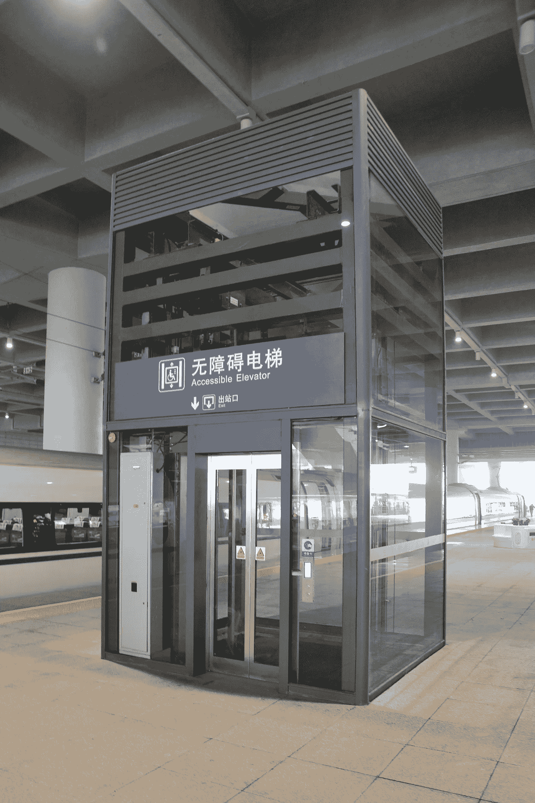
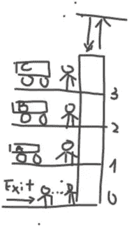

# 基于强化学习的火车站非平凡电梯控制系统

> 原文：<https://towardsdatascience.com/a-non-trivial-elevator-control-system-in-a-train-station-by-reinforcement-learning-f37e00137172?source=collection_archive---------11----------------------->

## [思想和理论](https://towardsdatascience.com/tagged/thoughts-and-theory)

## 为什么火车站的电梯不同，RL 如何优化整体服务质量



[中国宁波火车站站台上的电梯](https://commons.wikimedia.org/wiki/File:Elevator_on_the_platform_of_Ningbo_Railway_Station.jpg)

# 动机

没有电梯，今天的城市生活是无法想象的，电梯控制器算法已经通过不同的技术进行了很好的研究，包括强化学习[1]。浏览参考文献给人的印象是，大多数研究都集中在安装在高层建筑中的电梯上，而对安装在火车站中的电梯几乎没有讨论。然而，火车站的电梯也值得关注，因为它们与建筑物中的系统有着明显的不同。

电梯-列车-车站系统通常具有以下特性:

1.  不同列车线路的列车站台位于不同楼层。已经进入车站的人想要去一个特定的楼层乘火车，而已经乘火车到达的人将离开车站或者在另一个楼层换乘火车。
2.  在高峰时间，不存在像大楼里那样每个人都去的一个方向。一些人可能想离开火车站，而另一些人可能想在另一层楼换车。
3.  乘火车到达车站的人几乎同时在电梯前等候，而从车站外面来的人不一定属于这种情况。
4.  电梯通常是为携带沉重行李或婴儿推车的人保留的，因此它们可能没有巨大的载客量。此外，那些有婴儿车的人可能没有第二个选择，只能呆在电梯等候名单上，直到被运送。

一个很好的例子是巴黎的里昂火车站，它有两个地下楼层，在这两个楼层上你可以分别找到两个不同的列车线站台。

从我个人的经验来看，带着我的婴儿车乘电梯从一楼到二楼换乘火车通常需要相当长的时间。

在下文中，我将模拟一个电梯-火车-车站环境，该环境可以很容易地根据您自己的目的进行修改和重用，并实现强化学习以获得电梯控制器的最佳策略。

# 电梯-火车站系统

考虑具有 3 层的火车站中的电梯，使得 0 层是作为入口/出口的底层，而 1、2、3 层是列车站台。在 0 层等电梯的人是从外面来的，愿意上楼去乘火车，而其他楼层的人是由预定的火车带来的，要么出站，要么去另一个楼层换换口味。我们假设人们可以在任何时候从外面到达 0 层，而人们同时在火车上到达正楼层。

为了简单起见，我们首先考虑一部单独的电梯。这种简化实际上并没有消除太多的一般性，因为在列车站台上总是只有一部电梯可用。

正三层是不同铁路线的列车站台:1 层 A 线，2 层 B 线，3 层 C 线。每 10 分钟，A 线第一分钟到达，B 线第二分钟到达，C 线第三分钟到达。另外，每一趟列车到站，都会有 5 个人一起加入电梯的等候名单。这是有道理的，因为一般来说，只有那些带着行李或婴儿车的人想乘电梯，而其他人会选择这种耗时的选择。对于每个乘火车到达的人，他将有{0.2，0.2，0.6}的概率分别去另外两层和底层。同时，我们假设每 30 秒，在每 10 分钟的前 3 分钟，有 0.9 的概率有一个人将加入 0 楼的等候名单。对于一楼的每一个人，他将有 1/3 的概率去地下三层的每一层。

这部电梯的最大载客量是 5 人。看起来容量很小，但是请记住，他们也有自己的行李！此外，电梯每次停止需要 10 秒钟，从一层到另一层需要 2 秒钟。

首先，我们有:

1.  一层，三层。
2.  电梯等候名单中的三组 5 名预定人员和一组非自发人员。
3.  载客量为 5 人的电梯。

图吹是系统的草图(忘了我画的不好吧，我从幼儿园就没什么进步)。



作者图片:电梯火车站系统插图

# 构建 RL 环境

在继续下一步之前，我在这一节的开始给出了强化学习的一些必要元素。

简而言之，在 RL 中，主体以离散时间或连续时间与环境交互。在时间步骤中，代理根据环境的当前状态根据特定策略应用动作，导致新的状态并接收测量状态转换质量的奖励。RL 的目标是学习一个策略，或者是确定性的，或者是概率性的，以最大化累积回报。

让我们回到电梯控制器系统。

环境状态是 R⁷向量(楼层 _ 0 _ 上，楼层 _ 1 _ 上，…，楼层 _3_ 下，占用，位置),其中 floor_i^{up/down}是 1 或 0，是 1。如果需要在电梯外的楼层 I 上升/下降，占用是电梯内乘客总数的整数，并且定位电梯所在的当前楼层。请注意，我们只允许在 0 层上行，在 3 层下行。

功能的报酬定义为-(占有率+总和 _i floor_i^{up/down})，即电梯内外的需求总数。换句话说，奖励为 0 的唯一情况是没有乘客在系统中等待，无论是在电梯内部还是外部。

为了构建 RL 环境，我使用了 open AI Gym，这是一个用于开发和比较强化学习算法的工具包。如何构建一个定制的健身房环境不是本文的目的，读者可以在 want [2]中找到关于他们自己的 RL 环境的说明。下面是电梯类的 __init__ 和 reset 函数。

```
import gym
from gym import spaces
class Elevator(gym.Env):
    metadata = {**'render.modes'**: [**'human'**]}

    def __init__(self):
        *#observation space
        # states0: floor_0_up
        # states1: floor_1_up
        # states2: floor_1_down
        # states3: floor_2_up
        # states4: floor_2_down
        # states5: floor_3_down
        # states6: occupancy
        # states7: position* super(Elevator, self).__init__()
        self.done = 0
        self.reward = 0
        self.states = np.zeros(8)
        self.states[0]=1
        self.last_time = 0
        self.time = 0
        self.max_occupancy = 5
        self.action_space = spaces.Discrete(3)  *# 0 stop, 1 up, 2 down* self.observation_space = spaces.MultiDiscrete([2,2,2,2,2,2,6,4])

    def reset(self):
        self.states = np.zeros(8)
        *#suppose that there are already 2 people
        # waiting on the first floor at the beginning of the session* self.states[0]=1
        self.last_time = 0
        self.time = 0
        self.floor_0_waiting = 2
        self.floor_0_waiting_list = [1,2]
        self.floor_1_waiting = 0
        self.floor_1_waiting_list = []
        self.floor_2_waiting = 0
        self.floor_2_waiting_list = []
        self.floor_3_waiting = 0
        self.floor_3_waiting_list = []
        self.inside_list = []
        self.done = 0
        self.reward = 0
        return self.states
```

对更多细节感兴趣的人可以在 [*Github*](https://github.com/ShuyangenFrance/Elevator_train_station_system) 上获得本文的完整代码。

# 培训和结果

为了训练这个系统，我将使用 DQN 深度 Q 网络。注意，对于给定的初始状态和动作，RL 系统的总累积回报也称为 Q 值。理想的策略应该是最大化 Q 值的策略，Q 值通常是未知的，因此产生 Q 学习作为代理的“备忘单”[3]。DQN 旨在通过深度神经网络来逼近 Q 值。在我的实现中，我在[稳定基线](https://stable-baselines.readthedocs.io/en/master/modules/dqn.html)的帮助下构建了一个大小为 64 的两层 DQN，这是一组基于 OpenAI 基线的强化学习算法的改进实现。这个实现只需要 3 行代码:

```
elevator= Elevator()
elevator.reset()
model = DQN(**'MlpPolicy'**, elevator, verbose=0)
model.learn(total_timesteps=1e5)
```

在训练之前，我让电梯做随机动作，从训练开始到清空等候名单需要 800 多秒。而在 1e5 训练时间步骤之后，在我的本地试验中，电梯设法在 246 秒内清空了等候名单，也就是说，4 分钟而不是 10 多分钟(根据我的经验，我有时在火车站排队等候超过 10 分钟！).这突出了电梯控制器系统的显著改进。

# 结论

当然，我对系统做了许多简化，例如，火车上的人同时加入等待，当没有火车经过时，没有其他人会加入，但训练的结果仍然令人兴奋。此外，我认为系统中只有一部电梯，但在某些车站可能并非如此。作为下一步，值得在系统中增加更多的电梯，并考虑一个多代理 RL 系统来做进一步的优化。

# 参考

[1]徐苑·卢西恩·布索尼乌和罗伯特·巴布什卡，电梯控制的强化学习，2008 年。[https://www . science direct . com/science/article/pii/s 1474667016392783](https://www.sciencedirect.com/science/article/pii/S1474667016392783)

[2] Adam King，从头开始创建定制的健身房环境——一个股票市场的例子。[https://towards data science . com/creating-a-custom-open ai-gym-environment-for-stock-trading-be 532 be 3910 e](/creating-a-custom-openai-gym-environment-for-stock-trading-be532be3910e)

[3]使用 Python 中的 OpenAI Gym 进行深度 Q 学习的实践介绍。[https://www . analyticsvidhya . com/blog/2019/04/简介-deep-q-learning-python/](https://www.analyticsvidhya.com/blog/2019/04/introduction-deep-q-learning-python/)