# 一种基于词包划分平均的文档嵌入新方法

> 原文：<https://towardsdatascience.com/a-novel-approach-to-document-embedding-using-partition-averaging-on-bag-of-words-b07249d260f9?source=collection_archive---------34----------------------->

## [实践教程](https://towardsdatascience.com/tagged/hands-on-tutorials)

## 如何获取向量嵌入的集合并对其进行平均，从而保持其流形结构的多意义主题性。

[比阿特丽斯·佩雷斯·莫亚](https://unsplash.com/@beatriz_perez?utm_source=unsplash&utm_medium=referral&utm_content=creditCopyText)在 [Unsplash](https://unsplash.com/@beatriz_perez?utm_source=unsplash&utm_medium=referral&utm_content=creditCopyText) 上的照片

这是“嵌入、集群和平均”系列的第三篇文章。在深入本教程之前，我建议先阅读前面两篇文章:[使用 PyTorch 和 ResNeXt-WSL 从图片中提取丰富的嵌入特征](https://datasciencevademecum.com/2020/12/02/extracting-rich-embedding-features-from-pictures-using-pytorch-and-resnext-wsl/)和[使用 UMAP 和 GMM 在嵌入空间中进行流形聚类](https://datasciencevademecum.com/2021/01/02/manifold-clustering-in-the-embedding-space-using-umap-and-gmm/)。

在本教程中，我们将使用 ResNext-WSL 模型、UMAP 变换提供的稀疏主题表示、GMM 聚类模型从 COCO 图片中提取嵌入，并为图片集(单词包文档)生成嵌入表示。我们将展示为什么传统的平均技术对于由几个多主题对象组成的文档不太适用，并且我们将扩展[分区平滑逆频率(P-SIF)](https://arxiv.org/abs/2005.09069) 方法以适用于单词和文本之外的通用领域。

# 单词袋模型

单词袋模型将文档表示为对象(单词)的加权集合。每个文档都表示为一个词频矩阵，其中行是文档，列是可能值集(词汇表)中的单词，值是该单词在文档中出现的次数。

对于本教程，我们将假设文字就是图片，文档可以是它们的任意集合。为了方便起见，我们将使用 COCO 类别来定义文档，并使用词频来对应图片中该类别的注释数量。

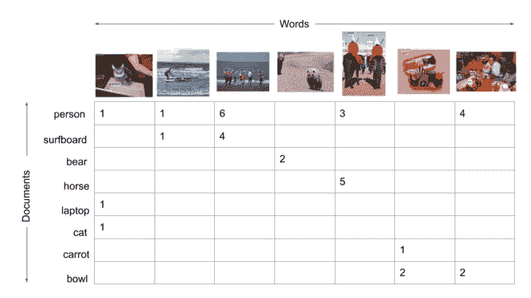

COCO 范畴词袋模型的词频矩阵

如果我们对每行中的术语频率求和，我们会得到以下分布:

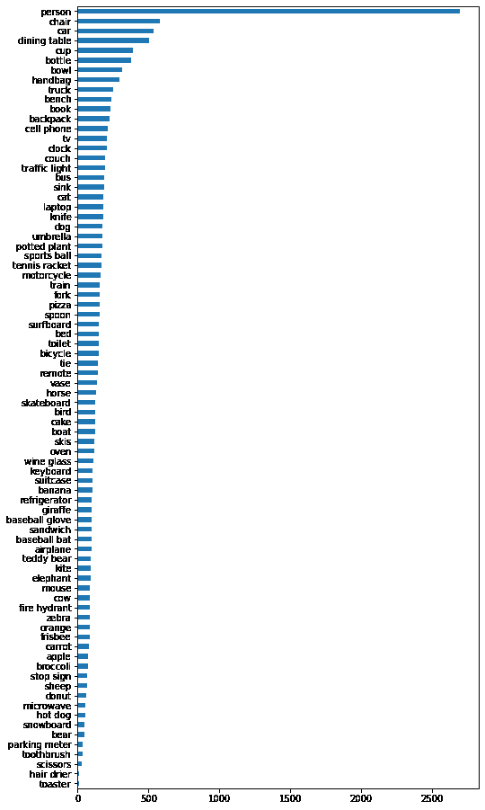

每个文档的词频总和

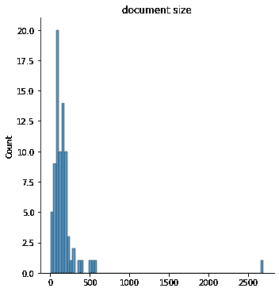

文件尺寸的分布

我们可以观察到，person 和 chair 是数据集中非常受欢迎的注释，但平均来说，每个文档(类别)由一百个单词(图片)组成，我们知道每个单词可能代表多个上下文。

# 单词加权平均

表示每个文档的简单方法是获取每张图片的嵌入向量，并基于词频进行加权平均。通过这样做，我们将在图片的相同嵌入空间中表示文档，这是一个方便的属性。然而，正如我们将在底部的比较部分看到的，对许多多主题单词进行平均，最终会得到所有文档的几乎相同的向量。很难保留单词中的原始信息，因为它们会相互补偿，从而导致扁平的信息量较少的向量。

# 术语频率-逆文档频率(tf-idf)平均

[tf-idf](https://en.wikipedia.org/wiki/Tf%E2%80%93idf) 是一个统计量，它测量一个单词在它们的集合(语料库)中对一个文档有多重要。一个单词在文档中出现得越频繁，重要性就越低。很可能，罕见的单词将具有更高的权重。

这种技术对于文本数据非常有效，可以过滤掉常见的单词，如 the、a、an、is、at、on，并赋予关键字以重要性。当单词字典(所有可能图片的集合)不遵循语言分布时，这种技术不会给出很大的改进。

我们这种平均的主要问题不在于每个单词的权重，而在于代数运算(和/均值),它去除了向量的所有信息成分。

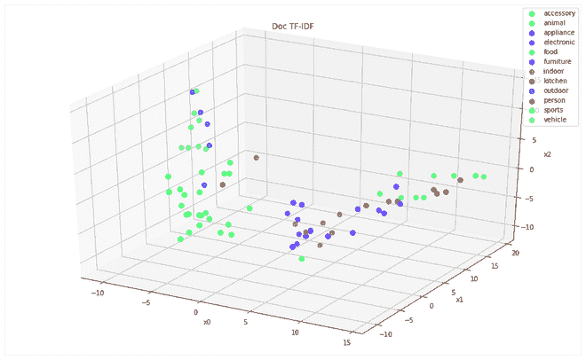

由 COCO 超级类别着色的 TF-IDF 文档矩阵的 PCA 3D 投影

我们可以看到，属于同一个超级类别的文档倾向于彼此靠近地聚集在一起，但是这种分离不是很明显。

# 分区 SIF 加权平均

我们介绍的新方法受到了 [P-SIF 平均方法](https://vgupta123.github.io/docs/AAAI-GuptaV.3656.pdf)的启发。

关键的直觉是:

1.  使用稀疏编码对“主题”中的所有“单词”进行聚类(论文作者称之为字典学习，但对我们来说，它们是流形聚类)。
2.  针对每个题目，用[平滑逆频](https://openreview.net/pdf?id=SyK00v5xx)做图片的加权平均。
3.  连接每个主题中的平均向量。
4.  去掉第一个主成分。

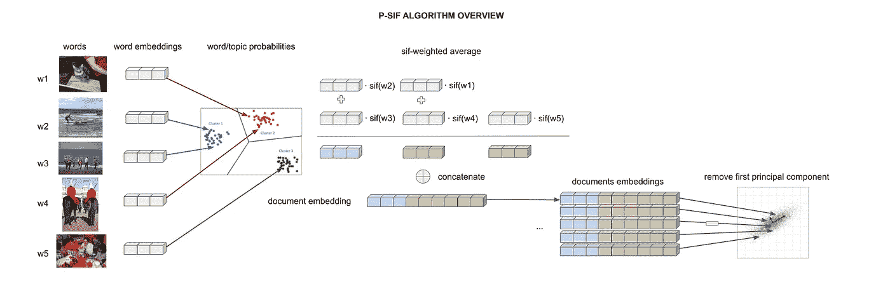

P-SIF 文档平均算法概述。图片作者。

让我们一步一步来。

# 主题聚类

原始论文通过字典学习算法使用稀疏编码，例如 [K-SVD](https://en.wikipedia.org/wiki/K-SVD) ，k-means 的一种推广，用于稀疏编码。类似于 PCA，K-SVD 将通过奇异值分解(SVD)学习单词的稀疏表示，并将每个单词表示为原子的线性组合。每个原子就像一个星团的质心。因此，该算法通过交替学习数据的稀疏编码和更新原子以更好地适应数据来工作。这就像在单个算法中优化 SVD 和 k-means。

在上一篇文章中，[使用 UMAP 和 GMM](https://datasciencevademecum.com/2021/01/02/manifold-clustering-in-the-embedding-space-using-umap-and-gmm/) 的嵌入空间中的流形聚类，我们已经讨论了那些线性投影和 k-means 在数据以流形结构排列的情况下的局限性。此外，截至今天，除了论文作者在[相关 GitHub 库中提供的内容之外，我们找不到任何 K-SVD 算法的成熟实现。](https://github.com/vgupta123/P-SIF)因此，我们用 UMAP 和 GMM 的组合代替了 K-SVD。

# SIF 平均值

为了执行平滑逆频率(SIF ),我们首先需要计算每个单词出现在文档 p 中的概率。

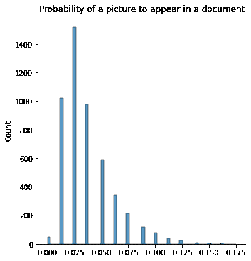

p(单词)的分布，单词在文档中出现的概率

然后，我们可以计算作为平滑参数α的函数的 SIF 权重(我们已经使用了 0.001 的值)。

为了执行 SIF 文档平均，我们必须将文档中的每个单词乘以 SIF 权重和单词主题概率。现在，我们可以用组合权重对每个主题中的单词进行平均。

# 连接主题向量

在上一步中，我们为每个文档和主题生成了一个向量。串联只是将所有这些主题向量堆叠在一起。我们可以把连接向量看作是保存单词包中大部分原始信息的一种方式。只有属于特定主题的单词将对嵌入主题子空间中的平均或文档坐标有贡献。

在我们的教程中，我们嵌入了维数为 2048 和 40 的聚类向量。因此，每个文档现在都以 2048*40 = 81920 的尺寸表示。很高，是吧？

我们可以通过在平均之前减少单词的嵌入空间或者通过减少主题的数量来减少这个维度。这两个方面在之前的聚类步骤中已经被次优化了。我们可以，但不是强制性地，用缩减的 UMAP 空间(50 维)替换原始的单词嵌入空间。因此，我们可以获得大小为 50*40 = 2000 维的文档向量。

一般来说，我们可以应用任何降维变换，而不一定是聚类过程中使用的那个。重用用于聚类的相同 UMAP 空间的便利选择不应该限制许多可用的选项。聚类步骤的目的是发现主题并将单词分配给主题概率。

# 去掉第一个主成分

为了使 SIF 平均技术有效，并与其背后的理论数学相一致，我们需要去除公共话语向量。这个想法是，所有的单词都是根据一个取决于微话题(本地话语)的过程生成的。然而，所有的文档都将共享这个话语的一个组成部分，这个组成部分可以使用 SVD 删除。作为代理，我们因此可以使用 PCA 计算第一主分量，然后从平均和连接之后获得的文档嵌入矩阵中减去它。

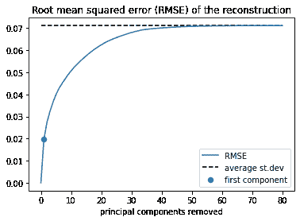

重构误差去除文档向量的主分量，点表示第一分量

我们还可以观察到，通过保留剩余的 50 个组件，我们可以在不损失信息的情况下进一步降低文档向量的维数。

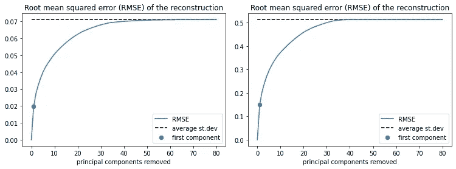

左边的图是原始空间中连接的文档向量的重构曲线，而右边的图是 UMAP 空间中的重构曲线。点代表第一个主成分。

我们还可以观察到，通过保留剩余的 50 个组件，我们可能已经进一步降低了文档向量的维数，而没有显著的信息损失。

# 结果比较

为了测试我们的结果，我们将计算每对文档之间的余弦相似度(在我们的例子中是 COCO 图片类别)。我们应该期望相似的文档，属于相同 COCO 超级类别的文档，与剩余的文档相比具有更高的相似性。

我们比较了 6 种配置:

1.  一袋单词
2.  UMAP 空间中的词汇袋
3.  TF-IDF
4.  UMAP 空间中的 TF-IDF
5.  p-SIF
6.  UMAP 空间中的 p-SIF

我们可以绘制每个配置的相似性矩阵的热图:

相似性矩阵(单词袋)

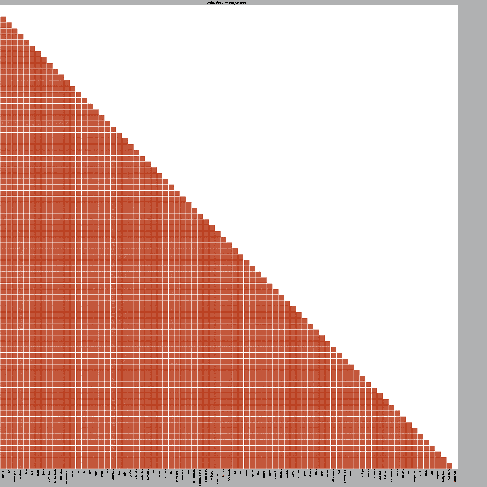

相似性矩阵(UMAP 空间中的单词包)

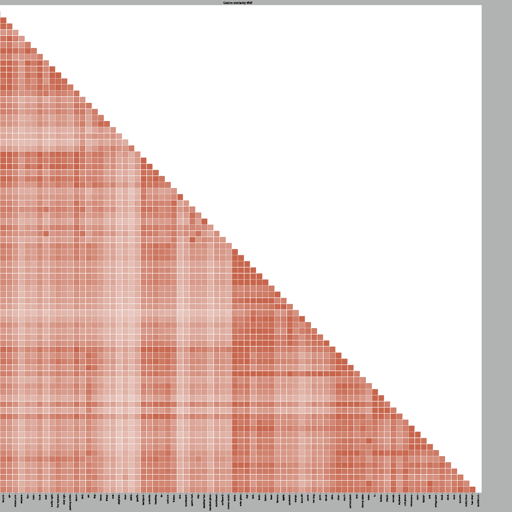

相似性矩阵

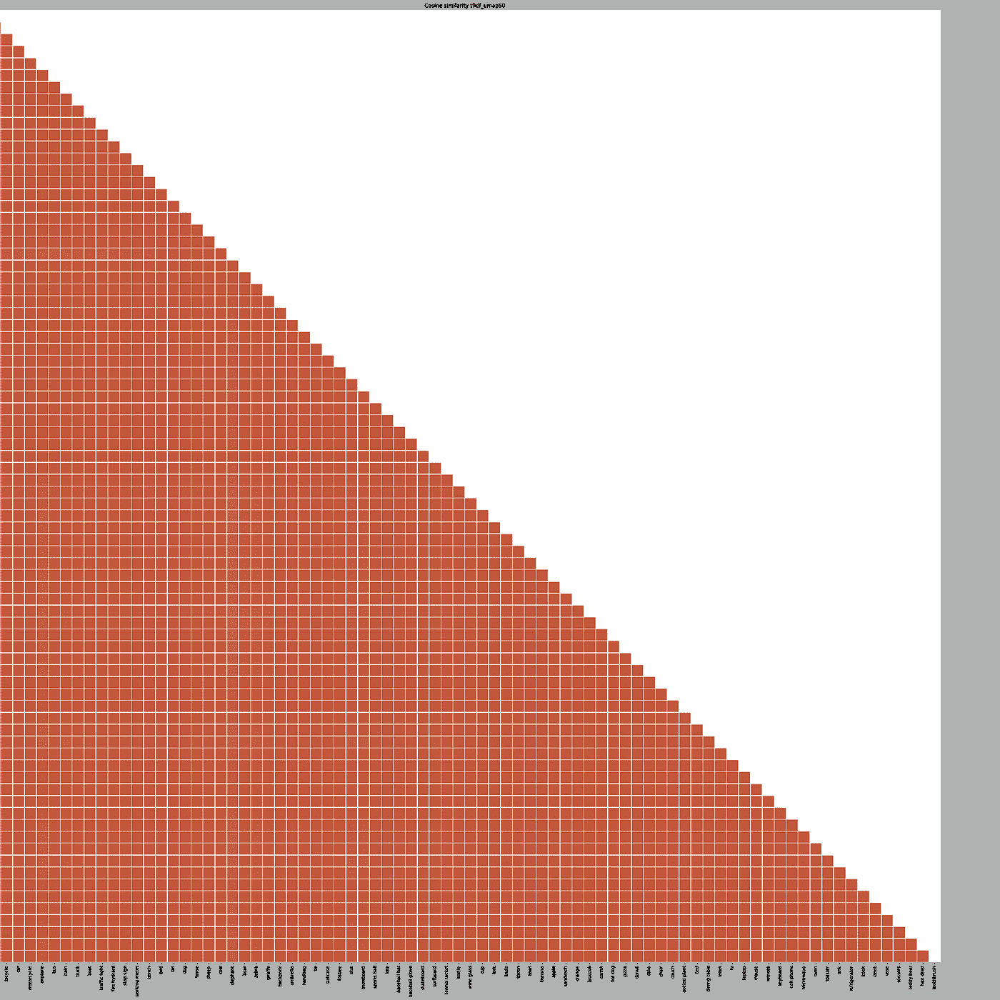

相似性矩阵(UMAP 空间中的 TF-IDF)

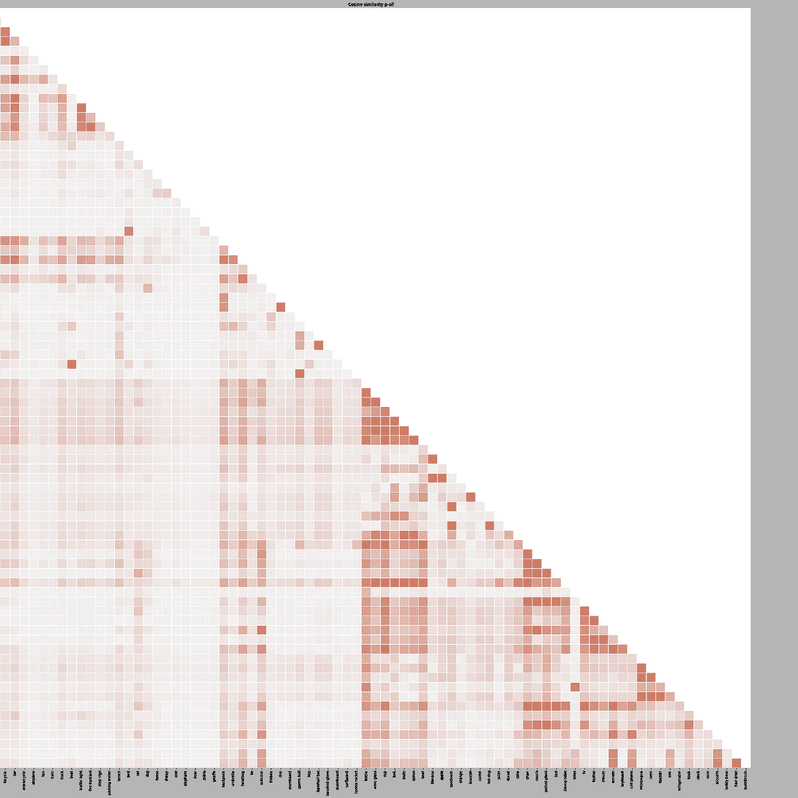

相似矩阵

相似矩阵(UMAP 空间中的 P-SIF)

我们可以观察到，具有传统单词包和 TF-IDF 平均的 UMAP 变换导致完全误导的结果，其中所有文档以相似的表示(和相似的余弦距离)结束，并且可能在 UMAP 空间的区域中没有任何实际意义。TF-IDF 变换没有产生任何相关的差别。我们已经预料到这种技术对于非语言发行版来说效果不佳。我们最终可以看到，无论是在原始嵌入空间还是在 UMAP 空间，我们修正的 p-SIF 确实提供了更稀疏和更一致的结果。

为了更好地形象化它们的表现，让我们计算属于和不属于同一个超级类别的文档对之间的平均余弦相似度的比率。较高的比率对应于较好的表示。

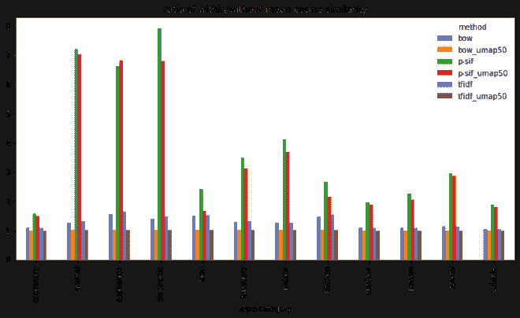

每个超范畴中所有配对的余弦相似性之内和之外的平均比率。

我们可以观察到，p-SIF 在所有超级类别中都占主导地位，其中一些类别(如动物、电器、电子产品)的性能提升了 7 倍以上。通过对所有超级范畴的结果进行微平均，我们可以总结为一个单一的指标:平均余弦相似性内/外的总比率。

所有超级范畴中所有配对的余弦相似性之内和之外的平均比率。

我们的 p-SIF 被证实是在多上下文情况下用于文档嵌入平均的更好的技术。原始空间中的 p-SIF 和 UMAP 空间中的 p-SIF 之间的差异是极小的，但是允许我们将向量的大小减少大约 40 倍。

# 结论

在这篇文章中，我们提出了一个重新适应版本的[分块平滑逆频率(p-SIF)](https://arxiv.org/abs/2005.09069) 算法。我们已经用 UMAP + GMM 的组合代替了 K-SVD 字典学习步骤。我们认为后者是一种更适合嵌入向量的词袋模型的技术，这些向量由深度神经网络生成，并排列在高维空间的流形中。我们已经证明了保留平均到 COCO 超级分类文档中的原始图片的多个主题和上下文的有效性。这种新提出的技术可以用于测量文档之间的相似性，但是也可以用于在新的特征空间中生成平均嵌入向量，该新的特征空间被定制用于表示一般文档可能表示的多义主题。

阅读“嵌入、聚类和平均”系列的前两篇文章:

[使用 PyTorch 和 ResNeXt-WSL 从 COCO 图片中提取丰富的嵌入特征](https://datasciencevademecum.com/2020/12/02/extracting-rich-embedding-features-from-pictures-using-pytorch-and-resnext-wsl/)。

[使用 UMAP 和 GMM 在嵌入空间中进行流形聚类](https://datasciencevademecum.com/2021/01/02/manifold-clustering-in-the-embedding-space-using-umap-and-gmm/)。

你可以在 https://github.com/gm-spacagna/docem 找到代码和笔记本。

*原载于 2021 年 1 月 9 日*[*【https://datasciencevademecum.com】*](https://datasciencevademecum.com/2021/01/09/a-novel-approach-to-document-embedding-using-partition-averaging-on-bag-of-words/)*。*