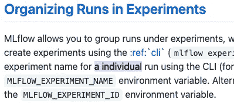
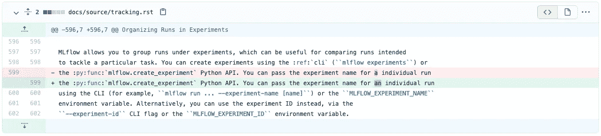
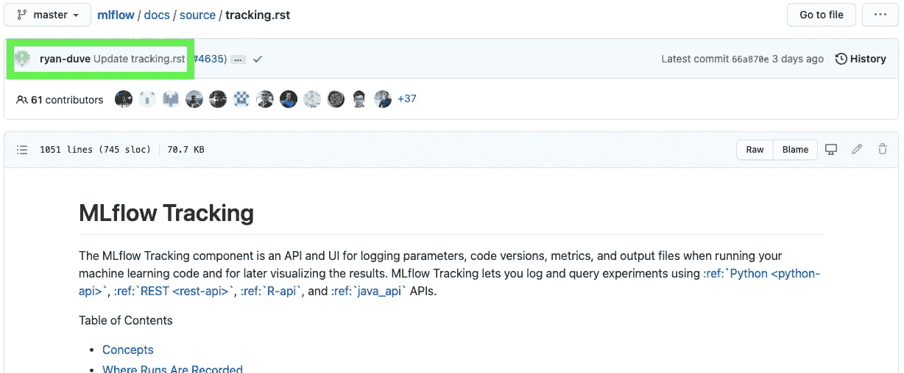

# 单字符 MLflow 拉请求

> 原文：<https://towardsdatascience.com/a-one-character-mlflow-pull-request-6d135437702d?source=collection_archive---------32----------------------->

上周，我受命为一个数据科学家团队编写一份关于最佳实践的文档，以协调使用 [MLflow](https://mlflow.org/) 的实验，这是一种跟踪数据科学实验参数和结果的工具。那时，我只使用了 MLflow 一天左右，所以任务主要是阅读文档和依靠我多年来在 [Domino 数据实验室](https://medium.com/u/88039f377b2a?source=post_page-----6d135437702d--------------------------------)的经验，这是一个类似的专有数据科学平台。

我想引用的一个 MLflow 段落有一个[小错别字](https://github.com/mlflow/mlflow/blob/c79475b715abba28ef059aace78f47c8e298a0d2/docs/source/tracking.rst#:~:text=a%20individual):

:-\

不管出于什么原因，这个错别字让我想起了我和同事们的谈话，他们谈到为开源项目做贡献是多么的不容易。我记得我刚出道时的那种感觉。感觉对流行项目唯一“有价值”的贡献是发现革命性的变化，这最好留给“维护项目的专家”。

没有什么比这更偏离事实了。开源项目依靠个人的微小贡献而蓬勃发展，对于一个用心良苦的新人来说，没有什么改变是微不足道的。许多人的小额捐款使项目保持繁荣。欢迎大家参与。我决定使用 MLflow 错别字来演示一个众所周知的项目的量子变化，希望让我的同行更容易理解开源贡献。

[变化](https://github.com/mlflow/mlflow/pull/4635/files)来得很快，以这样的形式出现:

我打开了一个拉请求，礼貌地介绍自己是一个新的贡献者，并询问这种改变是否可以。有人指出，我需要遵循更多涉及提交的方向，我解决了这个问题。第二天，变更被批准并且[被提交给](https://github.com/mlflow/mlflow/blob/master/docs/source/tracking.rst#organizing-runs-in-experiments) `[master](https://github.com/mlflow/mlflow/blob/master/docs/source/tracking.rst#organizing-runs-in-experiments)`。

不要害怕打开一个开源项目的拉请求。和我一起工作过的人，以及我自己，已经对大项目做了局部的改变，并且因为不确定是否会有回报而搁置它们。这个故事的寓意不是搜索阅读材料并开始修复错别字，而是尝试将你在当地的贡献提交回`master`。您可能必须修正一个测试或者符合注释约定，但是这个迭代过程是一个重要的开发人员体验的一部分，并且会使您成为一个更强的技术贡献者。

MLflow 把我一个字的改动合并成了一个自述。你提交给你最喜欢的项目的任何更实质性的改变都有很大的机会被合并，并有希望成为你未来更多贡献的开始。

[*瑞安·迪夫*](https://www.linkedin.com/in/duve/) *是 Corvus 保险公司的数据科学家。他还是一名物理学家、Linux 黑客和一名糟糕的咖啡师。*