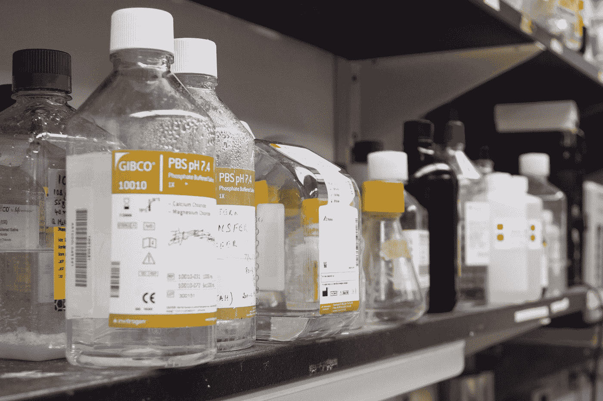
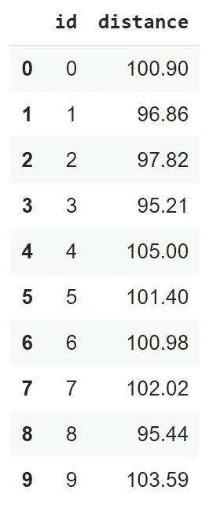
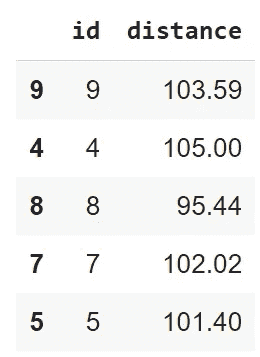
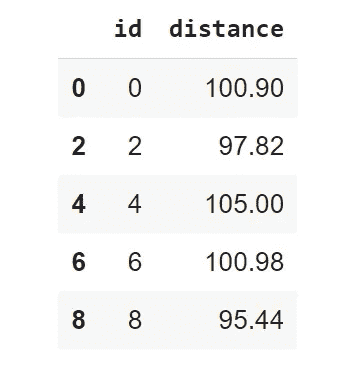
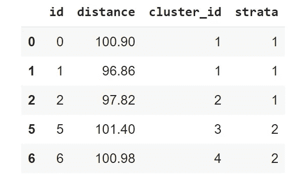
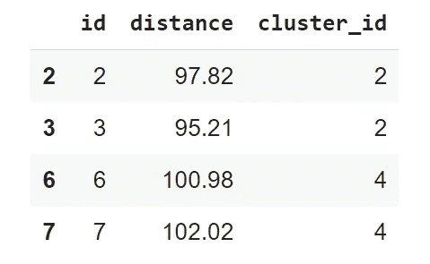

# 数据采样方法管窥

> 原文：<https://towardsdatascience.com/a-peek-at-data-sampling-methods-5d7199c8aab8?source=collection_archive---------20----------------------->

## 确保你从数据中得出有效的结论



[国家癌症研究所](https://unsplash.com/@nci?utm_source=medium&utm_medium=referral)在 [Unsplash](https://unsplash.com?utm_source=medium&utm_medium=referral) 上拍摄的照片

抽样偏差是现实世界中最常见的偏差类型之一。当用于训练模型的数据不能反映模型在生产时将接收的样本的分布时，就会出现这种情况。

</tackling-different-types-of-bias-in-data-projects-29e326660639> [## 处理数据项目中不同类型的偏差

towardsdatascience.com](/tackling-different-types-of-bias-in-data-projects-29e326660639) 

一般来说，每当我们从事机器学习项目时，对将在生产环境中观察到的数据中各种属性的真实比例进行正确的研究是至关重要的。

此外，当我们实际处理一个问题并且数据集非常大时，处理整个数据集通常是不实际的，也没有必要，除非您希望在处理转换和特征工程发生时等待数小时。

一个更有效的策略是，从你的数据中抽取一个足够有用的样本来学习有价值的见解，这个策略仍然允许你从你的结果中得出有效的结论。这种技术被称为*数据采样*。

# 什么是数据采样？

我们将来自较大人群的观察结果子集称为**样本**。**然而，取样**是指我们的研究将从中收集数据的观察组。因此，数据采样可以定义为从业者用来选择代表较大总体的观察值子集的技术。

通常，与数据打交道的人(即数据科学家、数据分析师等。)使用数据采样技术将大型数据集减少到更小、更易管理的数据量，而不牺牲其洞察力的准确性。

有两种主要的数据采样策略:

*   **概率抽样**涉及随机选择。数据中的所有观察值都有机会被选择，因此可以对整个群体进行强有力的统计推断。
*   **非概率抽样**不涉及随机选择。相反，它是基于方便或其他标准。因此，无论构建了多少个样本，一些观察值都没有机会被选中。

非概率抽样方法的一个主要缺陷是它们包括非代表性的样本，并且重要的观察值可能被排除在样本之外。因此，通常建议首先考虑概率抽样方法，这也是我在本文剩余部分只关注这种抽样方法的原因。

# 概率抽样方法

如前所述，我们通常在因为数据太大以及其他原因(如时间、成本等)而无法研究整个人群的情况下利用数据采样方法。).

在这个演示中，我们将使用我用 Python 创建的合成数据——参见下面的代码。

```
import numpy as np
import pandas as pd# create synthetic data
id = np.arange(0, 10).tolist()
distance = np.round(np.random.normal(loc=100, scale =5, size=len(id)), 2)# convert to pandas dataframe
data = {"id":id, "distance": distance}
df = pd.DataFrame(data=data)df
```



作者图片

## 简单随机抽样

最直接的数据采样方法是简单的随机采样。本质上，子集是由从一个更大的集合中完全随机选择的观察值构成的；每个观察值都有相同的机会从较大的集合中被选中。

```
# simple sampling example
simple_random_sample = df.sample(n=5, random_state=24)
simple_random_sample
```



作者图片

简单随机抽样极其简单，易于实现。另一方面，我们仍有可能在样本数据中引入偏差。例如，考虑一个事件，其中我们有一个带有不平衡标签的大型数据集。通过执行简单的随机抽样，我们可能会意外地无法捕捉到足够多的样本来代表少数群体——如果我们能捕捉到任何一个的话。

## 间隔抽样

间隔抽样是一种技术，它通过定期从较大的集合中选择观测值来创建子集。例如，我们可以决定从更大的集合中选择每 31 个观察值。

```
# interval sampling example
idx = np.arange(0, len(df), step=2)
interval_sample = df.iloc[idx]
interval_sample
```



作者图片

如果观察值是随机的，那么间隔抽样通常会比简单的随机抽样返回更好的样本。然而，如果在我们的数据中有周期性或重复的模式，那么间隔抽样是非常不合适的。

## 分层抽样

分层随机抽样将较大的数据集分成称为分层的组。从这些组中，我们随机选择我们想要创建新子集的观察值。从每个阶层中选择的例子的数量与阶层的大小成比例。

```
from sklearn.model_selection import StratifiedKFold# dividing the data into groups
df["strata"] = np.repeat([1, 2], len(df)/2).tolist()# instantiating stratified sampling
stratified = StratifiedKFold(n_splits=2)1q
for x, y in stratified.split(df, df["strata"]):
    stratified_random_sample = df.iloc[x]stratified_random_sample
```



作者图片

这种抽样策略倾向于通过减少我们引入的偏倚来提高样本的代表性；在最坏的情况下，我们得到的样本质量不会比简单的随机抽样差。另一方面，定义地层可能是一项困难的任务，因为它需要对数据的属性有很好的了解。这也是目前最慢的方法。

## 巢式抽样法

当我们不知道如何定义数据的层次时，整群随机抽样是一个很好的选择。在决定了我们希望我们的数据具有的聚类数之后，我们将较大的集合分成这些较小的聚类，然后从它们当中随机选择以形成一个样本。

```
# cluster sampling example# removing the strata
df.drop("strata", axis=1, inplace=True)# Divide the units into 5 clusters of equal size
df['cluster_id'] = np.repeat([range(1,6)], len(df)/5)# Append the indexes from the clusters that meet the criteria
idx = []# add all observations with an even cluster_id to idx
for i in range(0, len(df)):
    if df['cluster_id'].iloc[i] % 2 == 0:
        idx.append(i)cluster_random_sample = df.iloc[idx]
cluster_random_sample
```



作者图片

整群抽样比其他概率抽样方法更节省时间和成本。但是，很难确保您的分类代表更大的集合，因此，与简单随机抽样等其他方法相比，它通常提供的统计确定性更低。

# 最后一个音符

在处理大型数据集时，数据采样是一种有效的技术。通过利用数据采样技术，我们可以对较大集合中较小的、更容易管理的子集进行采样，以执行我们的分析和建模，同时确保我们仍然可以从该子集得出有效的结论。在本文中，我们讨论了执行数据采样的两种主要方法，为什么从概率采样技术开始可能更好，并在 python 中实现了 4 种概率采样技术。

感谢您的阅读！

如果你喜欢这篇文章，请通过订阅我的**[每周简讯](https://mailchi.mp/ef1f7700a873/sign-up)与我联系。不要错过我写的关于人工智能、数据科学和自由职业的帖子。**

## **相关文章**

**</cross-validation-c4fae714f1c5>  </7-common-gotchas-of-data-projects-62e8646552f2> [## 数据项目的 7 个常见问题

towardsdatascience.com](/7-common-gotchas-of-data-projects-62e8646552f2) </always-remember-data-comes-before-the-science-681389992082> **