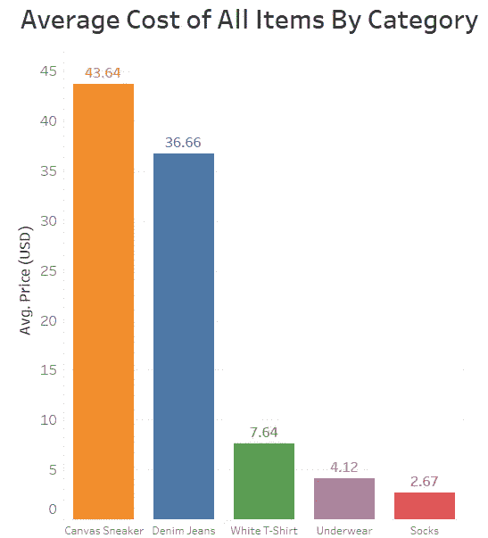
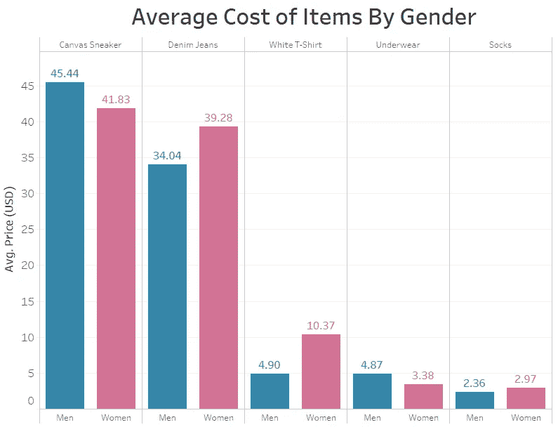
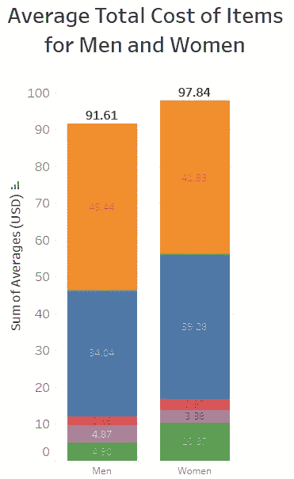

# 粉红税探索性数据分析

> 原文：<https://towardsdatascience.com/a-pink-tax-exploratory-data-analysis-94642f83d4c5?source=collection_archive---------16----------------------->

## 亚马逊上男女产品的购物比较

罗谢尔·布朗在 [Unsplash](https://unsplash.com?utm_source=medium&utm_medium=referral) 上的照片

为了纪念女性历史月，我想做一个与性别平等相关的探索性数据分析(EDA)项目。随着美国同工同酬日的到来，我立刻想到了粉红税。毕竟，没有什么比得到的报酬更少，而你的钱却花不完更让人愤怒的了，仅仅是因为你是一个女人。

# 什么是粉红税？

粉红税是销售给女性的产品比销售给男性的同等产品更贵的趋势。你有没有注意到粉红色的剃须刀要多花几分钱？还是说女性的除臭剂和男性的价格一样但是容器里的产品少？这是粉红税在起作用！如果你想更深入地了解粉红税，[在维基百科](https://en.wikipedia.org/wiki/Pink_tax)上有自己的词条，这是一个很好的起点，在撰写本文时有 27 个参考文献。

根据《Bankrate.com》今年发表的一篇文章，以下是一些关于粉红税的最新事实:

*   粉红税每年花费女性 1351 美元。
*   粉红税从出生时就开始征收，因为除了颜色/营销之外，即使是同等的玩具，对女孩来说平均成本也更高。
*   衣服、个人护理产品和服务都要缴纳粉红税。
*   总的来说，女性为类似商品和服务支付的价格比男性平均高出 7%。

# 实验

我想亲眼看看在亚马逊上男性和女性商品的购物体验会有什么不同。女性是否面临着平均比男性更贵的产品选择？我开始为自己的小实验创建一些参数。

我决定把它限制在一套服装的范围内:t 恤、牛仔裤、袜子、内衣和运动鞋。这个想法是，一个男人和一个女人在亚马逊上买一整套衣服平均要花多少钱？我想强调的是，这并不是试图找到男女平等的产品，并对它们进行直接比较。相反，它是关于所呈现的整体购物选择。如果女性产品普遍更贵，那么从逻辑上来说，当男性和女性搜索相同的商品时，亚马逊上出现的产品对女性来说平均更贵。我选择亚马逊是因为它是一个非常受欢迎的购物网站，有很多产品。

我用添加了“男士”或“女士”的相同搜索词搜索每一件商品。以下是我做的搜索:

*   “男士纯白 t 恤”和“女士纯白 t 恤”
*   “男士粗斜纹棉布牛仔裤”和“女士粗斜纹棉布牛仔裤”
*   “男士内衣”和“女士内衣”
*   “男式水手袜”和“女式水手袜”
*   “男士帆布鞋”和“女士帆布鞋”

我注销了我的亚马逊账户，在一个隐姓埋名的 Chrome 窗口中进行了所有这些搜索，希望不会受到我的购买或搜索历史的影响。但我猜在这个数字世界里，没有人能保证我所说的搜索是完全公正的。

我记下了每次搜索的前 25 个项目的价格，包括男性和女性(每个项目 50 英镑)。我想这大概是人们在做出购买决定前合理浏览的商品数量。我跳过了任何特殊的赞助或促销产品，主要是因为这造成了混乱的重复，因为这些产品仍然出现在列表的某个地方(在所有情况下,“赞助”只是将一个项目推到了列表的顶部，但它仍然出现在前 25 名中),我想要 25 个独特的产品。

我还注意保持单位的一致性。例如，袜子、t 恤和内衣往往是成包的。我将所有价格计算为单位成本(一件 t 恤、一条内裤和一双袜子)。我还擅自跳过了我认为不适合搜索的任何产品。例如，当我搜索牛仔布牛仔裤时，会出现一些看起来像牛仔布的打底裤的搜索结果。由于打底裤和粗斜纹棉布牛仔裤是完全不同的产品，我干脆跳过了它们。

# 结果呢

我使用 Tableau Public 创建了本文中的可视化效果。你可以在[我的 Tableau 公众号](https://public.tableau.com/profile/vivienned)上找到这些。首先，让我们来看看不分性别的各类商品的平均价格。

作者图片

平均来说，运动鞋是最贵的，一双袜子是最便宜的。我承认，我完全预料到这条牛仔裤会是最贵的。也许这是个人偏见，觉得找到一条真正合身的牛仔裤有多难。

让我们来看看按性别细分的物品平均价格。

作者图片

我们可以看到，就帆布鞋和内衣而言，男性产品的平均价格高于女性。男式帆布鞋的平均价格为 3.61 美元，比女式帆布鞋贵 8.6%。男士内衣比女士内衣贵 1.49 美元或 44%。

其他产品对女性来说比男性更贵。女式牛仔裤平均比男式牛仔裤贵 5.24 美元，涨幅为 15%。女性白色 t 恤的平均价格是男性的两倍多，增长了 112%。虽然袜子的实际成本差异最小，但普通女袜的价格仍然高出近 26%。

有趣的是，在这一点上出现的假设可能解释与粉红税无关的价格差异。如果材料的数量是价格差异的原因，我们预计女性产品在大多数情况下肯定会比男性产品便宜。那肯定不能解释我们在这里看到的牛仔裤、衬衫或袜子。也许有些差异可能与捆绑销售产品有关。比如，如果男士衬衫和袜子有更多的散装货，单位价格会更便宜(这是我在收集数据时特别注意到的**而不是**)。

好了，现在让我们进入实验的真正问题。对于一个男人和一个女人来说，买一套完整的衣服平均要花多少钱？

作者图片

女性购买所有商品的平均成本为 97.84 美元，比男性的总成本高出 6.23 美元和 6.8%。总平均增幅为 6.8%，这与粉红色税导致女性为产品和服务平均多支付约 7%的估计相符。我认为很有趣的是，我们的最终数字会如此接近真实的平均值，即使这可能完全是由于偶然。

# 结论

虽然这个 EDA 实验并不意味着是完美的、结论性的，或提出任何真正可行的建议，但采取一种实际操作的方法来比较男女产品价格是很有趣的。像任何好的探索性数据分析一样，这带来的问题比它回答的问题更多:

*   这种差异实际上是显著的还是随机的？如果我们将样本数量从 25 个增加到 100 个或 1000 个，会发生什么？
*   这种差异有多少是由于亚马逊算法造成的？在不同的日子结果会不同吗？
*   如果我们在其他受欢迎的零售网站如沃尔玛或塔吉特百货重复这个实验，我们会发现类似的结果吗？
*   如果我们看不同类型的物品，如个人护理品(肥皂、洗发水等),价格会有差异吗？)或娱乐项目(自行车、运动器材等。)?
*   比较理发、按摩或汽车维修等各种服务的成本的好方法是什么？
*   专注于比较更精确的产品等价物的实验会是什么样的？

如果你们中的任何人进行自己的实验来回答这些问题，我希望你能分享！只有通过解决粉红税，我们才能开始解决它，让每个人都能买得起产品。

# 在你走之前

美国女性同工同酬日是 2021 年 3 月 24 日，这一天女性最终与男性的收入持平。目前，女性的平均工资是男性的 0.82 美元。

让我们不要忘记美国其他的同酬日:

*   亚裔美国人和太平洋岛民女性——2021 年 3 月 9 日
*   母亲——2021 年 6 月 4 日
*   黑人女性——2021 年 8 月 3 日
*   美国土著妇女——2021 年 9 月 8 日
*   拉丁女性——2021 年 10 月 21 日

请访问[aauw.org](https://www.aauw.org/)了解更多信息。AAUW 网站是[可以找到同酬信息的地方。](https://www.aauw.org/resources/article/equal-pay-day-calendar/)