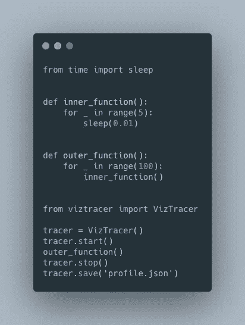
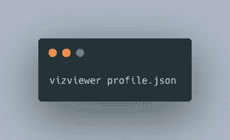
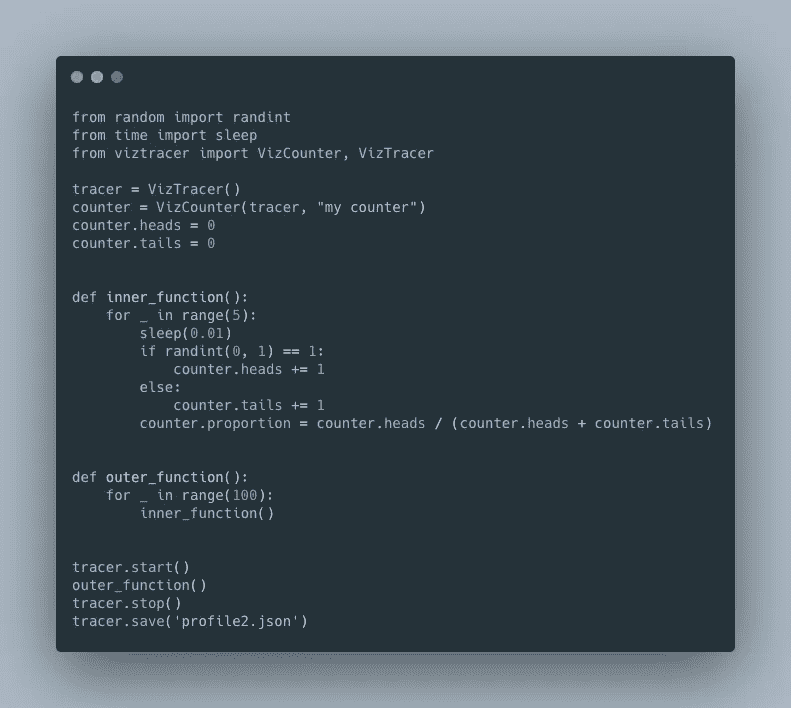
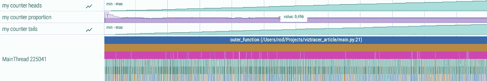

# 一个强大、简单、有趣的 python 分析器

> 原文：<https://towardsdatascience.com/a-powerful-easy-and-enjoyable-python-profiler-12b792bc91d6?source=collection_archive---------12----------------------->

## 使用 VizTracer 和 Perfetto 轻松浏览代码执行时间表

在为训练模型处理数据或试图提高推理速度时，我经常面临需要修复的缓慢代码。我尝试了大多数 python 分析器，我真的很喜欢 [VizTracer](https://github.com/gaogaotiantian/viztracer) ，因为它非常容易使用，而且非常强大，因为你可以在代码执行时间线上放大和缩小。

要使用它，您只需导入一个“追踪器”并使用启动、停止和保存方法，如下所示:

它将保存一个包含代码执行时间线的 profile.json 文件。然后，您必须运行该命令(安装 viztracer 时会安装 vizviewer)

使用 AWSD 键可以在代码执行时间线中进行缩放/导航，这非常简单快捷。你也可以用鼠标。下面的视频展示了如何浏览我们创建的 profile.json 的示例。它由 [Perfetto](https://perfetto.dev/) (由谷歌制造)提供支持，经过优化，甚至可以处理巨大的跟踪文件(多个 GB)。

我用 W 放大，用 S 缩小，用 A/D 向左/右移动，你可以看到主函数(outer_function)在顶部，然后是它正下方的 inner_function，然后是 time.sleep 调用。通过点击这些矩形中的一个，你可以看到关于这个函数调用的更多细节(持续时间，开始/结束时间，等等。).

通过单击并按住，您可以选择代码执行时间线的一部分并获得摘要。你将得到最长的函数，它被调用了多少次，等等。

# 跟踪变量

您还可以使用 VizCounter 类跟踪变量(假设您正在调试)。例如，我们将投掷一枚硬币，并使用以下代码跟踪正面、反面的数量以及正面的比例:

它通过“vizviewer profile2.json”命令生成:

我只展示了 [VizTracer](https://github.com/gaogaotiantian/viztracer) 的一小部分特性。你可以跟踪变量，分析多重处理/多线程程序，函数的入口，等等。更多信息见 [VizTracer](https://github.com/gaogaotiantian/viztracer) 。作者也在中等[https://gaogaotiantian.medium.com/](https://gaogaotiantian.medium.com/)