# 自动驾驶汽车数据融合的实用探索

> 原文：<https://towardsdatascience.com/a-practical-dive-into-data-fusion-for-self-driving-cars-7af71949133d?source=collection_archive---------33----------------------->

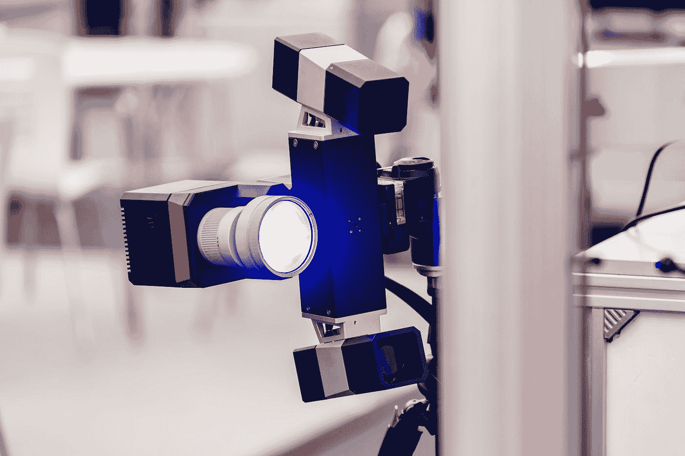

在 [Unsplash](https://unsplash.com?utm_source=medium&utm_medium=referral) 上[更聪明地生活](https://unsplash.com/@livingsmarter?utm_source=medium&utm_medium=referral)的照片

# 什么是数据融合？

***数据融合*** ，在抽象的意义上，指的是以 ***智能*** 和 ***高效*** 的方式组合不同来源的信息，使得系统处理数据的性能优于只给出单一数据源的情况。

在本文中，我们将讨论数据融合如何以及为什么用于各种智能应用，特别是自动驾驶汽车。然后，我们将深入到一个关于自动驾驶汽车的 ***【稀疏】*** 数据融合的具体案例研究中，看看数据融合是如何在行动中使用的。

**数据融合的高级思想:**如果我有两个或更多的数据源，并且每个数据源都提供了 ***新奇*** 和 ***预测性*** 信息来帮助我为我的智能系统做出更好的预测或控制决策，那么我就可以组合这些数据源来提高我的系统的性能。

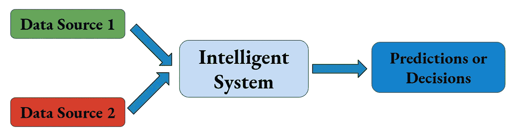

数据融合背后的主要思想:结合不同的数据源，做出更明智的预测或决策。图片来源:作者。

请注意，我们并不局限于仅组合两种类型的数据源:通常，我们可以跨任何*不同的数据源执行数据融合，只要它们是相互引用/校准的。*

*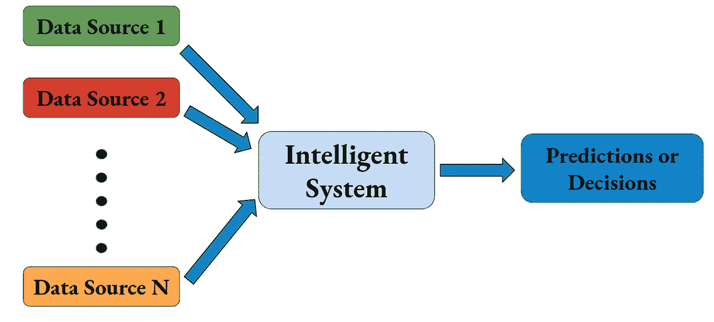*

*数据融合可以概括为组合 N 个不同的数据源，只要这些数据源中的每一个都相互参照/校准。*

## *数据融合可以用在哪些学科？*

*当然这不是一个详尽的列表，但数据融合在以下领域得到了应用:*

1.  ***信号处理**(匹配滤波、卡尔曼滤波、状态空间控制)。*
2.  ***机器人**(感知，视觉-惯性里程计(VIO)，光束调整[1])。*
3.  ***机器学习**(语义分割、对象检测和分类、嵌入)。*

*更一般地说，数据融合可以用于我们使用**数据进行预测或决策的任何领域。***

## ***使用数据融合的示例领域有哪些？***

**

*阿兰·范在 [Unsplash](https://unsplash.com?utm_source=medium&utm_medium=referral) 上的照片*

*同样，这个列表并不详尽，但希望能描绘出数据融合的可能性图景:*

1.  ***无人驾驶汽车**(下文将详细讨论！)*
2.  ***遥感:**不同形式的传感器数据，如 **RGB** 和**激光雷达**可以融合在一起，用于自动陆地勘测等任务。*
3.  ***机器人操纵:**基于视觉的数据，如 **RGB** 或**立体**，可以与来自操纵器和致动器的**里程计**数据融合，以提高机器人操纵任务的性能。*

## *我们如何在智能应用中有效利用数据融合？*

*一些形式的数据融合可能比其他更有效。当使用数据融合作为任何利用数据做出 ***预测*** 或 ***决策*** 的智能系统的一部分时，需要考虑一些事项:*

1.  *数据融合有哪些步骤可以进行 ***在线*** ？ ***离线*** 可以执行哪些步骤？数据融合会导致显著的推理延迟吗？如果会，那么性能上的 X 因子改进值得这种额外的延迟吗？*
2.  *多少在线**计算能力**(CPU，GPU 等。)我的数据融合管道的**预处理**和**后处理**需要吗？*
3.  *多少额外的**计算能力**(CPU、GPU 等)。)来使用来自我的数据融合管道的数据执行**推理**？*
4.  *需要多少额外的**内存** (RAM)来处理和存储来自我的数据融合管道的数据？*
5.  *如果我使用传感器进行数据融合(例如 RGB 摄像机、立体摄像机、激光雷达传感器、惯性测量单元(IMU)等)。)，我的传感器之间是否需要任何额外的**校准**？*
6.  *我的数据集有多**？给定其他数据集，预测一个数据集有多难，反之亦然？这越困难，你就能从融合这些不同来源的数据中提取越多的信息。***

***这些问题可以帮助您权衡不同数据融合方法的利弊，并允许您设计数据融合设置以实现最佳系统性能。***

# ***自动驾驶汽车的数据融合***

***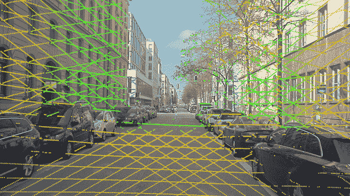***

***自动驾驶汽车数据融合的例子: **RGB 像素**和**激光雷达点云**的融合。图片来源:[2]。***

***现在我们已经介绍了数据融合，让我们考虑如何将其应用到自动驾驶汽车领域。***

***数据融合是自主车辆和机器人的感知、目标检测、语义分割和控制中至关重要的子程序。这些和其他需要智能的任务依赖于以有意义的方式组合数据源，使自动驾驶汽车能够尽快做出明智的预测和决策。***

## ***自动驾驶汽车的数据融合使用了哪些类型的数据源？***

***自动驾驶汽车的一些数据源包括:***

1.  *****RGB 像素:**这些是来自安装在无人驾驶汽车上的摄像头的红色、绿色和蓝色像素强度。***
2.  *****立体点云:**这些点云使用立体深度相机表示物体在空间中的(x，y，z)位置。这些点是通过使用一对立体摄像机估计点的深度来找到的。***
3.  *****激光雷达点云:**类似地，这些点云使用激光雷达传感器表示物体在空间中的(x，y，z)位置。通过计算从激光雷达激光扫描返回到激光雷达传感器的返回时间来找到这些点。***
4.  *****里程计:**里程计数据通常由惯性测量单元和/或加速度计产生。该数据包含汽车的运动学和动力学信息，如速度、加速度和 GPS 坐标。***

## ***这些数据源是如何组合的？***

***关于如何将上述数据源用于基于数据融合的自动驾驶汽车应用的一些示例包括:***

1.  *****里程计**数据与**点云数据**进行**定位**。***
2.  *****RGB** 数据与**里程计**数据用于解决**光束调整**问题【1】。***
3.  *****RGB** 和**点云数据**创建一个 **2D 密集图像**带有四个通道 **(R，G，B，D)**——这通常被称为数字表面模型(DSM)。诸如对象检测和分类以及语义分割的任务可以利用这个 DSM。***
4.  *****RGB** 和**点云数据**创建一个 **3D 稀疏点云**，**，**其中每个点都有 **(x，y，z，R，G，B)** 数据。诸如对象检测和分类以及语义分割的任务可以利用这种具有 RGB 特征的点云。***

***现在，我们已经介绍了一些自动驾驶汽车数据融合的数据源和应用的示例，让我们更深入地研究自动驾驶汽车数据融合的案例:用于**语义分割**的**激光雷达点云**和 **RGB 像素**之间的稀疏数据融合。***

# ***案例研究:稀疏数据融合***

***[GitHub 库](https://github.com/rmsander/sparse-fusion-scene-seg/tree/master)***

***在本案例研究中，我们没有将 **RGB** 和**深度信息**融合到具有多个通道的密集 2D 阵列中，而是采用相反的方法，用来自相应的共同参考的 2D 像素的 **RGB** 值来扩充与深度信息相对应的现有**点云**。***

***下图说明了这个**稀疏数据融合**过程。***

***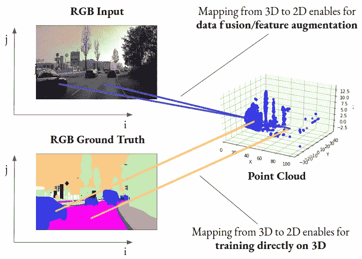***

*****稀疏数据融合:**通过将点云返回的 **(x，y，z)** 坐标与对应的 **(R，G，B)** 空间同一共参照位置的信息串联起来，将 3D 点云数据与 2D RGB 图像数据进行融合。***

## *****为什么稀疏融合？*****

***对于每个智能系统来说，一个至关重要的问题是:*为什么这很重要？*一些提议的理由:***

1.  ***因为我们现在对一个 ***稀疏的*** 、3D 点云执行推断，而不是对一个 ***密集的*** 、2D 图像执行推断，所以我们不必对密集的、计算密集型的输入进行预测。虽然 GPU 和其他硬件加速技术已经能够显著加速图像上的密集卷积运算，但在大型图像上实时执行语义分割推理仍然是一个需要解决的重要问题。***
2.  ***在 ***【密集融合】*****中，当我们将我们的点云(3D 点的点集)转换成深度图像(有时称为数字表面模型(DSM))时，我们固有地 ***丢失了关于这些激光雷达点云的精确 3D 结构的信息*** 。执行“ ***【稀疏融合】*** 通过保留我们的数据的基于点的表示来保留这种精确的 3D 结构和信息。*****

*****请注意，我们承认这种**“稀疏融合”**方法的一个缺点是，我们没有利用所有的 RGB 像素。*****

## *****问题陈述*****

*****有了要执行的融合任务类型的一些背景信息，我们现在准备正式定义我们的基于数据融合的语义分割任务。数学上:*****

*****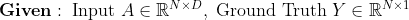**********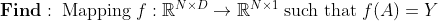*****

*****这里， ***N*** 指我们点云中的点数， ***D*** 指每个点的维数；在这种情况下， ***D = 6*** (3 代表 **x，y，z** ，3 代表 **R，G，B)。*******

*****概略地，这个基于数据融合的语义分割问题可以被可视化为:*****

*****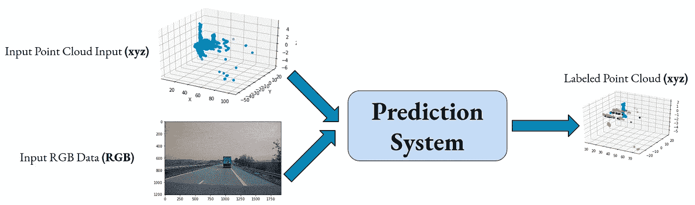*****

*****这是基于自动驾驶数据融合的语义分段应用程序的数据融合管道的高级概述。*****

*****现在我们已经设置了数据融合问题，让我们介绍一下我们将在案例研究中使用的自动驾驶数据集。*****

## *****奥迪自动驾驶数据集(A2D2)*****

*****为了测试这种数据融合方法，我们利用了奥迪自动驾驶数据集(A2D2) [2]。该数据集通过安装在作者汽车上的 ***校准的*** 深度和光学传感器，捕捉 RGB 像素和点云返回之间的直接映射。*****

*****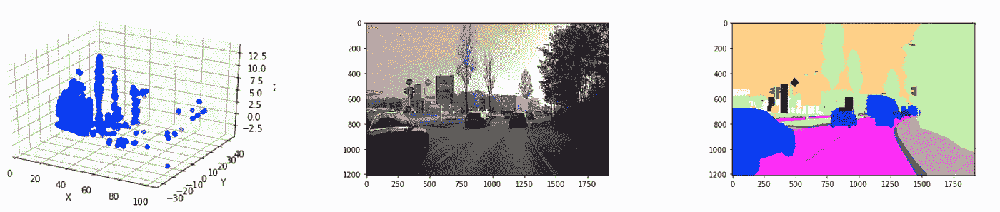*****

*****来自 A2D2 数据集的示例样本。**左:激光雷达**场景的点云表示。**中间:场景的 RGB** 图像表示。**右:场景的语义**标签表示——注意，不同的颜色表示场景中物体的不同地面真实类别，例如车辆、道路、树木或交通信号。图像源[2]。*****

*****更重要的是，我们利用这个数据集，因为由于[2]作者的校准工作，像素和点云返回之间存在直接映射 T32。值得注意的是，我们执行数据融合的能力取决于这种校准。*****

## *******执行数据融合*******

*****这种直接映射允许我们将点云返回与 RGB 特征连接起来，使得每个点云点不再仅仅表示为 **p = (x，y，z)** ，而是表示为 **p = (x，y，z，R，G，B)** ，其中 **R，G，B** 值取自与给定激光雷达点共同参考的像素。*****

*****为了执行这个数据融合操作，我们在 Python `torch`中定义了一个自定义的`DataLoader` 类，当使用`__get_item__`方法从数据集中检索项目时，该类连接了`(x, y, z)`和`(R, G, B)`特征。为了简洁起见，下面只提供了构造函数和采样方法，但是你可以在附录中找到完整的类，也可以在[链接的 GitHub 库](https://github.com/rmsander/sparse-fusion-scene-seg/tree/master)中找到:*****

*****你可以通过他们的校准文件[在这里](https://arxiv.org/abs/2004.06320)阅读更多关于 A2D2 的创造者是如何制作这张地图的。*****

## *****学习架构:PointNet++*****

*****为了学习这个语义分割问题所需要的映射 ***f*** ，我们将使用 **PointNet++** ，一个基于**点集的深度卷积神经网络**。然而，该网络不是在对应于 ***密集空间图像*** 的矩阵和张量上执行卷积，而是在点云的 ***点集空间*** 中执行高维点集卷积。*****

*****下面，提供了[3]中提出的 PointNet++的架构。由于我们的任务集中于语义分割，我们将利用这种神经网络架构的基于分割的变体。*****

*****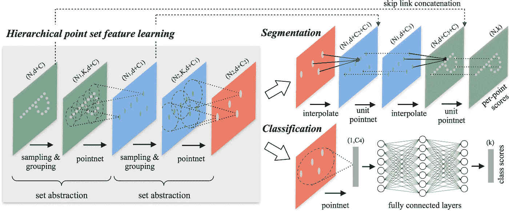*****

*****PointNet++架构。这种架构通过使用一组分层的点集卷积层改进了原始的点网架构[3]。图片来源:[3]。*****

## *****稀疏数据融合在 PointNet++中的应用*****

*****对于这个数据融合任务，我们在每个点组合我们的空间 **(x，y，z)** 特征和我们的 **(R，G，B)** 特征，并使用这些连接的特征作为 PointNet++网络的输入。请注意， **(R，G，B)** 特征不以空间方式处理，即我们不计算像素值之间的“空间”相关性。*****

*****我们基于数据融合的语义分割系统如下图所示:*****

*****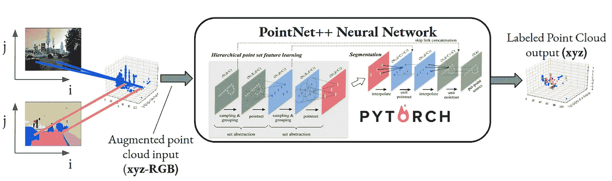*****

*****数据融合和语义分割管道，用于我们对自动驾驶汽车的稀疏数据融合案例研究。*****

*****为了训练网络，数据转换是离线执行的，以减少在线计算时间。然而，对于实时语义分割设置，该稀疏数据融合预处理步骤将需要实时或接近实时地执行。*****

## *****实验设置和评估*****

*****为了测试该框架的有效性，我们评估了网络对每个激光雷达点云返回的语义标签进行正确分类的能力。具体而言，我们使用语义分割度量来测量该系统的分割性能，例如**平均交集超过并集(mIoU)** 和**准确度**度量，下面针对一系列*点来定义，我们为这些点预测语义类别*，并且我们为这些点定义了*不同的类别:********

*********类 *c* :** 的并集上的交集(IOU)*******

******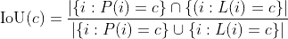******

********所有类的并的平均交集(mIOU):********

******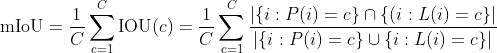******

********所有类别的精确度:********

******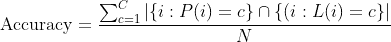******

******我们评估了这种稀疏数据融合方法，用于:******

1.  ********两个语义类:**分割道路与非道路特征。******
2.  ********六类:**这包括按频率排列的“其他”、“道路”、“车辆”、“行人”、“道路/街道标志”、“车道”。请注意,“其他”的真正类别不是“其他”,它是我们在这个实验中聚合到单个“其他”类别中的其他类别之一。******
3.  ******55 个类:这将我们的语义分割问题扩展到一组更加多样化的语义类。******

******作为参考，下面提供了六类语义分割问题中每个主要类的相对比例:******

******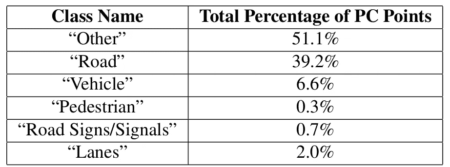******

******“六类”语义分割问题中六个最常见类的类频率。图片来源:作者。******

## ******结果******

******下表给出了我们应用 PointNet++方法和稀疏数据融合技术的结果。请注意，随着我们减少地面等级的数量，我们的精确度和 mIoU 指标开始显著增加。******

******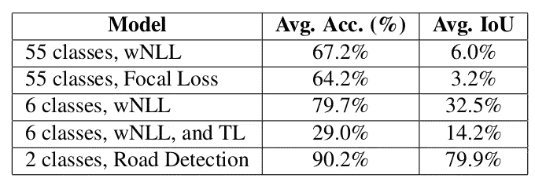******

******精确度和交集(IoU)指标的结果表。请注意以下缩写:wNLL:加权交叉熵，TL:迁移学习(增量迁移学习)。图片来源:作者。******

## ******局限性和未来工作******

******虽然这项工作证明了这个框架的初步可行性，但仍然有大量的额外研究可以扩展这个主题。******

******这项工作的一个建议延续旨在根据以下指标量化**密集**和**稀疏**数据融合之间的性能差异:******

1.  ******运行时性能******
2.  ******语义分割指标(如准确度、mIoU)******
3.  ******在线预处理和后处理时间******

******如果你有任何继续这项工作的想法，你想分享，请在下面留下回应！******

# ******回顾和总结******

************

******克里斯托弗·伯恩斯在 [Unsplash](https://unsplash.com?utm_source=medium&utm_medium=referral) 上拍摄的照片******

******在本文中，我们引入了 ***数据融合*** 的概念，作为通过 ***融合不同数据源*** 来提高智能系统性能的一种手段。我们讨论了一些使用数据融合的示例领域，特别关注数据融合在自动驾驶汽车上的应用。然后，我们深入研究了自动驾驶汽车的数据融合案例。******

******在案例研究中，我们讲述了**为什么**和**如何进行**数据融合，并讨论了我们为什么能够进行数据融合。然后，我们讨论了数据融合在一个示例语义分割系统中的作用，并通过这个案例研究总结了系统性能和未来的工作。******

******如果你想了解这个案例研究的更多信息，请查看我的 GitHub 知识库中关于 [**稀疏融合场景分割与 A2D2**](https://github.com/rmsander/sparse-fusion-scene-seg/tree/master) 的内容。******

******我希望你喜欢这篇文章，并感谢阅读:)请关注我更多关于强化学习、计算机视觉、编程和优化的文章！******

# ******感谢******

******感谢 A2D2 团队开源了他们的数据集，也感谢[3]的作者开源了 PointNet++神经网络架构。******

# ******参考******

1.  ******光束法平差——现代综合。*视觉算法国际研讨会*。施普林格，柏林，海德堡，1999。******
2.  ******Geyer，Jakob 等人，《A2d2:奥迪自动驾驶数据集》arXiv 预印本 arXiv:2004.06320 (2020)。******
3.  ******郝、查尔斯·黎齐·易、苏·列奥尼达斯·吉巴斯。" PointNet++度量空间中点集的深度层次特征学习." *arXiv 预印本 arXiv:1706.02413* (2017)。******

# ********附录:使用 PointNet++的 A2D2 数据融合数据集的 Python 类********