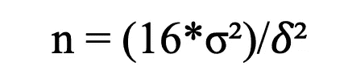
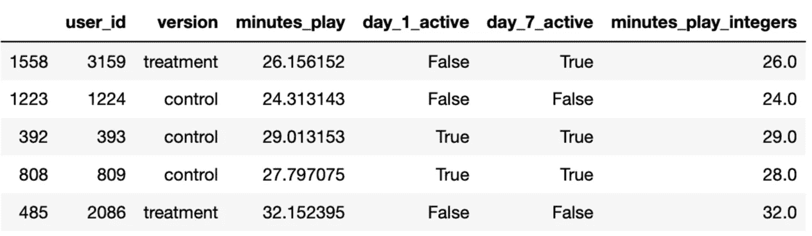
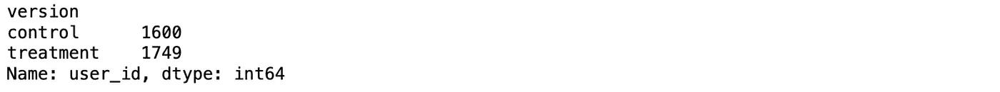
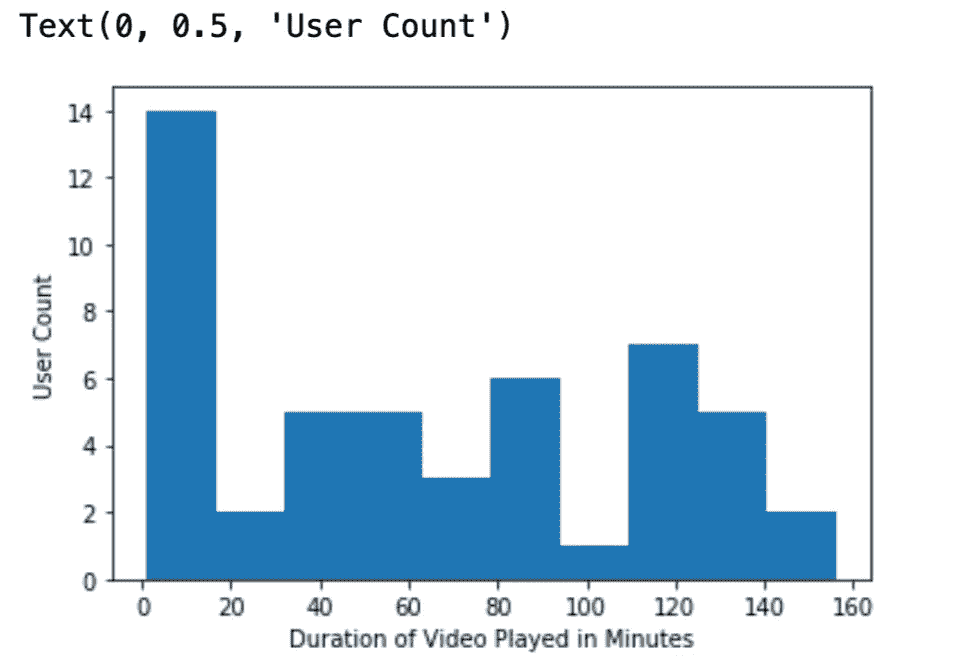
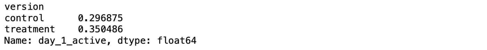
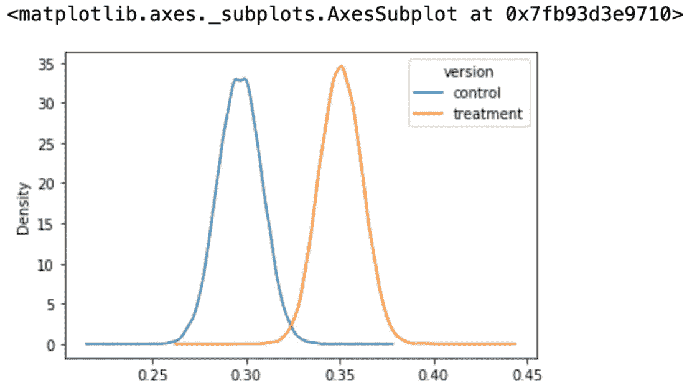
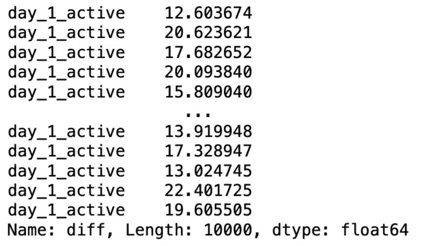
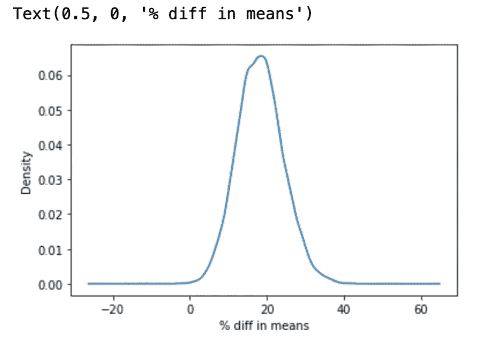
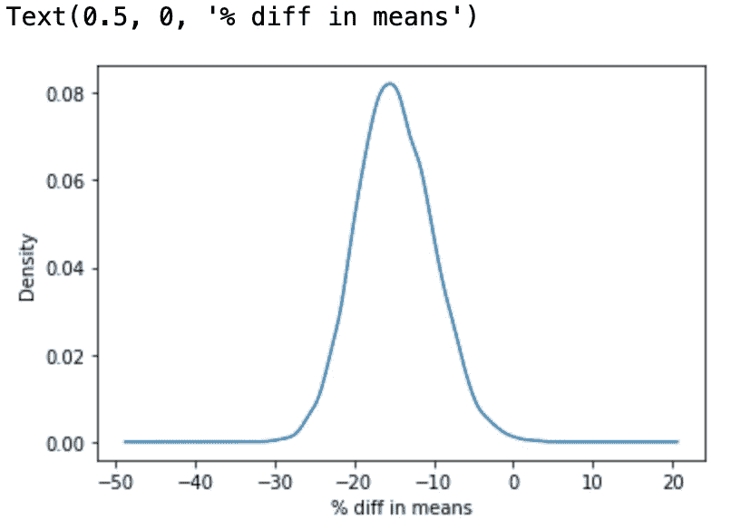

# Python 中 A/B 测试的实用指南

> 原文：<https://towardsdatascience.com/a-practical-guide-to-a-b-tests-in-python-66666f5c3b02?source=collection_archive---------5----------------------->

## 实验和因果推理

## 数据科学家在实验前、实验中和实验后应遵循的最佳实践


照片由 [niko photos](https://unsplash.com/@niko_photos?utm_source=unsplash&utm_medium=referral&utm_content=creditCopyText) 在 [Unsplash](https://unsplash.com/s/photos/nature?utm_source=unsplash&utm_medium=referral&utm_content=creditCopyText) 上拍摄

# 介绍

随机对照试验(又名。A/B 测试)是建立因果推断的黄金标准。RCT 严格控制随机化过程，并确保在推广治疗前在协变量间的平均分布。因此，我们可以将治疗组和对照组之间的平均差异归因于干预。

A/B 检验是有效的，只依赖温和的假设，最重要的假设是[稳定单位治疗值假设，SUTVA](https://en.wikipedia.org/wiki/Rubin_causal_model#Stable_unit_treatment_value_assumption_(SUTVA)) 。它指出，治疗和控制单位不相互作用；否则，干扰会导致有偏差的估计。我最新的博客文章讨论了它的来源和主要技术的应对策略。

[](/how-user-interference-may-mess-up-your-a-b-tests-f29abfcfccf8) [## 用户干扰如何会搞乱你的 A/B 测试？

### 来自 Lyft、LinkedIn 和 Doordash 的三个解决方案

towardsdatascience.com](/how-user-interference-may-mess-up-your-a-b-tests-f29abfcfccf8) 

作为一名数据科学家，我很高兴看到业界越来越多地采用实验和因果推理。《哈佛商业评论》最近发表了一篇题为“[为什么商学院需要教授实验](https://hbr.org/2021/06/why-business-schools-need-to-teach-experimentation)”的文章，强调了融入实验思维的重要性。与之相关的是，他们在另一篇论文中讨论了“[在线实验的惊人力量](https://hbr.org/2017/09/the-surprising-power-of-online-experiments)”(Kohavi 和 Thomke，2017)。

A/B 测试大致可以分为三个阶段。

> 阶段 1 预测试:运行功效分析以确定样本大小。
> 
> 第二阶段测试:关注关键指标。注意突然下降。
> 
> 第三阶段后测:分析数据并得出结论。

今天的帖子分享了每个阶段的一些最佳实践，并通过一个假设的案例研究详细介绍了 Python 中的代码实现。

# 业务场景

抖音开发了一种新的动物过滤器，并希望评估其对使用者的影响。他们对两个关键指标感兴趣:

> 1.过滤器如何影响用户参与度(例如，花在应用上的时间)？
> 
> 2.过滤器如何影响用户留存率(如活跃)？

也有一些限制。首先，抖音事先不知道它的性能，更喜欢小规模的研究，尽量少接触。这是理想的方法，因为如果关键指标直线下降(例如，治疗组的对话率为零)，他们可以立即结束测试。

第二，这是一个及时的紧急问题，抖音希望在两周内得到答复。幸运的是，抖音已经阅读了[我之前关于用户干扰的帖子](/how-user-interference-may-mess-up-your-a-b-tests-f29abfcfccf8?sk=9ff3bbae01ff9951e6eca33e1c75cff4)，并正确地解决了 SUTVA 假设违反的问题。

公司决定聘请一小群非常有才华的数据科学家，你是负责模型选择和研究设计的团队领导。在咨询了多个利益相关者之后，您提出了一个 A/B 测试，并建议了以下最佳实践。

# 第 1 阶段预测试:目标、指标和样本量

> 测试的目标是什么？
> 
> 如何衡量成功？
> 
> 我们应该运行多长时间？

作为第一步，我们希望阐明测试的目标，并将其反馈给团队。如前所述，该研究旨在测量推出过滤器后的用户参与度和保留度。

接下来，我们转向指标，并决定如何衡量成功。作为一个社交网络应用，我们采用花在应用上的时间来衡量用户参与度和两个布尔变量，**指标 1** 和**指标 2** (如下所述)，分别表明用户在 1 天和 7 天后是否活跃。

剩下的问题是:我们应该运行测试多长时间？一个常见的策略是，一旦我们观察到有统计学意义的结果(例如，一个小的 p 值)，就停止实验。公认的数据科学家强烈反对 p-hacking，因为它会导致有偏见的结果( [Kohavi 等人 2020](https://www.amazon.com/Trustworthy-Online-Controlled-Experiments-Practical/dp/1108724264) )。与此相关的是，当 p-hacking 导致误报时，Airbnb 也遇到了同样的问题(Airbnb 的[实验](https://medium.com/airbnb-engineering/experiments-at-airbnb-e2db3abf39e7))。

相反，我们应该进行功效分析，并根据三个参数决定最小样本量:

1.  **显著性水平，**也称为α或α:当假设为真时拒绝零假设的概率。通过拒绝一个真正的零假设，我们错误地声称有一个效果，而实际上没有效果。因此，它也被称为[假阳性的概率](/crack-data-science-interviews-essential-statistics-concepts-d4491d85219e)。
2.  **统计功效**:确实有效果时，正确识别效果的概率。功率= 1 — [第二类误差](/crack-data-science-interviews-essential-statistics-concepts-d4491d85219e?sk=af5291865f239ad505e8a8a1a80cceb8)。
3.  **最小可检测效应，MDE** :为了找到一个广泛认同的 MDE，我们的数据团队与项目经理坐下来，决定最小可接受差异为 0.1。换句话说，用标准差衡量的两组之间的差异需要至少为 0.1。否则，该版本将无法补偿所产生的业务成本(例如，工程师的时间、产品生命周期等)。).例如，如果一个新的设计仅仅带来 0.000001%的提升，那么它就没有任何意义，即使它在统计上是显著的。

以下是这三个参数与所需样本量之间的双向关系:

*   显著性水平降低→更大的样本量
*   统计功效增加→更大的样本量
*   最小可检测效应降低→更大的样本量

通常，我们将显著性水平设置为 5%(或 alpha = 5%)，统计功效设置为 80%。因此，样本大小通过以下公式计算:



我自己的截图

其中:

*   *σ:样本方差。*
*   *𝛿:治疗组和对照组的差异(以百分比表示)。*

为了获得样本方差( *σ* )，我们通常会运行一个 [A/A 测试](/an-a-b-test-loses-its-luster-if-a-a-tests-fail-2dd11fa6d241?source=friends_link&sk=null)，该测试遵循与 A/B 测试相同的设计思路，只是对两组进行了相同的处理。

> 什么是 [A/A 测试](/an-a-b-test-loses-its-luster-if-a-a-tests-fail-2dd11fa6d241?source=friends_link&sk=null)？
> 
> 将用户分成两组，然后对两组分配相同的处理。

下面是用 Python 计算样本大小的代码。

```
from statsmodels.stats.power import TTestIndPower# parameters for power analysis # effect_size has to be positiveeffect = 0.1
alpha = 0.05
power = 0.8# perform power analysis 
analysis = TTestIndPower()result = analysis.solve_power(effect, power = power,nobs1= None, ratio = 1.0, alpha = alpha)print('Sample Size: %.3f' % round(result))1571.000
```

我们需要 1571 个变量。至于我们应该运行多长时间的测试，这取决于应用程序收到多少流量。然后，我们将日流量平均分成这两个变量，等到收集到足够大的样本量(≥1571)。

如上所述，抖音是一个非常受欢迎的应用程序，拥有数百万的 dau。但是，我们专门针对试用新过滤器的用户。此外，最小接触法可能需要几天时间来为实验收集足够的观察数据。

## 最佳实践

*   了解实验的目标以及如何衡量成功。
*   运行 A/A 测试以估计指标的方差。[看看我最近发表的关于如何用 Python 运行和解释 A/A 测试的文章](/an-a-b-test-loses-its-luster-if-a-a-tests-fail-2dd11fa6d241?source=friends_link&sk=null)。
*   运行功效分析以获得最小样本量。


埃尔卡里托在 [Unsplash](https://unsplash.com/s/photos/two?utm_source=unsplash&utm_medium=referral&utm_content=creditCopyText) 上拍摄的照片

# 测试期间第 2 阶段:数据收集

我们推出测试并启动数据收集流程。在这里，我们模拟数据生成过程(DGP ),并人工创建遵循特定分布的变量。我们知道真实的参数，这在比较估计的治疗效果和真实的效果时很方便。换句话说，我们可以评估 A/B 测试的有效性，并检查它们在多大程度上导致无偏见的结果。

在我们的案例研究中，有五个变量需要模拟:

```
1\. userid2\. version3\. minutes of plays4\. user engagement after 1 day (metric_1)5\. user engagement after 7 days (metric_2)
```

**#变量 1 和 2:用户标识和版本**

我们有意创建 1600 个对照单位和 1749 个处理单位，以表示潜在的采样比率不匹配，SRM。

```
**# variable 1: userid** user_id_control = list(range(1,1601))# 1600 control
user_id_treatment = list(range(1601,3350))# 1749 treated**# variable 2: version** import numpy as np
control_status = [‘control’]*1600
treatment_status = [‘treatment’]*1749
```

**#变量 3:播放时间**

我们将变量 3(“*上场时间”*)模拟为正态分布，μ为 30 分钟，σ为 10。具体来说，对照组的平均值是 30 分钟，方差是 10。

概括地说，MDE 的效应参数计算为两组之间的差异除以标准偏差 *(μ_1 — μ_2)/σ_squared = 0.1。根据公式，我们得到μ_2 = 31。方差也是 10。*

```
# for control groupμ_1 = 30
σ_squared_1 = 10
np.random.seed(123)
minutes_control = np.random.normal(loc = μ_1, scale = σ_squared_1, size = 1600)# for treatment group, which increases the user engagement by 
# according to the formula (μ_1 — μ_2)/σ_squared = 0.1, we obtain μ_2 = 31μ_2 = 31σ_squared_2 = 10np.random.seed(123)minutes_treat = np.random.normal(loc = μ_2, scale = σ_squared_2, size = 1749)
```

**#变量 4:1 天后的用户参与度，metric_1**

我们的模拟显示，在 1 天(metric_1)后，对照组有 30%的活跃(真)用户和 70%的不活跃(假)用户，而治疗组分别有 35%的活跃用户和 65%的不活跃用户。

```
Active_status = [True,False]# control 
day_1_control = np.random.choice(Active_status, 1600, p=[0.3,0.7])# treatment
day_1_treatment = np.random.choice(Active_status, 1749, p=[0.35,0.65])
```

**#变量 5:7 天后的用户参与度，metric_2**

模拟数据显示，对照组的活跃用户率为 35%，而治疗组在 7 天后的活跃用户率为 25%。

```
# control 
day_7_control = np.random.choice(Active_status, 1600, p=[0.35,0.65])# treatment
day_7_treatment = np.random.choice(Active_status, 1749, p=[0.25,0.75])
```

真实数据包含一个相反的模式:治疗组在短期内表现更好，但对照组在一周后回来并脱颖而出。

让我们检查一下 A/B 测试是否拾取了反向信号。

```
final_data.head()
```



我自己的截图

*完整的模拟过程，请参考我的*[*Github*](https://github.com/LeihuaYe/Statistical_Simulation_In_Python)*。*

## 最佳实践

*   在目睹了一些初步的积极效果后，不要过早地结束你的 A/B 测试。
*   不要提前停车！
*   禁止 p-hacking！
*   相反，当达到最小样本量时就结束它。


拉扎·阿里在 [Unsplash](https://unsplash.com/s/photos/two?utm_source=unsplash&utm_medium=referral&utm_content=creditCopyText) 上的照片

# 阶段 3 后测:数据分析

收集到足够的数据后，我们进入实验的最后一个阶段，即数据分析。作为第一步，检查每个变体中有多少用户是有益的。

```
# calculate the number of users in each version
final_data.groupby('version')['user_id'].count()
```



我自己的截图

这似乎是一个可疑的变异分裂:1600 个控制单位，但 1749 个治疗单位。治疗分配过程从表面上看是可疑的，因为分配给治疗的用户比控制组多。

为了正式检查 SRM，我们在治疗组和对照组的实际分割和预期分割之间进行卡方检验([科哈维等人 2020](https://www.amazon.com/Trustworthy-Online-Controlled-Experiments-Practical/dp/1108724264) )。

```
from scipy.stats import chisquare 
chisquare([1600,1749],f_exp = [1675,1675])Power_divergenceResult(statistic=6.627462686567164, pvalue=0.010041820594939122)
```

我们将 alpha 级别设置为 0.001 来测试 SRM。由于 p 值为 0.01，我们无法拒绝零假设，并得出没有 SRM 证据的结论。与我们的直觉相反，统计测试得出的结论是，治疗任务按预期进行。

## 画出每组上场时间的分布图

由于变量 *minutes_play* 是一个浮点数，我们必须在分组前将其四舍五入到最接近的整数。

```
%matplotlib inlinefinal_data[‘minutes_play_integers’] = round(final_data[‘minutes_play’])plot_df = final_data.groupby(‘minutes_play_integers’)[‘user_id’].count()# Plot the distribution of players that played 0 to 50 minutes
ax = plot_df.head(n=50).plot(x=”minutes_play_integers”, y=”user_id”, kind=”hist”)ax.set_xlabel(“Duration of Video Played in Minutes”)ax.set_ylabel(“User Count”)
```



我自己的截图

## 指标 1:a b 组的 1 天保留时间

```
# 1-day retention
final_data[‘day_1_active’].mean()
0.3248730964467005
```

一天之后，总体活跃用户率平均徘徊在 32.5%左右。

```
# 1-day retention by group
final_data.groupby(‘version’)[‘day_1_active’].mean()
```



我自己的截图

仔细一看，对照组有 29.7%的活跃用户，治疗组有 35%。

自然，我们对以下问题感兴趣:

> 治疗组较高的保留率是否具有统计学意义？
> 
> 它的可变性是什么？
> 
> 如果我们重复这个过程 10，000 次，我们至少观察到极值的频率是多少？

Bootstrap 可以回答这些问题。这是一种重采样策略，用替换数据重复采样原始数据。根据[中心极限定理](https://en.wikipedia.org/wiki/Central_limit_theorem)，重采样的分布意味着近似正态分布(查看我在 Bootstrap 上的其他帖子，在 [R](/a-practical-guide-to-bootstrap-with-r-examples-bd975ec6dcea?sk=92ce4c8398188ab9421797ac5e292bf7) 或者 [Python](/bootstrap-and-statistical-inference-in-python-a06d098a8bfd?sk=bc2ddc26d3973354f350960b08746f1b) )。

```
# solution: bootstrap
boot_means = []# run the simulation for 10k times 
for i in range(10000):#set frac=1 → sample all rows
    boot_sample = final_data.sample(frac=1,replace=True).groupby (‘version’) [‘day_1_active’].mean() boot_means.append(boot_sample)# a Pandas DataFrame
boot_means = pd.DataFrame(boot_means)# kernel density estimate
boot_means.plot(kind = ‘kde’)
```



我自己的截图

```
# create a new column, diff, which is the difference between the two variants, scaled by the control groupboot_means[‘diff’]=(boot_means[‘treatment’] — boot_means[‘control’]) /boot_means[‘control’]*100boot_means['diff']
```



我自己的截图

```
# plot the bootstrap sample difference 
ax = boot_means[‘diff’].plot(kind = ‘kde’)
ax.set_xlabel(“% diff in means”)
```



我自己的截图

```
boot_means[boot_means[‘diff’] > 0]# p value 
p = (boot_means[‘diff’] >0).sum()/len(boot_means)
p
0.9996
```

在引导 10，000 次后，该治疗在 99.96%的时间内具有更高的 1 天保留率。

厉害！

测试结果与我们最初的模拟数据一致。

## 指标 7:a b 组的 7 天保留期

我们将同样的分析应用于 7 天指标。

```
boot_7d = []for i in range(10000):
      boot_mean = final_data.sample(frac=1,replace=True).groupby(‘version’)[‘day_7_active’].mean() boot_7d.append(boot_mean)

boot_7d = pd.DataFrame(boot_7d)boot_7d[‘diff’] = (boot_7d[‘treatment’] — boot_7d[‘control’])            /boot_7d[‘control’] *100# Ploting the bootstrap % difference
ax = boot_7d['diff'].plot(kind = 'kde')
ax.set_xlabel("% diff in means")
```



我自己的截图

```
# Calculating the probability that 7-day retention is greater when the gate is at level 30p = (boot_7d['diff']>0).sum()/len(boot_7d)1-p
0.9983
```

在 7 天的指标上，控件显然具有更好的用户保持率 99.83%的时间，也与原始数据一致。

1 天和 7 天指标之间的反向模式支持了[新奇效应](https://en.wikipedia.org/wiki/Novelty_effect)，因为用户被新设计激活和激起了兴趣，而不是因为变化实际上提高了参与度。新奇效应在消费者端 A/B 测试中很受欢迎。

## 最佳实践

*   SRM 是一个真正的问题。我们应用卡方检验对 SRM 进行正式测试。如果 p 值小于阈值(α = 0.001)，随机化过程不会按预期进行。
*   SRM 会引入使任何测试结果无效的选择偏差。
*   需要掌握三个基本的统计概念:SRM、卡方检验和 bootstrap。
*   比较短期和长期指标以评估新颖性效果。

*完整的模拟过程请参考我的* [*Github*](https://github.com/LeihuaYe/Statistical_Simulation_In_Python) *。*

# 结论

A/B 测试需要广泛的统计知识和对细节的仔细关注。有成千上万种方法可以破坏你的测试结果，但只有一种方法可以正确地做到。遵循实验前、中、后描述的最佳实践，为实验的成功做好准备。

*Medium 最近进化出了自己的* [*作家伙伴计划*](https://blog.medium.com/evolving-the-partner-program-2613708f9f3c) *，支持像我这样的普通作家。如果你还不是订户，通过下面的链接注册，我会收到一部分会员费。*

[](https://leihua-ye.medium.com/membership) [## 阅读叶雷华博士研究员(以及其他成千上万的媒体作家)的每一个故事

### 作为一个媒体会员，你的会员费的一部分会给你阅读的作家，你可以完全接触到每一个故事…

leihua-ye.medium.com](https://leihua-ye.medium.com/membership) 

# 进一步阅读

[](/online-controlled-experiment-8-common-pitfalls-and-solutions-ea4488e5a82e) [## 运行 A/B 测试的 8 个常见陷阱

### 如何不让你的在线控制实验失败

towardsdatascience.com](/online-controlled-experiment-8-common-pitfalls-and-solutions-ea4488e5a82e) [](/an-a-b-test-loses-its-luster-if-a-a-tests-fail-2dd11fa6d241) [## 如果 A/A 测试失败，A/B 测试就失去了光彩

### A/A 测试的统计方法

towardsdatascience.com](/an-a-b-test-loses-its-luster-if-a-a-tests-fail-2dd11fa6d241) [](/how-user-interference-may-mess-up-your-a-b-tests-f29abfcfccf8) [## 用户干扰如何会搞乱你的 A/B 测试？

### 来自 Lyft、LinkedIn 和 Doordash 的三个解决方案

towardsdatascience.com](/how-user-interference-may-mess-up-your-a-b-tests-f29abfcfccf8) 

[用曲奇猫测试手机游戏 A/B](https://learn.datacamp.com/projects/184)

# 喜欢读这本书吗？

> 请在 [LinkedIn](https://www.linkedin.com/in/leihuaye/) 和 [Youtube](https://www.youtube.com/channel/UCBBu2nqs6iZPyNSgMjXUGPg) 上找到我。
> 
> 还有，看看我其他关于人工智能和机器学习的帖子。