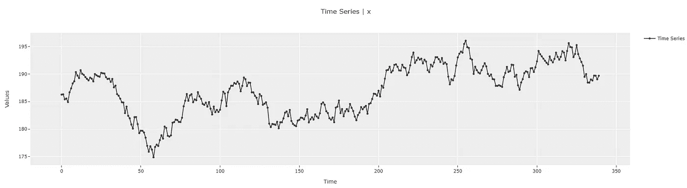
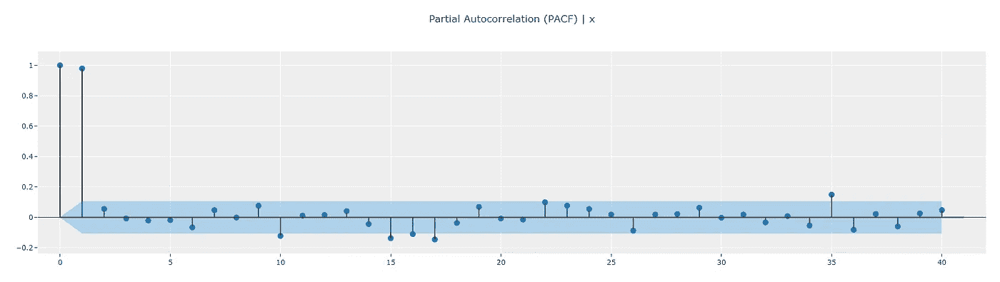
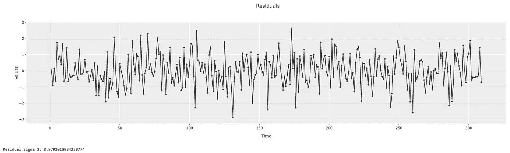
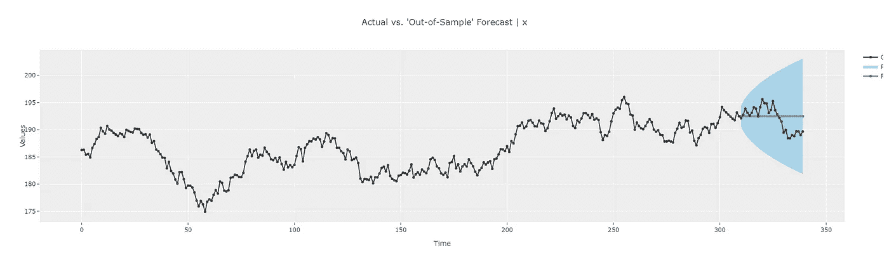
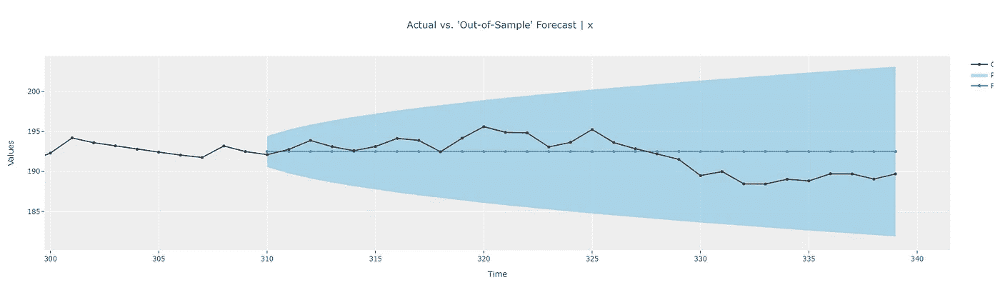
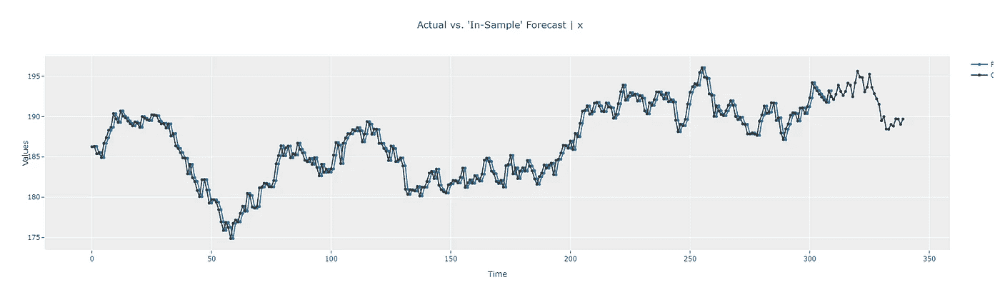
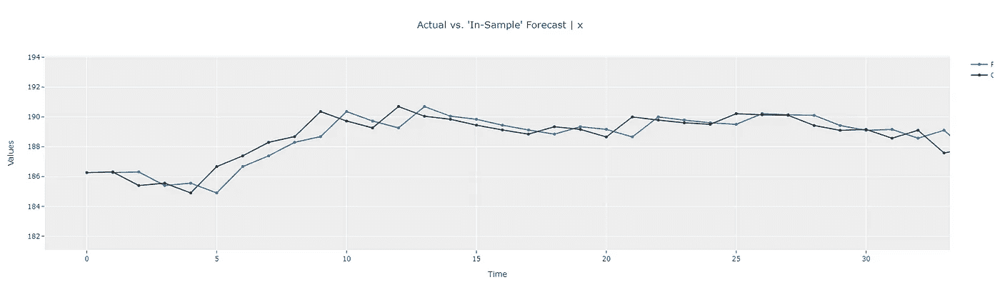
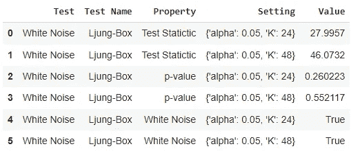

# 使用 PyCaret 的 ARIMA 模型实用指南—第 3 部分

> 原文：<https://towardsdatascience.com/a-practical-guide-to-arima-models-using-pycaret-part-3-823abb5359a7?source=collection_archive---------8----------------------->

## 理解差异术语


由[塞德里克·韦舍](https://unsplash.com/@cedrikwesche?utm_source=medium&utm_medium=referral)在 [Unsplash](https://unsplash.com?utm_source=medium&utm_medium=referral) 拍摄的照片

## 📚介绍

在本系列的前一篇文章中，我们看到了趋势项对 ARIMA 模型输出的影响。本文将着眼于“差异”术语“d ”,并了解它是如何建模的以及它代表了什么。

## 📖建议的先前阅读

本系列以前的文章可以在下面找到。我建议读者在继续阅读本文之前先浏览一遍。本文建立在前几篇文章中描述的概念的基础上，并重用了其中的一些工作。

[使用 PyCaret 的 ARIMA 模型实用指南—第 1 部分](/understanding-arima-models-using-pycarets-time-series-module-part-1-692e10ca02f2)

使用 PyCaret 的 ARIMA 模型实用指南—第 2 部分

## ARIMA 模型中的 1️⃣“差异-d”概述

在很高的层次上，差异意味着时间序列在任何给定时间点的值取决于前一时间点的值。差值“d = 1”意味着任何时间点的值取决于前一时间点(由等式 1 给出)。ε项表示无法建模的噪声项。


d=1 的 ARIMA 方程(图片由作者使用[https://latex2png.com/](https://latex2png.com/))

**重要提示:**使用等式 1 生成时间序列的过程也称为“随机漫步”。大多数股票数据都遵循这种模式。如果你仔细观察，你会意识到当这被正确建模时，未来点的最佳预测与最后已知点相同。因此，使用 ARIMA 等传统方法的股票价格模型不会产生“有用”的模型。我们真的需要一个模型来告诉我们明天的股价会和今天的股价一样吗？

## 2️⃣️用 PyCaret 理解差项

👉**步骤 1:设置 PyCaret 时间序列实验**

为了更好地理解这个概念，我们将使用来自`pycaret`游乐场的随机行走数据集。详细内容可以在本文的 Jupyter 笔记本中找到(可在文章末尾找到)。

```
*#### Get data from data playground ----*
y = get_data("1", **folder="time_series/random_walk"**)exp = TimeSeriesExperiment()
exp.setup(data=y, seasonal_period=1, fh=30, session_id=42)exp.plot_model()
```



随机漫步数据集[图片由作者提供]

👉**步骤 2:执行 EDA**

诊断时间序列是否由随机游走过程生成的经典方法是查看 ACF 和 PACF 图。ACF 图将显示扩展的自相关性[1]。PACF 图应显示滞后= 1 时的峰值，且峰值大小应非常接近 1。所有其他的滞后都将是微不足道的。您可以将 PACF 幅度视为等式 1 中滞后值 y(t-1)的系数。我将在另一篇文章中详细介绍这一点。

```
exp.**plot_model(plot="acf")**
exp.**plot_model(plot="pacf")**
```


随机游走数据集 ACF 图[图片由作者提供]



随机游走数据集 PACF 图[图片由作者提供]

👉**第三步:理论计算**

对于随机游走模型，我们可以使用等式 1 来指导我们计算理论值。本质上，下一个时间点被预测为最后一个“已知”时间点。对于样本内预测(即，对训练数据集的预测)，这将在每个时间点改变，因为 t = 1 时的最后已知点与 t=10 时的最后“已知”点不同(假设 t = 1 和 t = 10 都在样本内)。

对于样本外预测(即未知交叉验证/测试数据集中的预测)，最佳未来预测将是最后一个已知数据点。不管我们对未来的预测有多远，这都是一样的。这是随机游走的样本内和样本外预测之间的一个重要区别。


理论样本内(训练)和样本外(测试)预测[图片由作者提供]

👉**第四步:用 PyCaret** 建立模型

```
**#### Random Walk Model (without trend) ----**
model3a = exp.create_model(
    "arima",
    **order=(0, 1, 0),**
    seasonal_order=(0, 0, 0, 0),
    trend="n"
)
```

👉**第五步:分析结果**

我们将重用我们在以前的文章中创建的相同的助手函数来分析结果。

```
**summarize_model**(model3a)
```


随机漫步模型统计摘要[图片由作者提供]

统计总结显示，创建的模型是一个`SARIMAX(0,1,0)`模型，它与我们希望用`d=1`构建模型的愿望相匹配。残差σ2(未解释的方差)是 0.9720，代表等式 1 中的`epsilon`项。

```
**get_residual_properties**(model3a)
```



模型残差[图片由作者提供]

查看模型残差，我们可以看到残差确实具有 0.9720 的方差，这与统计汇总相匹配。接下来，让我们绘制预测图，并与我们的理论框架进行比较。

```
**plot_predictions**(model3a)
```



样本外预测[图片由作者提供]



缩小样本预测[图片由作者提供]

样本外预测与我们的理论计算相符。即预测与最后已知的数据点(在这种情况下是点 309 处的值)相同。在`pycaret`中放大交互图的能力使分析结果变得容易，并对模型的工作获得更好的直觉。



样本内预测[图片由作者提供]



放大样本预测[图片由作者提供]

同样，我们也可以观察样本内预测。放大图显示，任何给定时间点的预测都与最后一个已知点相同。并且由于最后已知的数据点从一个时间点变化到下一个时间点，样本内预测也从一个点变化到下一个点。这也符合我们的理论计算。

👉**第六步:检查模型是否合适**

这也是引入“模型拟合”概念的好时机。检查模型的拟合度实质上意味着检查模型是否从时间序列中获取了所有“信息”。当模型残差不具有任何趋势、季节性或自相关性时，即残差是“白噪声”时，这是正确的。`pycaret`提供了一个非常方便的功能来检查模型是否合适。我们可以通过将模型传递给`check_stats`方法/函数来检查模型残差的白噪声特性，如下所示。

```
exp.**check_stats**(model3a, test="white_noise")
```



模型剩余白噪声测试[图片由作者提供]

第 4 行和第 5 行证实了残差确实是白噪声，因此模型很好地捕获了来自时间序列的信息。

# 🚀结论

希望这个简单的模型已经为我们理解 ARIMA 模型中“差项— d”的内部运作打下了良好的基础。在下一篇文章中，我们将看到如何将“差异”术语“d”与本系列上一篇文章中所学的“趋势”组件结合起来。在那之前，如果你愿意在我的社交渠道上与我联系(我经常发布关于时间序列分析的文章)，你可以在下面找到我。暂时就这样了。预测快乐！

🔗[领英](https://www.linkedin.com/in/guptanick/)

🐦[推特](https://twitter.com/guptanick13)

📘 [GitHub](https://github.com/ngupta23)

*喜欢这篇文章吗？成为* [***中等会员***](https://ngupta13.medium.com/membership) *继续* ***无限制学习*** *。如果您使用下面的链接，* ***，我会收到您的一部分会员费，而不会对您产生额外的费用*** *。*

[](https://ngupta13.medium.com/membership) [## 通过我的推荐链接加入 Medium—Nikhil Gupta

### 阅读 Nikhil Gupta(以及媒体上成千上万的其他作家)的每一个故事。您的会员费直接支持…

ngupta13.medium.com](https://ngupta13.medium.com/membership) 

# 📗资源

1.  [**Jupyter 笔记本**](https://nbviewer.ipython.org/github/ngupta23/medium_articles/blob/main/time_series/pycaret/pycaret_ts_arima_010_0000.ipynb) 内含本文代码

# 📚参考

[1] [时间序列探索性分析|自相关函数](https://github.com/pycaret/pycaret/discussions/1765)