# 使用 PyCaret 的 ARIMA 模型实用指南—第 4 部分

> 原文：<https://towardsdatascience.com/a-practical-guide-to-arima-models-using-pycaret-part-4-d595da232540?source=collection_archive---------13----------------------->

## 结合“趋势”和“差异”术语


马库斯·斯皮斯克在 [Unsplash](https://unsplash.com?utm_source=medium&utm_medium=referral) 上的照片

## 📚介绍

在本系列的前几篇文章中，我们分别看到了趋势项和差异项对 ARIMA 模型输出的影响。本文将着眼于这两个术语的组合效果以及它们是如何建模的。

## 📖建议的先前阅读

本系列以前的文章可以在下面找到。我建议读者在继续阅读本文之前先阅读这些内容。本文建立在前几篇文章中描述的概念的基础上，并重用了其中开发的框架。

[使用 PyCaret 的 ARIMA 模型实用指南—第二部分](https://medium.com/towards-data-science/understanding-arima-models-using-pycarets-time-series-module-part2-308ea7bfecf6)(趋势术语)

使用 PyCaret 的 ARIMA 模型实用指南—第 3 部分(差异项)

## 1️⃣将“差异-d”项与趋势分量相结合

当开发具有趋势和差异项的 ARIMA 模型时，模型方程表示如下(对于 d = 1)。


带趋势项的 d=1 的 ARIMA 方程(图片由作者使用[https://latex2png.com/](https://latex2png.com/))

读者会注意到，这是本系列前几篇文章中的差异和趋势术语的简单线性组合。和以前一样，用户可以选择指定如何对趋势进行建模。有 3 种方法可以对其建模— (1)仅使用截距项“a”，(2)仅使用漂移项“b”，或者(3)同时使用截距项和漂移项。我们将在本文中看到这三个例子。

另一个有趣的观察结果是，如果重新排列等式，如等式 2 所示，趋势项的系数(“a”和“b”)可以通过对数据的一阶差分进行线性回归拟合来获得。我们将使用这个等式来开发模型参数“a”和“b”的理论框架。


趋势项重排后的 d=1 的 ARIMA 方程(图片由作者使用[https://latex2png.com/](https://latex2png.com/))

## 2️⃣️使用 PyCaret 理解趋势项和差异项的组合效应

👉**步骤 1:设置 PyCaret 时序实验**

设置与上一篇文章(描述了差异术语)中的设置相同。详细信息可在本文的 Jupyter 笔记本中找到(可在本文末尾找到)。

```
*#### Get data from data playground ----*
y = get_data("1", **folder="time_series/random_walk"**)exp = TimeSeriesExperiment()
exp.setup(data=y, seasonal_period=1, fh=30, session_id=42)
```

👉**第 2 步:执行 EDA**

我们将跳过本文中的 EDA，因为我们已经在本系列的上一篇文章中执行了它。

👉**第 3 步:理论计算**

如上所述，我们将使用等式(2)来确定该 ARIMA 模型的模型系数。我们还将模拟三种不同的 ARIMA 模型变体。每个模型将包含第一个差异项和上述趋势选项之一。为了帮助进行理论计算，我们重复使用了前一篇文章中的框架(它只包含第一个差异项)，但此外，我们还对残差进行了线性回归。

```
***# Get Train & Test Data Properties***
y_train **=** exp**.**get_config("y_train")
y_test **=** exp**.**get_config("y_test")***# Compute theoretical prediction for ARIMA(0,1,0)x(0,0,0,0)*** train_data **=** pd**.**DataFrame({"y":y_train})
train_data['preds'] **=** y_train**.**shift(1)
train_data['split'] **=** "Train"

test_data **=** pd**.**DataFrame({'y': y_test})
test_data['preds'] **=** y_train**.**iloc[**-**1]
test_data['split'] **=** "Test"

data **=** pd**.**concat([train_data, test_data])
data['residuals'] **=** data['y'] **-** data['preds']
```

**(1)方法 1:d = 1、trend = "c"** 的 ARIMA 模型

```
y_for_lr **=** data**.**query("split=='Train'")['residuals']**.**dropna()
y_for_lr**.**mean()***>>> 0.020172890811799432***
```

因此，对于 d=1 且趋势= "c "的模型，我们预计" c "的值= 0.02017。

**(2)方法 2:d = 1、trend = "t "的 ARIMA 模型**

```
y_for_lr **=** data**.**query("split=='Train'")['residuals']**.**dropna()
X_train **=** np**.**arange(1, len(y_for_lr)**+**1)**.**reshape(**-**1, 1)

reg **=** LinearRegression(fit_intercept**=False**)**.**fit(X_train, y_for_lr)
print(f"Expected Intercept: {reg**.**intercept_}")
print(f"Expected Slope: {reg**.**coef_}")***>>> Expected Intercept: 0.0
>>> Expected Slope: [0.00018524]***
```

对于 d=1 且趋势= "t "的模型，我们预计漂移" b "的值= 0.00018524。

**(3)方法 3:d = 1、trend = "ct "的 ARIMA 模型**

```
y_for_lr **=** data**.**query("split=='Train'")['residuals']**.**dropna()
X_train **=** np**.**arange(1, len(y_for_lr)**+**1)**.**reshape(**-**1, 1)

reg **=** LinearRegression(fit_intercept**=True**)**.**fit(X_train, y_for_lr)
print(f"Expected Intercept: {reg**.**intercept_}")
print(f"Expected Slope: {reg**.**coef_}")***>>> Expected Intercept: -0.03432448539897173
>>> Expected Slope: [0.0003516]***
```

对于 d=1 且趋势= "ct "的模型，我们预期常数" a" = -0.0343 和漂移" b "的值= 0.0003516。

👉**第 4 步:建模**

现在，我们已经讨论了理论计算，让我们使用 PyCaret 构建这些模型，并在实践中观察它们的输出。

```
**# Model with d = 1 and Trend = "c" ----**
model3b **=** exp**.**create_model(
    "arima",
    order**=**(0, 1, 0),
    trend**=**"c"
)**# Model with d = 1 and Trend = "t" ----** model3c **=** exp**.**create_model(
    "arima",
    order**=**(0, 1, 0),
    with_intercept**=True**, trend**=**'t'
)**# Model with d = 1 and Trend = "ct" ----** model3d **=** exp**.**create_model(
    "arima",
    order**=**(0, 1, 0),
    trend**=**"ct"
)
```

👉**第 5 步:结果分析**

我们将重复使用我们在上一篇文章中创建的帮助器函数来分析结果。

**(1)方法 1:d = 1、trend = "c "的 ARIMA 模型**

```
**summarize_model**(model3b)
**get_residual_properties**(model3b)
```

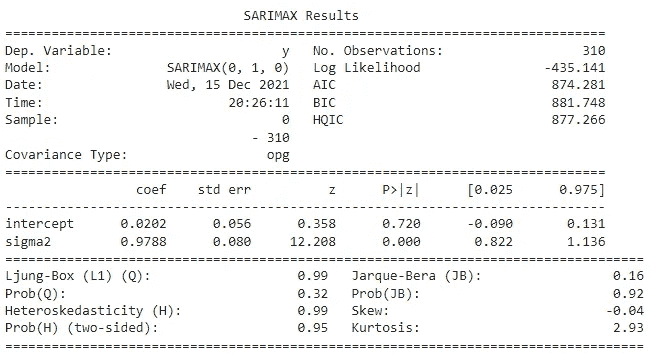

模型 3B 统计摘要[作者图片]

统计概要显示，创建的模型是一个带有“截距”项的`SARIMAX(0,1,0)`模型。该模型的截距值为 0.0202，与我们的理论计算相符(注意，上面的显示显示了四舍五入的结果)。残差 sigma2(无法解释的方差)为 0.9788，代表等式 1 中的`epsilon`项。

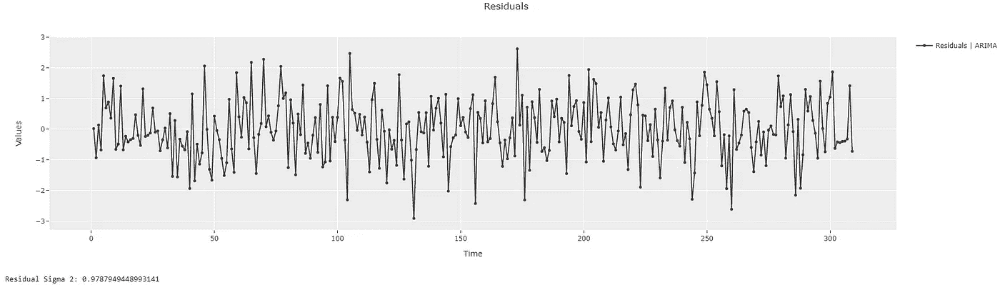

模型 3B 残差[作者图像]

查看模型残差，我们可以看到残差的方差确实为 0.9788，这与统计汇总相符。接下来，让我们绘制预测图，并将其与我们的理论框架进行比较。

```
**plot_predictions**(model3b)
```

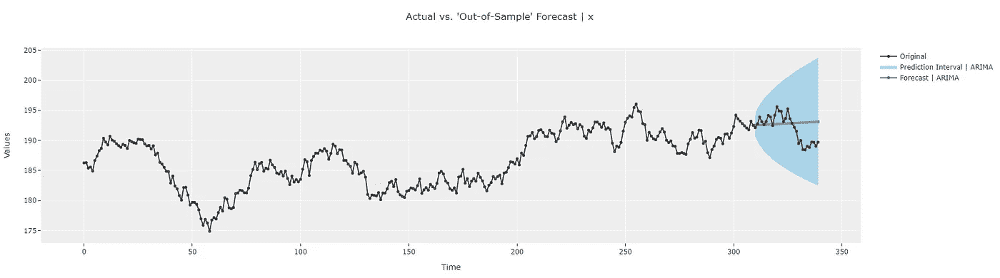

基于样本预测的 3B 模型[作者图片]

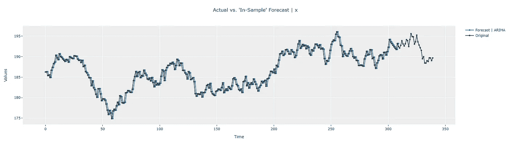

模型 3B 样本内预测[作者图片]

由于计算预测值的方程(方程 1)比以前的文章更复杂，所以我构建了一个小型 excel 计算器来计算理论预测值(列“Pred(计算)”)，并将它们与模型预测值(列“Pred”)进行比较。它们完全匹配(“匹配”列)。此外，请注意，上面的计算器包含样本内点(例如，索引 0、1、2、3、4……)，以及样本外预测(索引 310、311、312……)。PyCaret 中的交互式绘图使用户可以非常容易地放大和验证各个时间点的值，以交叉检查答案。

**注意:**我只展示了样本内和样本外预测的一小部分。读者可能希望延伸到更多的点，以加强他们的理解。excel 可以在本文的末尾(在“参考资料”一节中)找到。

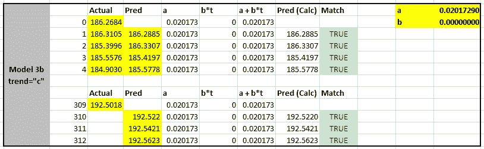

模型 3B 理论预测计算[图片由作者提供]

**(2)方法二:d=1 且 trend = "t"** 的 ARIMA 模型

```
**summarize_model**(model3c)
**get_residual_properties**(model3c)
```

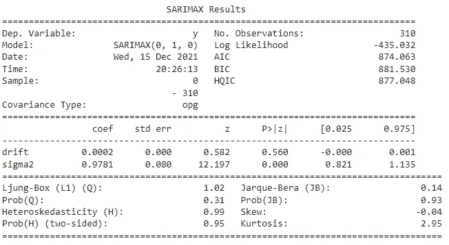

模型 3C 统计摘要[图片由作者提供]

统计汇总显示，创建的模型是一个带有“漂移”项的`SARIMAX(0,1,0)`模型。模型的漂移值 0.0002 与我们的理论计算相匹配(注意，上面显示的是四舍五入后的结果)。残差σ2(未解释方差)为 0.9781，代表等式 1 中的`epsilon`项。

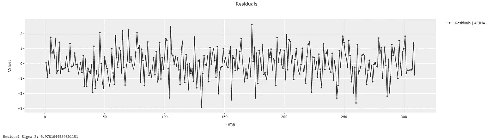

模型 3C 残差[图片由作者提供]

查看模型残差，我们可以看到残差确实具有 0.9781 的方差，这与统计汇总相匹配。接下来，让我们绘制预测图，并将其与我们的理论框架进行比较。

```
**plot_predictions**(model3c)
```

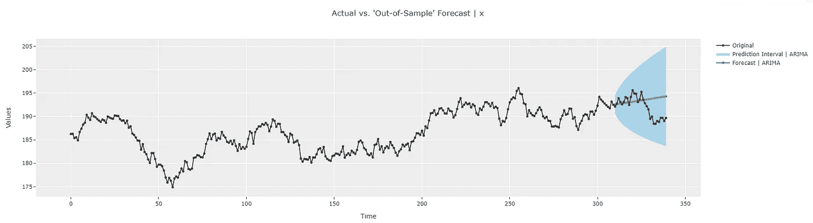

从样本预测中模拟 3C[图片由作者提供]

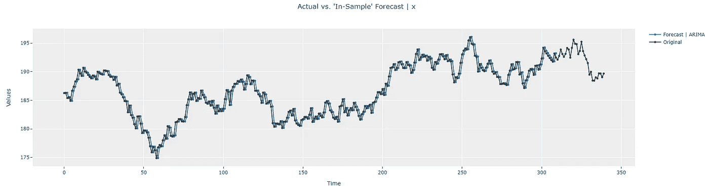

模型 3C 样本内预测[图片由作者提供]

同样，excel 计算器用于对照模型输出检查理论预测(这次使用斜率项“b”来匹配理论“漂移”值)。同样，由“Pred(计算)”列表示的理论预测(样本内和样本外)与由“Pred”列表示的模型输出相匹配。

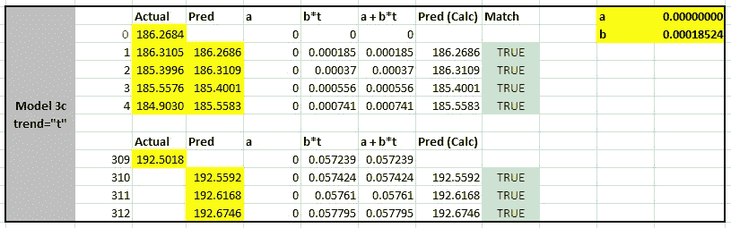

模型 3C 理论预测计算[图片由作者提供]

**(3)方法三:d=1 且 trend = "ct"** 的 ARIMA 模型

```
**summarize_model**(model3d)
**get_residual_properties**(model3d)
```

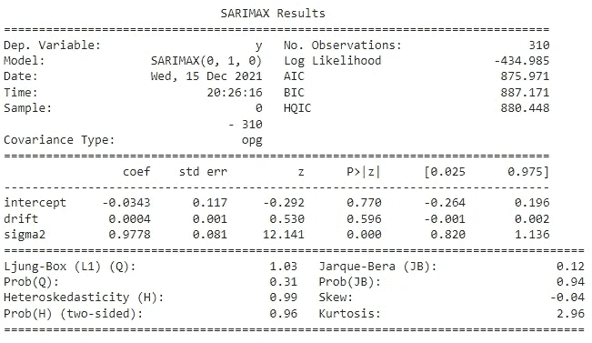

模型 3D 统计摘要[图片由作者提供]

统计概要表明，所创建的模型是一个既有“截距”又有“漂移”项的`SARIMAX(0,1,0)`模型。模型中的值(截距=-0.0343 和漂移= 0.0004)与我们的理论计算相匹配(注意，上面显示的是四舍五入的结果)。残差σ2(未解释方差)为 0.9778，代表等式 1 中的`epsilon`项。


3D 残差模型[图片由作者提供]

查看模型残差，我们可以看到残差确实具有 0.9778 的方差，这与统计汇总相匹配。接下来，让我们绘制预测图，并将其与我们的理论框架进行比较。

```
**plot_predictions**(model3d)
```

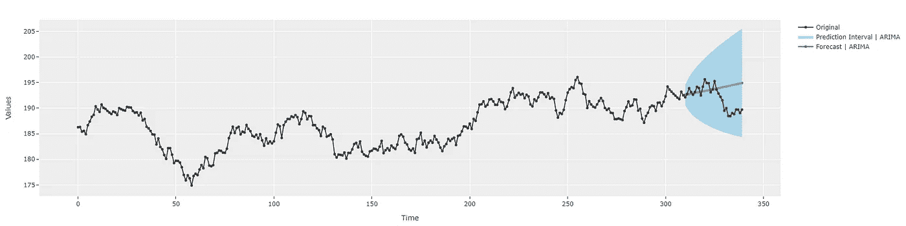

样本预测的 3D 模型[图片由作者提供]

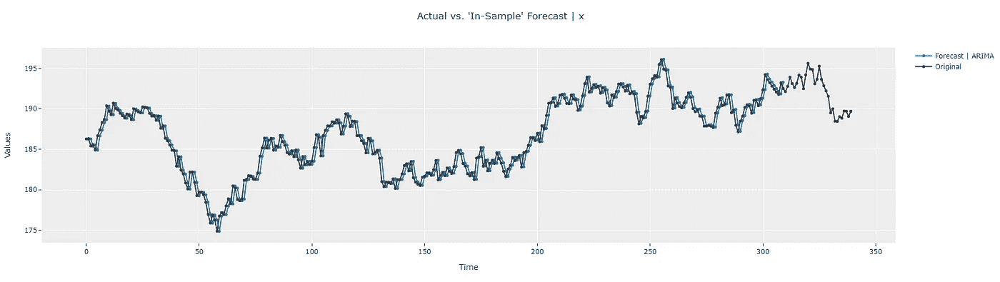

模型 3D 样本内预测[图片由作者提供]

同样，excel 计算器用于对照模型输出检查理论预测(这次使用截距项“a”和斜率项“b”)。同样，由“Pred(计算)”列表示的理论预测(样本内和样本外)与由“Pred”列表示的模型输出相匹配。

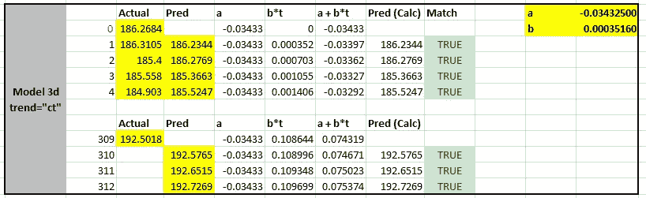

模型 3D 理论预测计算[图片由作者提供]

# 🚀结论

现在我们有了。我们将乐高风格的积木(“趋势”和“差异”术语)组合成一个更复杂的模型。希望这个简单的框架为我们理解这些术语在 ARIMA 模型中如何相互作用打下了良好的基础。在下一篇文章中，我们将看到季节参数“s”和季节差异“D”的影响。在那之前，如果你愿意在我的社交渠道上与我联系(我经常发布关于时间序列分析的文章)，你可以在下面找到我。暂时就这样了。预测快乐！

🔗 [LinkedIn](https://www.linkedin.com/in/guptanick/)

🐦[推特](https://twitter.com/guptanick13)

📘 [GitHub](https://github.com/ngupta23)

*喜欢这篇文章吗？成为* [***中等会员***](https://ngupta13.medium.com/membership) *继续* ***无限制学习*** *。如果你使用下面的链接，* ***，我会收到你的一部分会员费，而不会给你带来额外的费用*** *。*

[](https://ngupta13.medium.com/membership) [## 通过我的推荐链接加入媒体- Nikhil Gupta

### 阅读 Nikhil Gupta(以及媒体上成千上万的其他作家)的每一个故事。您的会员费直接支持…

ngupta13.medium.com](https://ngupta13.medium.com/membership) 

# 📗资源

1.  [**Jupyter 笔记本**](https://nbviewer.ipython.org/github/ngupta23/medium_articles/blob/main/time_series/pycaret/pycaret_ts_arima_010_0000.ipynb) 包含这篇文章的代码
2.  [**Excel 计算器**](https://github.com/ngupta23/medium_articles/blob/main/time_series/pycaret/pycaret_ts_arima_010_0000.xlsx) 进行理论预测。