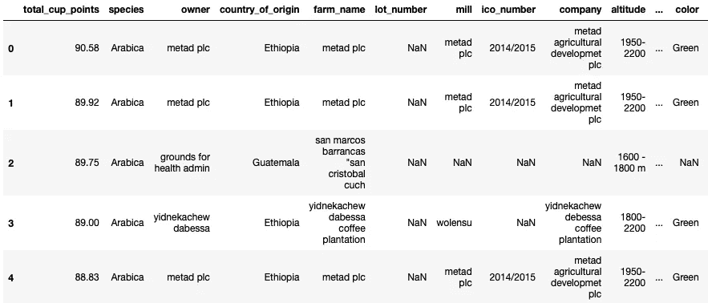
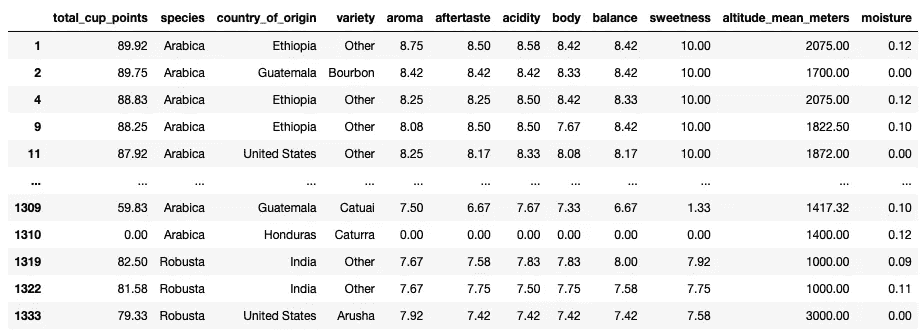
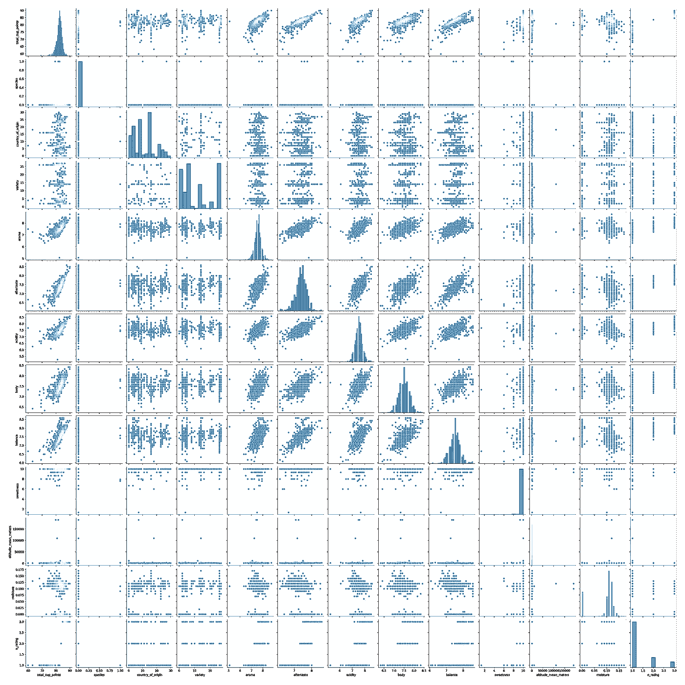
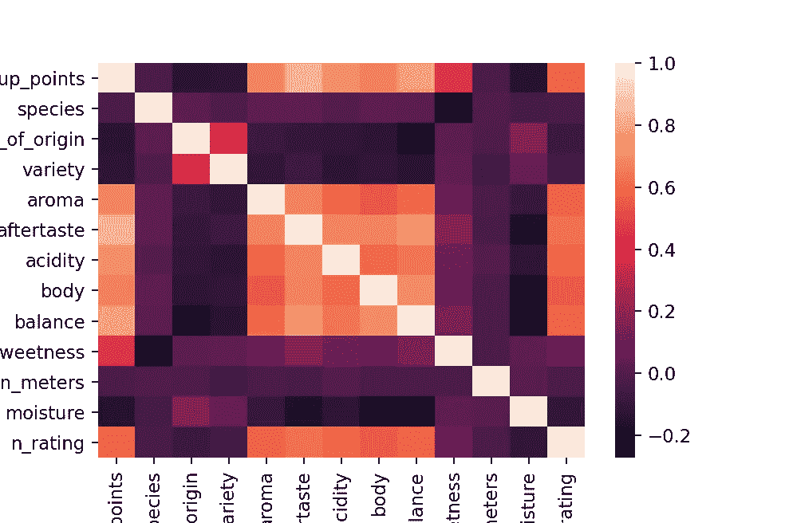
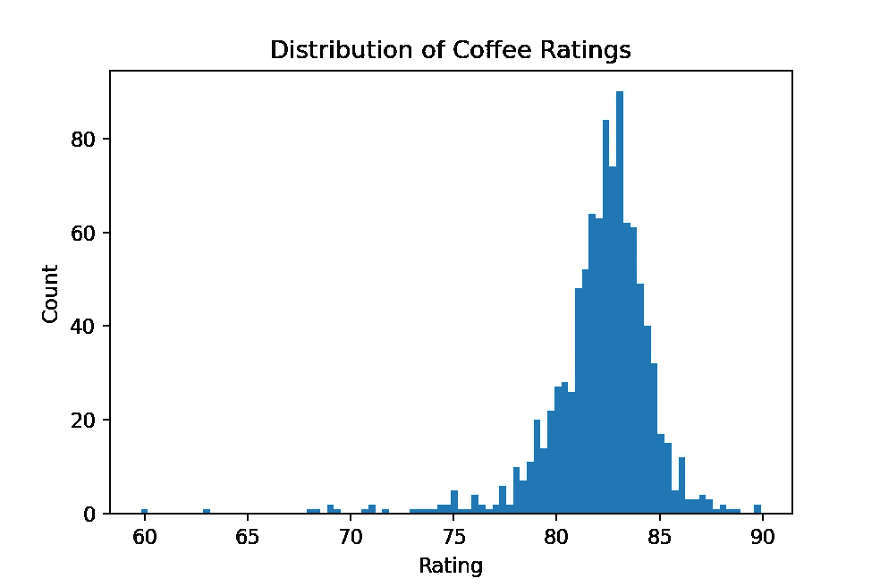
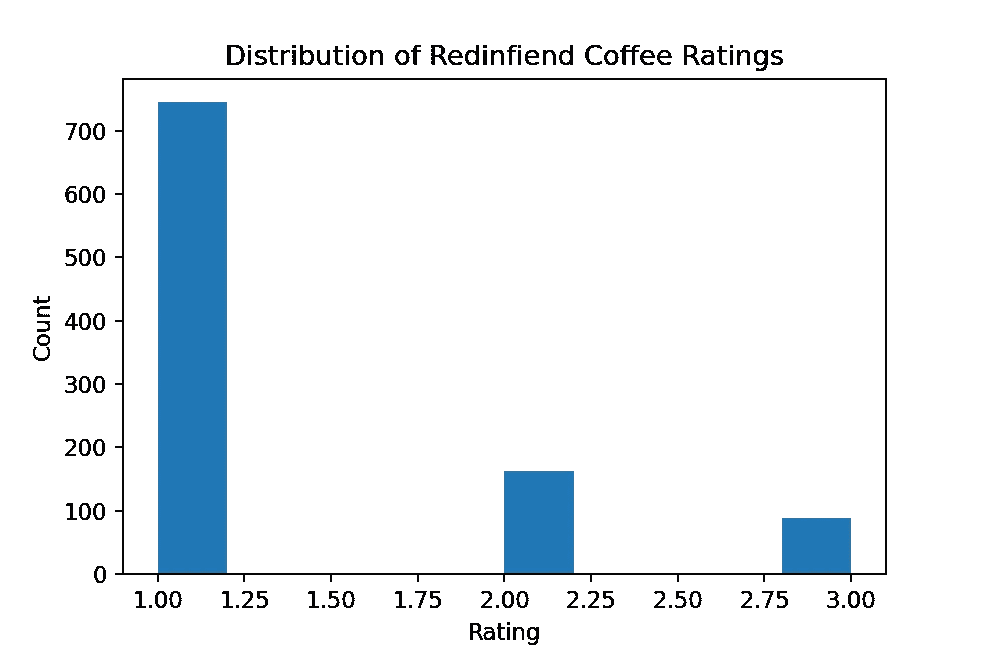
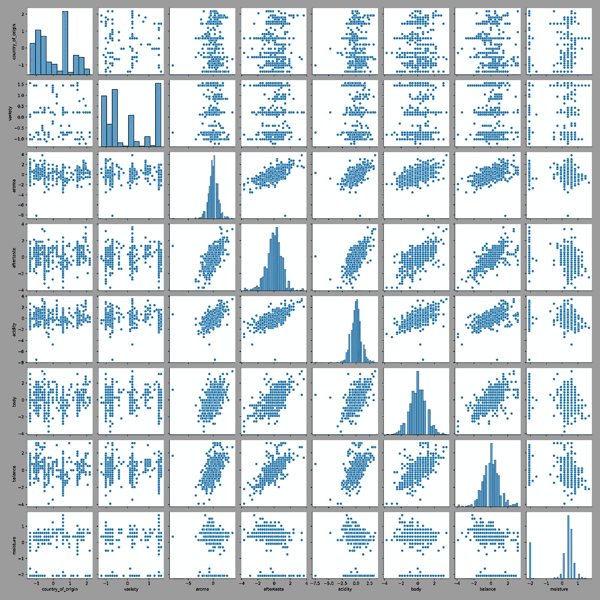
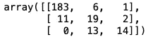
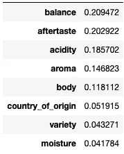
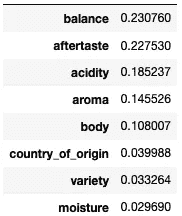

# 用 Python 实现随机森林分类器的实用指南

> 原文：<https://towardsdatascience.com/a-practical-guide-to-implementing-a-random-forest-classifier-in-python-979988d8a263?source=collection_archive---------0----------------------->

## 用 sklearn 构建咖啡评级分类器

随机森林是一种[监督学习](https://en.wikipedia.org/wiki/Supervised_learning)方法，这意味着我们的输入和输出之间有标签和映射。它可以用于分类任务，如根据花瓣长度和颜色等测量结果确定花的种类，也可以用于回归任务，如根据历史天气数据预测明天的天气预报。顾名思义，随机森林由多个决策树组成，每个决策树输出一个预测。在执行分类任务时，随机森林中的每个决策树都会为输入所属的一个类投票。例如，如果我们有一个关于花的数据集，并且我们想要确定一种花的种类，那么随机森林中的每棵决策树将投票选出它认为一种花属于哪个种类。一旦所有的树都得出结论，随机森林将计算哪个类(物种)拥有最多的投票，这个类将是随机森林输出的预测。在回归的情况下，随机森林将平均每个决策树的结果，而不是确定最多的投票。因为随机森林利用多个学习者(决策树)的结果，所以随机森林是一种集成机器学习算法。集成学习方法减少了方差并提高了其组成学习模型的性能。

## 决策树

如上所述，随机森林由多个决策树组成。决策树根据数据的特征将数据分成小组。例如，在花卉数据集中，特征将是花瓣长度和颜色。决策树将继续把数据分成组，直到一个标签(一个分类)下的一小组数据存在。一个具体的例子是选择吃饭的地方。人们可能会细读 Yelp 并根据关键决策找到一个吃饭的地方，比如:这个地方现在开门了吗，这个地方有多受欢迎，这个地方的平均评分是多少，我需要预订吗。如果这个地方是开放的，那么决策树将继续下一个特征，如果不是，决策结束，模型输出“不，不要在这里吃”。现在，在下面的要素中，模型将确定一个地方是否受欢迎，如果该位置受欢迎，模型将移动到下一个要素，如果不受欢迎，模型将输出“不，不要在这里吃”-与之前的过程相同。从本质上讲，人们可以把决策树想象成一个流程图，它根据数据绘制出可以做出的决策，直到得出最终结论。决策树基于测量信息增益的纯度度量来确定在哪里分割特征。在分类的情况下，它根据基尼指数或熵作出决定，在回归的情况下，根据残差平方和作出决定。然而，这其中的数学问题超出了这篇博文的范围。本质上，这些 metics 测量的是[信息增益](https://victorzhou.com/blog/information-gain/)，衡量我们能够从一条数据中收集多少信息。

## 随机森林逻辑

随机森林算法可以描述如下:

1.  假设观测值的数量为 N。这 N 个观测值将被随机抽样并替换。
2.  假设有 M 个特征或输入变量。将在每个节点从特征总数 M 中随机选择一个数字 M，其中 m < M。这 M 个变量的最佳分割用于分割节点，并且该值随着森林的增长而保持不变。
3.  森林中的每棵决策树都增长到最大程度。
4.  该林将基于该林中的树的聚合预测来输出预测。(多数票或平均票)

# 数据探索

在本帖中，我们将利用随机森林来预测咖啡的杯数。咖啡豆被专业地分为 0-100 分。该数据集包含咖啡豆的总杯突点以及咖啡豆的其他特征，如原产国、品种、风味、香味等。这些特征中的一些将被用于训练随机森林分类器，以基于它接收的总杯突点来预测特定豆的质量。本演示中的数据来自 TidyTuesday 存储库，下面是数据的预览。



为了保证模型的安全性，我们将对该数据集进行子集划分，以包含咖啡的属性列，这些属性包括但不限于:品种、原产国、酸度、酒体和甜度。此外，我们将删除任何包含 nan(非数字/缺失)值的行。

```
coffee_df = coffee_ratings[['total_cup_points',
                            'species',
                            'country_of_origin',
                            'variety',
                            'aroma',
                            'aftertaste',
                            'acidity',
                            'body',
                            'balance',
                            'sweetness',
                            'altitude_mean_meters',
                            'moisture']]
coffee_df = coffee_df.dropna()
```



从上面我们可以看到，数据不仅包含数值，还包含分类值，如物种、原产国和品种。我们可以通过使用 sklearn 包提供的 OrginalEncoder 函数将这些映射成数值。例如，有两种咖啡:阿拉比卡和罗布斯塔。代码将为这些分配数值，例如 Arabica 映射到 0，而 Robusta 映射到 1。对于其他变量，将遵循类似的逻辑。

```
from sklearn.preprocessing import OrdinalEncoder
ord_enc = OrdinalEncoder()
coffee_df["species"] = ord_enc.fit_transform(coffee_df[["species"]])
coffee_df["country_of_origin"] = ord_enc.fit_transform(coffee_df[["country_of_origin"]])
coffee_df["variety"] = ord_enc.fit_transform(coffee_df[["variety"]])
```

既然所有的数据都是数字，我们可以生成图表来观察不同特征之间的关系。一个有用的图表是显示特征的边缘和联合分布的 pairplot。我们放弃了

```
import seaborn
seaborn.pairplot(coffee_df.drop('total_cup_points', axis = 1))
```



我们可以看到分布是很难看到的。在某些情况下，分布是完全二元的，如特定的，或非常偏斜的，如平均高度。此外，一些数值变量，如香气和酸度，各包含一个 0 值，这是数据中的异常值，我们将把它们过滤掉并重新绘制 paitplot。

```
coffee_df = coffee_df[coffee_df['aroma']>0]
coffee_df = coffee_df[coffee_df['acidity']>0]seaborn.pairplot(coffee_df)
```

下面我们可以更清楚地看到联合分布。图的第一列表示特征如何与目标变量`total_cupping_points`相关。我们可以看到从`aroma`到`balance`的特征似乎与接收到的`total_cupping_points`有很强的关系。此外，我们在配对图的对角线上看到的边际分布在很大程度上似乎是正态分布的。

我们可以为探索性数据分析(EDA)生成的另一个图是关联矩阵，它将显示特征之间的关联。我们也可以通过 seaborn 软件包来实现这一点。

```
seaborn.heatmap(coffee_df.corr(),
                xticklabels=coffee_df.columns,
                yticklabels=coffee_df.columns)
```



我们可以看到，从`aroma`到`sweetness`特征之间呈正相关，与品种之间呈负相关，与`altitude_mean_meters`和`moisture`也呈负相关。

## 数据扩充

如果我们观察总杯数评级的分布，我们可以看到这些值是连续的，而不是离散的，例如对餐馆的星级评级，一星、二星等。在这个项目中，我将把拔罐评级分为三类:低、中、好。这可以通过根据我们下面看到的分布设置阈值来实现。在某个阈值内的任何东西都将被标记为坏的、一般的或好的。更准确地说，我将把低于第 75 百分位的定义为“低”，第 75 和第 90 百分位之间的定义为“一般”，前 10 百分位的定义为“好”。当然，在数据集中，这些标签将是数字的。坏的将被标为 1，一般的标为 2，好的标为 3。



这就是阈值的计算方法。我们将从 numpy 调用 percentile 函数，并输入一个包含代表分界点的百分点的列表。

```
rating_pctile = np.percentile(coffee_df['total_cup_points'], [75, 90])# The percentile thresholds are
array([83.58, 84.58])
```

然后，我们使用这些阈值在数据帧中创建一个名为`n_rating`的新列，代表使用基于以上定义的百分比系统的新标签系统对咖啡的评级。

```
coffee_df['n_rating'] = 0
coffee_df['n_rating'] = np.where(coffee_df['total_cup_points'] < rating_pctile[0], 1, coffee_df['n_rating'])
coffee_df['n_rating'] = np.where((coffee_df['total_cup_points'] >= rating_pctile[0]) & (coffee_df['total_cup_points'] <= rating_pctile[1]), 2, coffee_df['n_rating'])
coffee_df['n_rating'] = np.where(coffee_df['total_cup_points'] > rating_pctile[1], 3, coffee_df['n_rating'])
```

下面我们可以观察到由 out 阈值给出的评级的新分布。大多数咖啡评级属于“低”类(准确地说是 75%的数据)，只有少数咖啡评级为“好”。



此时，数据几乎可以用于建模了。我们现在需要将数据分成训练集和测试集。训练集将用于训练随机森林分类器，而测试集将用于评估模型的性能-因为这是它以前在训练中没有见过的数据。这里 75%的数据用于训练，25%的数据用于测试。

```
X = coffee_df.drop(['total_cup_points', 'n_rating', 'sweetness', 'species', 'altitude_mean_meters'], axis = 1)
y = coffee_df['n_rating']
training, testing, training_labels, testing_labels = train_test_split(X, y, test_size = .25, random_state = 42)
```

接下来，我们将缩放数据，这将是我们所有的功能相同的比例，这有助于确保具有较大值的属性不会过度影响模型。sklearn 中的`[StandardScaler](https://scikit-learn.org/stable/modules/generated/sklearn.preprocessing.StandardScaler.html)`主要计算每个要素的 z 得分，确保数据集中的每个要素的均值为 0，方差为 1。

```
# Normalize the data
sc = StandardScaler()
normed_train_data = pd.DataFrame(sc.fit_transform(training), columns = X.columns)
normed_test_data = pd.DataFrame(sc.fit_transform(testing), columns = X.columns)
```

为了子孙后代，我们可以绘制另一个 pairplot，看看归一化是否强调了特征之间的关系。数据归一化后，咖啡属性从`aroma`到平衡的关系为`clearer`。由于椭圆联合分布，这些变量之间似乎存在着弦关系。



# 构建随机森林

现在数据准备好了，我们可以开始编码随机森林了。我们可以用两行代码实例化并训练它。

```
clf=RandomForestClassifier()
clf.fit(training, training_labels)
```

然后做预测。

```
preds = clf.predict(testing)
```

然后快速评估它的性能。

```
print (clf.score(training, training_labels))
print(clf.score(testing, testing_labels))1.0
0.8674698795180723
```

`score`方法让我们了解随机森林对给定数据的平均准确性。在第一次调用中，我们在训练数据上评估它的性能，然后在测试数据上评估。该模型在训练数据上的准确率为 100%，在测试数据上的准确率较低，为 86.75%。由于训练精度如此之高，而测试又不是那么接近，所以可以肯定地说，该模型过度拟合了——该模型对训练数据的建模太好了，没有概括出它正在学习的东西。把它想象成记忆一个测试的答案，而不是真正学习那个测试的概念。我们将在后面讨论如何减轻这个问题。

我们可以用来评估模型性能的另一个工具是混淆矩阵。混淆矩阵显示了实际类别和预测类别的组合。矩阵的每一行代表预测类中的实例，而每一列代表实际类中的实例。这是一个很好的方法来衡量模型是否能解释类属性的重叠，并理解哪些类最容易混淆。

```
metrics.confusion_matrix(testing_labels, preds,  labels = [1, 2, 3])
```



第一列代表评级为“低”的咖啡，第二列代表评级为“一般”的咖啡，第三列代表评级为“好”的咖啡。矩阵对角线上的数字 183、19 和 14 代表模型准确分类的咖啡数量。非对角线值代表错误分类的数据。例如，11 种应该被标记为“低”分的咖啡被标记为“一般”。

我们可以从随机森林中获得的另一个有趣的洞察力是探索模型“认为”在确定总杯突点中最重要的特征。

```
pd.DataFrame(clf.feature_importances_, index=training.columns).sort_values(by=0, ascending=False) 
```



我们可以看到`balance`、`aftertaste`和`acidity`似乎对一杯咖啡获得的总杯数贡献很大。

# 调整随机森林

当我们在上面的`clf=RandomForestClassifier()`中实例化一个随机森林时，森林中的树的数量、用于分割特征的度量等参数采用在`[sklearn](https://scikit-learn.org/stable/modules/generated/sklearn.ensemble.RandomForestClassifier.html)`中设置的默认值。然而，这些默认值通常不是最佳的，必须针对每个用例进行调整。要调整的参数可以在`sklearn` [文档](https://scikit-learn.org/stable/modules/generated/sklearn.ensemble.RandomForestClassifier.html)中找到。调整这些参数的一种方法是执行随机网格搜索。我们定义了一个值的范围，代码可以从中随机挑选，直到找到一组性能最好的值。首先，我们定义搜索算法将搜索的值。

```
# Number of trees in random forest
n_estimators = np.linspace(100, 3000, int((3000-100)/200) + 1, dtype=int)
# Number of features to consider at every split
max_features = ['auto', 'sqrt']
# Maximum number of levels in tree
max_depth = [1, 5, 10, 20, 50, 75, 100, 150, 200]# Minimum number of samples required to split a node
# min_samples_split = [int(x) for x in np.linspace(start = 2, stop = 10, num = 9)]
min_samples_split = [1, 2, 5, 10, 15, 20, 30]
# Minimum number of samples required at each leaf node
min_samples_leaf = [1, 2, 3, 4]
# Method of selecting samples for training each tree
bootstrap = [True, False]
# Criterion
criterion=['gini', 'entropy']random_grid = {'n_estimators': n_estimators,
#                'max_features': max_features,
               'max_depth': max_depth,
               'min_samples_split': min_samples_split,
               'min_samples_leaf': min_samples_leaf,
               'bootstrap': bootstrap,
               'criterion': criterion}
```

这实际上创建了一个可供选择的值字典:

```
{'n_estimators': array([ 100,  307,  514,  721,  928, 1135, 1342, 1550, 1757, 1964, 2171,
        2378, 2585, 2792, 3000]),
 'max_depth': [1, 5, 10, 20, 50, 75, 100, 150, 200],
 'min_samples_split': [1, 2, 5, 10, 15, 20, 30],
 'min_samples_leaf': [1, 2, 3, 4],
 'bootstrap': [True, False],
 'criterion': ['gini', 'entropy']}
```

接下来，我们可以开始搜索，然后在随机搜索中找到的参数上安装一个新的随机森林分类器。

```
rf_base = RandomForestClassifier()
rf_random = RandomizedSearchCV(estimator = rf_base,
                               param_distributions = random_grid,
                               n_iter = 30, cv = 5,
                               verbose=2,
                               random_state=42, n_jobs = 4)rf_random.fit(training, training_labels)
```

我们还可以查看随机搜索找到的参数值:

```
rf_random.best_params_{'n_estimators': 2171,
 'min_samples_split': 2,
 'min_samples_leaf': 2,
 'max_depth': 200,
 'criterion': 'entropy',
 'bootstrap': True}
```

从这里我们可以再次评估模型

```
print (rf_random.score(training, training_labels))
print(rf_random.score(testing, testing_labels))0.9825970548862115
0.8714859437751004
```

我们现在看到培训分数不到 100%，测试分数是 87.25%。该模型似乎不像以前那样过度拟合。

既然我们已经从随机网格搜索中获得了参数值，我们可以将它们作为网格搜索的起点。原则上，网格搜索的工作方式类似于随机网格搜索，因为它将搜索我们定义的参数空间。然而，它不是搜索随机值，而是搜索参数空间中所有可能的值。这种计算可能是昂贵的，因为随着更多的参数和这些参数的搜索值的增加，搜索增长得非常快。这就是为什么我们首先执行随机网格搜索。我们节省了计算能力，只有当我们有了一个好的起点时，才进行精细的方法搜索。实例化网格搜索也类似于实例化随机网格搜索。

```
param_grid = {
    'n_estimators': np.linspace(2100, 2300, 5, dtype = int),
    'max_depth': [170, 180, 190, 200, 210, 220],
    'min_samples_split': [2, 3, 4],
    'min_samples_leaf': [2, 3, 4, 5]
}
```

然后我们可以重新训练另一个随机森林。

```
# Base model
rf_grid = RandomForestClassifier(criterion = 'entropy', bootstrap = True)
# Instantiate the grid search model
grid_rf_search = GridSearchCV(estimator = rf_grid, param_grid = param_grid, 
                          cv = 5, n_jobs = 8, verbose = 2)
grid_rf_search.fit(training, training_labels)
```

并查看它发现的最佳参数集

```
best_rf_grid = grid_rf_search.best_estimator_grid_rf_search.best_params_{'max_depth': 170,
 'min_samples_leaf': 2,
 'min_samples_split': 2,
 'n_estimators': 2100}
```

我们可以看到它找到的结果与随机网格搜索找到的结果相差不远。现在我们可以评估这个模型，以确定它的准确性和性能。

```
print (grid_rf_search.score(training, training_labels))
print(grid_rf_search.score(testing, testing_labels))0.9839357429718876
0.8714859437751004
```

我们看到它的表现与随机搜索网格非常相似，因为它的参数没有偏离我们最初开始时的参数太远。

此外，我们还可以查看模型认为最重要的特征。`Balance`、`aftertaste`和`acidity`仍然是排名前三的功能，只是权重略有不同。

最后，我们可以查看最终模型的混淆矩阵。看起来和以前一样。



在本文中，我们对 TidyTuesday 的咖啡数据集进行了一些探索性的数据分析，并构建了一个随机森林分类器，将咖啡分为三组:低、中、好。这些等级决定了咖啡应该得到多少杯点。一旦我们建立了一个初始分类器，我们调整它的超参数，以确定我们是否可以进一步提高模式的性能。