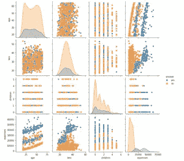

# 线性回归实用指南

> 原文：<https://towardsdatascience.com/a-practical-guide-to-linear-regression-3b1cb9e501a6?source=collection_archive---------4----------------------->

## 从 EDA 到特征工程再到模型评估


线性回归备忘单(作者图片来自[原始博客](https://www.visual-design.net/post/a-simple-practical-guide-to-linear-regression)

线性回归是负责数值预测的典型回归算法。它不同于分类模型，如决策树、支持向量机或神经网络。简而言之，线性回归找到自变量和因变量之间的最佳线性关系，然后做出相应的预测。

我估计大多数人在数学课上都频繁遇到过函数 ***y = b0 + b1x*** 。基本上是简单线性回归的形式，其中 *b0* 定义截距 *b1* 定义直线的斜率。我将在“模型实现”一节中解释算法背后的更多理论，本文的目的是走向实用！如果您想访问代码，请访问[我的网站](https://www.visual-design.net/code)。

# 定义目标

我在这个练习中使用 Kaggle 公共数据集“[保险费预测](https://www.kaggle.com/noordeen/insurance-premium-prediction)”。数据包括自变量:*年龄、性别、bmi、孩子、吸烟者、*地区、目标变量——*费用*。首先，让我们加载数据，并使用 *df.info()* 对数据进行初步检查

```
import pandas as pd
import seaborn as sns
import matplotlib.pyplot as plt
from pandas.api.types import is_string_dtype, is_numeric_dtypedf = pd.read_csv('../input/insurance-premium-prediction/insurance.csv')
df.info()
```


关键要点:

1.  分类变量:性别、吸烟者、地区
2.  数字变量:年龄、体重指数、孩子、费用
3.  **1338 条记录中没有缺失数据**

# 探索性数据分析

EDA 对于调查数据质量和揭示变量之间隐藏的相关性是必不可少的。在本练习中，我将介绍与线性回归相关的三种技术。要全面了解 EDA，请查看:

</semi-automated-exploratory-data-analysis-eda-in-python-7f96042c9809>  

## 1.单变量分析

使用直方图显示数值变量，使用条形图显示分类变量的数据分布。


单变量分析(图片由作者提供)

为什么我们需要单变量分析？

*   确定数据集是否包含异常值
*   确定是否需要数据转换或特征工程

在这种情况下，我们发现“费用”遵循幂律分布，这意味着作为特征工程步骤的一个步骤，需要进行对数变换，以将其转换为正态分布。


## 2.多变量分析

当想到线性回归时，我们能想到的第一个可视化技术是散点图。通过使用单行代码 *sns.pairplot(df)* 绘制目标变量与自变量的关系，潜在的线性关系变得更加明显。


配对图(图片由作者提供)

现在，添加分类变量作为图例怎么样？


色调=性


色调=区域



色调=吸烟者

从吸烟者与非吸烟者分割的散点图中，我们可以观察到吸烟者(蓝色)的医疗费用明显较高。这表明“吸烟者”这一特征可能是费用的一个强有力的预测因素。


## 3.相关分析

相关性分析检查变量对之间的线性相关性。这可以通过结合 corr()函数和 sns.heatmap()来实现。


相关性分析(图片由作者提供)

*注意，这是在分类变量编码之后(如“特征工程”一节)，因此热图中不仅显示数字变量。*

**为什么我们需要相关性分析？**

*   识别独立变量之间的共线性-线性回归假设独立要素之间没有共线性，因此如果存在共线性，则必须删除一些要素。在这个例子中，没有一个独立变量与另一个高度相关，因此不需要删除任何变量。
*   识别与目标密切相关的独立变量——它们是强有力的预测因素。再一次，我们可以看到“吸烟者”与费用相关。

# 特征工程

EDA 带来了一些关于什么类型的特征工程技术适合数据集的见解。

## 1.对数变换

我们发现目标变量“费用”是右偏的，服从幂律分布。由于线性回归假设输入和输出变量之间存在线性关系，因此有必要对“费用”变量进行对数变换。如下图，应用 *np.log2()* 后数据趋于正态分布。除此之外，剧透一下，这个转换确实把线性回归模型得分从 0.76 提高到了 0.78。


转型前的“费用”


转型后的“费用”

## 2.编码分类变量

机器学习算法的另一个要求是将分类变量编码成数字。两种常见的方法是一热编码和标签编码。如果你想了解更多的区别，请查看:“[特征选择和机器学习中的 EDA](/feature-selection-and-eda-in-python-c6c4eb1058a3?source=your_stories_page-------------------------------------)”。

这里我比较一下这两者的实现和结果。

*   **一个热编码**

```
df = pd.get_dummies(df, columns = cat_list)
```


一个热编码结果

*   **标签编码**


标签编码

然而，这两种方法都导致模型得分为 0.78，这表明选择任何一种都不会在这个意义上产生显著差异。

# 模型实现

简单的线性回归， *y = b0 + b1x，*预测一个自变量 x 和一个因变量 y 之间的关系，例如，经典的身高-体重相关性。随着更多特征/独立变量的引入，它演变成多元线性回归 y = b0 + b1x1 + b2x2 + … + bnxn，这不能容易地使用二维空间中的线来绘制。


简单线性回归(图片由作者提供)

我从 scikit-learn 应用了 *LinearRegression()* 来实现线性回归。我指定了 *normalize = True* ，这样独立变量将被规范化并转换成相同的标度。scikit-learn 线性回归利用**普通最小二乘法**找到拟合数据的最佳直线。因此，由系数 b0，b1，b2 … bn 定义的线使观测目标和预测值之间的残差平方和最小(图中的蓝线)


线性回归模型(图片作者提供)

实现非常简单，并返回一些属性:

*   model.coef_:系数值— *b1，b2，b3 … bn*
*   model.intercept_:常量值— *b0*
*   model.score:有助于评估模型性能的预测的确定性 R 平方(在模型评估部分有更详细的描述)

我们先用系数值粗略估计一下特征重要性，并可视化。不出所料，吸烟者是医疗费用的主要预测因素。

```
sns.barplot(x = X_train.columns, y = coef, palette = "GnBu")
```


回想一下，我们已经对目标变量进行了对数转换，因此不要忘记使用 *2**y_pred* 来恢复到实际预测费用。


# 模型评估

线性回归模型可以通过可视化误差分布进行定性评估。也有定量的措施，如平均误差，均方误差，RMSE 和 R 平方。


模型评估(图片由作者提供)

## 1.误差分布

首先，我使用直方图来可视化误差的分布。理想情况下，它应该多少符合正态分布。非正态误差分布可能表明存在模型未能提取的非线性关系，或者需要更多的数据转换。

## 2.RMSE 的梅、姆塞

平均绝对误差(MAE):误差绝对值的平均值


均方误差(MSE):均方误差的平均值


均方根误差(RMSE):平方误差平均值的平方根


这三种方法都是通过计算预测值ŷ和实际值 y 之间的差值来测量误差的，因此差值越小越好。主要区别是 MSE/RMSE 惩罚大的误差并且是可微的，而 MAE 是不可微的，这使得它很难应用于梯度下降。与 MSE 相比，RMSE 取平方根，从而保持原始数据比例。

## 3.r 平方——决定系数

r 的平方或决定系数是一个介于 0 和 1 之间的值，表示模型所解释的实际目标变量的变化量。r 平方定义为 1 — RSS/TSS，1 减去残差平方和(RSS)与总平方和(TSS)之比。更高的 R 平方意味着更好的模型性能。

**残差平方和(RSS)**


RSS(图片由作者提供)

**总平方和(TSS)**


TSS(图片由作者提供)

在这种情况下，R 的平方值为 0.78，表明模型解释了目标变量中 78%的变化，这通常被认为是一个好的比率，没有达到过度拟合的水平。

希望你喜欢我的文章:)。如果你想阅读我更多关于媒体的文章，我将非常感谢你的支持，注册[媒体会员](https://destingong.medium.com/membership)。

# 带回家的信息

本文提供了实现线性回归的实用指南，介绍了模型构建的整个生命周期:

1.  EDA:单变量分析，散点图，相关分析
2.  特征工程:对数变换，分类变量编码
3.  模型实现:scikit learn LinearRegression()
4.  模型评估:平均误差、均方误差、RMSE、R 平方

如果您对视频指南感兴趣:)

[https://www.youtube.com/watch?v=tMcbmyK6QiM](https://www.youtube.com/watch?v=tMcbmyK6QiM)

## 更多这样的文章

</simple-logistic-regression-using-python-scikit-learn-86bf984f61f1>  </semi-automated-exploratory-data-analysis-eda-in-python-7f96042c9809>  </clustering-algorithm-for-customer-segmentation-e2d79e28cbc3>  

*原载于 2021 年 9 月 18 日 https://www.visual-design.net**的* [*。*](https://www.visual-design.net/post/semi-automated-exploratory-data-analysis-process-in-python)