# AWS Sagemaker 中的 MLOps 实用指南—第一部分

> 原文：<https://towardsdatascience.com/a-practical-guide-to-mlops-in-aws-sagemaker-part-i-1d28003f565?source=collection_archive---------3----------------------->

## 如何在 AWS Sagemaker 中实现 CI/CD 模型开发和评估管道？


梵高，文森特。*星夜*。([来源](https://www.vangoghgallery.com/painting/starry-night.html)

这个指南是我自己在 AWS 上寻找一个完整的端到端的模型开发、评估和部署工作的挫折的结果。我在那里看到的所有指南和教程都只覆盖了一部分，而没有完全联系起来。我想写一些东西，帮助人们了解构建模型和部署模型的完整工作，以便前端开发人员可以在他们的网站和应用程序上访问它。

所以，让我们开始吧！

我将本指南分为两部分。

1.使用 AWS Sagemaker Studio 进行模型开发和评估。

2.使用 AWS Lambda 和 REST API 的模型部署

**先决条件:**

**AWS 账户——运行整个教程的费用不到 0.50 美元，所以不要担心。**

**对 Python 的理解——如今大部分机器学习工作都是用 Python 完成的。**

耐心——失败是成功最重要的先决条件，所以继续尝试，直到成功。

# 第 1 部分:模型开发

我们将在 Sagemaker Studio 中建立一个项目来构建我们的开发管道。

1.登录您的 **AWS 账户**，从服务列表中选择 **Sagemaker** 。

2.选择 **Sagemaker 工作室**并使用**快速启动**创建工作室。

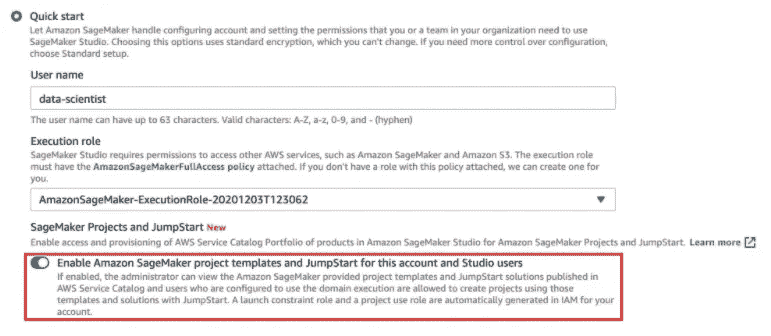

使用快速启动选项设置 sagemaker studio。(图片由作者提供)

一旦工作室准备就绪，用你刚刚创建的用户打开工作室。创建应用程序可能需要几分钟的时间，但是一旦一切就绪，我们就可以创建项目了。需要理解的是，我们只能创建一个工作室，但是该工作室中有多个用户，并且每个用户都可以在该工作室中创建多个项目。

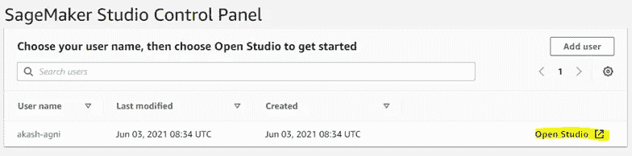

Sagemaker 控制面板。(图片由作者提供)

3.从左侧导航栏中选择 **Sagemaker 组件和注册表**，并选择**创建项目。**

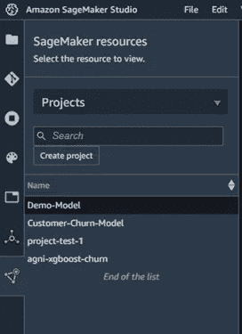

创建项目选项。(图片由作者提供)

默认情况下，Sagemaker 提供了可用于构建、评估主机模型的模板。我们将使用一个这样的模板，并修改它以适应我们的用例。

4.从列表中选择**用于模型开发、评估和部署的 MLOps 模板**并创建一个项目。


Sagemaker 项目模板。(图片由作者提供)

一旦您的新项目被创建，您将发现 2 个预构建的存储库。第一个定义您的模型开发和评估，另一个将您的模型构建到一个包中，并将其部署到一个端点以供 API 使用。在本指南中，我们将修改第一个模板来运行我们自己的用例。

5.克隆第一个存储库，这样我们就可以修改我们需要的文件。

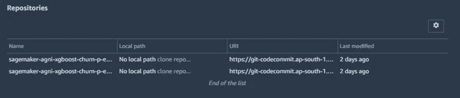

项目存储库。(图片由作者提供)

我们将要处理的用例是一个客户流失模型，用于预测客户将来是否会退订服务。由于本笔记本背后的想法是学习云中的模型开发和部署，所以我不会深入研究数据，而是直接进入管道开发。

这是我们刚刚克隆的存储库的文件结构，现在让我们看一下将要使用的一些文件。

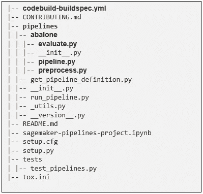

存储库文件结构。(图片由作者提供)

文件夹 **pipelines** 包含创建我们的模型开发管道所需的文件，默认情况下，该管道被命名为**鲍鱼。**

**pipeline.py** 定义了我们管道的组件，目前，它是用默认值定义的，但是我们将为我们的用例更改代码。

preprocess.py 和 evaluate.py 定义了我们需要在管道中为预处理和评估步骤执行的代码。

codebuild-buildspec-yml 创建并编排管道。

您可以将更多步骤添加到 **pipeline.py** 和相应的处理文件中，模板还定义了一个 **test** 文件夹和一个 **test_pipelines.py** 文件，该文件可用于构建单独的测试管道。

6.将文件夹**鲍鱼**重命名为**客户流失**在**code build-build spec-yml**文件中进行更改以反映这一更改。

```
**run-pipeline --module-name pipelines.customer_churn.pipeline \**
```

7.我们需要将数据下载到我们默认的 AWS s3 存储桶中以供使用，我们可以使用笔记本来完成这项工作。从 studio 中的文件选项卡在存储库中创建一个新的笔记本，选择一个带有基本数据科学 python 包的内核，然后将下面的代码粘贴到单元格中并运行。

```
**!aws s3 cp s3://sagemaker-sample-files/datasets/tabular/synthetic/churn.txt ./
import os
import boto3
import sagemaker
prefix = 'sagemaker/DEMO-xgboost-churn'
region = boto3.Session().region_name
default_bucket = sagemaker.session.Session().default_bucket()
role = sagemaker.get_execution_role()
RawData = boto3.Session().resource('s3')\
.Bucket(default_bucket).Object(os.path.join(prefix, 'data/RawData.csv'))\
.upload_file('./churn.txt')
print(os.path.join("s3://",default_bucket, prefix, 'data/RawData.csv'))**
```

现在我们需要修改 **pipeline.py、evaluate.py 和 preprocess.py** 中的代码来满足我们的需求。

8.出于指南的目的，从[链接](https://github.com/akash-agni/Sagemaker_Notebooks)中复制代码以更新 **pipeline.py、preprocess.py 和 evaluate.py** 中的代码，但确保仔细阅读代码以更好地理解细节。

一切就绪，一旦我们更新了这 3 个文件中的代码，我们就准备好运行我们的第一个管道执行，但是当我们尝试实现 CI/CD 模板时，这将在我们提交和推送代码后自动完成。

9.从侧面导航栏中选择 **GIT** 选项卡，然后选择您已经修改的文件以添加到暂存区，并将更改提交和推送至远程存储库。

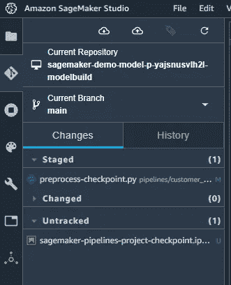

提交更改并将代码推送到远程。(图片由作者提供)

现在转到项目页面上的**pipeline**选项卡，选择您创建的管道以检查运行的执行情况，您应该会发现一个**成功的**作业在我们克隆库时自动执行，另一个作业将处于**执行**状态，您刚刚通过推送代码执行了该作业，现在双击该作业以查看管道图和更多详细信息。

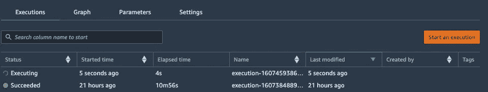

管道的“执行”选项卡。(图片由作者提供)

万岁！！恭喜你刚刚完成了你的第一份培训工作。

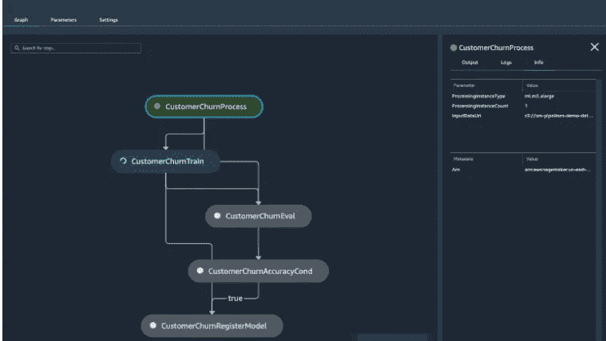

管道图。(图片由作者提供)

除非出了差错，你应该看到你的工作**成功了，**但是记住如果它很容易，任何人都会做。失败是走向成功的第一步。

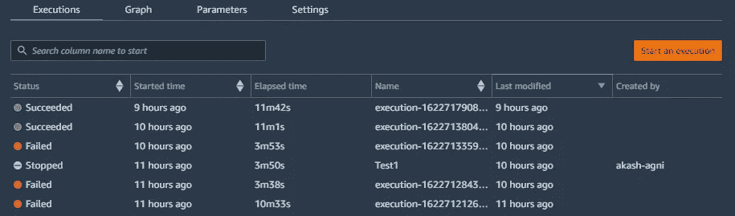

通往成功的道路是崎岖的。(图片由作者提供)

管道完成后，它将创建一个模型并将其添加到您的模型组中，因为我们已经在管道中添加了一个“手动”模型批准条件，所以我们需要选择模型并手动批准它，以创建一个可用于推理的端点。

10.转到项目主页上的**模型组**选项卡，选择已经创建的模型，您可以查看**指标**页面来查看评估阶段的结果。

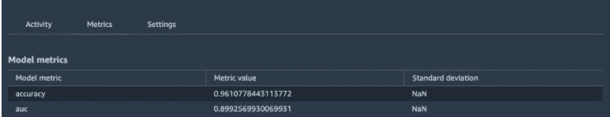

您的模型的度量。(图片由作者提供)

11.如果您对指标满意，您可以选择右上角的**批准**选项来批准模型。

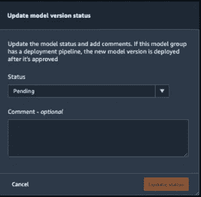

模型批准页面。(图片由作者提供)

当我们的第二个存储库出现时，一旦您批准了在第二个存储库中定义的模型部署管道，它将执行以部署和托管一个新的**端点**，我们可以使用它从我们的 API 进行推理。

# 结论

我试图让本指南保持使用 Sagemaker 的观点，因为它很长，而且还有第 2 部分要写。这里的目标是通过实现一个简单的项目来快速概述 Sagemaker 的不同组件。我给读者的建议是，不要一步一步地遵循指南，用你自己的想法和步骤进行实验，你会经常失败，但你会学到很多东西，这就是议程。希望你喜欢阅读这个指南，就像我喜欢把它放在一起一样。欢迎在评论中提出任何建议或反馈，我们很乐意听到它们。

[**AWS Sagemaker 中的 MLOps 实用指南—第二部分**](/a-practical-guide-to-mlops-using-aws-sagemaker-part-ii-c5159b4b51aa)