# 使用 AWS Sagemaker 的 MLOps 实用指南—第二部分

> 原文：<https://towardsdatascience.com/a-practical-guide-to-mlops-using-aws-sagemaker-part-ii-c5159b4b51aa?source=collection_archive---------16----------------------->

## 如何使用 AWS lambda 和 REST API 部署您的模型供全世界使用。


文森特·梵高的《罗讷河上的星夜》([来源](https://commons.wikimedia.org/wiki/Category:Starry_Night_Over_the_Rhone_by_Vincent_van_Gogh))

在我们开始之前，我强烈建议你阅读[第一部分](/a-practical-guide-to-mlops-in-aws-sagemaker-part-i-1d28003f565)，如果你还没有这样做的话。在本指南中，我们将介绍如何部署您的模型，以便前端开发人员可以在他们使用 REST API 的应用程序中使用它，而不必太担心底层细节。


我们需要构建一个管道，将用户的 Web 浏览器(左)连接到我们的模型端点(右)。(图片由作者提供)

由于我们已经在前一部分开发和部署了模型端点，我们将从开发 lambda 函数开始。

# AWS 函数

> AWS Lambda 是一种无服务器计算服务，允许您运行代码，而无需配置或管理服务器、创建工作负载感知集群扩展逻辑、维护事件集成或管理运行时。

通过使用 AWS Lambda 函数，我们可以避免设置专用服务器来监控传入的请求和执行代码。这样做有很多好处，比如每次 lambda 函数被传入的请求触发时，我们只需支付计算费用，而不是专用的服务器。

按照步骤创建一个 lambda 函数来处理传入的请求。

1.  登录 AWS 控制台，从服务列表中选择 lambda。

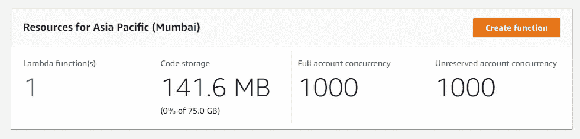

Lambda function dashboard 显示您使用了多少存储和其他统计数据。(图片由作者提供)

2.创建一个新的 lambda 函数开始编码。

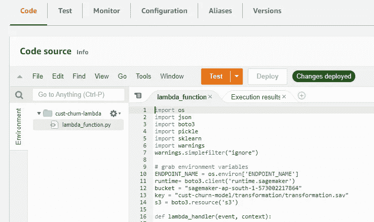

Lambda 函数允许您将简单的代码包部署到无服务器环境中。(图片由作者提供)

3.添加模型端点的名称作为环境变量，方法是单击 configuration 选项卡并添加一个新变量，使用关键字“ENDPOINT_NAME”和值作为开发的端点的名称。

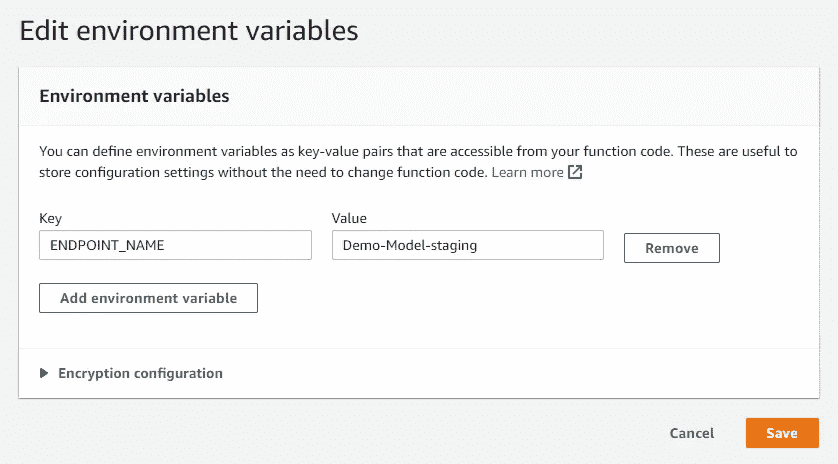

添加端点名称作为环境变量将有助于我们将来在开发更好的模型时自动化这个过程。(图片由作者提供)

4.将下面的代码放入代码编辑器中，确保您将变量“**bucket”**的值替换为您自己的变量，以便它指向您在模型开发期间保存转换的位置。

**注意:您可以在第 1 部分开始时创建的笔记本中找到 s3 的位置。**

```
import os
import json
import boto3
import pickle
import sklearn
import warnings
warnings.simplefilter("ignore")# grab environment variables
**ENDPOINT_NAME** = os.environ['ENDPOINT_NAME']
**runtime**= boto3.client('runtime.sagemaker')
**bucket** = "sagemaker-ap-south-1-573002217864"
**key** = "cust-churn-model/transformation/transformation.sav"
s3 = boto3.resource('s3')def lambda_handler(event, context):

    payload = process_data(event)
    response = runtime.invoke_endpoint(EndpointName=ENDPOINT_NAME,
                                       ContentType='text/csv',
                                       Body=payload)
    result = json.loads(response['Body'].read().decode())
    predicted_label = 'True' if result > 0.39 else 'False'

    return predicted_labeldef process_data(event):
    trans = pickle.loads(s3.Object(bucket, key).get()['Body'].read())
    event.pop('Phone')
    event['Area Code'] = int(event['Area Code'])
    obj_data = [[value for key,value in event.items() if key in trans['obj_cols']]]
    num_data = [[value for key,value in event.items() if key in trans['num_cols']]]

    obj_data = trans['One_Hot'].transform(obj_data).toarray()
    num_data = trans['scaler'].transform(num_data)

    obj_data = [str(i) for i in obj_data[0]]
    num_data = [str(i) for i in num_data[0]]

    data = obj_data + num_data
    return ",".join(data)
```

5.在我们执行 lambda 函数之前的最后一步，lambda 函数使用 vanilla python3 来执行，默认情况下没有安装任何库，如 Pandas、NumPy 或 sklearn。因此，我们需要添加一个 sklearn 层，以便可以加载我们的转换。

现在，我将不会进入如何创建和添加一个层的细节，因为这是一个单独的主题，你可以在这里找到更多的细节。

一旦完成，我们就准备好测试我们的 lambda 函数，选择**测试**下拉菜单来配置一个测试用例，并将下面的输入数据粘贴到其中来运行测试。

```
{
  "State": "SC",
  "Account Length": "15",
  "Area Code": "836",
  "Phone": "158-8416",
  "Int'l Plan": "yes",
  "VMail Plan": "no",
  "VMail Message": "0",
  "Day Mins": "10.018992664834252",
  "Day Calls": "4",
  "Day Charge": "4.226288822198435",
  "Eve Mins": "2.3250045529370977",
  "Eve Calls": "0",
  "Eve Charge": "9.97259241534841",
  "Night Mins": "7.141039871521733",
  "Night Calls": "200",
  "Night Charge": "6.436187619334115",
  "Intl Mins": "3.2217476231887012",
  "Intl Calls": "6",
  "Intl Charge": "2.559749162329034",
  "CustServ Calls": "8"
}
```

6.一旦您运行测试，lambda 函数将通过转换将输入数据运行到我们已经部署的端点，以获得对数据的响应。

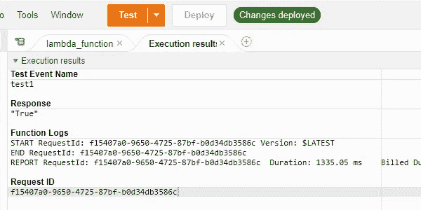

如果一切顺利，您将看到模型的响应。(图片由作者提供)

# 构建 REST API

> API 是一组用于构建和集成应用软件的定义和协议。它有时被称为信息提供者和信息用户之间的契约—建立消费者所需的内容(调用)和生产者所需的内容(响应)。

在我们的例子中，lambda 函数是*生产者*，它使用模型端点来预测消费者提供的输入*(调用)*的分数，消费者可以是前端开发人员开发的任何 web 应用程序。

1.  从 AWS 服务列表中选择“***【API Gateway】***，选择****【创建 API】***选项，创建一个新的 REST API。*

*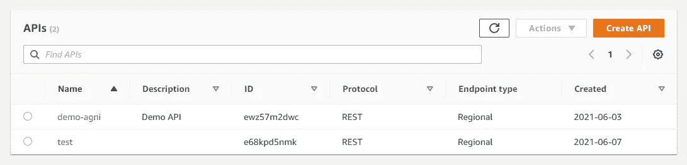*

*使用 REST API，我们可以将模型提供给前端应用程序。(图片由作者提供)*

*2.从 API 列表中选择 REST API 并点击 build。*

*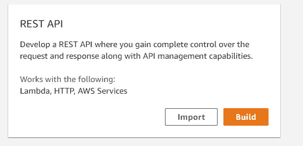*

*构建一个新的 REST API。(图片由作者提供)*

*3.选择新的 API，给它一个好听的名字，然后创建。确保将端点类型保留为区域。*

*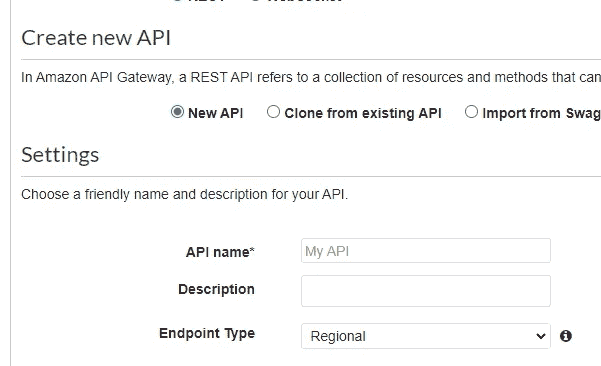*

*将端点类型保留为区域。(图片由作者提供)*

*4.点击**动作**下拉菜单，选择 ***“创建资源”。*** 创建新资源。接下来，再次单击 Actions 并创建一个新的 Post 方法。*

*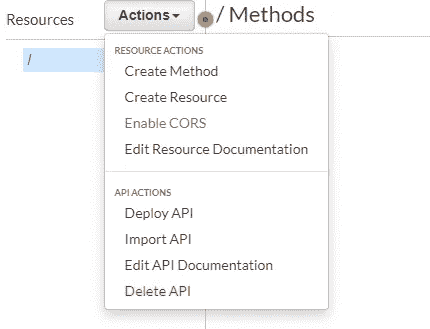*

*5.一旦你创建了一个 ***Post 方法*** 你会得到一个选项来将这个方法与你创建的 lambda 函数集成，输入你的 lambda 函数的名字继续。*

*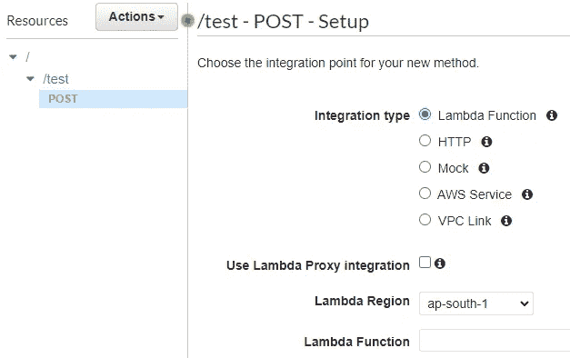*

*确保你所有的项目(lambda，API，Sagemaker studio，s3)都在同一个区域。(图片由作者提供)*

*一旦创建了 API，就需要部署它。正如你所看到的，仪表板显示了你的 API 的架构，以及它是如何集成到你的 lambda 函数中的。*

*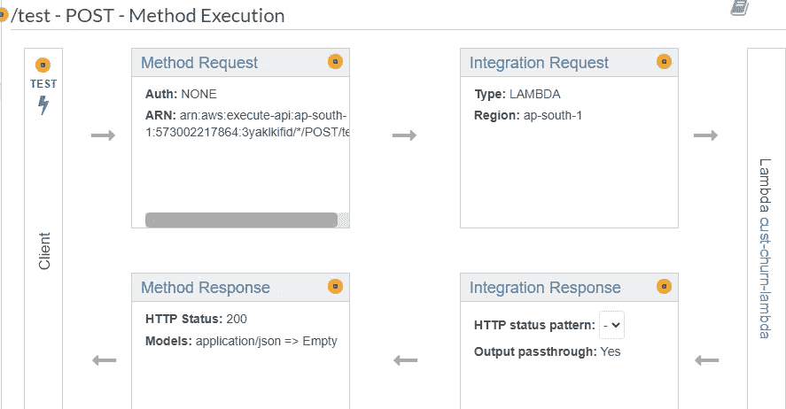*

*与 lambda 函数一起部署的 API 结构。(图片由作者提供)*

*6.您可以通过点击**动作**选项卡并选择**部署 API** 选项来部署 API。这将为您提供一个链接，您可以使用它向您的模型端点发送 **Post** 请求。*

**

*确保在复制调用 URL 之前选择 post 方法。(图片由作者提供)*

# *将这一切结合在一起*

*现在是测试我们的模型结果是否可以通过我们的部署公之于众的时候了。我们可以使用 Postman 来测试我们的 API。*

*在 Postman 中创建一个新的测试，粘贴您从 REST API 中创建的链接，选择 **Body** 作为输入类型，选择 **POST** 作为请求类型，并提供输入数据。*

*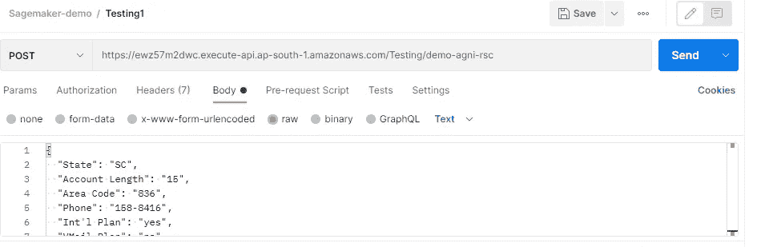*

*Postman 可用于在部署到生产环境之前测试您的 API。(图片由作者提供)*

*一旦你点击发送，它将发送一个请求给你的 API，API 将把请求传递给 lambda 函数以获得响应。*

*万岁！！您已经构建了一个完整的端到端的模型部署管道。*

*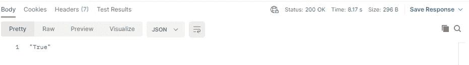*

*响应将由 Postman 连同一些统计数据一起提交。(图片由作者提供)*

# *结论*

*总之，我们有。*

1.  *在 AWS 上构建了完整的 CI/CD 兼容模型开发管道。*
2.  *使用 AWS lambda 函数执行预处理来访问模型端点。*
3.  *构建了一个 REST API 来向前端应用程序公开我们的模型。*
4.  *使用 Postman 测试我们的管道。*

*在这个阶段，你应该花点时间回顾一下你做过的所有事情，并试着想出新的很酷的实验来做得更好。*

## *如果你觉得我的工作有帮助，这里是你可以做的。*

> *发表评论让我知道你的想法，或者如果你发现任何问题。*
> 
> *与你的朋友分享这篇文章。*