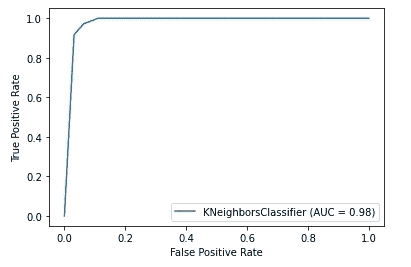

# 使用 Scikit-Learn 分类的七个基本性能指标实用指南

> 原文：<https://towardsdatascience.com/a-practical-guide-to-seven-essential-performance-metrics-for-classification-using-scikit-learn-2de0e0a8a040?source=collection_archive---------11----------------------->

## [入门](https://towardsdatascience.com/tagged/getting-started)

## 通过 Python 中的实例介绍了准确率、混淆矩阵、准确率、召回率、F1 值、ROC 曲线和 AUROC。

由[弗勒](https://unsplash.com/@yer_a_wizard?utm_source=unsplash&utm_medium=referral&utm_content=creditCopyText)在 [Unsplash](https://unsplash.com/s/photos/measure?utm_source=unsplash&utm_medium=referral&utm_content=creditCopyText) 上拍摄

**性能测量**是任何机器学习项目中必不可少的过程。我们的机器学习过程可能不总是产生具有预期准确性的最佳模型。因此，这里需要性能测量来评估训练模型在预测中的有效性。

绩效测量中使用的指标种类繁多，但一般来说，它们可以根据模型类型进行分类，1)分类器或 2)回归器。在本文中，我们将通过介绍在分类项目中使用的七个常见的性能度量标准来关注分类器类型的度量。这七项指标如下:

1.  **准确度得分**
2.  **混淆矩阵**
3.  **精度**
4.  **召回**
5.  **F1 得分**
6.  **ROC 曲线**
7.  奥罗克

虽然理解上述一些性能指标的基本概念可能需要一段时间，但好消息是，使用 Python 机器学习库[**Scikit-Learn**](https://scikit-learn.org/)**，这些指标的实现从未如此简单。Scikit-Learn 可以用几行 Python 代码简化性能测量。**

照片由[沙哈达特·拉赫曼](https://unsplash.com/@hishahadat?utm_source=unsplash&utm_medium=referral&utm_content=creditCopyText)在 [Unsplash](https://unsplash.com/s/photos/python-code?utm_source=unsplash&utm_medium=referral&utm_content=creditCopyText) 上拍摄

在下面的部分中，将通过基于经典威斯康星州乳腺癌数据集的简单二元分类项目来解释每个性能指标的概念。这种分类的目的是预测乳腺癌肿瘤是恶性还是良性。

为了确保您能够理解这些材料，建议您使用**sci kit-learn 0.23 版或更高版本**更新您的 Python 包。这里介绍的一些功能在 Scikit-learn 的早期版本中可能不受支持。

**注:**

完整的源代码可以从我的 Jupyter 笔记本格式的 [Github](https://github.com/teobeeguan/Classification) 中获得。(如果您希望在阅读下面的材料时预览源代码，可以提前下载 Jupyter 笔记本)。

# 1.数据准备

## 1.1 数据加载

我们将使用威斯康星州乳腺癌数据集进行分类。为了获得数据，我们可以使用 Scikit-Learn 中的一个助手函数。

*load_breast_cancer* 是一个 Scikit-Learn 辅助函数，它使我们能够获取所需的乳腺癌数据集并将其加载到 Python 环境中。这里我们调用 helper 函数，并将加载的乳腺癌数据赋给一个变量， *br_cancer* 。

加载的数据集具有 Python 字典结构，其中包括:

*   一个" *data"* 键，包含一个数组，每个实例一行，每个特征一列
*   包含标签数组的“目标”键
*   包含数据集描述的“描述”键

## 1.2 数据探索

现在，让我们通过显示前三行记录来快速预览一下加载的数据集。

前三行记录(图片由作者准备)

记录显示乳腺癌数据集由 30 个数字特征组成(每列一个特征)。如果你有兴趣了解更多关于特性的细节，你可以参考这里的资源。

接下来，我们来看看前三个目标值。

前三个目标值(图片由作者准备)

前三个值是 *0* ，表示一个“*恶性*类。还有另一个可能的值是 1，表示“*良性*类。

两个可能的类别(图片由作者准备)

现在，我们可以将特征值和目标值分别赋给变量 *X* 和 *y，*。

## 1.3 数据标准化

此时，您可能已经注意到 30 个特性的值范围不一致，这可能会影响我们模型预测的准确性。为了避免这个问题，我们可以使用 Scikit-Learn *标准缩放器*将特征值重新缩放到其单位方差。

缩放后的特征值(图片由作者准备)

我们创建一个 *StandardScaler* 对象，并使用其 *fit_transform* 方法来重新缩放我们的 *X* 值，并将转换后的值赋给一个变量 *X_scaled* 。

## 1.4 将数据分为训练集和测试集

在训练分类器之前，我们需要将数据集分成训练集和测试集。为此，我们可以利用 Scikit-Learn 函数， *train_test_split。*

*train_test_split* 可以自动随机化我们的数据集，并根据我们分配的 *test_size* 将其分成训练集和测试集。在这种情况下，我们将 *test_size* 设置为 0.3，以便留出 30%的数据集作为测试集，其余的将用作训练集。训练集和测试集分别分配给变量 *X_train* 、 *X_test* 、 *y_train* 和 *y_test* 。

# 2.训练分类器

我们将分别基于 k-最近邻算法(KNN)、随机梯度下降(SGD)和逻辑回归来训练三个分类器。我们构建三个分类器的原因是，我们可以使用本文将要介绍的度量标准来比较它们的性能。

Scikit-Learn 为我们提供 KNN、SGD 和逻辑回归分类器。我们需要做的只是将这些分类器( *KNeighboursClassifier、SGDClassifier* 和 *LogisticRegression* )导入到我们的 Python 环境中。接下来，我们为每个分类器创建一个对象，然后使用*拟合*方法开始训练各自的分类器，使用相同的训练集(*X _ train*&*y _ train*)作为其输入。

(整个训练过程应该只需要几秒钟，因为我们正在处理一个非常小的数据集。)

现在，让我们通过使用模型内置方法*预测*来尝试使用我们训练的分类器进行预测。

我们将测试集取到*预测*方法中，每个分类器的预测结果分别存储在三个变量 *y_pred_knn、* *y_pred_sgd* 和 *y_pred_log* 中。

# 3.性能测定

这是本文的主题。在这里，我们将通过深入研究分类器的基本概念及其使用 Scikit-Learn 的实现来涵盖分类器的七个性能指标。

先说最简单的一个，*准确率评分*。

## 3.1 准确度得分

**3.1.1 概念**

准确度分数可能是衡量分类器性能的最直接的指标。这是一个向我们展示正确预测的一部分的指标。公式如下:

准确度分数的公式(图片由作者准备)

假设在我们的测试集中有 100 条记录，并且我们的分类器成功地对其中的 92 条进行了准确的预测，那么准确性得分将是 0.92。

**3 . 1 . 2 sci kit-Learn 中的实施**

Scikit-Learn 提供了一个函数 *accuracy_score* ，它接受真实值和预测值作为其输入来计算模型的准确度分数。

首先，我们从 Scikit-Learn 的*度量*模块中导入 *accuracy_score* 函数。接下来，我们将 *y_test* 作为真值，将 *y_pred_knn* ，*y _ pred _ SGD*&*y _ pred _ log*作为预测值输入到 *accuracy_score* 函数中。将得到的准确度分数分配给三个变量，并打印分数。

三个分类器的结果准确度分数(图片由作者准备)

所得的准确度分数揭示了逻辑回归分类器在三个分类器中表现出最高的性能。然而，所有三个分类器通常都很高(> 95%的准确度)，这给了我们一个粗略的想法，即这些分类器在识别恶性或良性肿瘤中是有效的。

## 3.2 混淆矩阵

**3.2.1 概念**

总的来说，准确度分数只给了我们正确预测的一小部分。如果我们想从以下几个方面了解我们的分类器，该怎么办:

*   我们的样本中有多少恶性肿瘤被正确和错误地预测了？
*   我们的样本中有多少良性肿瘤被正确和错误地预测了？

这些问题是至关重要的，因为没有一个病人会乐于接受错误报告的医疗结果。理想情况下，对恶性和良性类别的预测应该达到很高的准确度，以最小化错误报告。如果我们的分类器明显偏向恶性或良性类别，我们可能需要通过调整一些超参数或获取额外的数据到训练管道来重新训练我们的分类器。

因此，评估分类器性能的更好方法是使用**混淆矩阵**。混淆矩阵(也称为误差矩阵)是一个二维表格，允许分类器对正确标记和错误标记的实例进行可视化。

给定测试集中的 100 个实例的样本，其中每个实例属于正类或负类。分类器在该测试集上的性能可以表示为下面的混淆矩阵:

混淆矩阵的样本(图片由作者准备)

上面混淆矩阵中的每一列代表一个实际的类，而每一行代表一个预测的类。左上象限显示在测试集中有 44 个被准确预测的阳性实例，因为实际类(阳性)与预测类(阳性)相匹配。这种结果被称为**真阳性(TP)** 。另一方面，右上象限显示了被错误预测为阳性类别的 6 个阴性实例，这些实例被称为**假阳性(FP)** 。

在右下象限，有 48 个被正确预测的负实例，被称为**真负(TN)** 。最后，左下象限显示 2 个阳性实例，它们被错误地预测为阴性类别，这些实例被称为**假阴性(FN)** 。

从上面的样本混淆矩阵中，我们可以观察到，分类器在识别负类时表现出比正类稍好的性能。理想情况下，一个好的分类器应该具有尽可能少的假阳性和假阴性。这意味着混淆矩阵的主对角线中的非零数字越高，分类器的性能越好。

**3.2.2** **在 Scikit-Learn 中实现**

虽然对混淆矩阵的解释可能听起来很冗长，但实现只需要几行代码(感谢 Scikit-Learn)。让我们尝试使用 Scikit-Learn 的*混淆矩阵*函数为我们的 KNN 分类器构建一个混淆矩阵表。

首先，我们将*混淆矩阵*函数导入到我们的 Python 环境中。通过向函数传递两个必需的参数，真值( *y_test* )和预测值( *y_pred_knn* )，将生成一个表示为 2D 数组的混淆矩阵，如下所示:

Scikit-Learn 生成的 2D 阵列(图片由作者准备)

为了减轻我们在乳腺癌预测中解释 2D 阵列的任务，我们可以通过将阳性类别称为恶性，将阴性类别称为良性，来尝试将 2D 阵列映射到我们之前的混淆矩阵表**。**

将 2D 阵列映射到 KNN 分类器的混淆矩阵表(图片由作者准备)

给定测试集中总共 171 个实例，混淆矩阵显示有 59 个恶性肿瘤被正确分类(真阳性)，4 个良性肿瘤被错误分类为恶性(假阳性)，105 个良性肿瘤被正确分类(真阴性)，另外 3 个恶性肿瘤被错误分类为良性(假阴性)。

基本上，KNN 分类器展示了对恶性和良性肿瘤的良好预测工作。通过重复上述类似的步骤，我们还可以为我们的 SGD 分类器和逻辑回归分类器创建混淆矩阵，然后将它们与 KNN 分类器进行比较。

将 2D 阵列映射到 SGD 分类器的混淆矩阵表(图片由作者准备)

将 2D 阵列映射到 log reg 分类器的混淆矩阵表(图片由作者准备)

现在，让我们看看所有三个混淆矩阵，并在它们之间进行比较。

三种分类器混淆矩阵的比较(图片由作者准备)

从上面的结果中，我们可以观察到 SGD 分类器显示出稍高的假阴性数量，尽管它的总体准确度分数优于 KNN。如果我们只有两个分类器的选择，KNN 或 SGD，并且目标是更低的假阴性，KNN 可能是一个更好的选择，即使它的整体准确性分数略低于 SGD。

另一方面，很明显，逻辑回归分类器仍然是赢家，因为它在三个分类器中显示出最低数量的假阳性和假阴性。

## 3.3 精确度、召回率和 F1 分数

**3.3.1 概念**

混淆矩阵向我们显示了一个分类结果中真阳性、假阳性、真阴性和假阴性的确切数量。事实上，我们可以进一步从混淆矩阵中导出几个有用的度量。

首先，我们可能会问自己:**真正肯定的积极预测的比例是多少？**

阳性预测中真正阳性的比例(图片由作者准备)

为了解决这个问题，让我们通过一个简单的数学计算逻辑，如下所示。

精度计算(图片由作者准备)

真正阳性的数量与阳性总数之间的比率就是所谓的**精度。**精度公式如下:

精确公式(图片由作者准备)

精度给了我们一个量词来揭示预测的阳性实例中真正阳性的部分。上面的样本分类器达到了 0.88 的精度分数，这也意味着 88%的预测阳性是真阳性。

现在，让我们考虑另一个微妙的问题:**被正确预测为阳性的阳性实例的比例是多少？**

预测为阳性的阳性实例的比例(图片由作者准备)

我们将再次使用一个简单的数学逻辑来解决这个问题。

回忆的计算(图片由作者准备)

上面的计算得出真实阳性与阳性实例总数之间的比率，该比率称为**召回**。回忆也称为敏感度或真阳性率(TPR)。召回的公式如下所示:

回忆公式(图片由作者准备)

上面的样本分类器的召回分数为 0.957，高于其精确度。这意味着在所有 46 个阳性实例中，95.7%被正确预测为阳性。

精确度和召回率也可以合并成一个单一的指标，称为 F1 分数。F1 分数是精确度和召回率的调和平均值。

F1 分数公式(图片由作者准备)

初看起来，F1 分数公式似乎有点令人生畏，但它只是一个特定的平均值，给予低值更多的权重(与平等对待所有值的常规平均值相比)。高 F1 分数表示相似的精确度和召回率。例如，如果我们将 F1 分数公式应用于我们的样本分类器，我们将得到大约 0.917 的分数。这表明样本分类器的准确率和召回率都很高。

重要的是要知道精确度和召回率并不总是相似的，在某些情况下，我们更喜欢精确度高于召回率，反之亦然。例如，我们期望在医学使用案例(如癌症检测)中有更高的召回率。使我们的分类器能够准确地识别尽可能多的真正阳性癌症实例总是比忽略一些阳性实例更好。另一方面，银行分析师可能更喜欢他们的贷款分类器具有更高的精度，这样他们就不会意外拒绝潜在客户并失去业务。

不幸的是，我们不能总是调整我们的分类器来达到几乎同样高的精度和召回率。提高精确度会导致召回率的降低，反之亦然。这就是所谓的**精度/召回权衡。**

**3 . 3 . 2 sci kit-Learn 中的实现**

现在是时候再次动手使用 Scikit-Learn 实现我们在本节中涉及的指标了。使用 Sckit-Learn 提供的 *classification_report* 函数可以轻松获得精确度、召回率和 F1 分数指标。

像往常一样，我们将所需的 *classification_report* 函数导入到 Python 环境中。接下来，让我们尝试从数据集中提取目标名称(恶性和良性)，并将其分配给一个变量 *targets* 。由 *targets* 变量保存的名称稍后将显示为最终结果的一部分。最后，我们将三个参数，真值( *y_test* )、预测值( *y_pred_knn、y_pred_sgd & y_pred_log* )和目标名称( *targets* )传递给 *classification_report* 函数并打印出结果，如下所示。

三个分类器的分类报告(图片由作者准备)

总的来说，三种分类器在准确率、召回率和 F1 值上没有明显的差异。逻辑回归仍然是明显的赢家，恶性和良性类别的 F1 值分别为 0.98 和 0.99。此外，其 0.98 的高召回率已经证明其本身是对恶性肿瘤进行可靠检测的可靠分类器。

## 3.4 ROC 曲线和 AUROC

3.4.1 概念

**接收器工作特性(ROC)曲线**为我们提供了一种可视化方法来检查我们训练过的分类器的性能。这是一条绘制分类器的真阳性率(TPR)与其假阳性率(FPR)的曲线。如前所述，TPR 也称为召回。另一方面，FPR 是被错误预测为阳性的阴性实例的比率。

ROC 曲线示例如下:

ROC 曲线(图片由作者准备)

TPR 和 FPR 之间有一个权衡，TPR 越高，分类器产生的 FPR 越多。中间的斜虚线代表随机分类器 ROC 曲线。

一个好的分类器的 ROC 曲线应该尽可能远离对角线，朝向左上角。基于这一基本原理，我们可以通过计算曲线下面积(AUC)来衡量和比较我们的分类器的性能，这将产生一个名为 **AUROC (** 受试者操作特性**下的面积)**的分数。一个完美的 AUROC 应该有 1 分，而一个随机分类器应该有 0.5 分。

**3 . 4 . 2 sci kit-Learn 中的实施**

Scikit-Learn 提供了一个方便的函数， *plot_roc_curve* ，我们可以用它来创建 roc 曲线并计算 AUROC 分数。

*plot_roc_curve* 函数只需要三个参数，即分类器( *knn_model* )、测试集( *X_test* )和真值( *y_test* )，它将自动生成 roc 曲线并实时计算我们的 knn 分类器的 AUROC 分数。

KNN 分类器的 ROC 曲线和 AUROC 分数(图片由作者准备)

让我们为 SGD 和逻辑回归分类器重复类似的步骤。

SGD 分类器的 ROC 曲线和 AUROC 分数(图片由作者准备)

Log Reg 分类器的 ROC 曲线和 AUROC 分数(图片由作者准备)

我们的逻辑回归分类器的 AUROC 达到了满分 1。通过查看我们在这里讨论的所有指标的结果，我们可以得出结论，逻辑回归分类器是三者中表现最好的。该分类器被证明是预测乳腺癌肿瘤类型的最可靠的模型。

# 结论

在本文中，我们已经使用上面介绍的七个度量标准完成了测量三个分类器性能的步骤。使用 Scikit-Learn 可以很容易地实现它们。Scikit-Learn 在一些性能指标中封装了大量底层复杂逻辑，它提供了一个一致的编程接口来接受输入参数并即时生成所需的结果。我希望您能从这里提供的材料中受益，它能让您在学习分类器性能指标的同时接触 Scikit-Learn(如果您还不熟悉 Scikit-Learn)。

# 资源

完整的源代码可以从我的 [Github 库](https://github.com/teobeeguan/Classification)获得。

# 参考

1.  Geron，A. (2019)。使用 Scikit-Learn、Keras & TensorFlow 进行机器学习。奥莱利媒体。
2.  https://en.wikipedia.org/wiki/Confusion_matrix
3.  【https://en.wikipedia.org/wiki/Precision_and_recall 