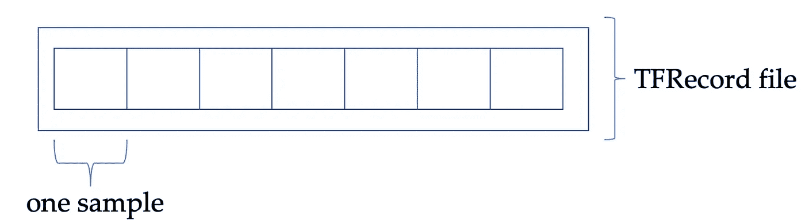
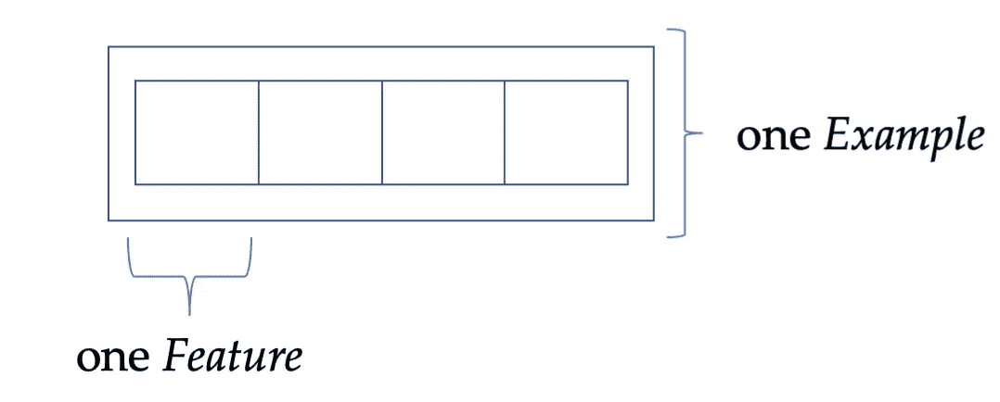

# TFRecords 实践指南

> 原文：<https://towardsdatascience.com/a-practical-guide-to-tfrecords-584536bc786c?source=collection_archive---------2----------------------->

## 关于处理图像、音频和文本数据的介绍

TensorFlow 的自定义数据格式 TFRecord 真的很有用。这些文件由速度极快的 tf.data API 提供本机支持，支持分布式数据集，并利用并行 I/O。但它们起初有些令人难以招架。这篇文章是一个实践性的介绍。

# 概观

在下文中，我们将使用人工数据来回顾 TFRecord 文件背后的概念。记住这一点，我们就可以继续研究图像；我们将使用小型和大型数据集。扩展我们的知识，然后我们处理音频数据。最后一个大的领域是文本领域，我们也会涉及到。为了将所有这些结合起来，我们创建了一个人工的多数据类型数据集，并且，您可能已经猜到了，也将它写入 TFRecords。

# TFRecord 的布局

当我开始我的深度学习研究时，我天真地将我分散在磁盘上的数据存储起来。更糟糕的是，我用数千个小文件污染了我的目录，大约只有几 KB。我当时工作的集群并不觉得有趣。加载所有这些文件花了相当长的时间。

这就是 TFRecords(或大型 NumPy 数组，就此而言)派上用场的地方:我们不是存储分散的数据，而是迫使磁盘在块之间跳转，而是简单地将数据存储在一个顺序布局中。我们可以用以下方式来形象化这个概念:



作者创建的可视化

TFRecord 文件可以看作是所有单个数据样本的包装器。每一个数据样本都被称为一个*示例*，本质上是一个字典，存储着一个键和我们实际数据之间的映射。

现在，看似复杂的部分是这样的:当你想把数据写到 TFRecords 时，你首先必须把你的数据转换成一个*特性*。这些特征是一个示例的内部组件:



作者创建的可视化

到目前为止，一切顺利。但是现在将数据存储在压缩的 NumPy 数组或 pickle 文件中有什么区别呢？两件事:TFRecord 文件是顺序存储的，由于访问时间短，可以实现快速流式传输。其次，TFRecord 文件原生集成到 TensorFlows tf.data API 中，可以轻松实现批处理、混排、缓存等功能。

另外，如果您有机会和计算资源进行多工人培训，您可以将数据集分布在您的机器上。

在代码级别，特性创建是通过这些方便的方法进行的，我们将在后面讨论这些方法:

要将数据写入 TFRecord 文件，首先要创建一个字典，该字典表示

> 我想把这个数据点存储在这个键下

当从 TFRecord 文件中读取时，您可以通过创建一个字典来反转这个过程，该字典说

> 我有这个键，用存储在这个键上的值填充这个占位符

让我们看看这是如何运作的。

# 图像数据，小


一只小猫。在 [Unsplash](https://unsplash.com?utm_source=medium&utm_medium=referral) 上由 [Kote Puerto](https://unsplash.com/@kotecinho?utm_source=medium&utm_medium=referral) 拍摄的照片

图像是深度学习中的一个常见领域，MNIST [1]和 ImageNet [2]是两个众所周知的数据集。将您的图像从磁盘放入模型的方法有很多:[编写一个定制的生成器](https://stanford.edu/~shervine/blog/keras-how-to-generate-data-on-the-fly)，使用 Keras 的[内置工具](https://keras.io/api/preprocessing/image/#imagedatagenerator-class)，或者从 NumPy 数组加载它。为了高效地加载和解析图像数据，我们可以求助于 TFRecords 作为底层文件格式。

过程如下:我们首先创建一些随机图像——也就是说，使用 NumPy 随机填充给定图像形状的矩阵:宽度、高度和颜色通道:

输出符合预期；我们有 100 个形状为 250x250 的图像，每个图像有三个通道:

```
(100, 250, 250, 3)
```

我们也创造一些人为的标签:

因此，我们有一个形状为(100，1)的标签数组，每个图像存储一个标签。打印出前十个标签:

```
(100, 1)
[[2] [4] [3] [3] [2] [4] [2] [3] [3] [0]]
```

为了将这些{image，label}对放入 TFRecord 文件，我们编写了一个简短的方法，获取一个图像及其标签。使用上面定义的助手函数，我们创建一个字典，在键 *height* 、 *width* 和*depth——w*中存储我们图像的形状，我们需要这些信息在以后重建我们的图像。接下来，我们还将实际图像存储为 *raw_image* 。为此，我们首先序列化数组(考虑构建一个长列表)，然后将其转换为一个 *bytes_feature* 。最后，我们存储图像的标签。

所有这些键:值映射构成了一个*示例*的特性，如上所述:

既然我们已经定义了如何从一对{image，label}创建一个*示例*，我们需要一个函数将我们的完整数据集写入 TFRecord 文件。

我们首先创建一个 *TFRecordWriter* ，随后使用它将*示例*写入磁盘。对于每个图像和相应的标签，我们使用上面的函数来创建这样一个对象。在写入磁盘之前，我们必须对其进行序列化。在我们使用完数据后，我们关闭我们的 writer 并打印我们刚刚解析的文件数:

这就是将图像写入 TFRecord 文件所需的全部内容:

输出与预期的一样，因为我们刚刚解析了 100 个{image，label}对:

```
Wrote 100 elements to TFRecord
```

有了这个文件在我们的磁盘上，我们以后可能也会有兴趣阅读它。这也是可能的，并且是相反的:

前面，我们定义了一个用于将内容写入磁盘的字典。我们现在使用类似的结构，但这次是为了读取数据。之前，我们说过键*宽度*包含 int 类型的数据。因此，当我们创建字典时，我们也分配一个 int 类型的占位符。因为我们正在处理固定长度的特性(我们大部分时间都在处理这些特性；稀疏张量很少使用)，我们说:

> 给我我们存储在键“width”中的数据，并用它填充这个占位符

类似地，我们为其他存储的特性定义了 key:placeholder 映射。然后，我们通过用 *parse_single_example* 解析元素来填充占位符。假设我们处理的是一个字典，我们通常可以通过访问相应的键来提取所有的值。

在最后一步中，我们必须将图像从序列化形式解析回(高度、宽度、通道)布局。注意，我们希望 out_type 为 int16，这是必需的，因为我们也是用 int16 创建映像的:

为了从解析元素中创建数据集，我们只需利用 tf.data API。我们通过将 TFRecord 文件指向磁盘上的 TF record 文件来创建一个 *TFRecordDataset* ，然后将我们之前的解析函数应用于每个提取的*示例*。这会返回一个数据集:

我们可以通过获取单个数据点来探索数据集的内容:

输出是

```
(250, 250, 3)
()
```

第一行是一个图像的形状；第二条线是标量元素的形状，它没有维度。

这标志着小型数据集解析的结束。在下一节中，我们将研究如何解析一个更大的数据集，在解析过程中创建多个 TFRecord 文件。

# 图像数据，大


一只大猫。照片由[蒂莫西·梅恩伯格](https://unsplash.com/@timothymeinberg?utm_source=medium&utm_medium=referral)在 [Unsplash](https://unsplash.com?utm_source=medium&utm_medium=referral) 上拍摄

在上一节中，我们向单个 TFRecord 文件中写入了一个相当小的数据集。对于更大的数据集，我们可以考虑将数据分割到多个这样的文件中。

首先，让我们创建一个随机图像数据集:

下一步将创建相应的标签:

由于我们现在正在处理一个更大的数据集，我们首先必须确定我们甚至需要多少个碎片。为了计算这一点，我们需要文件总数和希望存储在单个碎片中的元素数量。我们还必须考虑这样的情况，例如，每个分片有 64 个图像和 10 个文件。这将导致 6 个碎片(6x10 ),但会丢失最后 4 个样本。我们只是通过预先添加一个额外的碎片来避免这种情况，如果我们有 60 个文件，就删除它，因为 60//10 不会留下任何余数:

下一步，我们迭代分割/碎片。我们为每个分割创建一个新的文件和 writer，相应地更新文件名。命名遵循{输出目录} {当前碎片数} _ {碎片总数} {文件名}。

对于每一个碎片，我们创建一个临时计数来跟踪我们存储在其中的所有元素。通过计算*split _ number*x*max _ files*+*current _ shard _ count*来确定下一个{image，label}对。对于我们的第一个碎片，索引将从 0 到 9；对于第二个碎片，索引将从 10 到 19，依此类推。如果索引等于元素的数量，我们只需打破循环:

准备好索引后，我们可以从相应的数组中获取图像和标签。我们重用了之前编写的 *parse_single_image* 函数，因为我们只改变了数据集的维度，而没有改变布局。下一步，我们将返回的*示例*对象写入 TFRecord 文件。最后，我们增加当前和全局计数器；最后，关闭我们的 writer:

和前面一样，我们可以通过一个函数调用来创建 TFRecord 文件:

打印语句的输出是

```
Using 17 shard(s) for 500 files, with up to 30 samples per shard
100%|██████████| 17/17 [00:03<00:00,  5.07it/s]
Wrote 500 elements to TFRecord
```

类似于我们的小数据集，我们可以从磁盘中提取较大的文件。因为我们没有改变存储的键，所以我们重用了我们的 *parse_tfr_element()* 方法。唯一的区别是我们有多个 TFRecord 文件，而不是只有一个。我们可以通过获取符合某个模式的所有文件的列表来处理这个问题；我们简单地搜索所有包含字符串 *large_images* 的 TFRecord 文件:

我们可以用下面的代码获取一个数据集并查询一个元素:

输出是预期的，一个图像的形状是(400，750，3)，标签是一个标量，没有形状:

```
(400, 750, 3)
()
```

这标志着将较大的图像数据集解析为多个 TFRecord 文件并获取数据的工作已经结束。在下一节中，我们将讨论存储音频数据。

# 音频数据


照片由 [Alexey Ruban](https://unsplash.com/@intelligenciya?utm_source=medium&utm_medium=referral) 在 [Unsplash](https://unsplash.com?utm_source=medium&utm_medium=referral) 上拍摄

音频是第二种常用的数据类型；有各种各样的大型数据集可用。Christopher Dossman 列出了超过 1 TB 的音频数据——这只是更大的公开数据中的一部分:

</a-data-lakes-worth-of-audio-datasets-b45b88cd4ad>  

对于本节，我们不会从一开始就处理 TBs。相反，我们将关注一个更小的数据集。

让我们从创建它开始，我们需要 librosa 包来完成它。我们使用 librosa 提供的示例文件，并分配一些人工标签。对于每个样本，我们存储原始音频和采样速率:

正如我们之前所做的，我们编写了一个简短的方法来帮助我们将数据放入 TFRecord 文件。因为我们将音频数据和采样率打包到一个公共数组中，所以我们必须简单地查询条目:第一个条目是音频数据，第二个条目保存采样率。

有了这些，我们就可以创建并返回一个*示例*对象。这里没有什么完全新的东西；方法与之前类似:

前面的函数返回一个样本，准备写入 TFRecord。下一个函数遍历所有样本，并将它们写入磁盘:

然后我们简单地调用

将我们完整的音频数据集写入磁盘。

将它存储在一个文件中，我们可以像以前一样继续:我们编写一个函数，它与向 TFRecord 编写示例的过程相反，而是读取它。这与我们用来解析图像的函数非常相似；只有键有不同的名称:

和前面一样，要创建数据集，我们只需将这个解析函数应用于 TFRecord 文件中的每个元素:

为了查询我们的数据集，我们调用这个函数并检查第一个元素:

输出是

```
(117601,)
tf.Tensor(0, shape=(), dtype=int64)
```

第一个条目是音频文件的形状；第二个条目是相应的标签。

这标志着音频数据和 TFRecord 文件工作的结束。在下一节中，我们来看看如何处理文本数据。

# 文本数据


由[米卡·博斯韦尔](https://unsplash.com/@micahboswell?utm_source=medium&utm_medium=referral)在 [Unsplash](https://unsplash.com?utm_source=medium&utm_medium=referral) 上拍摄的照片

作为最后一个大域，我们有文本数据。考虑到 NLP 研究在过去三、四年中的成功——变形金刚[3]、GPT [4]、…这就不足为奇了。

我们首先创建一个虚拟数据集:

然后，我们创建数据集并查询前五个元素:

这给了我们

```
['Hey, this is a sample text. We can use many different symbols.',
 'A point is exactly what the folks think of it; after Gauss.',
 'Hey, this is a sample text. We can use many different symbols.',
 'A point is exactly what the folks think of it; after Gauss.',
 'Hey, this is a sample text. We can use many different symbols.']
```

现在我们编写一个函数，从文本数据中创建一个示例对象。过程和前面一样:我们将非标量数据存储为字节特征，将标签存储为标量。

使用下一个函数，我们迭代文本数据集和标签，并将它们写入单个 TFRecord 文件:

将我们的人工文本数据集放到磁盘上只需一个简单的调用:

在下一个函数中，我们反转这个过程，从 TFRecord 文件中获取数据。一个显著的区别是，我们希望我们的特征——文本数据——是字符串类型；因此，我们将 *out_type* 参数设置为 *tf.string* :

和以前一样，我们将每个元素都映射到这个函数:

然后我们得到一个数据集，并期待前两个元素:

输出是

```
b'Hey, this is a sample text. We can use many different symbols.'
tf.Tensor(0, shape=(), dtype=int64)
b'A point is exactly what the folks think of it; after Gauss.'
tf.Tensor(1, shape=(), dtype=int64)
```

这标志着在 TFRecord 文件的上下文中写入和读取音频数据的结束。在下一节中，我们将合并所有以前的域。

# 多种数据类型

到目前为止，我们已经检查了单个域。当然，没有什么反对合并多个域！对于以下内容，请考虑以下大纲:

我们有多个图像:

其次，我们对每幅图像都有一个简短的描述，描述图像显示的风景:

最后，我们还有对风景的听觉描述。我们重用上面的虚拟音频数据:

现在，让我们将它们合并到 TFRecord 文件中。我们编写一个函数，接受这些数据类型并返回一个示例对象。这是 TFRecord 格式的另一个好处:即使我们处理多种数据类型，我们也可以将所有内容一起存储在一个对象中:

如前所述，我们迭代所有数据样本并将它们写入磁盘:

创建 TFRecord 文件只是一个函数调用:

既然我们已经将这样一个*例子*写到磁盘上，我们通过提取*特征*来读回它。与上一节的主要区别在于，我们有多个特征—文本、图像和音频数据—因此我们必须分别解析它们:

获得组合数据集的代码非常简单:

让我们看看数据集中的第一个元素:

输出是

```
(<tf.Tensor: shape=(256, 256, 3), dtype=int16, numpy=
 array([[[160, 224, 213],
         ...
         [189, 253,  65]]], dtype=int16)>,

<tf.Tensor: shape=(), dtype=string, numpy=b'This image shows a house on a cliff. The house is painted in red and brown tones.'>,<tf.Tensor: shape=(), dtype=int64, numpy=3>,<tf.Tensor: shape=(117601,), dtype=float32, numpy=
 array([-1.4068224e-03, -4.4607223e-04, -4.1098078e-04, ...,
         7.9623060e-06, -3.0417003e-05,  1.2765067e-05], dtype=float32)>,<tf.Tensor: shape=(), dtype=int64, numpy=0>)
```

第一个元素是图像，第二个元素是图像的文本描述，第三个元素是文本的标签。最后两个元素是音频数据和音频数据的标签。

这标志着关于将多种数据类型写入 TFRecord 文件的部分到此结束。

# 摘要

我们讨论了将图像、音频和文本数据写入 TFRecord 文件。我们还讨论了读回这些数据。

不管实际内容如何，程序总是如下:

*   为存储在 TFRecord 文件中的数据定义字典
*   解析数据时，通过复制该字典来重建数据
*   将每个元素映射到解析函数

只有在处理大型数据集时，才需要稍加修改。在这种情况下，您必须将您的数据写入多个 TFRecord 文件，这一点我们在处理大型图像数据一节中已经介绍过。

这里有一个包含所有代码的 Colab 笔记本。

如果您有兴趣了解这种文件格式，您可以阅读我关于自定义音频数据分类的帖子。在那里，我使用 TFRecord 文件来存储我的数据集，并直接在其上训练神经网络:

</custom-audio-classification-with-tensorflow-af8c16c38689>  

# 文学

[1] Y. LeCun *等*。，[基于梯度的学习应用于文档识别](https://ieeexplore.ieee.org/document/726791) (1994)，IEEE 会议录

[2] J. Deng *等*，Imagenet: [大规模分层图像数据库](https://ieeexplore.ieee.org/document/5206848) (2009)，IEEE 计算机视觉与模式识别会议

[3] A .瓦斯瓦尼*等*，[注意力是你所需要的全部](https://arxiv.org/pdf/1706.03762.pdf）描述了这样做的原因%E3%80%82) (2017)，NIPS

[4] A .拉德福德*等*，[通过生成性预训练提高语言理解](https://www.cs.ubc.ca/~amuham01/LING530/papers/radford2018improving.pdf) (2018)，OpenAI