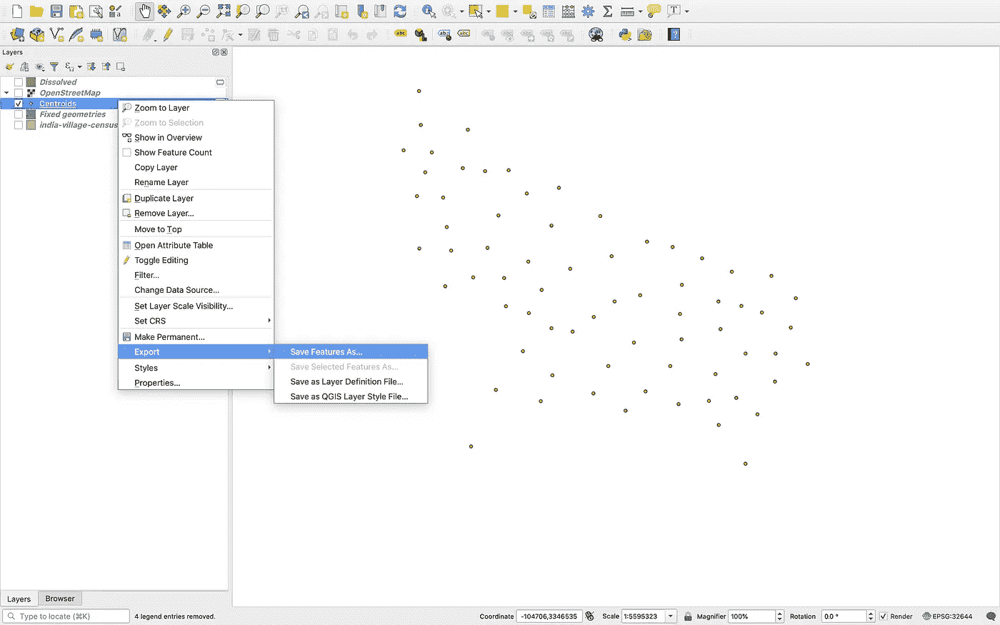

# 使用 QGIS 处理地理空间数据的实用指南:第 1 部分

> 原文：<https://towardsdatascience.com/a-practical-guide-to-working-with-geospatial-data-using-qgis-part-1-561056a5a3b3?source=collection_archive---------15----------------------->

在 [Unsplash](https://unsplash.com/s/photos/map?utm_source=unsplash&utm_medium=referral&utm_content=creditCopyText) 上由 [Brett Zeck](https://unsplash.com/@iambrettzeck?utm_source=unsplash&utm_medium=referral&utm_content=creditCopyText) 拍照

# 介绍

最近，我开始研究一个涉及分析地理空间数据的项目。要分析这样的数据，可视化是极其重要的一步。你可以很容易地在地图上看到几个图案。如果数据包含 100 个特征，如果我们可以绘制这些特征的地图，并查看数据是否直观地有意义，那就太好了。QGIS 是一个很好的应用程序，允许分析、编辑和可视化地理数据。在本教程的第 1 部分中，我们将学习如何使用 QGIS 来显示地图和分析地理空间数据。我们还将学习对数据进行一些基本的操作。在第 2 部分中，我将讨论一些复杂的操作以及如何使用 geopandas 来操作地理空间数据。

# 地理数据和 QGIS 简介

地理数据包含一个几何组件，为数据在地图上提供一个位置。几何可以是不同的类型，如点/多点、线/多线和多边形/多边形。

> QGIS 是一个免费的地理信息系统应用程序，支持查看、编辑和分析地理空间数据。

你可以从[这里](https://qgis.org/en/site/forusers/download.html)下载 QGIS。

shapefiles 有不同的格式，如。shp，。kml，。kmz，。geojson 等。你可以在这里查看所有格式:[https://gisgeography.com/gis-formats/](https://gisgeography.com/gis-formats/)

对于本教程，我将使用一个**。来自 SEDAC 网站的 shp** 格式 shapefile。

> SEDAC 是社会经济数据和应用中心。它是美国国家航空航天局(NASA)地球观测系统数据和信息系统(EOSDIS)的分布式主动档案中心(DAACs)之一。SEDAC 专注于人类在环境中的互动。

我将使用印度北方邦的村级 shapefile。它包含村庄一级的社会经济特征。你可以从[这里](https://sedac.ciesin.columbia.edu/data/set/india-india-village-level-geospatial-socio-econ-1991-2001/data-download)下载。

# 在 QGIS 上加载/显示数据

首先，打开 QGIS 应用程序。点击“新建空项目”。您可以选择:**项目**->-**另存为**选项来保存项目。

## A.加载 Shapefile 数据

要加载 shapefile，请执行以下步骤:

1.  图层->添加矢量图层。
2.  选择。shp 文件或选择 shapefile 所在的目录。现在，点击添加。

现在，您可以查看 shapefile。

第一步

第二步

Shapefile 的视图

要查看有关 shapefile 的信息:

1.  右键单击左窗格中的 shapefile 名称。
2.  点击属性->信息。在这里你可以看到关于 shapefile 的所有细节。

Shapefile 信息

## **B .修复几何图形(可选)**

有时，shapefile 包含无效的几何。当我们试图在 shapefile 上执行一些操作时，它会给出错误“无效几何图形”。要修复几何图形，请执行以下步骤:

1.  从菜单栏中，转到处理->工具箱->修复几何。选择您的形状文件。

2.点击运行

3.现在，将创建一个新的 shapefile。如果某些几何图形无效，它将修复这些几何图形。

几何图形固定的 Shapefile

我们将继续我们在这个新的形状文件上的工作。如果旧的 shapefile 没有无效的几何图形，您也可以使用它。但是，我已经知道这个 shapefile 有一些无效的几何图形。而且，它会在以后产生一些问题。

## C.查看数据属性

现在，shapefile 已加载。但是我们如何知道 shapefile 中有哪些变量/属性呢？要查看属性:

1.  右键单击左窗格中的 shapefile 名称。
2.  点击“打开属性表”。

现在，您可以看到数据中存在的所有属性。

第一步

属性表

## D.在地图上显示数据属性

让我们在地图上显示 shapefile 中的特定属性。属性可以有两种类型:离散/分类变量或连续值。

以下是实现这一点的步骤:

1.  右键单击左侧窗格中的 shapefile 名称。
2.  点击属性。
3.  现在，点击符号。
4.  在顶部，单击下拉菜单。你会看到诸如单一符号、分类、分级等选项。

5.要显示分类属性，请单击分类。

6.在它下面，有一个名为“值”的选项来选择属性。

7.我们将选择“DID ”,这是唯一的地区 ID。

8.现在，在左下角，点击“分类”。按“确定”。

您将看到类似下图的内容。

在地图上显示分类属性

9.要显示连续值，请遵循上述相同的步骤。但是，点击“毕业”，而不是“分类”。

10.现在，在“值”中，选择属性“TOT_P ”,这是总人口。

11.现在，在左下角，有一个叫做“模式”的按钮。它使用特定的模式将连续变量划分为不同的区间，如等计数、等区间、对数标度、自然突变等。

12.我们将使用“自然休息”。Natural Breaks 试图找到数据的自然分组来创建类。

13.在右下角，有一个名为“Classes”的参数。它会将变量划分为用户指定数量的区间。我们将创建 15 个类。

14.现在，点击分类。

你会看到这样的东西。

在地图上显示分级/连续属性

# 使用 QGIS 操作数据

我们可以使用 QGIS 执行许多操作。例如:将多边形转换为质心，基于特定属性溶解边界等。我们将在这里看到一些操作。

## A.按特定属性融合几何

shapefile 中的所有几何图形都使用多边形显示。此 shapefile 还包含村庄边界。但是，如果我们想要合并每个区内的所有边界，并且只保留区边界，该怎么办呢？“溶解”操作正是这样做的。它将融合区域内的所有边界/多边形，并从中创建一个单独的区域/多边形。以下是融合边界的步骤:

1.  转到矢量->地理处理工具->融合
2.  现在，有一个选项融合领域。我们希望分解一个区内的所有内容，而“DID”变量是唯一的区 ID。所以，我们将通过属性“DID”来溶解。
3.  在溶解属性中选择“DID”后，点击“运行”。

你会看到这样的东西-

溶解的几何图形形状文件

## B.将多边形转换为质心

也可以将多边形转换为质心。我们将把这个“溶解”的 shapefile 转换成质心。

1.  转到矢量->几何工具->质心
2.  选择文件“溶解”并点击“运行”。

您将看到类似这样的内容:

生成质心

# 在 shapefile 上显示街道地图

您也可以在“溶解”的 shapefile 上显示街道地图。

1.  首先，在左窗格底部，点击“浏览器”。
2.  现在，在众多选项中，双击“OpenStreetMap”。
3.  现在，在左窗格底部，再次点击“层”。而且，你会看到一个新的层被称为“OpenStreetMap”

开放街道地图

4.为了将溶解的地图叠加在街道地图上，勾选两个图层。然后，拖动“溶解”层以上的“OpenStreetMap”层。

5.但是，我们看不到 shapefile 后面的地图。这是因为图层的不透明度默认为 100%。我们可以设置图层的不透明度为 50%。

6.现在，右键单击溶解层。

7.转到属性->不透明度。

8.设置不透明度为 50%，点击“确定”。

现在，我们可以看到两层。您也可以放大以获得更好的视图。“放大镜”选项位于底部中间。

查看打开的街道地图以及其他 shapefile

# 保存形状文件

现在，让我们保存质心文件。要保存 shapefile，请按照下列步骤操作。

1.  在左侧窗格中，右键单击一个特定的文件(*此处为“质心”*)。
2.  点击导出->功能另存为。

3.现在，编写所需的输出文件名。您也可以通过选中/取消选中属性旁边的框来选择要保存的属性。

4.最后，单击确定。并且，您的文件被保存。

# 结论

这是针对初学者的关于如何使用 QGIS 处理地理空间数据的基础教程。现在，您知道了如何将数据加载到 QGIS 中并进行分析。我们还对数据做了一些基本的处理。我希望它对你有帮助。

# 后续步骤

在本文的第 2 部分，我将尝试使用 QGIS 介绍一些复杂的操作。我将讨论如何使用 geopandas 和 python 来读取和操作 shapefiles。

> 我希望这篇文章对你有用。
> 
> 让我知道，如果你有一些关于 QGIS 的其他问题，需要帮助。我将在以后的文章中尝试介绍它们。

***非常感谢您的阅读！*🙂**

# 参考

<https://earthdata.nasa.gov/eosdis/daacs/sedac>  <https://sedac.ciesin.columbia.edu/data/set/india-india-village-level-geospatial-socio-econ-1991-2001/data-download>   