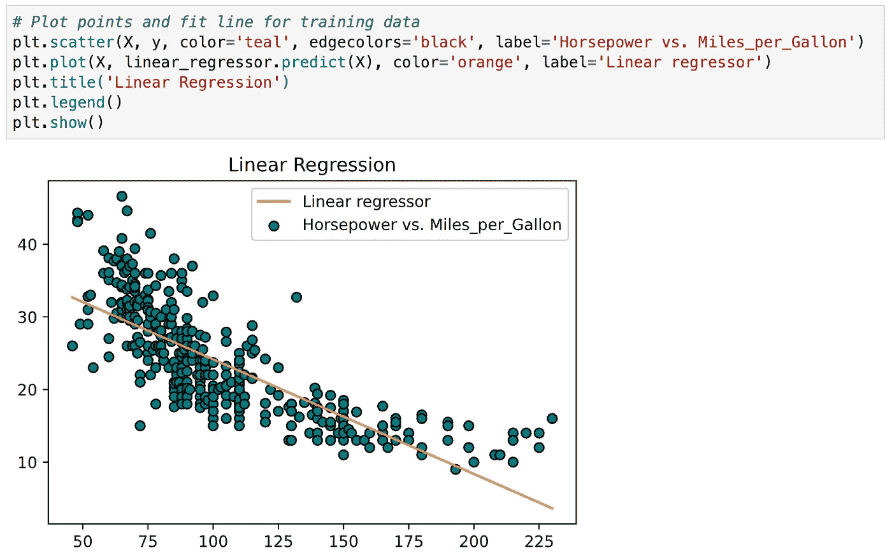
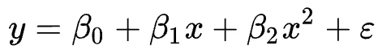
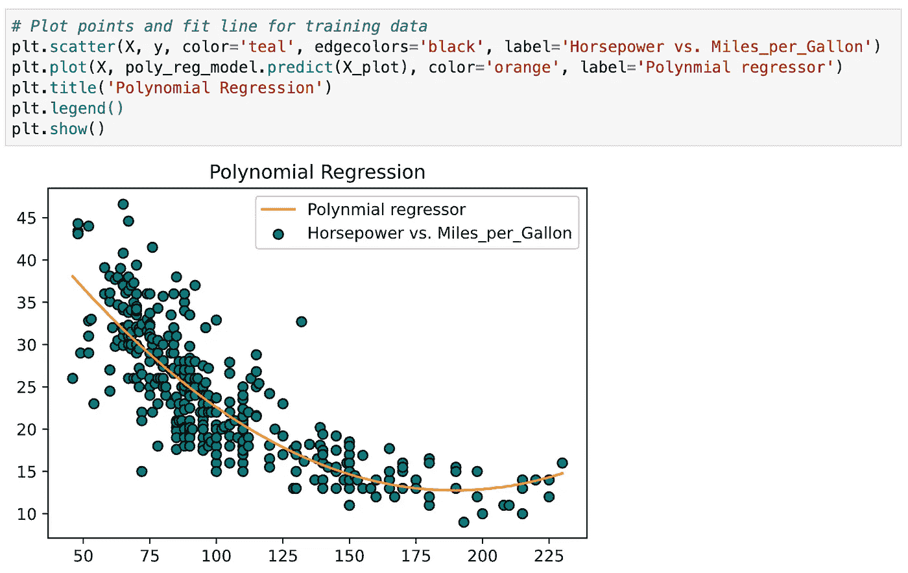
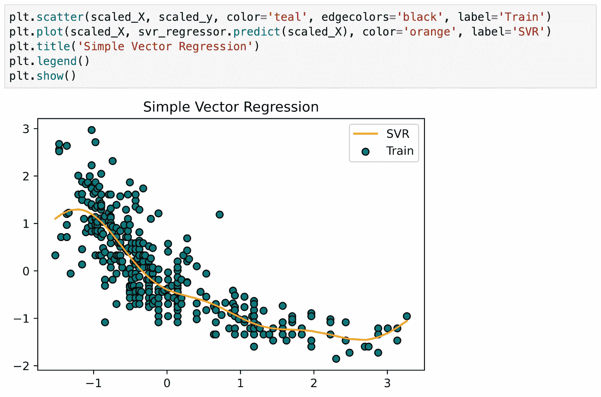
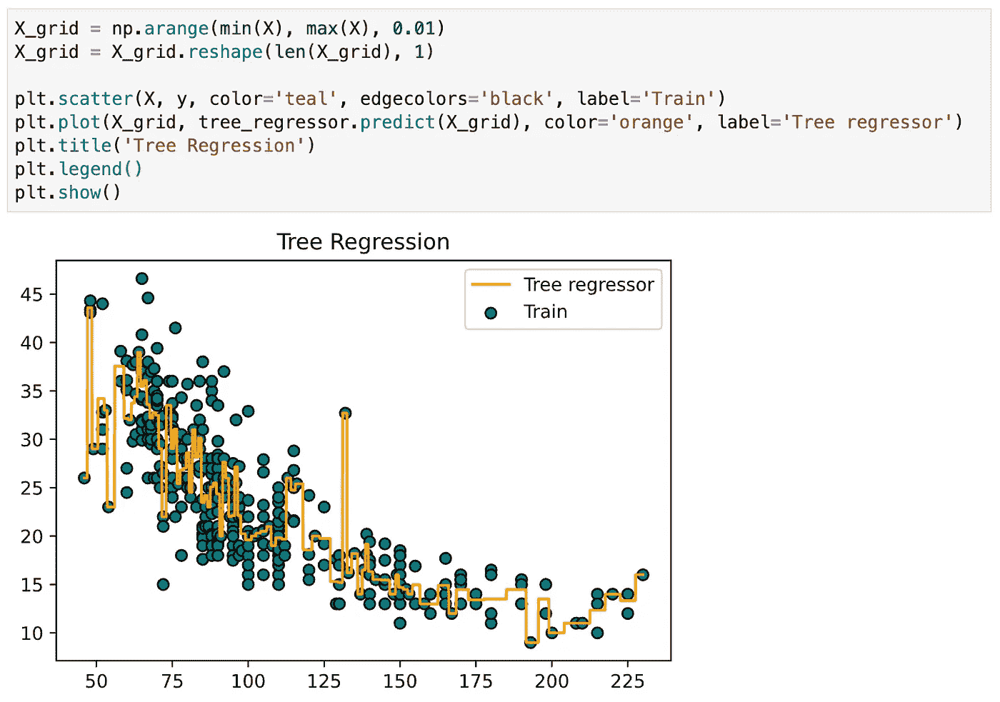
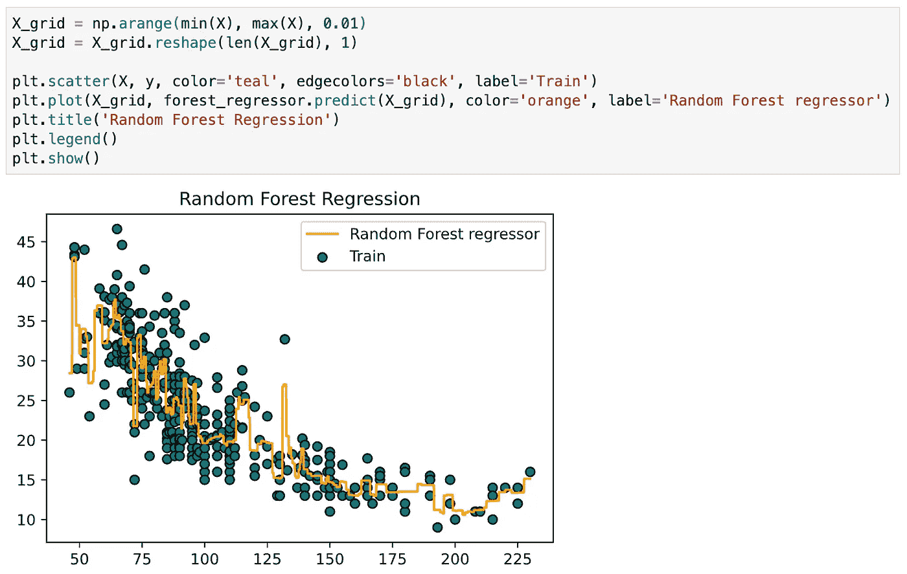
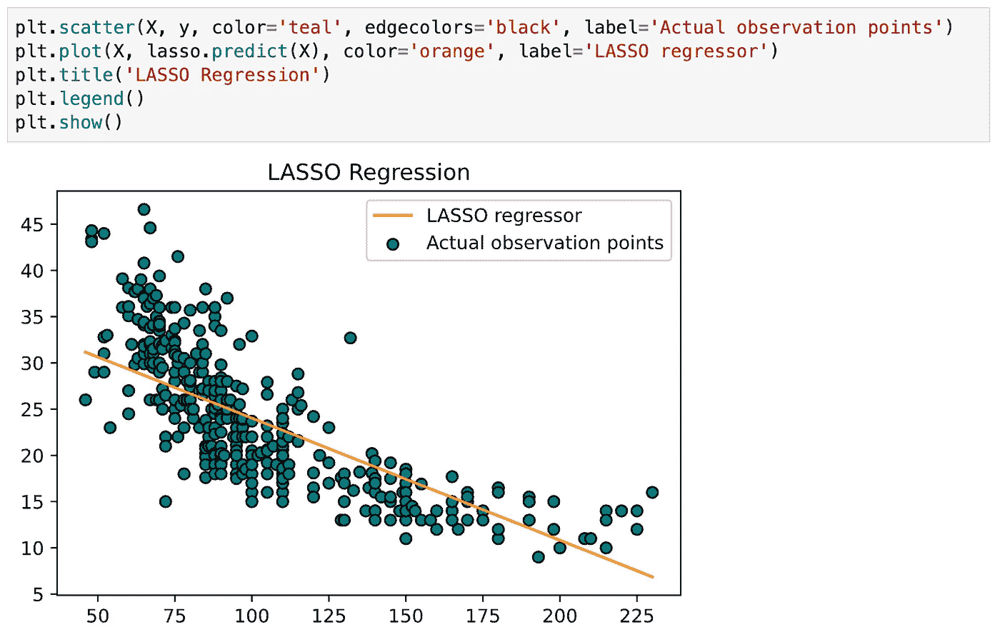
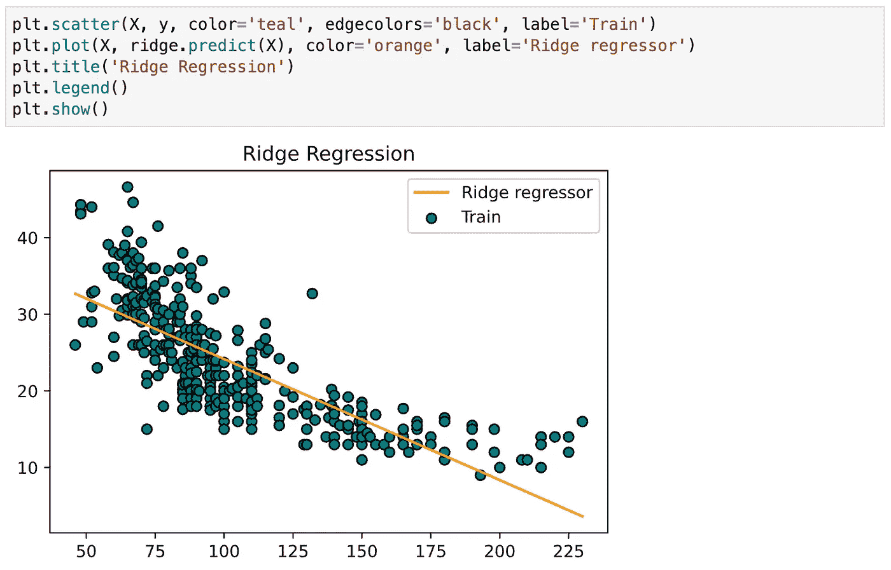
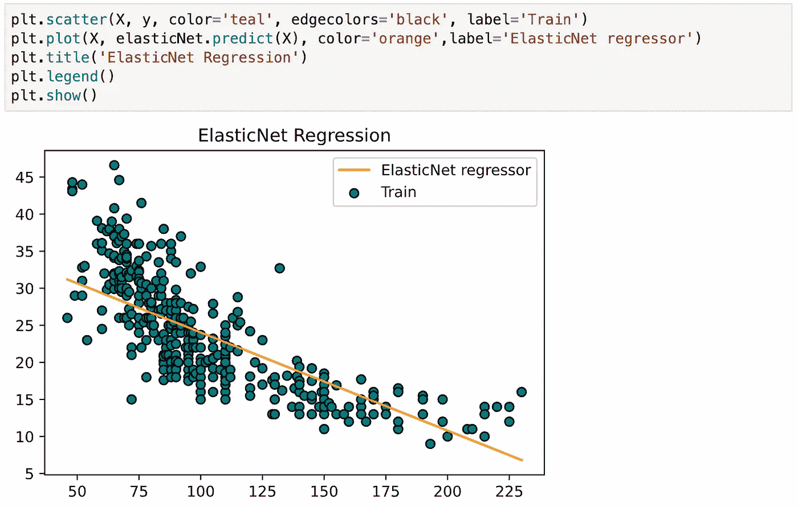
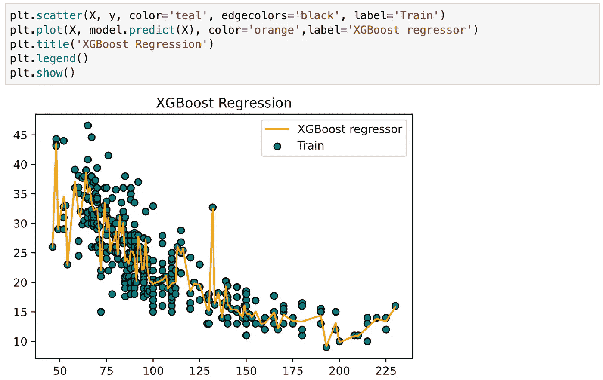

# 9 种回归算法的实用介绍

> 原文：<https://towardsdatascience.com/a-practical-introduction-to-9-regression-algorithms-389057f86eb9?source=collection_archive---------6----------------------->

## 有效使用不同回归算法的实践教程


由[杰森·库德里特](https://unsplash.com/@jcoudriet?utm_source=unsplash&utm_medium=referral&utm_content=creditCopyText)在 [Unsplash](https://unsplash.com/s/photos/graph?utm_source=unsplash&utm_medium=referral&utm_content=creditCopyText) 上拍摄的照片

线性回归通常是人们学习机器学习和数据科学的第一个算法。它简单易懂，但是，由于其功能有限，它不太可能是真实世界数据的最佳选择。最常见的是，线性回归被用作基线模型来评估和比较研究中的新方法。

在处理现实问题时，您应该知道并尝试许多其他回归算法。在本文中，您将通过使用 [Scikit-learn](https://scikit-learn.org/stable/) 和 XGBoost 的实践来学习 9 种流行的回归算法。这篇文章的结构如下:

1.  线性回归
2.  多项式回归
3.  简单向量回归
4.  决策树回归
5.  随机森林回归
6.  套索回归
7.  里脊回归
8.  弹性网络回归
9.  XGBoost 回归

> 请查看[笔记本](https://github.com/BindiChen/machine-learning/blob/master/traditional-machine-learning/001-regression-algorithms/regression-algorithms.ipynb)获取源代码。更多教程可从 [Github Repo](https://github.com/BindiChen/machine-learning) 获得。

# 1.线性回归

**线性回归**通常是人们学习机器学习和数据科学的第一个算法。线性回归是一种线性模型，假设输入变量(`X`)和单个输出变量(`y`)之间存在线性关系。一般来说，有两种情况:

*   **单变量线性回归**:模拟**一个** **单输入变量**(单特征变量)和**一个单输出变量**之间的关系。
*   **多元线性回归**(也称**多元线性回归**):模拟**多输入变量**(多特征变量)和**单输出变量**之间的关系。

这种算法非常常见，以至于 [Scikit-learn](https://scikit-learn.org/stable/) 在`LinearRegression()`中内置了这种功能。让我们创建一个`LinearRegression`对象，并使其适合训练数据:

```
from sklearn.linear_model import LinearRegression# Creating and Training the Model
linear_regressor = **LinearRegression()**
linear_regressor**.fit(X, y)**
```

一旦训练完成，我们可以检查`LinearRegression`在`coef_`属性中找到的系数参数:

```
linear_regressor.**coef_**array([[-0.15784473]])
```

现在，用这个模型为训练数据拟合一条线



sci kit-学习线性回归(图片由作者提供)

关于线性回归的几个要点:

*   快速且易于建模
*   当要建模的关系不是非常复杂，并且您没有大量数据时，这尤其有用。
*   非常直观的理解和解读。
*   它对异常值非常敏感。

# 2.多项式回归

**多项式回归**是我们想要为非线性可分数据创建模型时最流行的选择之一。这就像线性回归，但使用变量`X`和`y`之间的关系来找到绘制符合数据点的曲线的最佳方式。

对于多项式回归，一些自变量的幂大于 1。例如，我们可以提出如下的二次模型:



二次模型(作者图片)

*   `β_0`、`β_1`和`β_2`是系数
*   `x`是一个变量/特征
*   `ε`是偏见

[Scikit-learn](https://scikit-learn.org/stable/) 在`PolynomialFeatures`中内置了这个方法。首先，我们需要生成一个由指定次数的所有多项式特征组成的特征矩阵:

```
from sklearn.preprocessing import PolynomialFeatures# We are simply generating the matrix for a quadratic model
poly_reg = PolynomialFeatures(**degree = 2**)
**X_poly** = **poly_reg.fit_transform(X)**
```

接下来，让我们创建一个`LinearRegression`对象，并将其与我们刚刚生成的特征矩阵`X_poly`相匹配。

```
# polynomial regression model
poly_reg_model = LinearRegression()
poly_reg_model.fit(**X_poly**, y)
```

现在采用该模型，并为训练数据`X_plot`拟合一条线，如下所示:



多项式回归(作者图片)

关于多项式回归的几个要点:

*   能够对非线性可分离数据建模；线性回归做不到这一点。一般来说，它更加灵活，可以模拟一些相当复杂的关系。
*   完全控制特征变量的建模(设置哪个指数)。
*   需要精心设计。需要一些数据知识，以便选择最佳指数。
*   如果指数选择不当，容易过度拟合。

# 3.支持向量回归

支持向量机在分类问题中是众所周知的。在回归中使用 SVM 被称为**支持向量回归** (SVR)。 [Scikit-learn](https://scikit-learn.org/stable/) 在`SVR()`中内置了这个方法。

在拟合 SVR 模型之前，通常的最佳实践是执行特征缩放，以便每个特征具有相似的重要性。首先，让我们用`StandardScaler()`进行特征缩放:

```
from sklearn.svm import SVR
from sklearn.preprocessing import StandardScaler# Performing feature scaling
scaled_X = StandardScaler()
scaled_y = StandardScaler()scaled_X = scaled_X.fit_transform(X)
scaled_y = scaled_y.fit_transform(y)
```

接下来，我们创建一个`SVR`对象，将**内核**设置为`'rbf'`，将**伽玛**设置为`'auto'`。在这之后，我们调用`fit()`来使其符合缩放的训练数据:

```
svr_regressor = SVR(**kernel='rbf'**, **gamma='auto'**)
svr_regressor.fit(**scaled_X, scaled_y**.ravel())
```

现在采用该模型，并为训练数据`scaled_X`拟合一条线，如下所示:



支持向量回归(图片由作者提供)

关于支持向量回归的几个要点

*   它对异常值是鲁棒的，并且在高维空间中是有效的
*   它具有出色的泛化能力(能够恰当地适应新的、以前看不见的数据)
*   如果特征的数量远大于样本的数量，则容易过度拟合

# 4.决策树回归

**决策树(DTs)** 是一种用于分类和回归的非参数监督学习方法[1]。目标是创建一个模型，通过学习从数据特征推断的简单决策规则来预测目标变量的值。一棵树可以被看作是一个分段常数近似。

决策树回归也很常见，以至于 [Scikit-learn](https://scikit-learn.org/stable/) 内置了`DecisionTreeRegressor`。无需特征缩放即可创建`DecisionTreeRegressor`对象，如下所示:

```
from sklearn.tree import DecisionTreeRegressortree_regressor = DecisionTreeRegressor(random_state = 0)
tree_regressor.**fit(X, y)**
```

现在采用该模型，并使其符合训练数据:



决策树回归(图片作者提供)

关于决策树的几个要点:

*   易于理解和解释。树木可以被可视化。
*   适用于分类值和连续值
*   使用 DT(即预测数据)的成本是用于训练树的数据点数量的对数
*   决策树的预测既不平滑也不连续(显示为分段常数近似，如上图所示)

# 5.随机森林回归

**基本上，随机森林回归**与决策树回归非常相似。它是一种元估计器，可以在数据集的各种子样本上拟合许多决策树，并使用平均来提高预测准确性和控制过度拟合。

随机森林回归器在回归中的表现不一定比决策树好(虽然它通常在分类中表现更好)，因为在树构造算法的本质中存在微妙的过拟合-欠拟合权衡。

随机森林回归非常普遍，以至于 [Scikit-learn](https://scikit-learn.org/stable/) 将它内置于`RandomForestRegressor`中。首先，我们需要创建一个具有指定数量估算器的`RandomForestRegressor`对象，如下所示:

```
from sklearn.ensemble import **RandomForestRegressor**forest_regressor = RandomForestRegressor(
    **n_estimators = 300**, 
    random_state = 0
)
forest_regressor.fit(X, y.ravel())
```

现在采用该模型，并使其符合训练数据:



随机森林回归(图片作者提供)

关于随机森林回归的几点:

*   减少决策树中的过度拟合并提高准确性
*   它也适用于分类值和连续值
*   需要大量的计算能力和资源，因为它适合多个决策树来组合它们的输出

# 6.套索回归

套索回归是使用收缩的线性回归的变体。收缩是数据值向中心点收缩为平均值的过程。这种类型的回归非常适合显示高度多重共线性(要素之间的高度相关性)的模型。

Scikit-learn 内置了`LassoCV`。

```
from sklearn.linear_model import LassoCVlasso = LassoCV()
lasso.fit(X, y.ravel())
```

现在采用该模型，并使其符合训练数据:



拉索回归(图片由作者提供)

关于拉索回归的几点:

*   它最常用于消除自动化变量和选择特性。
*   它非常适合显示高度多重共线性(要素之间的高度相关性)的模型。
*   套索回归利用 L1 正则化
*   LASSO 回归被认为比 Ridge 更好，因为它只选择一些要素，而将其他要素的系数降低到零。

# 7.里脊回归

岭回归与套索回归非常相似，因为两种技术都使用收缩。岭回归和套索回归都非常适合显示高度多重共线性(要素之间的高度相关性)的模型。它们之间的主要区别是 Ridge 使用 L2 正则化，这意味着没有一个系数会像 LASSO 回归中那样变为零(而是接近零)。

[Scikit-learn](https://scikit-learn.org/stable/) 内置了`RidgeCV`。

```
from sklearn.linear_model import RidgeCVridge = RidgeCV()
ridge.fit(X, y)
```

现在采用该模型，并使其符合训练数据:



岭回归(图片作者提供)

关于岭回归的几点:

*   它非常适合显示高度多重共线性(要素之间的高度相关性)的模型。
*   岭回归使用 L2 正则化。贡献较小的特征将具有接近零的系数。
*   由于 L2 正则化的性质，岭回归被认为比拉索差

# 8.弹性网络回归

**ElasticNet** 是另一个用 L1 和 L2 正则化训练的线性回归模型。它是套索和岭回归技术的混合，因此也非常适合显示严重多重共线性(要素之间的严重相关性)的模型。

在套索和脊之间进行权衡的一个实际优势是，它允许弹性网在旋转下继承脊的一些稳定性[2]。

[Scikit-learn](https://scikit-learn.org/stable/) 内置了`ElasticNetCV`。

```
from sklearn.linear_model import ElasticNetCV
elasticNet = ElasticNetCV()
elasticNet.fit(X, y.ravel())
```

现在采用该模型，并使其符合训练数据:



ElasticNet 回归(图片由作者提供)

关于 ElasticNet 回归的几个要点:

*   ElasticNet 总是优于 LASSO 和 Ridge，因为它解决了这两种算法的缺点
*   ElasticNet 带来了确定最优解的两个 lambda 值的额外开销。

# 9.XGBoost 回归

**极限梯度提升** ( **XGBoost** )是梯度提升算法的一种高效且有效的实现。**梯度提升**是指一类集成机器学习算法，可用于分类或回归问题。

**XGBoost** 是一个开源库，最初由[陈天琦](https://www.linkedin.com/in/tianqi-chen-679a9856/)在他 2016 年题为“ [XGBoost:一个可扩展的树增强系统](https://arxiv.org/abs/1603.02754)”的论文中开发。该算法被设计成计算效率高且高效。

如果尚未安装 XGBoost 库，第一步是安装它。

```
pip install xgboost
```

XGBoost 模型可以通过创建一个`XGBRegressor`的实例来定义:

```
from xgboost import XGBRegressor
# create an xgboost regression model
model = **XGBRegressor(
    n_estimators=1000, 
    max_depth=7, 
    eta=0.1, 
    subsample=0.7, 
    colsample_bytree=0.8,
)**model.fit(X, y)
```

*   `**n_estimators**`:集合中的树的数量，经常增加直到看不到进一步的改进。
*   `**max_depth**`:每棵树的最大深度，通常取值在 1 到 10 之间。
*   `**eta**`:用于加权每个模型的学习率，通常设置为 0.3、0.1、0.01 或更小的小值。
*   `**subsample**`:每棵树使用的样本数，设置为 0-1 之间的值，通常为 1.0 表示使用所有样本。
*   `**colsample_bytree**`:每个树中使用的特征(列)的数量，设置为 0 到 1 之间的值，通常为 1.0 以使用所有特征。

现在采用该模型，并使其符合训练数据:



XGBoost 回归(图片由作者提供)

关于 XGBoost 的几点:

*   XGBoost 在稀疏和非结构化数据上表现不佳。
*   该算法被设计为计算效率高且高效，但是对于大数据集来说，训练时间仍然相当长
*   它对异常值很敏感

# 结论

在本文中，我们通过使用 [Scikit-learn](https://scikit-learn.org/stable/) 和 XGBoost 的实践，介绍了 9 种流行的回归算法。在您的工具箱中拥有它们是很好的，这样您就可以尝试不同的算法，并为现实世界的问题找到最佳的回归模型。

我希望你喜欢这篇文章，并学到一些新的有用的东西。

感谢阅读。请查看[笔记本](https://github.com/BindiChen/machine-learning/blob/master/traditional-machine-learning/001-regression-algorithms/regression-algorithms.ipynb)获取源代码，如果你对机器学习的实用方面感兴趣，请继续关注。更多教程可从 [Github Repo](https://github.com/BindiChen/machine-learning) 获得。

**参考文献:**

*   [1]sci kit-学习决策树文档:[https://scikit-learn.org/stable/modules/tree.html#tree](https://scikit-learn.org/stable/modules/tree.html#tree)
*   [2] Scikit-Learn ElasticNet 文档:[https://sci kit-Learn . org/stable/modules/linear _ model . html # elastic-net](https://scikit-learn.org/stable/modules/linear_model.html#elastic-net)