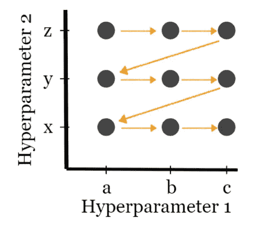
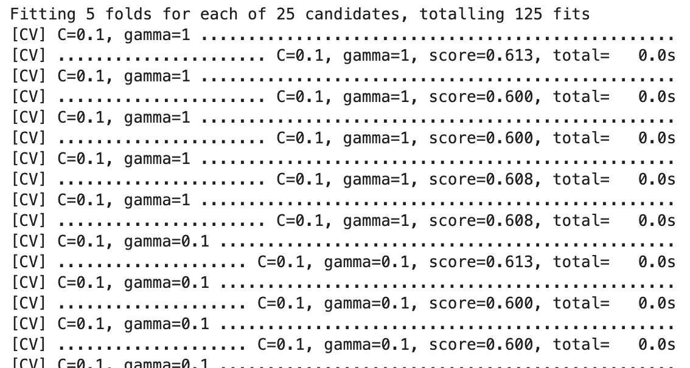
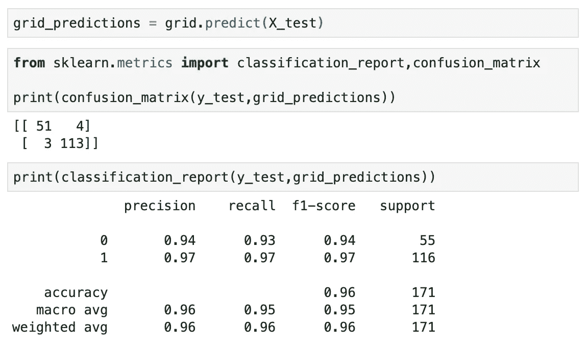
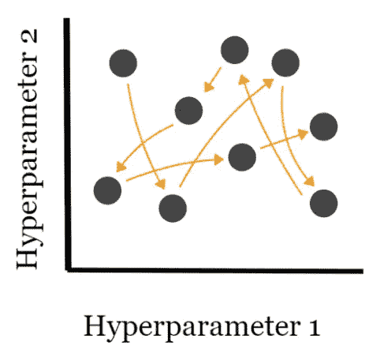
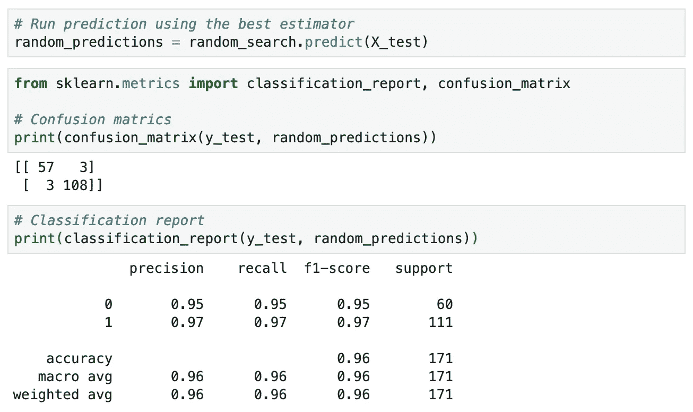
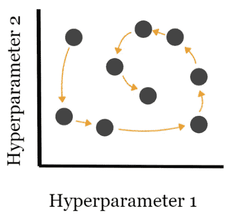
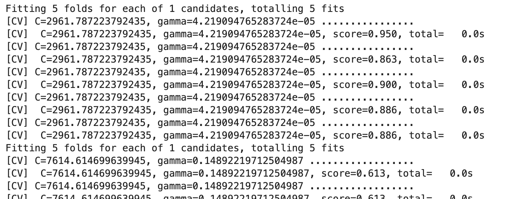
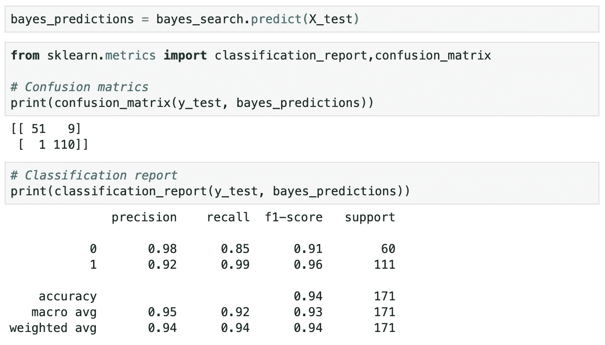

# 网格搜索、随机搜索和贝叶斯搜索的实用介绍

> 原文：<https://towardsdatascience.com/a-practical-introduction-to-grid-search-random-search-and-bayes-search-d5580b1d941d?source=collection_archive---------10----------------------->

## 在机器学习中有效使用超参数调整的实践教程


由[路易斯·汉瑟](https://unsplash.com/@louishansel?utm_source=unsplash&utm_medium=referral&utm_content=creditCopyText)在 [Unsplash](https://unsplash.com/s/photos/adjust?utm_source=unsplash&utm_medium=referral&utm_content=creditCopyText) 上拍摄的照片

在机器学习中，超参数是指无法从数据中学习到，需要在训练前提供的参数。机器学习模型的性能在很大程度上依赖于找到最优的超参数集。

超参数调整基本上是指调整模型的超参数，这基本上是一个长度过程。在本文中，您将学习 3 种最流行的超参数调优技术:**网格搜索**、**随机搜索**和**贝叶斯搜索**。这篇文章的结构如下:

1.  获取和准备数据
2.  网格搜索
3.  随机搜索
4.  贝叶斯搜索
5.  结论

> 请查看[笔记本](https://github.com/BindiChen/machine-learning/blob/master/traditional-machine-learning/005-grid-search-vs-random-search-vs-bayes-search/gridsearch-vs-randomsearch-vs-bayessearch.ipynb)获取源代码。更多教程可以从 [Github Repo](https://github.com/BindiChen/machine-learning) 获得。

# 1.获取和准备数据

为了进行演示，我们将使用来自 [Scikit Learn](https://scikit-learn.org/stable/) 的内置乳腺癌数据来训练一个**支持向量分类器** (SVC)。我们可以用`load_breast_cancer`函数得到数据:

```
from sklearn.datasets import **load_breast_cancer****cancer = load_breast_cancer()**
```

接下来，让我们为特性和目标标签创建`df_X`和`df_y`，如下所示:

```
# Features
df_X = pd.DataFrame(cancer['data'], columns=cancer['feature_names'])# Target label
df_y = pd.DataFrame(cancer['target'], columns=['Cancer'])
```

另外，如果你想了解更多关于数据集的信息，你可以运行`print(cancer['DESCR'])`来打印出概要和特性信息。

之后，让我们使用`training_test_split()`将数据集分成训练集(70%)和测试集(30%):

```
# Train test split
from sklearn.model_selection import train_test_split
import numpy as npX_train, X_test, y_train, y_test = train_test_split(df_X, np.ravel(df_y), test_size=0.3)
```

我们将训练一个**支持向量分类器** (SVC)模型。正则化参数`C`和核系数`gamma`是 SVC 中两个最重要的超参数:

*   正则化参数`C`决定正则化的强度。
*   内核系数`gamma`控制内核的宽度。SVC 默认使用**径向基函数(RBF)** 核(也称为**高斯核**)。

我们将在下面的教程中调整这两个参数。

# 2.网格搜索

很难找到`C`和`gamma`的最佳值。最简单的解决方案是尝试多种组合，看看哪种效果最好。这种创建参数“网格”并尝试所有可能组合的想法被称为**网格搜索。**



网格搜索——尝试所有可能的组合(图片由作者提供)

这种方法很常见，Scikit-learn 在`GridSearchCV`中内置了这种功能。CV 代表交叉验证，这是另一种评估和改进我们的机器学习模型的技术。

`GridSearchCV`采用描述应该尝试的参数的字典和要训练的模型。参数网格被定义为一个字典，其中键是参数，值是要测试的设置。让我们首先定义我们的候选人`C`和`gamma`如下:

```
param_grid = { 
  'C': [0.1, 1, 10, 100, 1000], 
  'gamma': [1, 0.1, 0.01, 0.001, 0.0001]
}
```

接下来，让我们创建一个`GridSearchCV`对象，并使其适合训练数据。

```
from sklearn.model_selection import GridSearchCV
from sklearn.svm import SVCgrid = **GridSearchCV(SVC(), param_grid, refit=True, verbose=3)**
grid.**fit(X_train,y_train)**
```



作者图片

一旦训练完成，我们可以检查`GridSearchCV`在`best_params_`属性中找到的最佳参数，以及`best_estimator_`属性中的最佳估计器:

```
# Find the best paramters
>>> **grid.best_params_**{'C': 1, 'gamma': 0.0001}# Find the best estimator
>>> **grid.best_estimator_**SVC(C=1, gamma=0.0001)
```

现在，利用这个网格模型，使用测试集创建一些预测，并为它们创建分类报告和混淆矩阵。



# 3.随机搜索

网格搜索尝试超参数的所有组合，因此增加了计算的时间复杂度，并且可能导致不可行的计算成本。提供了一个更便宜的选择，**随机搜索**只测试你选择的元组。超参数值的选择是完全随机的。



随机搜索尝试随机组合(作者图片)

这种方法也很常见，Scikit-learn 在`RandomizedSearchCV`中内置了这种功能。函数 API 和`GridSearchCV`很像。

首先，让我们指定参数`C` & `gamma`和样本分布如下:

```
import scipy.stats as stats
from sklearn.utils.fixes import loguniform# Specify parameters and distributions to sample from
param_dist = {
  'C': **stats.uniform(0.1, 1e4)**,
  'gamma': **loguniform(1e-6, 1e+1)**,
}
```

接下来，让我们用参数`n_iter_search`创建一个`RandomizedSearchCV`对象，并使其适合训练数据。

```
**n_iter_search = 20**
random_search = **RandomizedSearchCV**(
    SVC(), 
    param_distributions=param_dist,
    **n_iter=n_iter_search,** 
    refit=True,
    verbose=3
)
**random_search.fit(X_train, y_train)**
```


RandomizedSearchCV fit()输出示例(图片由作者提供)

类似地，一旦训练完成，我们可以检查由`best_params_`属性中的`RandomizedSearchCV`找到的最佳参数，以及在`best_estimator_`属性中的最佳估计器:

```
>>> **random_search.best_params_**{'C': 559.3412579902997, 'gamma': 0.00022332416796205752}>>> **random_search.best_estimator_**SVC(C=559.3412579902997, gamma=0.00022332416796205752)
```

最后，我们采用随机搜索模型，使用测试集创建一些预测，并为它们创建分类报告和混淆矩阵。



预测随机搜索并创建报告(图片由作者提供)

# 4.贝叶斯搜索

贝叶斯搜索使用贝叶斯优化技术来模拟搜索空间，以尽快达到优化的参数值。它利用搜索空间的结构来优化搜索时间。贝叶斯搜索方法使用过去的评估结果对最有可能给出更好结果的新候选人进行采样(如下图所示)。



贝叶斯搜索(作者图片)

[Scikit-Optimize](https://pypi.org/project/scikit-optimize/) 库附带 BayesSearchCV 实现。

首先，让我们如下指定参数`C` & `gamma`和样本分布:

```
from skopt import BayesSearchCV
# parameter ranges are specified by one of below
from skopt.space import Real, Categorical, Integersearch_spaces = {
  'C': **Real(0.1, 1e+4)**,
  'gamma': **Real(1e-6, 1e+1, 'log-uniform')**,
}
```

接下来，让我们用参数`n_iter_search`创建一个`BayesSearchCV`对象，并使其适合训练数据。

```
n_iter_search = 20
bayes_search = BayesSearchCV(
    SVC(), 
    search_spaces, 
    n_iter=n_iter_search, 
    cv=5,
    verbose=3
)
bayes_search.fit(X_train, y_train)
```



作者图片

类似地，一旦训练完成，我们可以检查`BayesSearchCV`在`best_params_`属性中找到的最佳参数，以及`best_estimator_`属性中的最佳估计器:

```
>>> **bayes_search.best_params_**OrderedDict([('C', 0.25624177419852506), ('gamma', 0.00016576008531229226)])>>> **bayes_search.best_estimator_**SVC(C=0.25624177419852506, gamma=0.00016576008531229226)
```

最后，我们采用贝叶斯搜索模型，使用测试集创建一些预测，并为它们创建分类报告和混淆矩阵。



作者图片

# 5.结论

在本文中，我们讨论了 3 种最流行的超参数优化技术，这些技术用于获得优化的超参数集，从而训练一个健壮的机器学习模型。

一般来说，如果组合的数量足够有限，我们可以使用**网格搜索**技术。但是当组合的数量增加时，我们应该尝试**随机搜索**或**贝叶斯搜索**，因为它们计算量不大。

希望这篇文章能帮助你节省学习机器学习的时间。我建议你去看看他们的 APIs，2]并了解你可以做的其他事情。

感谢阅读。请查看[笔记本](https://github.com/BindiChen/machine-learning/blob/master/traditional-machine-learning/005-grid-search-vs-random-search-vs-bayes-search/gridsearch-vs-randomsearch-vs-bayessearch.ipynb)获取源代码，如果您对机器学习的实用方面感兴趣，请继续关注。

**参考文献:**

*   [1]sci kit-Learn docs:[https://sci kit-Learn . org/stable/auto _ examples/model _ selection/plot _ randomized _ search . html](https://scikit-learn.org/stable/auto_examples/model_selection/plot_randomized_search.html)
*   [2]sci kit-Optimize docs:[https://sci kit-Optimize . github . io/stable/modules/generated/skopt。BayesSearchCV.html](https://scikit-optimize.github.io/stable/modules/generated/skopt.BayesSearchCV.html)