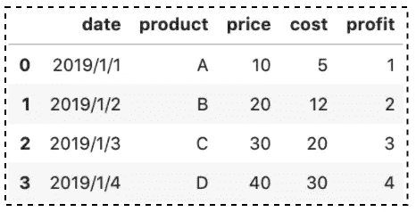

# 熊猫系列实用介绍

> 原文：<https://towardsdatascience.com/a-practical-introduction-to-pandas-series-9915521cdc69?source=collection_archive---------8----------------------->

## 你所需要知道的熊猫系列——数据框架的基本构件。


熊猫系列实用介绍(作者使用[canva.com](https://www.canva.com/)图片)

**数据帧**和**系列**是 Pandas 中的两个核心数据结构。 **DataFrame** 是带有行和列的二维标签数据。它就像一个电子表格或 SQL 表。**系列**是一维标签数组。这有点像 Python 列表的更强大版本。理解序列非常重要，不仅因为它是核心数据结构之一，还因为它是数据帧的构建块。

在本文中，您将学习 Pandas **系列**最常用的数据操作，并且应该可以帮助您开始使用 Pandas。这篇文章的结构如下:

1.  创建系列
2.  检索元素
3.  属性(常用)
4.  方法(常用)
5.  使用 Python 内置函数

源代码请查看[笔记本](https://github.com/BindiChen/machine-learning/blob/master/data-analysis/029-pandas-series/intro-to-pands-series.ipynb)。

# 1.创建系列

## 1.1 来自 Python 列表

Python 列表可以传递给 Pandas `Series()`函数来创建一个系列。

```
companies = ['Google', 'Microsoft', 'Facebook', 'Apple']pd.Series(companies)0       Google
1    Microsoft
2     Facebook
3        Apple
dtype: **object**
```

注意事项:

*   所有值的显示顺序与它们在原始 Python 列表中的显示顺序完全相同。
*   `dtype`表示**对象**(是**字符串**的内部熊猫行话)。
*   还有一个额外的列叫做**索引**。在这种情况下，它类似于 Python 列表中的索引。但是 Pandas 系列的一个主要优点是索引标签不必是数字，它们可以是任何数据类型。

我们可以使用参数`index`来指定一个自定义索引:

```
# Pass number
pd.Series(companies,**index=[100,101,102,103]**)**100**       Google
**101**    Microsoft
**102**     Facebook
**103**        Apple
dtype: object # Pass string
pd.Series(companies,**index=['GOOGL','MSFT','FB','AAPL']**)
**GOOGL**       Google
**MSFT**     Microsoft
**FB**        Facebook
**AAPL**         Apple
dtype: object
```

## 1.2 来自字典

一个字典可以传递给熊猫`Series()`函数。如果没有指定`index`,字典键将按照排序的顺序构造索引。

```
companies = {
 **'a': 'Google',
    'b': 'Microsoft',
    'c': 'Facebook',
    'd': 'Apple'**
}
pd.Series(companies)**a       Google
b    Microsoft
c     Facebook
d        Apple**
dtype: object
```

如果指定了`index`，则`index`中标签对应的数据中的值将被取出。

```
pd.Series(
    companies, 
    **index=['a', 'b', 'd']**
)**a**       Google
**b**    Microsoft
**d**        Apple
dtype: object
```

## 1.3 从标量

如果输入是标量值，那么必须提供参数`index`。该值将被重复以匹配`index`的长度:

```
pd.Series(**10**, index=[100, 101, 102, 103])100    10
101    10
102    10
103    10
dtype: int64
```

## 1.4 来自熊猫的`read_csv()`功能

默认情况下，Pandas `read_csv()`函数将数据作为**数据帧**导入。它将整个数据集加载到内存中，当导入一个巨大的 CSV 文件时，这可能是一个内存和性能问题。

```
pd.read_csv('data.csv')
```



`pd.read_csv(‘data.csv’)`结果(图片由作者提供)

如果我们想将数据导入到**系列**中，而不是**数据帧**，我们可以提供额外的参数`usecols`和`squeeze`。`squeeze=True`将一列的数据帧转换成一个序列。

```
pd.read_csv('data.csv', **usecols=['product']**, **squeeze=True**)0    A
1    B
2    C
3    D
Name: product, dtype: object
```

请看看下面这篇关于熊猫的文章`read_csv()`

</all-the-pandas-read-csv-you-should-know-to-speed-up-your-data-analysis-1e16fe1039f3>  

# 2.检索元素

## 2.1 带位置

传递索引以检索元素，例如，第一个元素。

```
s = pd.Series([1,2,3,4,5],index = ['a','b','c','d','e'])s[**0**]
1
```

检索第一个`*n*`元素，例如，前 3 个元素

```
s[**:3**]a    1
b    2
c    3
dtype: int64
```

检索最后一个`n`元素。

```
s[**-3:**]c    3
d    4
e    5
dtype: int64
```

检索某个范围内的元素

```
s[**2:4**]c    3
d    4
dtype: int64
```

逐步检索元素

```
s[**::2**]a    1
c    3
e    5
dtype: int64
```

## 2.2 带索引标签

熊猫**系列**是一个一维标签数组，我们可以通过索引标签访问元素。

使用索引标签检索单个元素。

```
s = pd.Series([1,2,3,4,5],index = ['a','b','c','d','e'])s[**'a'**]
1
```

使用索引标签列表检索多个元素。

```
s[**['a','c','d']**]a    1
c    3
d    4
dtype: int64
```

# 3.属性

Python 中的对象有**属性**和**方法**。属性是一种我们可以用来查找信息的方式，而不需要操作或破坏任何东西。**方法**实际上对对象做了些什么。它可能是操纵它，或者添加值，或者用对象的值做一些计算。

熊猫**系列**只是 Python 对象的一种类型。在这一节中，我们将介绍熊猫系列中一些常用的属性。

我们先来创作一个熊猫系列。

```
companies = ['Google', 'Microsoft', 'Facebook', 'Apple']
s = pd.Series(companies)
```

## 3.1 值和索引

属性返回序列中所有值的数组。

```
s.**values**array(['Google', 'Microsoft', 'Facebook', 'Apple'], dtype=object)
```

属性返回一个`RangeIndex`对象。我们可以看到它从 0 开始，到 4 结束。最后一部分叫做步长，它告诉我们它的增量是 1

```
s.**index**RangeIndex(start=0, stop=4, step=1)
```

`**is_unique**`属性返回一个布尔值(`True`或`False`)。这是检查每个序列值是否唯一的一种非常方便的方法。

```
s.**is_unique**True
```

## **3.2 数据类型和大小**

`**dtype**`属性返回数据类型。它给了我们`'O'`，它是 object 的缩写。

```
s.**dtype**dtype('O')
```

`**size**`属性返回一个系列中的项目数。

```
s.**size**4
```

`**shape**`属性根据元组中的列数返回行数

```
s.**shape**(4,)
```

我们还有`**ndim**`属性，它是维数的缩写，一个序列总是一个一维对象

```
s.**ndim**1
```

# 4.方法

上面提到的方法实际上对对象做了一些事情。它可能是操纵它，或者添加值，或者用对象的值做一些计算。

## 4.1 显示行

`head()`和`tail()`方法分别返回第一行和最后一行`*n*`。`*n*`如果不给出任何值，默认为 5。它们对于快速验证数据很有用，例如在排序或追加行之后。

```
prices = [10, 5, 3, 2.5, 8, 11]
s = pd.Series(prices)s.**head()**0    10.0
1     5.0
2     3.0
3     2.5
4     8.0
dtype: float64s.**head(2)**0    10.0
1     5.0
dtype: float64s.**tail(2)**
4     8.0
5    11.0
dtype: float64
```

## 4.2 执行聚合

我们可以对`mean()`、`sum()`、`product()`、`max()`、`min()`、`median()`等系列进行聚合

```
s.**mean()**s.**sum()**s.**product()**
```

如果我们需要多个聚合，我们可以在一个列表中将它们传递给`agg()`方法

```
s.**agg(['mean','sum','product'])**mean           6.583333
sum           39.500000
product    33000.000000
dtype: float64
```

## 4.3 计数值

`unique()`和`nunique()`方法分别返回唯一值和唯一值的数量。

```
s = pd.Series(['a','b','b','a','a'])**s.unique()**
array(['a', 'b'], dtype=object)**s.nunique()**
2
```

`value_counts()`方法返回一个序列中每个唯一值出现的次数。了解数值分布的概况是很有用的。

```
**s.value_counts()**a    3
b    2
dtype: int64
```

## 4.4 按值或索引标签排序

`sort_values()`方法根据某种标准对一个系列进行升序或降序排序。

```
# ascending by default
s.sort_values()# To sort it in descenting order
s.sort_values(**ascending=False**)# To modify the original series
s.sort_values(**inplace=True**)
```

`sort_index()`方法通过索引标签对序列进行排序。它类似于`sort_value()`。

```
# ascending by default
s.sort_index()# To sort it in descenting order
s.sort_index(**ascending=False**)# To modify the original series
s.sort_index(**inplace=True**)
```

## 4.5 处理缺失值

`isna()`方法返回一个相同大小的布尔对象，指示值是否丢失。

```
s = pd.Series([1, 2, 3, np.nan, np.nan])
**s.isna()**0    False
1    False
2    False
3     True
4     True
dtype: bool
```

我们可以通过用`sum()`方法链接结果来计算缺失值的数量。

```
**s.isna().sum()**
2
```

`count()`方法返回序列中非缺失值的个数。

```
s.count()
3
```

## 4.6 搜索值

`nlargest()`和`nsmallest()`方法返回序列中的最大值和最小值。默认情况下，如果您不给出任何值，它将显示 5 个结果。

```
s.**nlargest()**s.**nlargest(2)**
```

有一些逻辑运算符方法:

*   `gt()`:大于
*   `ge()`:大于等于
*   `eq()`:平等
*   `le()`:小于或等于
*   `lt()`:小于
*   `ne()`:不相等

它们分别相当于`>`、`>=`、`=`、`<=`、`<`和`!=`，但支持用`fill_value`替换缺失值。

```
s.le(5, **fill_value=0**) s <= 5
```

# 5.使用 Python 内置函数

`len()`和`type()`是针对大小和数据类型的 Python 内置函数。

```
**len(s)**
6**type(s)**
pandas.core.series.Series
```

`dir()`目录的简称。如果我们向它传递一个序列，它会给出所有可用属性和方法的输出。

```
**dir(s)**['T',
 '_AXIS_LEN',
 '_AXIS_NAMES',
 '_AXIS_NUMBERS',
 '_AXIS_ORDERS',
 '_AXIS_REVERSED',
 '_AXIS_TO_AXIS_NUMBER',
 '_HANDLED_TYPES',
 '__abs__',
 ....]
```

要浓缩一个系列，我们可以使用内置的`list()`函数。我们传递一个列表给`Series()`，这是一种完全相反的操作。

```
**list(s)**[10.0, 5.0, 3.0, 2.5, 8.0, 11.0]
```

类似地，`dict()`是我们向`Series()`传递字典时的反向操作

```
**dict(s)**{0: 10.0, 1: 5.0, 2: 3.0, 3: 2.5, 4: 8.0, 5: 11.0}
```

Python `in`关键字返回一个布尔值，将您提供的值与列表中的值进行比较。如果它存在于这些值中，它将返回`True`，如果不存在，它将返回`False`。

```
2.5 **in s**False
```

`2.5 in s`返回`False`，因为默认情况下，Pandas 将在索引标签中查找，而不是在序列中查找实际值。只需确保添加额外的`values`属性:

```
2.5 **in s.values**True
```

# 结论

Pandas 系列是 Pandas 中的核心数据结构，也是数据框架的基本构件。本文从 5 个方面介绍了 Pandas 系列常用的数据操作。

我希望这篇文章能帮助你节省学习熊猫的时间。当然，熊猫系列有更多的属性和方法可以使用。我建议你查看一下 API 文档并了解你可以做的其他事情。

感谢阅读。请查看[笔记本](https://github.com/BindiChen/machine-learning/blob/master/data-analysis/029-pandas-series/intro-to-pands-series.ipynb)获取源代码，如果您对机器学习的实用方面感兴趣，请继续关注。

## 你可能会对我的其他一些熊猫文章感兴趣:

*   [使用熊猫方法链接提高代码可读性](https://medium.com/@bindiatwork/using-pandas-method-chaining-to-improve-code-readability-d8517c5626ac)
*   [如何对熊猫数据帧进行自定义排序](/how-to-do-a-custom-sort-on-pandas-dataframe-ac18e7ea5320)
*   [何时使用 Pandas transform()函数](/when-to-use-pandas-transform-function-df8861aa0dcf)
*   [你应该知道的熊猫串联()招数](/pandas-concat-tricks-you-should-know-to-speed-up-your-data-analysis-cd3d4fdfe6dd)
*   [Pandas 中 apply()和 transform()的区别](https://medium.com/@bindiatwork/difference-between-apply-and-transform-in-pandas-242e5cf32705)
*   [所有熊猫合并()你应该知道](/all-the-pandas-merge-you-should-know-for-combining-datasets-526b9ecaf184)
*   [在 Pandas 数据帧中处理日期时间](/working-with-datetime-in-pandas-dataframe-663f7af6c587)
*   [熊猫阅读 _csv()你应该知道的招数](https://medium.com/@bindiatwork/all-the-pandas-read-csv-you-should-know-to-speed-up-your-data-analysis-1e16fe1039f3)
*   [用 Pandas read_csv()解析日期列应该知道的 4 个技巧](/4-tricks-you-should-know-to-parse-date-columns-with-pandas-read-csv-27355bb2ad0e)

更多教程可以在我的 [Github](https://github.com/BindiChen/machine-learning) 上找到