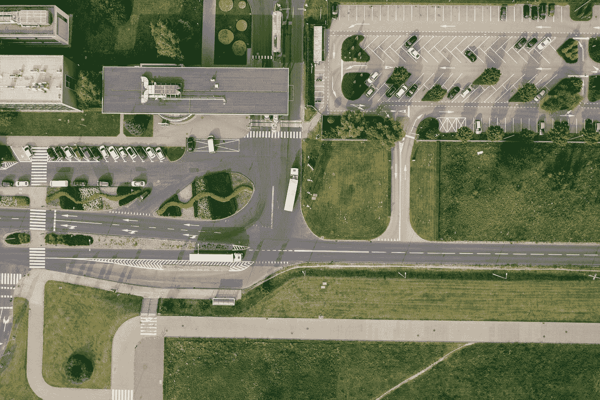
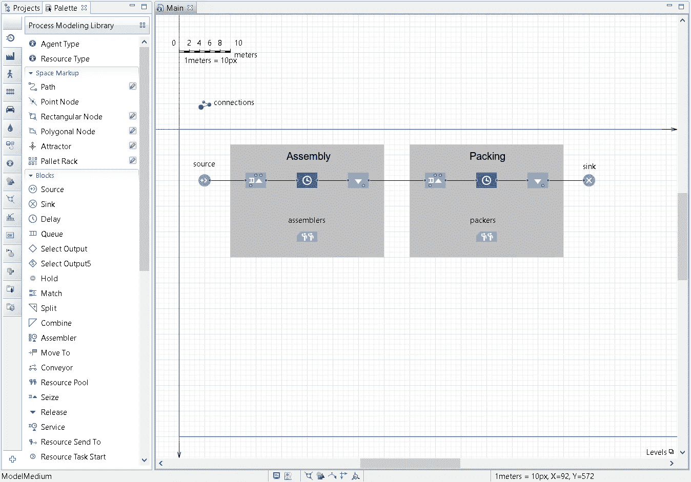
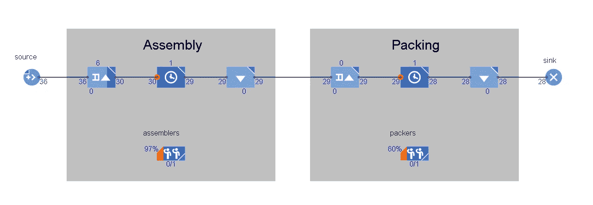
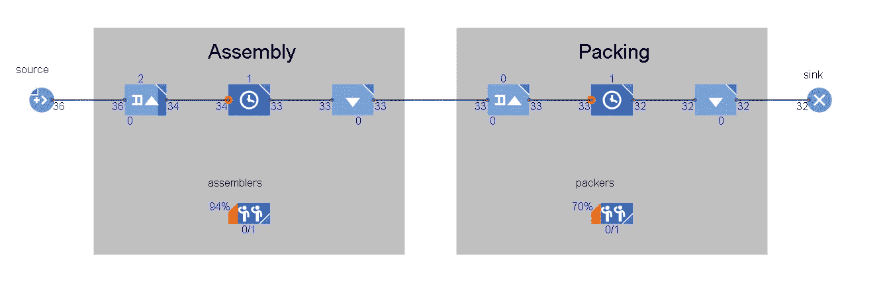
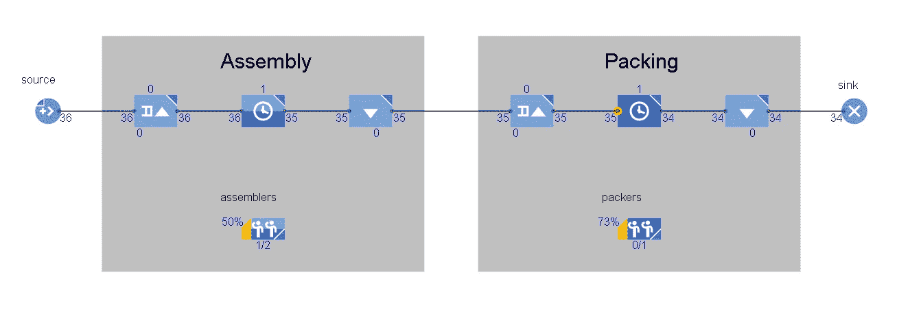

# 数据科学家模拟建模实用介绍

> 原文：<https://towardsdatascience.com/a-practical-introduction-to-simulation-modelling-for-data-scientists-a5e32cec0304?source=collection_archive---------10----------------------->

几十年来，模拟一直被用于改善物流、供应链管理和制造等领域的运营。然而，今天大多数数据科学家可能并不熟悉它。在本文中，我们将使用模拟改进操作，并使用建模软件 AnyLogic 解释统计输出。

[Marcin Jozwiak](https://unsplash.com/@marcinjozwiak?utm_source=medium&utm_medium=referral) 在 [Unsplash](https://unsplash.com?utm_source=medium&utm_medium=referral) 上拍摄的照片

# 但是首先，让我们介绍一下模拟建模的世界

仿真建模是一种研究方法，旨在模拟虚拟环境中的物理系统，并从中获取有用的输出统计数据。例如，一个系统可以是一个群体、一个机场或一个货运卡车运输队。

模拟建模也用于改进分析。这通常是通过对模拟系统进行修改来完成的，以在实际投入使用之前，看看是否可以在虚拟模型中进行改进。这使得它成为决策支持和风险缓解的强大工具。总之，模拟非常适用于*描述*和*改进*系统。

在模拟建模中，有三个主要框架:

1.  离散事件模拟
2.  系统动力学
3.  基于主体的建模(ABM)

DES 的范围很窄，主要处理流程。典型的应用领域是制造、物流和运营规划。

*SD* 范围更广，处理更多的聚合系统。典型的应用是人口、流行病和经济。

*ABM* 的范围可以有所不同，旨在研究系统中的代理如何随时间改变状态。应用范围非常广泛，并且该框架与 *DES* 和 *SD* 结合使用效果良好。

如今有许多强大的模拟软件/软件包可供数据科学家使用。其中包括 *AnyLogic* 、 *Arena* 和 *Simul8* 以及 python 和 R 包 *SimPy* 和*smell。当选择一个适合你的时候，要认真考虑你正在解决的问题。较重的商业软件非常适合包含动画和验证输出，但是它通常缺乏基于脚本的包所能实现的复杂性和灵活性。*

让我们进入一个简短的案例研究，看看我们如何在 *DES* 框架内使用模拟来改进流程。

# **案例研究**

考虑下图中装配工厂的两步流程:

从图中我们可以看到，货物每 5 天到达一次。之后，装运被装配，装配时间正态分布为 N(6，1)。最后，组装的装运以 N(5，1)的操作时间包装，并离开系统。

乍一看，我们可以看到装配时间平均比系统的到达率长。因此，我们应该看到在装配站有一些排队等候的人。

使用*流程建模库*在 AnyLogic 中对此进行建模，为我们提供了以下模型:

该模型的结构由 10 个模块组成。块*源*和*接收器*是系统的起点和终点。在*源*之后，我们有三个模块分配给*组件*，同样用于*包装*。这三个块被称为*抓住、延迟*和*释放*。这种结构保证了当*装配工*和*打包机*的产能闲置*时，新的出货可以进入运行。*它还确保如果一个进程繁忙，在操作之前形成一个队列。

为每个流程分配一个工人，并运行模拟 180 天，我们将得到以下带有固定种子的输出:

从模拟输出中，我们可以看到 36 个装运(源块)进入系统，只有 28 个装运(接收器块)离开系统。我们还可以看到，目前有 6 批货物正在等待组装，1 批正在组装，1 批正在包装。最后，我们还可以看到，装配工人 97%的时间在忙，包装工人 60%的时间在忙。显然，装配操作是限制生产量的瓶颈。

( **NB** :尽管我们应该理想地运行大约 1000+次模拟来获得这些数字的有效估计，但我们将保持简单，只运行一次模拟)

因此，作为一名数据科学家，你必须弄清楚的是:

*   我们怎样才能缩短排队的时间？
*   我们怎样才能提高系统的效率？
*   我们怎样才能防止装配工人累垮呢？

让我们考虑我们可以做出的三个决定:

1.  再雇一个装配工人
2.  使装配操作平均快 1 天
3.  两样都做 1。第二。

**1。雇用另一名装配工人的产量**

这个决定似乎并没有给系统增加多少价值。生产量只增加了一个单位(从 28 个增加到 29 个),装配工人似乎仍然超负荷工作，利用率高达 93%。

**2。装配作业平均快 1 天的产量**

这一决定增加了系统的吞吐量，出货 4 次(从 28 次增加到 32 次),但是，在这种情况下，装配工人似乎也超负荷工作，利用率为 94%。

**3。双管齐下的产出 1。第二。**

现在的生产量相当稳定，为 34，装配工人不像以前那样超负荷工作，利用率为 50%。有趣的是，23%的瓶颈似乎转向了包装过程。积分利用率更高！

那么这项研究的结论是什么？我们要做决定 3 吗？

*——不一定。为了给出更有把握的答案，应该收集额外的数据，例如雇佣额外工人的成本、提高操作速度的成本以及将货物排队等待的成本。时间单位*

该模型可以进一步扩展，以提供更强大的决策支持，这就是模拟建模的魅力所在。诸如此类的决定可以在一个*无风险环境*中进行实验，随着问题的进展，可以对模型进行修改。

有关本文中使用的 AnyLogic PLE 和流程建模库的更多信息，请查看以下链接:
[https://www.anylogic.com/](https://www.anylogic.com/)
[https://www . any logic . com/features/libraries/process-modeling-library/](https://www.anylogic.com/features/libraries/process-modeling-library/)