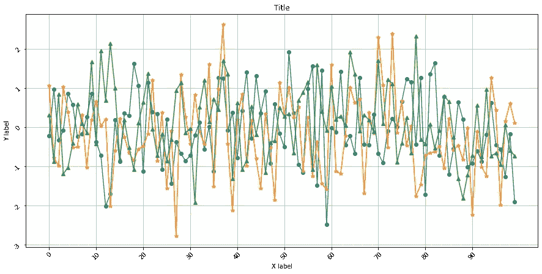
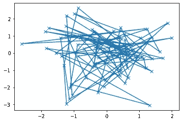
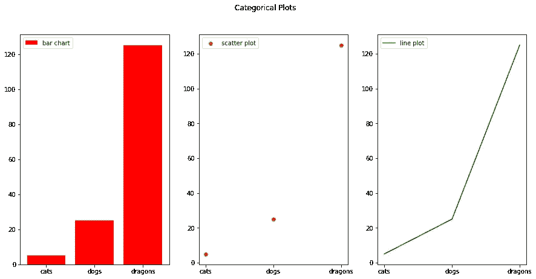

# 13 个 Python 片段中的 Matplotlib 实用摘要

> 原文：<https://towardsdatascience.com/a-practical-summary-of-matplotlib-in-13-python-snippets-4d07f0011bdf?source=collection_archive---------7----------------------->


图片由来自 [Pixabay](https://pixabay.com/?utm_source=link-attribution&utm_medium=referral&utm_campaign=image&utm_content=6246450) 的 [Yvette W](https://pixabay.com/users/wallusy-7300500/?utm_source=link-attribution&utm_medium=referral&utm_campaign=image&utm_content=6246450) 提供

## Python 中基本数据可视化的基本脚本

Matplotlib 是 Python 中数据可视化的基础。为了最大限度地利用它，人们需要练习它的多种特性和功能，以便能够随意定制情节。

***在本文中，我将向您展示总结 Matplotlib*** 基础知识的 13 个脚本

**[[2021 年更新]]**

如果你愿意，你可以看看我在 Youtube 上关于这个话题的视频:

# 用图形和轴绘制基础

```
import matplotlib.pyplot as plt
import numpy as npfig,axs = plt.subplots(figsize=(15,7)) 
data1 = np.random.normal(0,1,100)
data2 = np.random.normal(0,1,100)
data3 = np.random.normal(0,1,100)
x_ax = np.arange(0,100,10)
y_ax = np.arange(-3,3,1)
axs.plot(data1,marker="o")
axs.plot(data2,marker="*")
axs.plot(data3,marker="^")
axs.set_xticks(x_ax)
axs.set_xticklabels(labels=x_ax,rotation=45)
axs.set_yticks(y_ax)
axs.set_yticklabels(labels=y_ax,rotation=45)
axs.set_xlabel("X label")
axs.set_ylabel("Y label")
axs.set_title("Title")
axs.grid("on")
```



# 面向对象(OO)风格与 Pyplot 风格

如[文档](https://matplotlib.org/stable/users/index.html)中所述，使用 Matplotlib 主要有两种方式:

*   ***OO 风格*** :显式创建图形和轴，并对其调用方法
*   ***Pyplot 式*** :依靠 Pyplot 模块自动创建和管理图形和轴。

## 面向对象风格

```
import matplotlib.pyplot as plt
import numpy as np

x = np.cos(np.linspace(0, 2, 100)) # Create the data
# Note that even in the OO-style, we use `.pyplot.figure` to create the figure.
fig, ax = plt.subplots()  # Create a figure and an axes with pyplot.subplots()
ax.plot(x, x, label='linear')  # Plot some data on the axes.
ax.plot(x, x**2, label='quadratic')  # Plot more data on the axes...
ax.plot(x, x**3, label='cubic')  # ... and some more.
ax.set_xlabel('x label')  # Add an x-label to the axes.
ax.set_ylabel('y label')  # Add a y-label to the axes.
ax.set_title("Simple Plot")  # Add a title to the axes.
ax.legend();  # Add a legend.
```


## Pyplot 风格

```
import matplotlib.pyplot as plt
import numpy as npx = np.cos(np.linspace(0, 2, 100)) # Create the data
plt.plot(x, x, label='linear')  # Plot some data on the (implicit) axes.
plt.plot(x, x**2, label='quadratic')  # same pipeline but using pyplot.plot directly
plt.plot(x, x**3, label='cubic')
plt.xlabel('x label')
plt.ylabel('y label')
plt.title("Simple Plot")
plt.legend();
```


## 何时使用面向对象风格还是 pyplot 风格

Matplotlib 文档中的例子使用了这两种方法，但是强调最好选择其中一种并坚持使用。建议是 ***将 pyplot 限制为交互式绘图(例如，在 Jupyter 笔记本中)，并且对于非交互式绘图*** 更喜欢 OO 风格。

# Matplotlib 图的推荐函数签名

```
# source: https://matplotlib.org/stable/tutorials/introductory/usage.html#sphx-glr-tutorials-introductory-usage-pyimport matplotlib.pyplot as plt
import numpy as npdef my_plotter(ax, data1, data2, param_dict):
    """
    A helper function to make a graph

    Parameters
    ----------
    ax : Axes
        The axes to draw to

    data1 : array
       The x data

    data2 : array
       The y data

    param_dict : dict
       Dictionary of kwargs to pass to ax.plot

    Returns
    -------
    out : list
        list of artists added
    """
    out = ax.plot(data1, data2, **param_dict)
    return out

data1, data2, data3, data4 = np.random.randn(4, 100)
fig, ax = plt.subplots(1, 1)
my_plotter(ax, data1, data2, {'marker': 'x'})

# 2 sub-plots example
fig, (ax1, ax2) = plt.subplots(1, 2)
my_plotter(ax1, data1, data2, {'marker': 'x'})
my_plotter(ax2, data3, data4, {'marker': 'o'});
```



# 格式化您的绘图样式

```
import matplotlib.pyplot as plt
import numpy as np

t = np.sin(np.linspace(-3,3,50))
# red dashes, blue squares and green triangles
plt.plot(t, t, 'r--', color="red")
plt.plot(t, t**2, 'bs', color="blue")
plt.plot(t, t**3, 'g^', color="green")
plt.plot(t, t**4, "o", color="orange")
plt.plot(t, t**5, "o-", color="black")
plt.show()
```


查看更多信息

*   [在 matplotlib 中自定义样式表](https://matplotlib.org/stable/tutorials/introductory/customizing.html)
*   [pyplot.setp 文档](https://matplotlib.org/stable/api/_as_gen/matplotlib.pyplot.setp.html)
*   [控制线属性](https://matplotlib.org/stable/tutorials/introductory/pyplot.html#:~:text=Here%20are,Line2D%20properties.)

# 使用关键字字符串绘图(来自字典)

```
# source: https://matplotlib.org/stable/gallery/misc/keyword_plotting.htmlimport matplotlib.pyplot as plt
import numpy as npdata = {'a': np.arange(50),
        'c': np.random.randint(0, 50, 50),
        'd': np.random.randn(50)}
data['b'] = data['a'] + 10 * np.random.randn(50)
data['d'] = np.abs(data['d']) * 100
plt.scatter('a', 'b', c='c', s='d', data=data)
plt.xlabel('entry a')
plt.ylabel('entry b')
plt.show()
```


# 绘制分类变量

```
import matplotlib.pyplot as plt
import numpy as npnames = ['cats', 'dogs', 'dragons']
values = [5, 25, 125]
plt.figure(figsize=(15, 7))
plt.subplot(131)
plt.bar(names, values, color="red", label="bar chart")
plt.legend()
plt.subplot(132)
plt.scatter(names, values, color="orange", label="scatter plot")
plt.legend()
plt.subplot(133)
plt.plot(names, values, color="green", label="line plot")
plt.legend()
plt.suptitle('Categorical Plots')
plt.show()
```



# 使用多个图形

```
import matplotlib.pyplot as plt
import numpy as npdef f(t):
    return np.exp(-t) * np.cos(2*np.pi*t)

t1 = np.arange(0.0, 5.0, 0.1)
t2 = np.arange(0.0, 5.0, 0.2)

plt.figure()

plt.subplot(2,2,1)
plt.plot(t1, f(t1), 'black')

plt.subplot(2,2,2)
plt.plot(t2, np.tan(2*np.pi*t2), 'r--')

plt.subplot(2,2,3)
plt.plot(t2, np.exp(t2), 'g^')

plt.subplot(2,2,4)
plt.plot(t2, np.cos(2*np.pi*t2), 'orange');
```


您可以使用图形编号来创建多个图形:

```
import matplotlib.pyplot as plt
import numpy as npplt.figure(1)
plt.subplot(121)
plt.plot([1, 2, 3])
plt.subplot(122)
plt.plot([4, 5, 6])
plt.figure(2)
plt.subplot(121)
plt.plot([1, 2, 3],color="red")
plt.subplot(122)
plt.plot([4, 5, 6],color="red")
plt.title('It is that simple');
```


查看更多信息:

*   [处理多个图形](https://matplotlib.org/stable/gallery/subplots_axes_and_figures/multiple_figs_demo.html)

# 使用文本

Matplotlib 允许您使用文本对象在绘图中轻松编写任意放置的文本。

```
#source: https://matplotlib.org/stable/tutorials/introductory/pyplot.html#sphx-glr-tutorials-introductory-pyplot-pymu, sigma = 100, 15
x = mu + sigma * np.random.randn(10000)

# the histogram of the data
n, bins, patches = plt.hist(x, 50, density=1, facecolor='g', alpha=0.75)
plt.xlabel('Smarts')
plt.ylabel('Probability')
plt.title('Histogram of IQ')
plt.text(60, .025, r'$\mu=100,\ \sigma=15$')
plt.axis([40, 160, 0, 0.03])
plt.grid(True)
plt.show()
```


所有的文本函数都返回一个文本对象实例。请注意，您可以在文本中使用数学表达式，就像上面取自 [Matplotlib 文档](https://matplotlib.org/stable/tutorials/introductory/pyplot.html#sphx-glr-tutorials-introductory-pyplot-py)的例子一样。想法是在文本字符串中插入 latex 语法:

```
plt.title(r'$\sigma_i=15$')Text(0.5, 1.0, '$\\sigma_i=15$')
```


更多信息，请访问:

*   [Matplotlib 中的文本介绍](https://matplotlib.org/1.4.3/users/text_intro.html)
*   [py plot 简介](https://matplotlib.org/stable/tutorials/introductory/pyplot.html#sphx-glr-tutorials-introductory-pyplot-py)

## 文本注释

```
# source: https://matplotlib.org/stable/tutorials/text/annotations.html
ax = plt.subplot()

t = np.arange(0.0, 5.0, 0.01)
s = np.cos(2*np.pi*t)
line, = plt.plot(t, s, lw=2)

plt.annotate('local max', xy=(2, 1), xytext=(3, 1.5),
             arrowprops=dict(facecolor='black', shrink=0.05),
             )

plt.ylim(-2, 2)
plt.show()
```


更多信息，请访问:

*   [使用注释](https://matplotlib.org/stable/tutorials/text/annotations.html)

# 使用其他轴秤

```
# adapted from: https://matplotlib.org/stable/tutorials/introductory/pyplot.html#sphx-glr-tutorials-introductory-pyplot-py

# make up some data in the open interval (0, 1)
y = np.random.normal(loc=0.5, scale=0.4, size=1000)
y = y[(y > 0) & (y < 1)]
y.sort()
x = np.arange(len(y))

# plot with various axes scales
plt.figure()

# linear
plt.subplot(221)
plt.plot(x, y, color="red")
plt.yscale('linear')
plt.title('linear',color="red")
plt.grid(True)

# log
plt.subplot(222)
plt.plot(x, y, color="green")
plt.yscale('log')
plt.title('log',color="green")
plt.grid(True)

# symmetric log
plt.subplot(223)
plt.plot(x, y - y.mean(),color="blue")
plt.yscale('symlog', linthresh=0.01)
plt.title('symlog',color="blue")
plt.grid(True)

# logit
plt.subplot(224)
plt.plot(x, y, color="orange")
plt.yscale('logit')
plt.title('logit',color="orange")
plt.grid(True)
# Adjust the subplot layout, because the logit one may take more space
# than usual, due to y-tick labels like "1 - 10^{-3}"
plt.subplots_adjust(top=0.92, bottom=0.08, left=0.10, right=0.95, hspace=0.25,
                    wspace=0.35)
plt.tight_layout()
plt.show()
```


更多信息，请访问:

*   [py plot 简介](https://matplotlib.org/stable/tutorials/introductory/pyplot.html#sphx-glr-tutorials-introductory-pyplot-py)

# 数据可视化是一门手艺

这些只是 Matplotlib 背后图形可能性的几个例子。我鼓励您进一步阅读该文档，并研究掌握 Matplotlib 的正确做法。对于那些每天使用它的人来说，我保证这是一个值得追求的目标！

本文的笔记本源代码可以在[这里](https://github.com/EnkrateiaLucca/matplotlib_summary_in_13_scripts)找到。

如果您想了解更多关于 Python 和数据可视化的知识，请查看 Udemy 的这些课程:

> 这些是附属链接，如果你使用它们，我会得到一小笔佣金，干杯！:)

*   [Python for Data Science A-Z](http://seekoapp.io/613108a77bb42d0008b5085f)
*   [学习 Python 进行数据可视化](http://seekoapp.io/613108aa7bb42d0008b50861)
*   [Python master class 中的数据可视化](http://seekoapp.io/613108ad7bb42d0008b50863)

如果你喜欢这篇文章，请在 [Twitter](https://twitter.com/LucasEnkrateia) 、 [LinkedIn](https://www.linkedin.com/in/lucas-soares-969044167/) 、 [Instagram](https://www.instagram.com/theaugmentedself/) 上联系我，并在 [Medium](https://lucas-soares.medium.com/) 上关注我。谢谢，下次再见！

# 参考

*   [Matplotlib](https://matplotlib.org/stable/users/index.html) [文档](https://matplotlib.org/stable/users/index.html)
*   [在 matplotlib 中自定义样式表](https://matplotlib.org/stable/tutorials/introductory/customizing.html)
*   [pyplot.setp 文档](https://matplotlib.org/stable/api/_as_gen/matplotlib.pyplot.setp.html)
*   [控制线属性](https://matplotlib.org/stable/tutorials/introductory/pyplot.html#:~:text=Here%20are,Line2D%20properties.)
*   [处理多个图形](https://matplotlib.org/stable/gallery/subplots_axes_and_figures/multiple_figs_demo.html)
*   [Matplotlib 中的文本介绍](https://matplotlib.org/1.4.3/users/text_intro.html)
*   [py plot 简介](https://matplotlib.org/stable/tutorials/introductory/pyplot.html#sphx-glr-tutorials-introductory-pyplot-py)
*   [使用注释](https://matplotlib.org/stable/tutorials/text/annotations.html)