# 30 个 Python 片段中的熊猫实用摘要

> 原文：<https://towardsdatascience.com/a-practical-summary-of-pandas-in-30-python-snippets-c2d6ce84415e?source=collection_archive---------36----------------------->


由[卡洛斯·穆扎](https://unsplash.com/@kmuza?utm_source=medium&utm_medium=referral)在 [Unsplash](https://unsplash.com?utm_source=medium&utm_medium=referral) 上拍摄的照片

## 理解 pandas 库中主要功能的基本脚本

Pandas 是数据科学和机器学习最重要的 Python 库之一。我几乎每天都使用它，但我总是觉得我错过了有用的功能，所以我决定写一个压缩的总结来帮助指导我的熊猫技能的进步。

在本文中，我将用 30 个 Python 片段来分享 pandas 库主要功能的实用摘要。

# 这些功能

我们将在此介绍的功能包括:

*   使用数据框架
*   读取和写入表格数据
*   过滤数据帧中的行
*   选择特定的行和列
*   创建地块
*   从现有列创建新列
*   计算汇总统计数据
*   对表中的值进行排序
*   组合多个表中的数据
*   处理时间序列数据
*   操作文本数据

我们开始吧！

# 使用数据框架

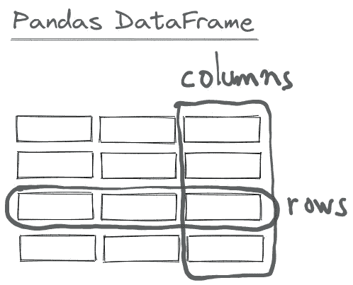

让我们从从字典创建一个基本数据帧开始:

```
import pandas as pd

data = {"Country": ["Portugal", "USA", "France"],
             "Population": [10.31*10**6, 329.5*10**6, 67.39*10**6]
               }

df = pd.DataFrame(data)

df
```


当您使用 Python 字典创建 pandas 数据帧时，字典中的键将是数据帧的列标题，相应的值将是列。您可以在同一数据帧中存储多种数据类型。

要从 pandas 数据框架中选择一列，我们需要:

```
df["Country"]# Output0    Portugal
1         USA
2      France
Name: Country, dtype: object
```

使用方括号“[]”，这将返回一个`Series`对象。

如文档中所述:

> pandas 系列没有列标签，因为它只是数据帧中的一列。系列确实有行标签。

我们还可以根据 pandas 的解释检查每一列的数据类型:

```
df.dtypesCountry        object
Population    float64
dtype: object
```

在这种情况下，数据类型是浮点(`float64`)和字符串(`object`)

## 读取和写入表格数据

Pandas 提供了`read_csv()`功能，将存储为 csv 文件的数据读入 pandas 数据帧。Pandas 支持许多不同的文件格式或现成的数据源(csv、excel、sql、json、parquet)。

```
df = pd.read_csv("Advertising.csv")

df
```

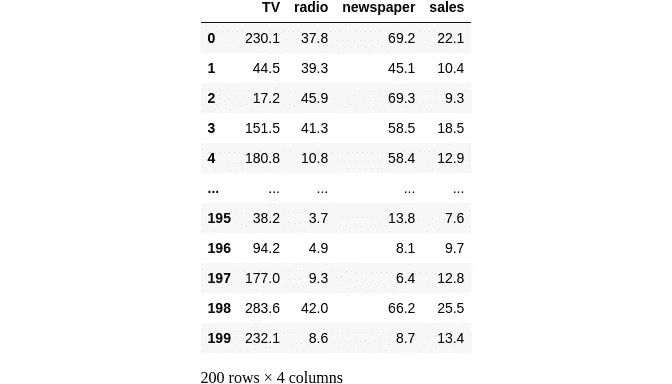

如果您想查看数据的受控子集，您可以:

```
df.head(8)
```

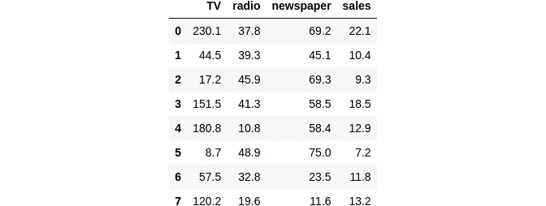

这里我们只显示了数据帧的前 8 行。

如果我们想要可视化数据帧的最后 8 行，我们可以:

```
df.tail(8)
```

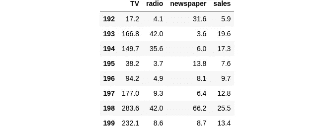

我们还可以用熊猫轻松读取 excel 文件:

```
df = pd.read_excel("Advertising.xlsx")
df
```


您可以从数据帧中获得技术总结:

```
df.info()# Output<class 'pandas.core.frame.DataFrame'>
RangeIndex: 200 entries, 0 to 199
Data columns (total 4 columns):
 #   Column     Non-Null Count  Dtype  
---  ------     --------------  -----  
 0   TV         200 non-null    float64
 1   radio      200 non-null    float64
 2   newspaper  200 non-null    float64
 3   sales      200 non-null    float64
dtypes: float64(4)
memory usage: 6.4 KB
```

这将输出关于数据帧的技术信息，如条目数、数据类型、列数、空值数等。

## 过滤数据帧中的行

假设我对收视率大于 100.0 的电视节目感兴趣，我如何过滤我的数据帧以获得特定的子集？

```
df[df["TV"]>100]
```

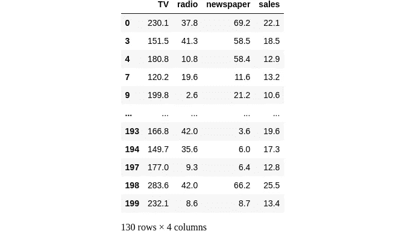

我们还可以使用条件表达式来帮助过滤。例如，假设我们有 titanic 数据集(与 Pandas 文档中使用的相同):

```
df = pd.read_csv("titanic.csv")
df
```

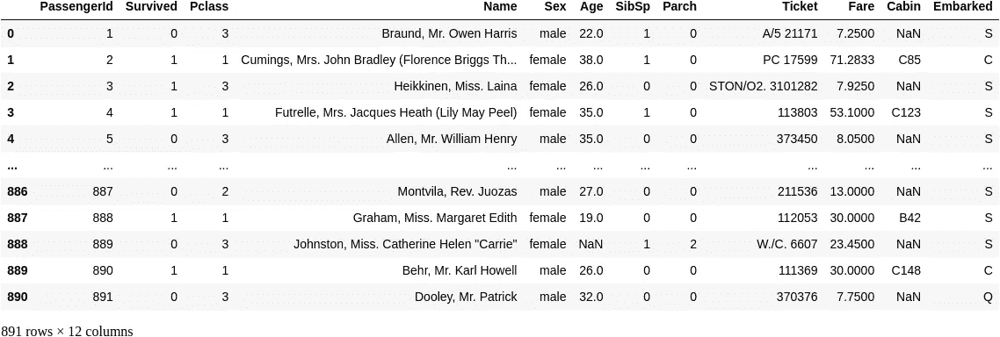

我们希望从 35 岁以下的幸存者那里获得信息，然后我们会使用:

```
survived_under_35 = df[(df["Survived"]==1) & (df["Age"]<35)]
survived_under_35
```

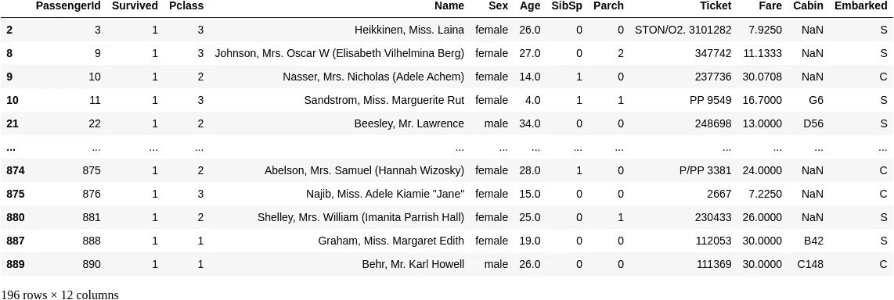

在这里，我们使用括号内的条件表达式结合这里的`and`操作符作为`&`来组合两个过滤语句。

如果我们只想处理特定列中非空的值，我们可以使用条件函数`notna()`，它返回`True`每一行的值都不是空值。

```
df[df["Age"].notna()]
```

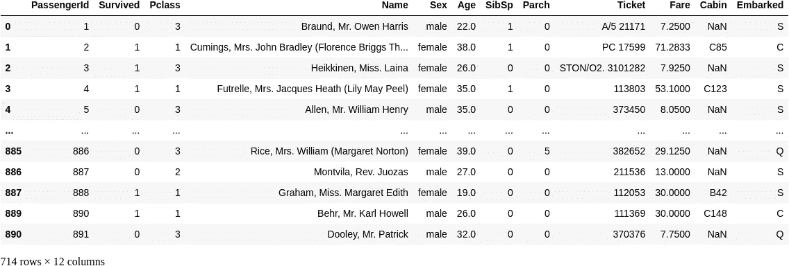

关于条件表达式和过滤的更多信息，请参见 [pandas 文档](https://pandas.pydata.org/pandas-docs/stable/getting_started/intro_tutorials/03_subset_data.html)的这一部分。

## 选择特定的行和列

假设我想要 40 岁以上乘客的名字。因为我想要行和列的子集，仅仅使用选择括号`[]`已经不够了，所以我使用了`loc/iloc`操作符:

```
df.loc[df["Age"]>40, "Name"]6                                McCarthy, Mr. Timothy J
11                              Bonnell, Miss. Elizabeth
15                      Hewlett, Mrs. (Mary D Kingcome) 
33                                 Wheadon, Mr. Edward H
35                        Holverson, Mr. Alexander Oskar
                             ...                        
862    Swift, Mrs. Frederick Joel (Margaret Welles Ba...
865                             Bystrom, Mrs. (Karolina)
871     Beckwith, Mrs. Richard Leonard (Sallie Monypeny)
873                          Vander Cruyssen, Mr. Victor
879        Potter, Mrs. Thomas Jr (Lily Alexenia Wilson)
Name: Name, Length: 150, dtype: object
```

如文档中所述:

> 使用 loc/iloc 时，逗号前的部分是您想要的行，逗号后的部分是您想要选择的列。

使用列名、行标签或条件表达式时，在选择括号`[]`前使用 loc 运算符。

对于逗号前后的部分，可以使用单个标签、标签列表、标签片段、条件表达式或冒号。如果您使用冒号，这意味着您想要选择所有行或列。

当您的选择基于表上的位置时，例如使用`iloc.`,假设您想要 23 到 42 行和 1 到 3 列:

```
df.iloc[22:42, 0:3]
```

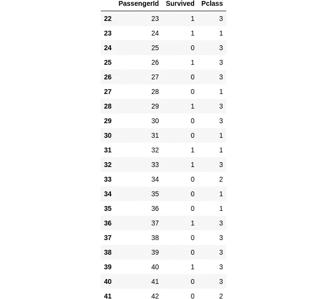

当使用`loc|iloc`选择特定的行和/或列时，新值可以分配给所选数据。例如，将名称 anonymous 分配给第三列的前三个元素。有关选择的更多信息，请参见[此处](https://pandas.pydata.org/pandas-docs/stable/getting_started/intro_tutorials/03_subset_data.html)。

## 创建地块

```
df = pd.read_csv("Advertising.csv")
```

如果您想快速可视化数据，您可以简单地调用`.plot()`方法:

```
df.plot();
```

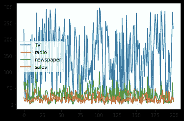

在这里，pandas 用数字数据为每一列创建了一个单线图。如果您想得到具体的数据，您可以选择所需的列，例如，假设您只想绘制销售额:

```
df["sales"].plot();
```

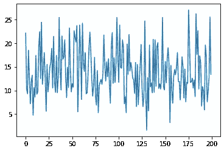

如果你想评估电视/广播/报纸收视率对销售额的影响，你可以将它们一个一个地对比:

```
df.plot.scatter(x="TV", y="sales", alpha=0.6);
```

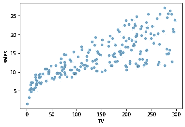

```
df.plot.scatter(x="radio", y="sales", alpha=0.6);
```

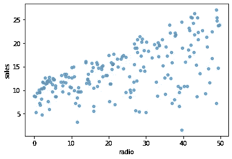

```
df.plot.scatter(x="newspaper", y="sales", alpha=0.6);
```

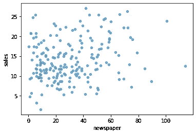

pandas 中有许多绘图选项，我们可以使用 Python 中内置的 dir()函数来检查它们:

```
for method_name in dir(df.plot):
    if not method_name.startswith("_"):
        print(method_name)area
bar
barh
box
density
hexbin
hist
kde
line
pie
scatter
```

关于熊猫的更多绘图，查看熊猫文档的这一部分。

## 从现有列创建新列


在 pandas 中创建新的专栏很简单。只需使用括号`[]`在左侧分配新的列名，在右侧分配该列的数据:

```
df["Date"] = pd.date_range("1965-01-01", periods=len(df))
df
```

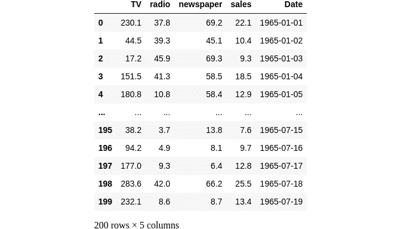

*注意:这里我还使用了另一个名为* `*date_range*` *的 cool pandas 方法，它以* `*period*` *参数指定的周期从一个起点生成一个日期值列表。*

但是，如果我们想从一个现有的列创建一个新的列呢？例如，假设我们有熊猫文档使用的空气质量数据集:

```
df = pd.read_csv("air_quality_no2.csv")
df
```

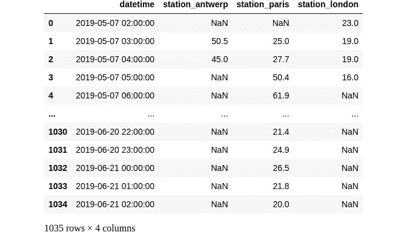

假设您想要检查安特卫普与伦敦的值的比率，并将结果保存为新列:

```
df["ratio_antwerp_london"] = (df["station_antwerp"] / df["station_london"])
df
```

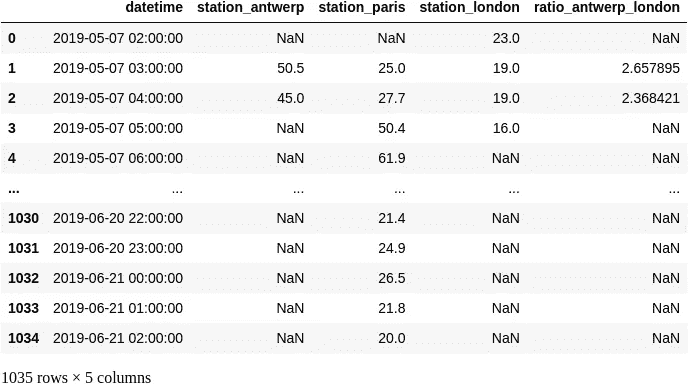

如果您想对一列应用一个更复杂的函数，并将结果保存为 dataframe 的一个新列，您可以使用`.apply()`方法。

例如，让我们对来自伦敦站的 NO2 值应用条件，其中，如果它们大于阈值，则输出将为“高”，否则为“低”:

```
def highLow(temp):
    if temp > 24.77:
        return "High"
    else:
        return "Low"
df["station_london_high_low"] = df["station_london"].apply(highLow)
df
```

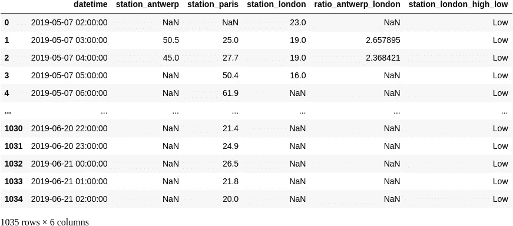

使用熊猫`.rename()`重命名数据列:

```
data = {"Name": ["John", "Mary", "Paul"],
             "Age": [20,25,30],
             "Occupation": ["Software Engineer", "Artist", "Product Manager"]
               }

df = pd.DataFrame(data)

df_renamed = df.rename(columns={"Name":"First Name", 
                                     "Occupation": "Job"})
df_renamed
```


注意，我不必重命名所有的列，因为`Age`列保持不变。

## 计算汇总统计数据

计算熊猫的统计数据非常简单:

```
df = pd.read_csv("titanic.csv")

print(df["Age"].mean())
print(df["Age"].max())
print(df["Age"].min())
print(df["Age"].median())29.69911764705882
80.0
0.42
28.0df.describe()
```

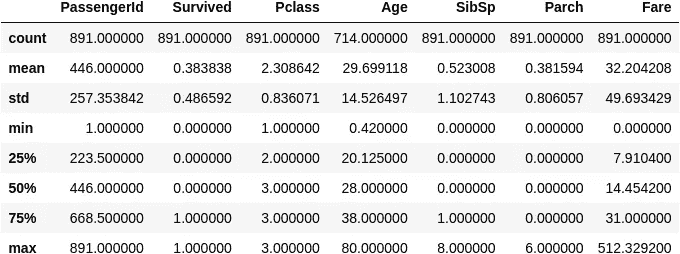

您还可以计算给定列的聚合统计信息的特定组合:

```
df.agg(
    {
        "Age": ["min", "max", "mean"],
        "Parch": ["min", "max", "mean"]
    }
)
```


`.describe()`方法可以方便地加快速度:

```
df.describe()
```


它提供了表格中数字数据的快速概览。您还可以通过一行代码按类别计算值/记录的数量:

```
df["Pclass"].value_counts()3    491
1    216
2    184
Name: Pclass, dtype: int64
```

你可以在这个[部分](https://pandas.pydata.org/pandas-docs/stable/user_guide/basics.html#basics-stats)看到更多细节。

## 对表中的值进行排序

假设你有一个姓名和年龄的数据集:

```
data = {
                "Name": ["Lucas", "Beatriz", "Clara", "Sara"],
                "Age": [30, 26, 20, 22]
               }
df = pd.DataFrame(data)
df
```


你想按年龄分类:

```
df.sort_values(by="Age")
```


您也可以按降序排列:

```
df.sort_values(by="Age", ascending=False)
```


## 组合多个表中的数据

```
df1 = pd.DataFrame(
    {
        "Name": ["Lucas", "Beatriz", "Clara", "Sara"],
         "Age": [30, 26, 20, 22]
    }
)

df2 = pd.DataFrame(
     {
         "Name": ["John", "Mary"],
         "Age": [45, 38]
     }
)
df_names_ages = pd.concat([df1, df2], axis=0)
df_names_ages
```


也可以使用共享列合并两个数据帧。

```
df1 = pd.DataFrame(
    {
        "Name": ["Lucas", "Beatriz", "Clara", "Sara"],
         "Age": [30, 26, 20, 22],
        "City": ["Lisbon", "Barcelona", "London", "Paris"],
    }
)

df2 = pd.DataFrame(
     {
         "City": ["Lisbon", "Barcelona", "London", "Paris"],
         "Occupation": ["Machine Learning Enginner", "Scientist", "Writer","Teacher"]
     }
)

df_merged = pd.merge(df1,df2,how="left", on="City")
df_merged
```


在这个[部分](https://pandas.pydata.org/pandas-docs/stable/getting_started/intro_tutorials/08_combine_dataframes.html)你可以了解更多关于 pandas 中的连接和合并。

## 处理时间序列数据

```
import pandas as pd
import matplotlib.pyplot as plt
```

假设我们有这样一个数据集:

```
df = pd.read_csv("typingPerformance.csv")
df
```

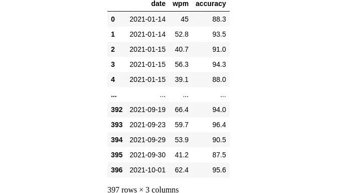

*这实际上是我创建的一个数据集，用来跟踪我的触摸打字性能，以显示我在键盘上打字的速度。*

这里的一个问题是“日期”列的数据类型是一个`string`。我希望它是一个`datetime`对象，这样我就可以对它执行标准的日期操作。Pandas 提供了一种将列转换为 datetime 对象的简单方法:

```
df["date"] = pd.to_datetime(df["date"])
df
```


现在，我们可以检查数据类型以确保它是`datetime`:

```
df.dtypesdate        datetime64[ns]
wpm                 object
accuracy           float64
dtype: object
```

完美！现在我们可以用简单的表达回答问题了。比如，我什么时候开始跟踪我的打字表现？

```
df["date"].min()Timestamp('2021-01-14 00:00:00')
```

我上次练习是什么时候？

```
df["date"].max()Timestamp('2021-10-01 00:00:00')
```

我追踪了多久？

```
df["date"].max() - df['date'].min()Timedelta('260 days 00:00:00')
```

现在，我可以创建一个新列，指定一些关于日期的信息，如创建该数据点的月份:

```
df["month"] = df["date"].dt.month
df
```

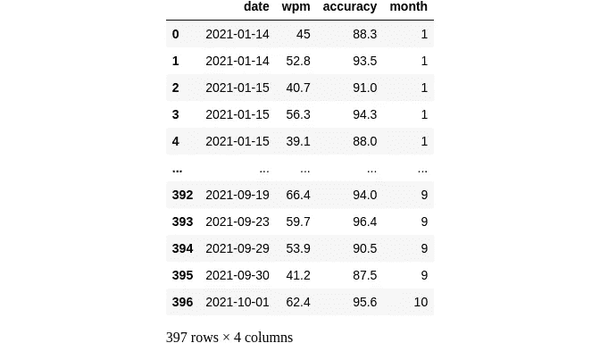

现在，我可以画出每个月的平均 wpm(每分钟字数)表现:

```
df_monthly_performance = df.groupby("month")["wpm"].mean()df_monthly_performance.plot()
plt.ylabel("wpm");
```

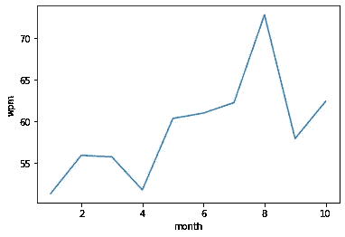

pandas 中有大量与日期相关的功能，我建议查看文档的这一[部分，以了解更多信息！](https://pandas.pydata.org/pandas-docs/stable/getting_started/intro_tutorials/09_timeseries.html)

## 操作文本数据

```
data = {"Full Name": ["Mark Harrison Junior", "Mary Elisabeth"],
             "Age": [40, 50]}

df = pd.DataFrame(data)
df
```


我们可以使用`.str()`方法来处理字符串列。例如，我们可以使给定列中的所有字符串都小写:

```
df["Full Name"].str.lower()0    mark harrison junior
1          mary elisabeth
Name: Full Name, dtype: object
```

或者基于给定列的文本操作创建另一列:

```
df["Last Name"] = df["Full Name"].str.split(" ").str.get(-1)
df
```


我们可以检查字符串列是否包含某个字符串:

```
df["Full Name"].str.contains("Junior")0     True
1    False
Name: Full Name, dtype: bool
```

您可以在本[部分](https://pandas.pydata.org/pandas-docs/stable/getting_started/intro_tutorials/10_text_data.html)中了解更多关于文本操作的信息。

## 学习熊猫

Pandas 是数据科学家和机器学习工程师最常用的 Python 库之一。它具有惊人的功能，如果掌握得当，在处理数据和加快工作流程时会有很大的帮助。

花时间以正确的方式学习 pandas，阅读文档，练习每个项目中经常出现的单个功能，我保证结果会不言自明。

如果你想了解更多关于熊猫的知识，可以看看 Udemy 的这两门课程:

*   [终极熊猫训练营](http://seekoapp.io/6159992e0b3251000962ac59)
*   [熊猫数据分析](http://seekoapp.io/615999688ff9b600082a55e3)

> (这些是附属链接，如果你使用它们，我会得到一小笔佣金，干杯！:))

如果你喜欢这篇文章，在[媒体](https://lucas-soares.medium.com/)、[上关注我，订阅我的时事通讯](https://lucas-soares.medium.com/subscribe)，或者[加入媒体](https://lucas-soares.medium.com/membership)(如果你还没有的话:)。在 [Twitter](https://twitter.com/LucasEnkrateia) 、 [LinkedIn](https://www.linkedin.com/in/lucas-soares-969044167/) 和 [Instagram](https://www.instagram.com/theaugmentedself/) 上和我联系！谢谢，下次再见！:)

# 参考

*   [熊猫文档](https://pandas.pydata.org/pandas-docs/stable/getting_started/intro_tutorials/01_table_oriented.html#min-tut-01-tableoriented)
*   [熊猫用户指南](https://pandas.pydata.org/pandas-docs/stable/user_guide/index.html#user-guide)
*   [excalidraw](https://excalidraw.com/)