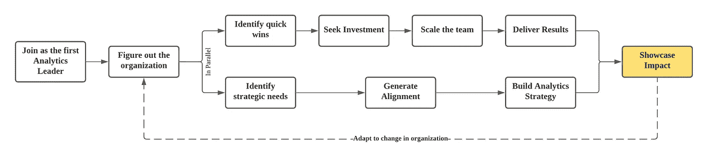
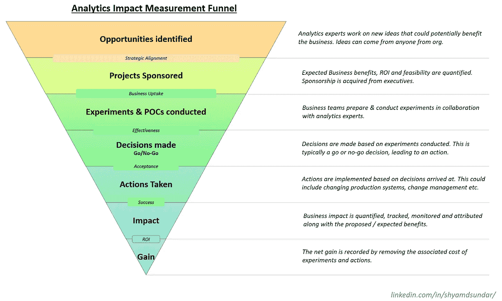
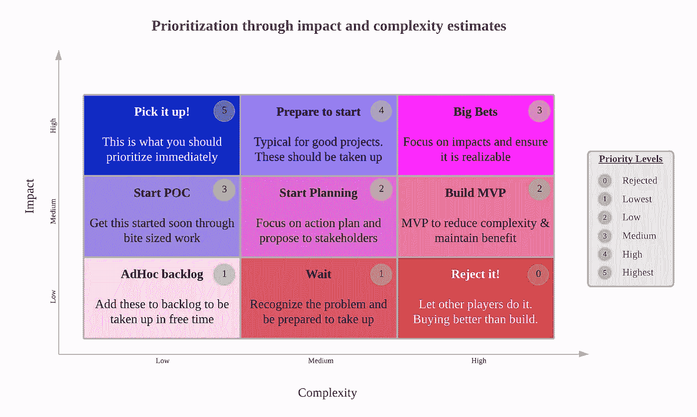
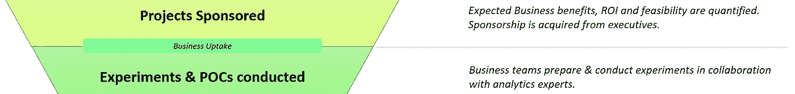
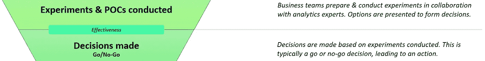
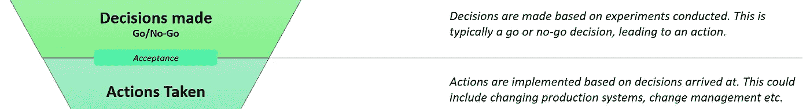
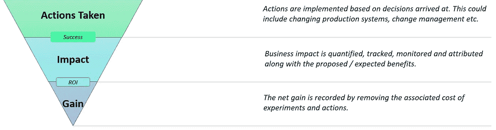

# 释放分析和实验力量的实用方法

> 原文：<https://towardsdatascience.com/a-practical-way-to-unleash-the-power-of-analytics-and-experimentation-33372d4cea6f?source=collection_archive---------19----------------------->

## 我们不能通过雇佣分析师来“打开”分析文化。它需要对整个组织进行积极的监控和指导，以产生真正的影响！

来自 Unsplash 的海蒂·芬(Heidi Fin)拍摄的照片([链接](https://unsplash.com/photos/M2Kxb80gqcc?utm_source=unsplash&utm_medium=referral&utm_content=creditShareLink))

> 如果没有决策要做，就没有分析的需要，导致没有数据的需要，从此没有价值要用数据来创造！

在当前的时代，每个人都是数据驱动的，每个组织策略都围绕着数据，每一次炒作都是关于人工智能/ML 的魔杖。然而，大多数企业都难以从数据中获取价值并建立分析文化。仔细观察实际情况就会发现，对分析的期望往往与组织对做出数据驱动决策的承诺不相符合。

我们经常听到从数据中创造价值的说法。但在现实中，如果没有决策要做，就不需要分析，导致不需要数据，从此没有价值要用数据来创造！如果不产生实际的数据需求，它可能会成为另一种没人关心的僵尸资产。数据驱动型业务的基本重点是如何做出决策。

当业务从一无所知的、基于意见的决策转变为知情的、基于证据的科学决策时，分析成熟度自然会到来。后者自然需要数据和相关的专业知识。

分析领导者在全新环境中的典型旅程(作者插图)

*本文将分析的范围定义为“从数据或统计的系统分析中获得的见解”，主要是决策支持。*

在过去的十年里，我在从大公司到初创公司和咨询公司的各种业务中建立了多个数据团队。我目睹并参与了许多挖掘数据潜力的尝试。如上图所示的旅程有许多平行的线索，总是从乐观的投资观点开始，到证明投资的影响和回报结束。如果管理层确信，就会投入更多的投资，循环就会重复。

> …当数据驱动的决策成为组织中每个成员的习惯时，分析文化就形成了

根据我的经验，这个周期中最关键的部分总是衡量和展示分析的影响。没有它，周期会变慢，分析变得更像一项服务，而不是“变化的引擎”。

分析主要是一个决策支持角色，需要整个组织与之合作。因此，这样一个功能的成功更多的是朝向科学过程而不是结果。正如 [Sudaman](https://www.linkedin.com/in/sudaman/) (安联比荷卢经济联盟的区域首席数据和分析官)在[数据框架播客](https://www.datacamp.com/community/podcast/the-path-to-building-data-cultures)中提到的，当数据驱动的决策成为组织中每个成员的习惯时，分析文化就形成了。

我在跟踪和测量分析文化方面的研究总是会导致许多带有定性指标的分析成熟度阶段的广泛和抽象的定义。这些可能有利于 CXO 在大型组织的层面上做出战略投资决策，但对我来说几乎毫无用处。通常，管理顾问用这一点为大老板指出分析成熟度的未来之路。

但作为一名现场分析领导者，我想关注实际影响的问题:“我应该做些什么来帮助团队朝着基于数据的决策的正确方向前进？”有没有简单的方法来跟踪和监控团队如何利用基于数据的决策？这是否可行，以便领导可以积极使用这些指标来识别瓶颈？

在这里，我提出了一种可量化和可操作的方法来跟踪分析和实验在一个组织中是如何使用的，以及如何释放其潜力。

# 分析影响漏斗！

分析影响漏斗由[作者](https://www.linkedin.com/in/shyamdsundar/)概念化并呈现

是的，你是对的。上面的漏斗看起来太熟悉了。这是我们在互联网上看到的标准创新漏斗。我只是将这些应用于分析和实验。让我们通过每个阶段和指标来跟踪，以确保漏斗性能。

## 漏斗顶端

领导者应该引导团队成员发现需要解决的问题，并开始创建实验、测试和学习的积压工作。这里的关键是不断填充漏斗并保持分析能力。随着分析成熟度的提高，我们经常会看到指数级增长，导致分析团队能力耗尽，利益相关者要求更多的见解！没有任何分析项目可以交付，就证明影响而言，这场战斗已经失败了。

分析项目的机会可能来自任何人:无论是从事产品工作的人、查看数据的人、用户研究人员、最终用户反馈等。分析团队应该有一种机制来捕捉这些机会，根据业务目标标记和组织它们。这些可以是标准的请求表格，或者使用吉拉等工具。每一个商业机会都应该以同样的真诚对待，以确保我们不会以一种狭隘的思维结束，也不会不适当地拒绝一个好主意。

科学的优先顺序框架(由作者[提交，链接此处](https://shyamdsundar.medium.com/prioritising-the-scientific-way-507d4200b6b8)

任何提出想法的成员都应该使用第一原则方法详细阐述商业价值和影响。对于一个组织来说，这是最好的标准化。

## 获得首肯

> …一个高度集中的组织是一个联合的团队代表其业务领导思考的地方

这些想法经过了商业领袖的验证，他们会考虑赞助这些想法。尽管创意的产生需要“跳出框框”的思维，但它们应该在很大程度上与业务目标保持一致。当一切顺利时，一个高度集中的组织就建立起来了，在那里，一个联合的团队代表其业务领导进行思考。

很明显，一个更好的联盟将有更高的机会让商业领袖赞助提议的项目。项目赞助的水平代表了战略一致性。为了跟踪这一点，我们可以使用**战略一致性分数**，这是赞助想法与提交的提案总数的比率。由于此分数是在战略和愿景层面上衡量的，因此应该在更广泛的范围内(跨部门或业务单位)进行衡量，而不是在特定的团队层面。

当得分较低时，高层和中层经理有责任找出缩小差距的方法。造成这种差距的通常原因是业务/战略团队和技术/运营团队之间缺乏联系。这通常是由于缺乏与高层管理人员的沟通和接触造成的。组织需要充满激情的人，他们是不可思议的工作狂。但是如果不对齐，这些马就会朝各个方向拉！

## 说服团队

> …分析和实验的核心目的是增加企业的可选性！

选择性被定义为“可供选择但不是强制性的品质”。说白了，分析和实验的核心目的是增加企业的可选性。但是，只有当企业有能力行使它们时，可选性才是有用的。主要的问题往往是克服惰性，走向探索，而不仅仅是利用已知的问题。

虽然企业领导赞助一个项目，但基层团队可能有不同的优先级。为“可能”受益的项目提取资源可能是一场艰难的对话。分析领导者应该具有情境同理心，以理解团队的每个优先事项，并相应地对实验进行排序。

当一切顺利的时候，这些团队会很乐意接受赞助的实验。这可以通过**业务接受率**来衡量，业务接受率被定义为实际接受的实验数量与受资助项目总数的比率。较低的接受率可能意味着错过机会或不同团队之间在业务优先级上缺乏一致性。造成这种情况的原因可能是业务发起人没有认识到优先级，也可能是执行团队没有足够的能力。

## 做出决定

> …我们应该绝对区分实验的方式和实验的结果

艰难的部分已经完成了。现在，进行实验，分析结果，并提出选择。但是，它导致了具体的决定吗？

让我非常明确地说:我们应该绝对地区分实验的方式和实验的结果。一个不正确的实验是一个有缺陷的过程，导致不确定的结果，阻止具体的决策。即使一个完美的实验，负面或无影响的结果是可以预期的。

理想情况下，我们希望每个实验或分析概念验证都能产生建议和决策。我们可以通过**有效性得分**来衡量这一点，有效性得分被定义为进行的实验数量与做出的结论性决策之间的比率。分数少了，我们就需要自省为什么一个实验没有结论。

实验没有做好可能有很多原因。这包括不清楚的问题定义和范围，不充分的样本大小和统计能力，错误的计算，错误的测量，没有考虑次要影响，错误的时间安排等。

## 接受决定

每一个决定都应该有一个与之相关的行动和结果。当团队完全相信决策时，会立即采取行动，表明对决策的信任。我们可以通过**接受分数**来衡量信任程度，接受分数被定义为采取的行动与做出的决定的比率。

缺乏后续行动可能意味着对实验或决策缺乏信任。如果决策的背景和团队的关注点之间存在脱节，也会出现这种情况。由于计划和进行实验需要合理的时间，业务优先级的频繁变化会破坏实验的流程和行动的相关性。因此，在将实验转化为行动的过程中，企业和组织的稳定性至关重要。

## 漏斗底部

在大多数组织中，这是一个经常被忽略或不完整的关键部分。根据我的观察，漏斗通常会在记录下所采取的行动后停止。然而，我们应该继续监测结果并量化预期的影响。

> …不承担风险的过于谨慎的团队或不惜一切代价避免失败的团队可能会破坏成功的衡量标准

业务影响可能有多种形式，如运营改善、销售提升、利润提高、客户参与度等。关键是使用通用指标(通常以货币形式)量化这种影响。有了这些信息，我们就可以将**成功率**定义为积极的净结果与采取的行动总数的比率。虽然高比率是可取的，但成功的度量可能会被不承担风险的过于谨慎的团队或不惜任何代价避免失败的团队所破坏。因此，还应该注意高成功率。

最后一个指标是**投资回报率**，它是通过各种实验产生的总商业价值与分析领域总投资的总和。实验&的实施是跨团队跨职能的努力。因此，应采用可接受的方式计算归属于分析的回报部分。建议有一个比复杂模型更粗糙的&有意义的归属。我们只需要耐心等待归因模型的进化。

# 提前计划

从长远来看，任何企业都应该看到这个漏斗发展和稳定。虽然更多的投资会导致漏斗顶端更胖，但也会给净收益和投资回报率带来压力。另一方面，缺乏投资或能力不足会使漏斗变得更细，表明机会成本的积累。

该漏斗是一种很好的方式，可以证明单靠分析团队无法创造奇迹并推动数据成熟。完善一个没有业务承诺的分析团队会导致失望和期望的不匹配。

同时，还应避免挪用其他团队职能的预算来推动对分析的更多关注。没有推向市场的产品，数据就不会产生，分析也不会有意义。

从分析和实验文化起步的组织可能会更好地拥有自上而下的授权，为这些漏斗设定最低 KPI。这些不仅仅是分析 KPI，而是对组织在其核心推动分析和实验方面的成熟度的总体衡量！

# 关于作者

Shyam 是数据领域的公认领导者，在建立技术和数据领域的全功能团队方面拥有丰富的经验。他目前在 Yara 领导全球数字解决方案的数据科学和分析团队。他热衷于战略和通过数据、分析和人工智能/人工智能创造切实的商业价值。

请在 [**LinkedIn 这里**](https://www.linkedin.com/in/shyamdsundar/) 随意连接和联系聊天。

# 参考

<https://shyamdsundar.medium.com/prioritising-the-scientific-way-507d4200b6b8>  <https://www.forbes.com/sites/forbestechcouncil/2020/11/11/optionality-part-i-what-is-it-and-why-is-it-crucial/?sh=7bcae3a864b0>  <https://www.linkedin.com/posts/shyamdsundar_insights-datascience-analytics-activity-6717605677487017984-z5t1> 