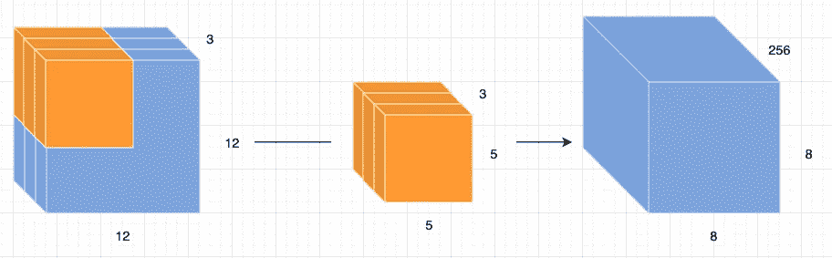

# 阿特鲁(扩张的)和深度方向可分卷积的初级读本

> 原文：<https://towardsdatascience.com/a-primer-on-atrous-convolutions-and-depth-wise-separable-convolutions-443b106919f5?source=collection_archive---------7----------------------->

## [思想和理论](https://towardsdatascience.com/tagged/thoughts-and-theory)

## 什么是萎缩/扩张和深度方向可分卷积？与标准卷积有何不同？它们的用途是什么？

凭借权重共享和平移不变性等属性，卷积层和 CNN 在使用深度学习方法的计算机视觉和图像处理任务中变得无处不在。考虑到这一点，本文旨在讨论我们在卷积网络中看到的一些发展。我们特别关注**的两个**发展:阿特鲁(扩张)卷积和深度方向可穿透卷积。我们将看到这两种类型的卷积是如何工作的，它们与普通的卷积有什么不同，以及为什么我们可能要使用它们。

# 卷积层

在进入正题之前，我们先快速提醒一下自己卷积层是如何工作的。从本质上来说，卷积滤波器只是简单的特征提取器。以前手工制作的特征过滤器现在可以通过反向传播的“魔法”来学习。我们有一个在输入特征图上滑动的核(conv 层的权重),在每个位置，执行逐元素乘法，然后对乘积求和，以获得标量值。在每个位置执行相同的操作。图 1 显示了这一过程。

图 1:一个 3×3 卷积滤波器的作用[1]。

卷积过滤器通过**在输入特征图上滑动**来检测特定的特征，即，它在每个位置寻找该特征。这直观地解释了卷积的平移不变性。

# 阿特鲁(扩张)卷积

为了理解 atrous 卷积与标准卷积有什么不同，我们首先需要知道什么是**感受野**。感受野被定义为产生每个输出元素的输入特征图的区域的大小。在图 1 的情况下，感受野是 3×3，因为输出特征图中的每个元素看到(使用)3×3 输入元素。

深度 CNN 使用卷积和最大池的组合。这样做的缺点是，在每一步，特征图的空间分辨率减半。将所得的特征图植入到原始图像上导致稀疏特征提取。这种效果可以在图 2 中看到。conv。滤镜将输入图像缩减采样为原来的两倍。上采样和在图像上施加特征图表明，响应仅对应于 1/4 的图像位置(稀疏特征提取)。

图 DCNN 中的稀疏特征提取[2]。

阿特鲁(扩张)卷积解决了这个问题，并允许密集特征提取。这是通过一个叫做**的新参数(r)** 实现的。简而言之，atrous 卷积类似于标准卷积，除了 atrous 卷积核的权重被间隔开**或**个位置，即，扩展卷积层的核是稀疏的。

图 3:标准与膨胀的内核。

图 4:3×3 阿特鲁(扩张)卷积的作用[1]。

图 3(a)示出了标准内核，图 3(b)示出了具有**比率 r = 2** 的扩大的 3×3 内核。通过控制速率参数，我们可以任意控制 conv 的感受野。层。这使得 conv。过滤以查看更大的输入区域(感受野),而不降低空间分辨率或增加内核大小。图 4 示出了运行中的扩展卷积滤波器。

图 5。使用扩张卷积进行密集特征提取[2]。

与图 2 中使用的标准卷积相比，在图 5 中可以看出，通过使用比率 r=2 的扩展核来提取密集特征。只需将**膨胀**参数设置为所需的膨胀速率，即可轻松实现膨胀卷积。

扩展卷积:pytorch 实现

# 深度方向可分离卷积

深度方向可分离卷积是在例外网[3]中引入的。图 6 示出了标准卷积操作，其中卷积作用于所有通道。对于图 6 所示的配置，我们有 256 个 5x5x3 内核。

图 6:应用于 12x12x3 输入的标准 5x5 卷积。

图 7(a)示出了深度方向卷积，其中滤波器被应用于每个通道。这就是深度方向可分离卷积与标准卷积的区别。深度方向卷积的输出具有与输入相同的通道。对于图 7(a)所示的配置，我们有 3 个 5x5x1 内核，每个通道一个。通道间混合是通过将深度方向卷积的输出与所需数量的输出通道的 1×1 内核进行卷积来实现的(图 7(b))。

图 7:5×5 深度方向的可分离卷积，接着是 1×1 conv。

## 为什么选择深度可分卷积？

为了回答这个问题，我们来看看执行标准卷积和深度可分卷积所需的乘法次数。

**标准卷积** 对于图 6 中指定的配置，我们有 256 个大小为 5x5x3 的内核。计算卷积所需的总乘法:
**256*5*5*3*(8*8 个位置)= 1228800**

**深度方向可分离卷积** 对于图 7 中指定的配置，我们有 2 个卷积运算:
1) 3 个大小为 5×5×1 的核。这里，所需的乘法次数是: **5*5*3*(8*8 个位置)= 4800** 2) 256 个大小为 1x1x3 的核用于 1x1 卷积。所需乘法次数: **256*1*1*3*(8*8 个位置)= 49152** 深度可分卷积所需乘法总数: **4800 + 49512 = 54312。**

我们可以非常清楚地看到**深度方向卷积比标准卷积**需要更少的计算。

在 pytorch 中，深度方向可分离卷积可以通过将组参数设置为输入通道的数量来实现。

**注意:**py torch 中的**组**参数必须是 **in_channels** 参数的倍数。这是因为在 pytorch 中，通过将输入特征分成**组=g** 组来应用深度卷积。更多信息[点击这里](https://pytorch.org/docs/master/generated/torch.nn.Conv2d.html#torch.nn.Conv2d)。

# 结论

这篇文章深入研究了两种流行的卷积类型:atrous(扩张)卷积和深度可分卷积。我们看到了它们是什么，它们与标准卷积运算有何不同，也看到了它们相对于标准卷积运算的优势。最后，我们还看到了如何使用 pyTorch 实现 atrous(扩张)和深度方向可分离卷积。

# **参考文献**

[1]卷积运算([https://github.com/vdumoulin/conv_arithmetic](https://github.com/vdumoulin/conv_arithmetic))

[2]陈，梁杰，等，“Deeplab:基于深度卷积网、atrous 卷积和全连通条件随机场的语义图像分割” *IEEE 模式分析与机器智能汇刊*40.4(2017):834–848。

[3]弗朗索瓦·乔莱。"例外:具有深度可分卷积的深度学习."*IEEE 计算机视觉和模式识别会议论文集*。2017.