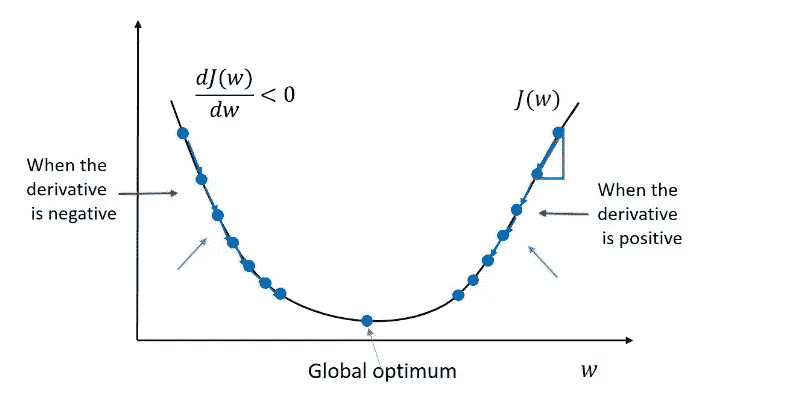
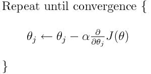
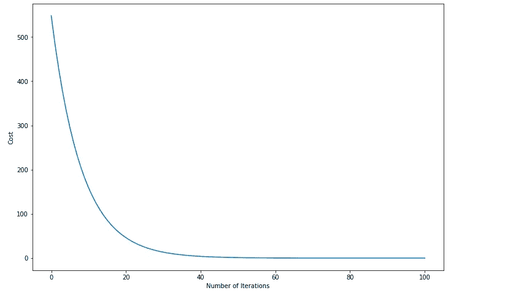
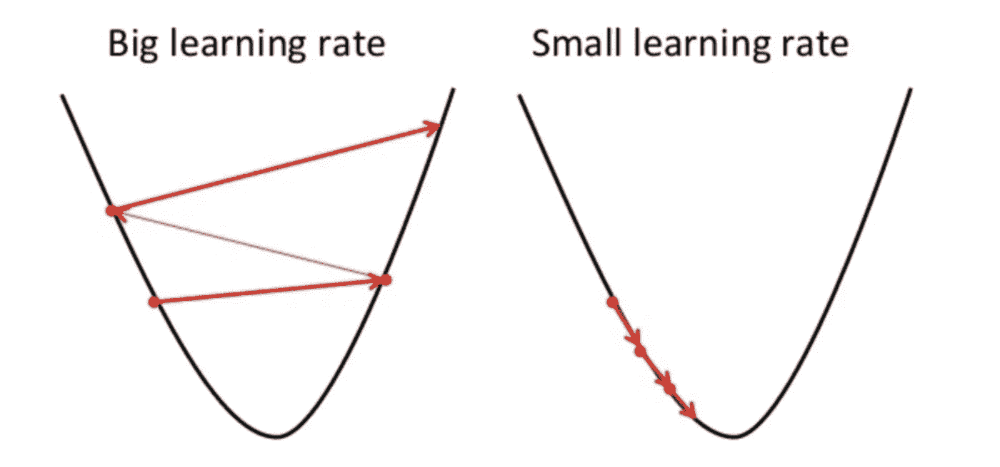
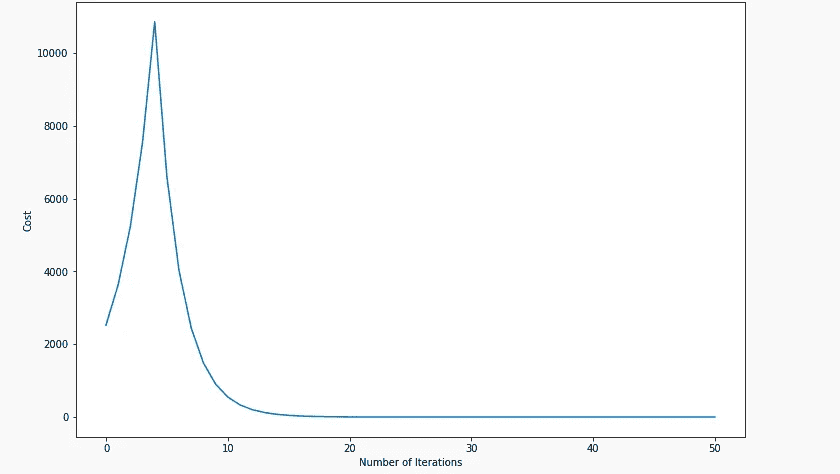
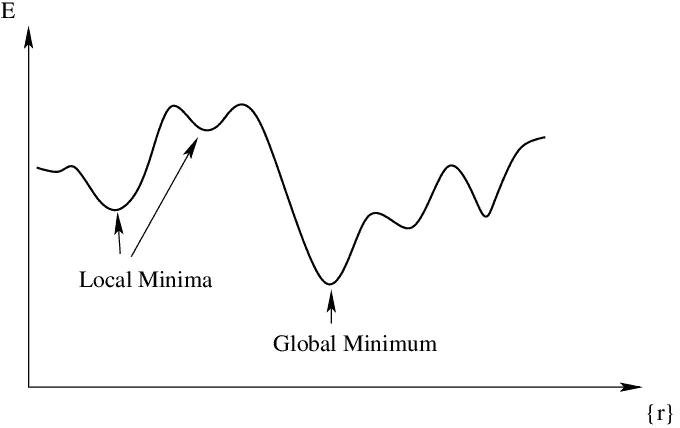

# 梯度下降入门

> 原文：<https://towardsdatascience.com/a-primer-on-gradient-descent-410f2d1a0eaa?source=collection_archive---------32----------------------->

## 直观地探索梯度下降，将其可视化，并使用 Python 中精彩的 SymPy 库实现一个示例

阿曼德·库利在 [Unsplash](https://unsplash.com?utm_source=medium&utm_medium=referral) 上拍摄的照片

# 为什么我们需要知道什么是梯度下降？

让我们首先定义什么是优化问题。在优化问题中，我们首先列出一个成本，它是可变参数的函数。这些参数的取值范围很大，最终这些值决定了成本。我们在处理这些问题时的目标是找到*一组* *值，它们将最小化成本函数*。梯度下降有助于我们系统地**这样做**，而不是通过随机选择参数值来随意尝试这样做。

# 直觉

在 [Unsplash](https://unsplash.com?utm_source=medium&utm_medium=referral) 上[tefan tefaník](https://unsplash.com/@cikstefan?utm_source=medium&utm_medium=referral)拍摄的照片

假设我们在山上徒步旅行，正沿着一个斜坡往下走。现在我们被告知下降时必须闭上眼睛。我们会怎么做？很简单，闭上我们的眼睛，用我们的脚去感觉我们站的地方周围有什么，在我们感觉到一个轻微向下的斜坡的地方走一步。这正是我们在梯度下降中要做的。我们向下迈出的这一步被称为**更新步骤。现在，我们当中一些感觉更有冒险精神的人会迈出更大的一步，甚至可能是向下迈出一大步！我们迈出的一步的大小被称为**学习率**，它决定了我们到达底部的速度。**

# 梯度——数字感知的方式

我们谈到了人类是如何轻松定位迈出一步的，但是数字是如何做到这一点的呢？向下的方向是多少？

来源:datahacker.rs

上图中，我们有一个成本 J，它只是一个参数 w 的函数。该函数可以用一个 w 表示的等式来表示。为了更新 w 以减少 J，我们首先从 w 的随机值开始，然后使用该等式来更新该值。

来源:塞缪尔·特伦德勒

这里，α是我们谈到的学习速率。那么到底发生了什么？首先让我们再来看一下图表。在全局最优值(最小成本)右边的任何地方，函数的[偏导数](https://en.wikipedia.org/wiki/Partial_derivative#:~:text=In%20mathematics%2C%20a%20partial%20derivative,vector%20calculus%20and%20differential%20geometry.)都是正的。现在，通过查看图表我们知道，如果我们降低 **w** 的值，我们就会降低成本。因此，使用上面的等式，我们从当前值 **w 中减去一个正数，这反过来使成本最小化。阿尔法决定了我们减去多少**。类似地，对于全局最优值左侧的任何 w，该 w 处的梯度为负，因此使用该等式，我们得到比之前更高的值 **w，这再次最小化了成本。这总结了一个步骤。**

*我们按照这个简单的步骤进行固定次数的迭代，或者直到我们看到我们的成本已经收敛并且不会再进一步降低。*

# 为什么要用 SymPy？

SymPy 是一个非常方便的库，它有很多我们可以使用的数学函数。我们将使用它来定义成本函数并计算给定方程的梯度。我们可以很容易地通过 SymPy 计算偏导数。

# 让我们把手弄脏吧

让我们尝试并优化成本函数 cost = x + y，看看梯度下降是否给出 x 和 y 的最佳值(x=0 且 y=0 时成本=0)。

1.  导入必要的库(我在 Google Colab 上运行)，如果你想在本地运行，请安装这些库。

2.创造符号，让 SymPy 发挥它的魅力&定义一个成本函数

3.可视化成本函数，我们可以看到在 x=0 和 y=0 时最小值为 0

成本函数(向下滚动)

4.使用带有接头的 sympy.evalf 计算成本

5.计算给定点 x，y 处参数的偏导数

6.肉！这是梯度下降函数，它迭代更新梯度并返回最佳参数值和最小化成本。

7.随着算法的进展，可视化我们的成本函数的变化。

# **学习率大的问题**

好吧，那我们为什么要等这么多次迭代呢？为什么不迈出巨大的一步，降低成本。问题是梯度和学习率的乘积变得非常大，我们的成本直线上升。我们所有的努力都被冲走了，这可能是我们的成本不断飙升，永远不会收敛。

这些图表说明了为什么学习速度如此重要

来源:走向数据科学

让我们看看实际情况，如果我们将学习率提高到 1.1，就会发生这种情况。

***我在代码里加了一个条件，如果代价开始射击，不会收敛，会自动降低学习率。***

# 非凸成本函数的问题

由于这是一个入门，我选择了一个非常简单的成本函数，但实际上我们的成本函数可能是非凸的，并且有多个局部最小值。在这种情况下，我们可能会陷入局部最小值，永远不会达到全局最小值。

资料来源:vitalflux.com

如图所示，我们得到了一个错误的印象，即算法已经最小化了成本和收敛，而实际上我们陷入了一个远离全局最小值的局部最小值。

# 处理这些问题

因为这是给初学者的，我用了简单的梯度下降。我将写一篇关于更复杂的变体的文章，这些变体收敛得更快，并且避开了前面提到的问题。这些包括

1.  使用随机梯度下降/批量梯度下降
2.  使用 RMSProp 或 Adam。
3.  使用指数递减的学习速率。

如果你想让我写这些话题，请在评论中提及。

# 结尾部分

我们了解了如何使用梯度下降优化成本函数，以及 SymPy 如何轻松地为我们完成所有的计算和繁重的工作。这是对惊人算法的温和介绍，该算法被广泛用于优化机器学习和深度学习模型。

我很想听一些关于这方面的反馈，如果你想要一篇更高级的文章来解释上面提到的调整，也请告诉我。

查看我的 [**github**](https://github.com/rajlm10) 的一些其他项目和完整代码。可以联系我 [***这里***](https://rajsangani.me/) ***。*** 感谢您的宝贵时间！