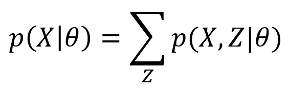
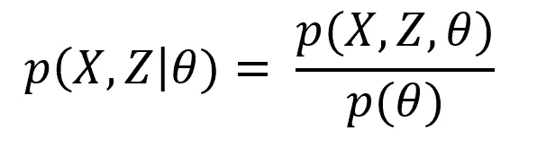
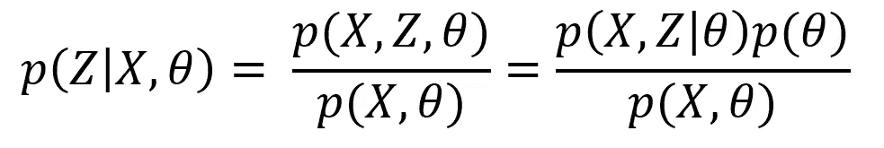
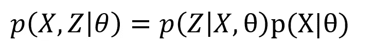
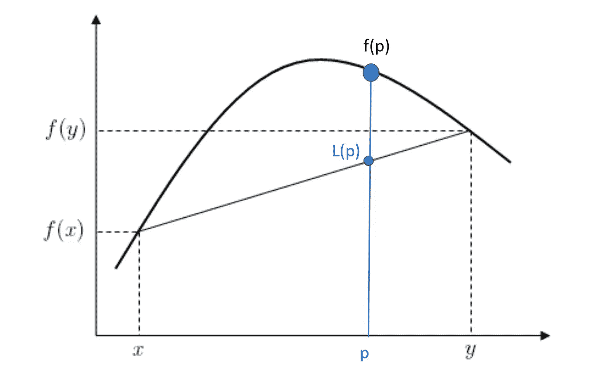
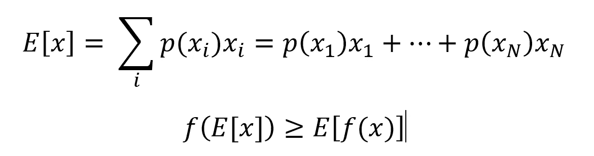
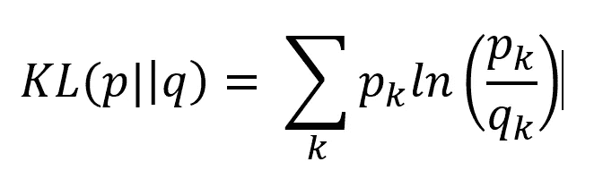
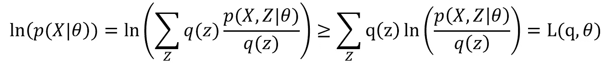
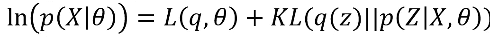

# EM 算法的初级读本

> 原文：<https://towardsdatascience.com/a-primer-on-the-em-algorithm-7bd60e9813e?source=collection_archive---------22----------------------->

克里斯蒂安·祖尼加博士

图一。用于混合模型的 EM 模型示例[1]

期望最大化(EM)算法是机器学习中用于估计模型参数的主要算法之一[2][3][4]。例如，它用于估计混合模型中的混合系数、均值和协方差，如图 1 所示。其目标是最大化似然 p(X|θ),其中 X 是观测数据的矩阵，θ是模型参数的向量。这是最大似然估计，实际上对数似然 ln p(X| θ)是最大的。最大化该函数的模型参数被认为是正确的模型参数。EM 是梯度下降的有用替代，并且可能具有几个优点。

1 它更自然地实施约束，例如保持协方差矩阵正定。

2.在许多情况下，例如对于混合模型，它可能收敛得更快。

3.它提供了一种处理缺失数据的方法。

不幸的是，EM 算法对初学者来说可能不容易理解。EM 算法的第一步是假设存在帮助生成数据的隐藏变量 Z。只有数据 X 被直接观察到。隐藏变量有助于将问题分成两个步骤，有时更简单，期望和最大化。通过对联合分布 p(X，Z | θ)进行边缘化，可以将可能性写成隐藏变量 Z 的形式。总和是 z 的所有可能值。

推导 EM 算法需要理解三个主要概念:两个以上变量的 Bayes 定理、凹函数的 Jensen 不等式以及比较概率分布的 Kullback-Leibler 散度。

贝叶斯定理在 em 算法中起着重要的作用。许多人都熟悉两个变量的定理，但是如上所示，三个变量会发生什么呢？虽然形式更复杂，但条件概率的定义仍然适用，它可以用联合分布 p(X，Z，θ)来表示。

无论变量的顺序如何，联合分布都是相同的，这是操纵所有条件概率的基础。在 EM 算法中，将使用 X 和θ来估计 Z，因此条件概率 p(Z | X，θ)很重要。使用上式中的联合分布，Z 的后验分布可表示如下。

方程可以简化为 p(X | θ) = p(X，θ)/p(θ)。

詹森不等式是获得 EM 算法所需的第二个结果。对于凹函数 f(x)，f(x)的期望 E[f(x)]，小于或等于先应用函数再取期望 f(E[x])。简洁地说，E[f(x)] ≤ f(E[x])。

像对数一样，凹函数是那些向外“凸出”的函数，如图 2 所示。该函数总是大于或等于弦。数学上，对于 x 和 y 之间的任意点 p，f(p) ≥ L(p)其中 L(p)是在 p 处评估的线的值。点 p(或 x 和 y 之间的任意点)可以通过 p = w1 x + w2 y 表示为 x 和 y 的加权组合。权重大于零，总和为 1。利用直线的方程，值 L(p)可以写成 L(p) = w2 f(y) + (1- w2) f(x)。所以对于凹函数*f(w1 x+w2 y)≥w2 f(y)+(1-w2)f(x)*。

图 2 凹函数位于任意弦之上。

显示詹森不等式的下一步如下，因为期望可以被认为是一个加权和，概率分布给出了权重。一般来说，概率会给出两个以上的权重，但前面的结果可以归纳为许多权重。

要理解的最后一个概念是 Kullback-Leibler 散度，它是两个概率分布 q(z)和 p(z)之间不相似性的度量。当两个分布相等时，KL 散度总是大于或等于零，q(z) = p(z)。它不是对称的，KL(p||q) ≠ KL(q||p)，所以它不是距离测度。当真实分布是 p(z)时，它可以被解释为使用分布 q(z)编码数据所需的额外比特数，反之亦然。

掌握了这 3 个概念，EM 算法就更容易理解了。隐藏变量 Z 也具有分布 q(Z)。将 q(z)作为 q(z)/q(z) = 1 引入对数似然中，并利用对数函数是凹的这一事实，詹森不等式给出了关于分布 q(z)的期望。

这个不等式给出了对数似然的一个下界。对数似然和 L(q，θ)之间的差异可以看作是 q(z)和 p(Z|X，θ)之间的 KL 散度。用 p(X，Z| θ) = P(Z|X，θ)P(X| θ)的展开式来证明这一点。

当 KL 散度为零时，或者当 q(z) = p(Z|X，θ)时，完全相等。

最大化对数似然可以通过最大化 L(q，θ)来间接实现。有两种方法可以最大化 L，即改变 q 或改变参数θ。独立地改变每一个更简单。顾名思义，EM 算法有两个步骤，期望和最大化，并迭代进行。首先初始化参数。分布 q(z)在期望步骤中更新，保持参数θ固定为θold。这仅仅涉及到设置 q(z) = p(Z|X，θold)。然后更新参数θ以最大化 L(q，θ),保持在最大化步骤中固定的 q(z)。

**期待**

设 q(z) = p(Z|X，θold)代入 L。

**最大化**

保持 q(z)不变，改变θ，最大化 L(p(Z|X，θold)，θ。

这两个步骤保证总是增加可能性并且至少收敛到局部最大值。最大化步骤可以根据分布的形式以不同的方式进行。例如，在高斯混合模型中，最大似然估计的修改给出了分析结果。在其他情况下，可能没有解析解，但是求解最大化步骤可能仍然比原始问题简单。

**参考文献**

[1]https://en.wikipedia.org/wiki/[期望% E2 % 80 %最大化 _ 算法](https://en.wikipedia.org/wiki/)

【2】邓普斯特；[莱尔德，n . m .](https://en.wikipedia.org/wiki/Nan_Laird)；鲁宾，D.B. (1977)。“通过 EM 算法不完整数据的最大可能性”。 [*《英国皇家统计学会杂志》，B 辑*](https://en.wikipedia.org/wiki/Journal_of_the_Royal_Statistical_Society,_Series_B) 。**39**(1):1–38。[JSTOR](https://en.wikipedia.org/wiki/JSTOR_(identifier))2984875

[3] Bishop 模式识别和机器学习 Springer 2006

[4]墨菲机器学习从概率角度看麻省理工学院出版社 2012 年