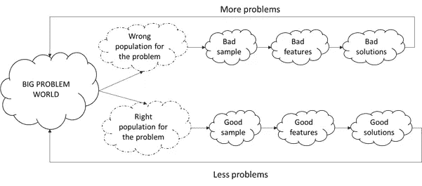

# 机器学习数据挖掘中偏差的来源

> 原文：<https://towardsdatascience.com/a-primer-on-the-sources-of-biases-in-data-mining-for-machine-learning-d82e89604693?source=collection_archive---------26----------------------->

## 尽管通过大数据实现的自动化水平不断提高，但大部分数据挖掘和机器学习过程仍然依赖于人的干预，从而引入了不同的偏见。

摄影:[JESHOOTS.COM](https://unsplash.com/@jeshoots)在[的 Unsplash](https://unsplash.com/photos/fzOITuS1DIQ)

在过去几十年中，生成的结构化和非结构化数据的数量呈指数级增长，并且在未来几年还将继续增长。“大数据”分析可能会克服企业和政府几个世纪以来在决策时面临的众多挑战:缺乏足够的数据来制定政策(例如，针对特定社会群体的政策)或检查市场或消费者预期(例如，推荐系统)。由大数据范式驱动的描述性和预测性建模可以帮助决策者获得对个人、商业或集体收益的宝贵见解。

然而，现代数据收集过程和算法仍然容易受到数据挖掘偏见的影响。如果不采取适当的措施，大数据可能会放大现有社会问题(如种族歧视)的负面影响，使研究结果变得毫无价值，甚至适得其反[1]，[2]。本博客的目的是探索在数据挖掘过程中以及大数据项目的特征工程阶段可能引入的偏差的潜在来源。

# 垃圾进垃圾出—大数据也是如此

大数据有可能克服数据可用性的限制，这是一个困扰传统统计分析几十年的问题，但这种分析的价值也容易受到数据质量和数据应用不当的影响。随着数字设备的日益普及，收集各种数据变得比以往任何时候都更加容易。例如，智能手机有能力实时记录你在哪里，你在做什么，你如何花费你的时间和金钱，你和谁见面，多长时间，以及许多这样的个人细节。尽管存在隐私和监控问题，但这些信息已经改变了经济和我们的生活方式。

尽管如此，就像老派的数据分析一样，新数据范式的成功也取决于相同假设的有效性——目标人群包括与被调查问题相关的所有成员；样本反映了统计总体；并且建模变量的选择是适当的。违反任何假设都会导致有偏见的结论，从而降低机器学习解决许多现实世界问题的价值。

图 1 描绘了机器学习练习中的典型步骤序列，并显示了不同的错误如何强化现有的问题。虽然谨慎使用将提供有效的解决方案并减少我们的问题，但任何错误都可能延续或恶化现有的问题(差异、歧视或其他)。

图片由作者根据[2]中的信息提供

# 第一部分:确定目标人群

数据分析练习的早期步骤之一(如果不是第一步的话)是询问谁或哪些成员最有可能拥有我们需要的信息或熟悉我们试图解决的问题。这组成员是我们期望的群体(姑且称之为**问题群体**)来考虑样本收集。训练数据样本的代表性必须仅针对与问题有直接联系的问题群体进行测量。

例如，假设一个道路维护部门想要使用众包(通过智能手机)来监控整个城市的道路状况[1]。虽然似乎居住在该地区的所有人都应该是目标人群，但只有在该地区的道路上行驶的人(作为乘客或司机)才是真正的目标人群(我们的问题人群)。来自不旅行或不开车的人的设备的加速度计数据不会增加任何价值。同样，对于招聘目标，所有潜在合格(满足强制性资格要求)的员工都是抽样人群，而不是所有毕业生或求职者。另一个明显的例子是衡量谁会赢得选举的抽样人口。大多数青少年的意见在民意测验中并不重要，因为只有选民(在大多数国家是 18 岁以上的人)才构成选举调查的人口。有多少年轻人被调查并不重要；调查结果或任何基于这种信息的预测模型将是无用的。

虽然在大多数情况下，完成这一步对于适当描述的问题来说可能是微不足道的，但是任何无意的错误都可能对我们工作的准确性和相关性产生巨大的影响。在我们的例子中，在定义了所有驾车者的目标人群后，道路部门现在必须设计一个策略来从一个有代表性的，即使是少量的道路使用者那里收集数据(暂时不包括骑自行车的人和步行的人)。

# 第二部分:确保有代表性的培训数据

任何小数据或大数据应用的价值取决于训练数据描述问题群体的准确程度。虽然大数据意味着一个巨大的数据集，但它很少代表整个问题群体，并且只捕获其中的一部分，这增加了代表性采样的重要性。创建不反映潜在问题群体的组成的训练数据集将强调某些成员而不代表其他成员。维基百科[有一个长长的采样偏差列表](https://en.wikipedia.org/wiki/Sampling_bias)，包括选择偏差、排除偏差、报告偏差、检测偏差，这个列表还可以继续下去。事实上，一个小的，但有代表性的样本可以产生比一个大的，有偏见的数据集更可靠的结果[3]。

例如，在上述道路监控项目中，如果该部门依靠智能手机中的加速度计来收集信息，则缺乏此类高科技设备或充足互联网接入的低收入群体可能无法成为样本的一部分[1]。有偏见的数据可能导致纳税人的钱不公平地分配给道路开发和维修，导致一个城市内道路基础设施质量的系统性差异。互联网接入不畅也会限制职位候选人名单，或者简历中的用词会导致招聘中的性别偏见。

# 第三部分:选择代表性特征

预测因子的选择也会影响模型中如何考虑不同的人群成员。即使我们正确地识别了问题人群，并为训练抽取了一个代表性的样本，输入变量中仍然存在某些差异。可能有许多特征捕捉到群体中某些成员的不完整图像，并且对有偏见的预测者赋予更大的权重将产生不期望的结果。因此，尽管样本很好地描述了所有的人口阶层，但特征工程会间接低估或高估某些群体，并影响模型的公平性。

例如，表面上中性的特征之间的小相关性会产生不公平的结果。如果好斗的司机和老年人都更喜欢红色汽车，对红色汽车收取更高的保险费来惩罚糟糕的司机的决定将间接地对老年人有偏见[2]。

如[2]中所引用的，“被错误代表的群体与已经存在社会偏见(如偏见或歧视)的社会群体相吻合，甚至“无偏见的计算过程也可能导致歧视性的决策程序”。此类风险适用于采样和特征选择步骤。

例如，雇佣好员工取决于“好”的定义，这可以基于过去工作的平均时间或证明的成就记录。使用任期长度作为一个特征会不成比例地排斥在高招聘周转率(或流失率)行业工作的某些人[1]。虽然它是衡量员工忠诚度的理想替代指标，但将其不必要地纳入模型可能会产生主导影响，并延续大数据被认为正在缩小的差异。因此，尽管尽了最大努力来定义人口和收集良好的数据，但选择错误的要素可能会在结果中引入系统性偏差，从而导致问题的出现。

# 最后的想法

大数据分析有可能克服由个人和人类决策产生的许多偏见，并呈现合理的、有代表性的人口状况。这篇博客的目的是介绍偏见如何成为机器学习建模练习的一部分。在执行数据挖掘和进行机器学习项目时，分析师必须意识到以下三个可能会削弱机器学习项目功效的原因:

未能正确识别与问题相关的统计(问题)人群

使用非代表性训练数据进行预测建模

用于预测目标变量的特征的有偏选择

常言道，“能力越强，责任越大”，在数据挖掘和特征工程方面的任何疏忽都可能使现有问题恶化，而这些努力将会适得其反。只有大数据、其易访问性和明智的数据挖掘的综合效应才有可能彻底改变我们的日常生活，实现环境可持续、社会公平和经济充满活力的世界。

# 参考

[1] S. Barocas 和 A. D. Selbst，“大数据的不同影响”，*《加州法律评论》*，第 104 卷，第 3 期，第 671–732 页，2016 年 2 月。

[2] E. Ntoutsi *等*，《数据驱动的人工智能系统中的偏差——一项介绍性调查》， *WIREs Data Min。知道了。Discov。*，第 10 卷第 3 期，第 e1356 页，2020 年 5 月。

[3]j . j . farage 和 N. H. Augustin，“当小数据打败大数据”， *Stat。可能吧。列特。*，第 136 卷，第 142–145 页，2018 年。

[4] J. Manyika、J. Silberg 和 B. Presten，“我们如何应对人工智能中的偏见？," 2019.【在线】。可用:[https://HBR . org/2019/10/what-do-we-do-about-the-bias-in-ai。](https://hbr.org/2019/10/what-do-we-do-about-the-biases-in-ai.)