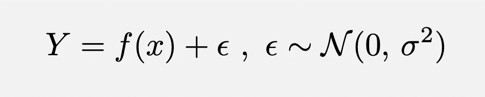
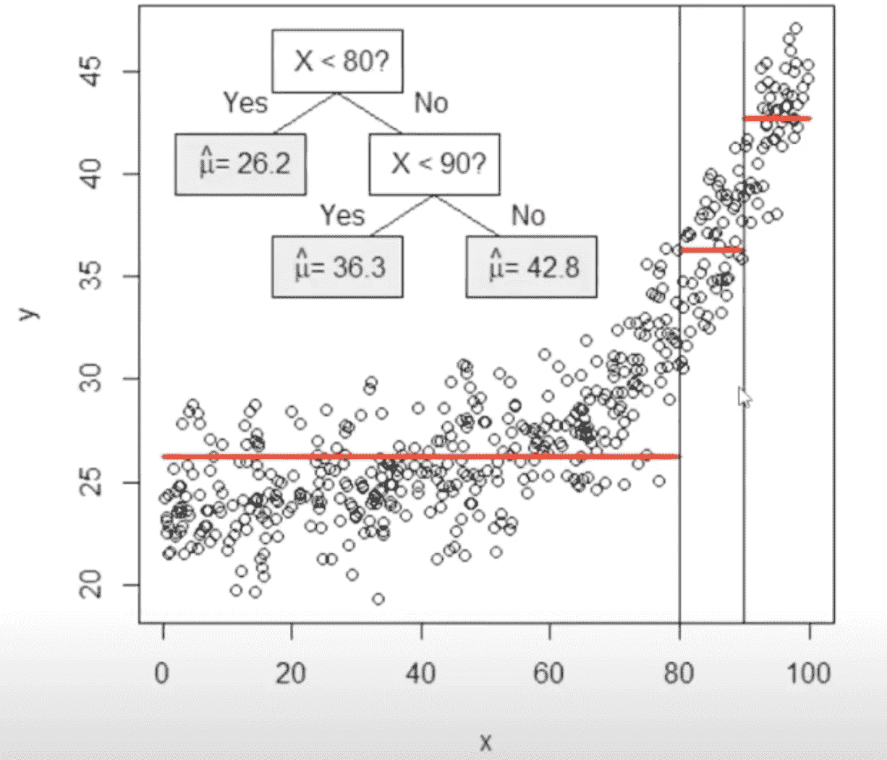
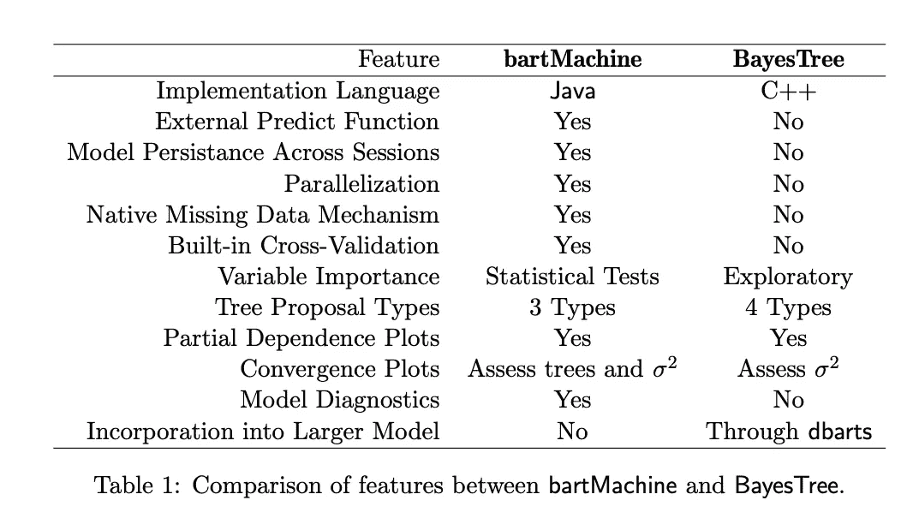
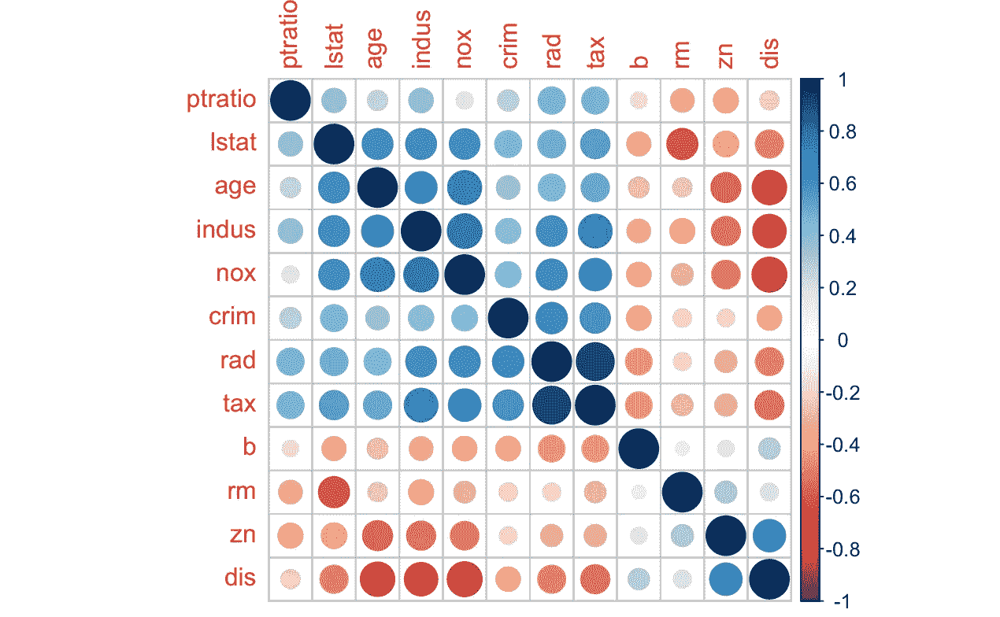
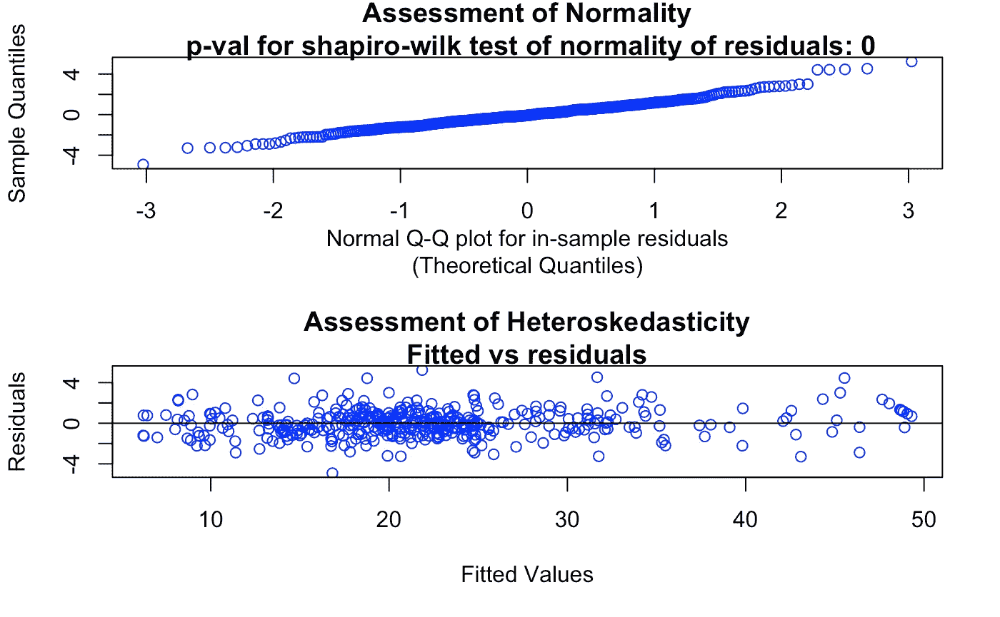
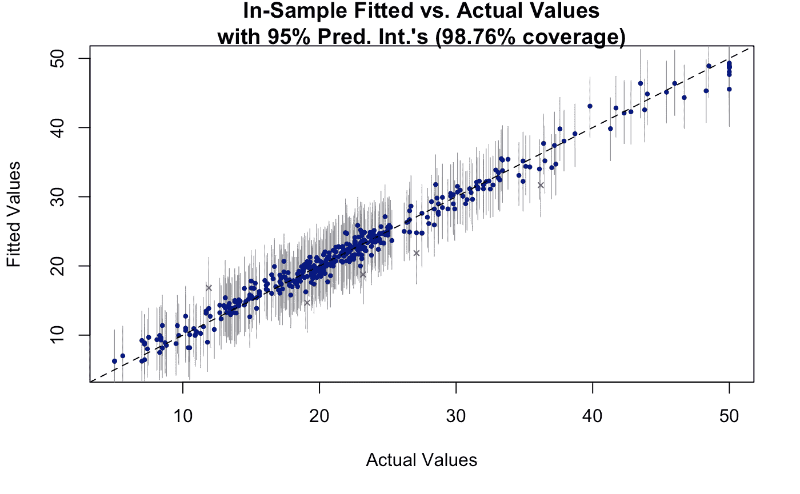
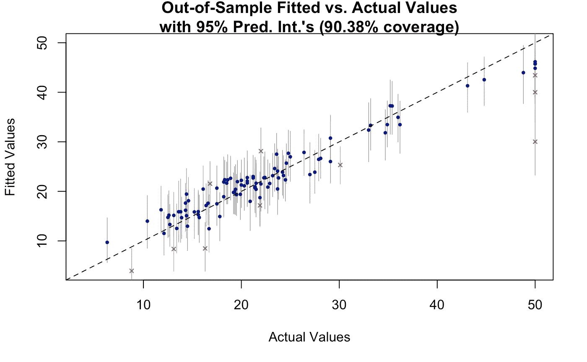
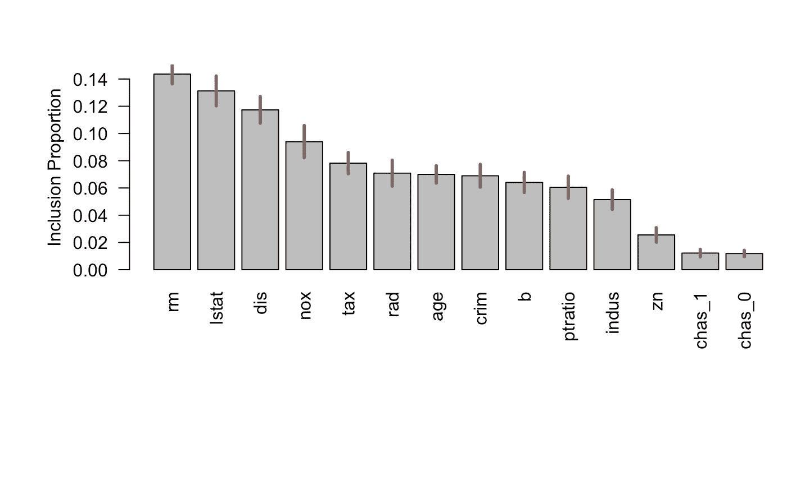

# 带 R 的贝叶斯可加回归树入门

> 原文：<https://towardsdatascience.com/a-primer-to-bayesian-additive-regression-tree-with-r-b9d0dbf704d?source=collection_archive---------8----------------------->

## 传统集成算法的贝叶斯方法

由 [kazuend](https://unsplash.com/@kazuend?utm_source=unsplash&utm_medium=referral&utm_content=creditCopyText) 在 [Unsplash](https://unsplash.com/s/photos/forest?utm_source=unsplash&utm_medium=referral&utm_content=creditCopyText) 拍摄的照片

# **简介**

在 XGBoost、Lightgbm 和 catboost 在几次高调的 kaggle 竞赛和机器学习研究中取得巨大成功之后，梯度增强机器(GBM)/集成算法成为许多涉及结构化数据的机器学习问题的主力。GBM 如此成功的原因之一是它可以同样好地处理数值和分类数据。然而，这些传统的基于集成的方法的问题是，它们给我们一个点估计，因此，我们没有办法估计该特定估计有多可信。通过量化经验风险，即 rmse、对数损失等。，我们可以得到一种模型不确定性的感觉(认知不确定性)；然而，对于迭代主动学习或更好的风险管理(对于高风险情况)，随机不确定性或个体预测不确定性也是非常重要的。为了缓解这个问题，Chipman 等人发表了这篇[论文](http://www-stat.wharton.upenn.edu/~edgeorge/Research_papers/BART%20June%2008.pdf)，这是由系综方法的相同精神所激发的；然而，它需要贝叶斯方法来识别模型参数，其中我们可以对我们关于树的形状和总体结构的先验信念进行编码。然后，基于该数据，它将使用 MCMC 反向拟合算法更新先验。在他们的文章中，他们声称在 42 个数据集(包括模拟和药物发现数据)上，它优于其他传统的集成方法。在这篇文章中，我的目的是用波士顿住房数据集上的一个说明性例子来证明这种说法。

# 树木的集合

系综树的想法来自于这样一种想法，即通过组合比随机猜测稍好的弱学习者的集合，我们可以得到一个强学习者。这些个体学习者中每一个都是低偏差-高方差模型。当组合在一起形成一个集合时，这些树形成一个中等偏差-中等方差模型，该模型在理论和实践上都具有极好的样本外预测性能。

做出推论的一般问题可以写成:

在集成算法中，未知函数被近似为树的和 h(x)。树和模型是一个以多元成分为核心的加性模型，与广义加性模型相反，它可以自然地包括交互作用效应。此外，它还可以包括单棵树无法获得的附加效果。由于这些优异的性质，系综方法吸引了大量的注意力，并导致了 boosting [ [Friedman，2001](https://www.jstor.org/stable/2699986) ]、random forest [ [Breiman，2001](https://link.springer.com/article/10.1023/A:1010933404324) ]和 bagging [ [Breiman，1996](https://link.springer.com/article/10.1007/BF00058655) ]的发展。随机森林使用特征子集来构建每棵树，然后将所有这些单棵树的预测进行组合。相比之下，bagging 使用数据的子集来构建每棵树。Boosting 与其他两种不同之处在于，它按顺序形成模型，其中每棵树都试图适应前一棵树无法解释的数据变化。贝叶斯加性回归树(BART)类似于 Boosting 算法，因为它结合了顺序弱学习者的贡献来进行预测。

# 贝叶斯加性回归树

在 BART 中，类似于梯度提升的反向拟合算法用于获得树的集合，其中一棵小树与数据拟合，然后该树的残差与另一棵树迭代拟合。然而，BART 在两个方面不同于 GBM，1 .它如何通过使用先验来削弱单个树，以及 2 .它如何在固定数量的树上使用贝叶斯反向拟合来迭代拟合新树。

拟合单棵树(信用:[https://www.youtube.com/watch?v=9d5-3_7u5a4&ab _ channel = PutnamDataSciences](https://www.youtube.com/watch?v=9d5-3_7u5a4&ab_channel=PutnamDataSciences)

在 GBM 中，存在巨大的过度拟合风险，因为我们可以不断迭代，直到我们的经验风险在训练集示例上最小化(此时，所有这些树中存在的比特如此之大，以至于它本质上记住了所有的训练点，而不是概括)。在传统的 GBM 中，限制树深或提前停止等。来规范算法。相比之下，BART 使用智能先验系统地学习树木的收缩量或深度。先验是这样选择的，1。树很小，2。与每个树终端节点相关联的参数值趋向于零(限制灵活性)，以及 3。残留噪声的标准差较小。有趣的是，树的数量没有被控制在先验范围内，因为这将导致优化过程中巨大的计算成本。相反，它被设置为默认值 50，这对于大多数应用程序来说已经很不错了。在获得上述三个参数的后验分布后，通过从模型空间(三个参数的后验)连续抽取样本，用反拟合算法进行推断。通过取所有这些图的平均值，我们可以得到任何试验数据的点估计。类似地，相应的分位数给出了测试数据的不确定性区间。

现在是使用 BART 建立预测模型的时候了。对于这部分，我们使用 r 中可用的 [bartmachine](https://cran.r-project.org/web/packages/bartMachine/bartMachine.pdf) 包，程序的核心是用 java 编写的。BART 的原作者的本机实现( [bayestree](https://cran.r-project.org/web/packages/BayesTree/BayesTree.pdf) )是用 C++编写的，但是它有几个限制(如下所列)。

信用:【https://arxiv.org/pdf/1312.2171.pdf】T4

在本练习中，我们将使用波士顿住房数据，这些数据在 R 中不可用，但我们可以通过 mlbench 软件包轻松获得。在下面的代码中，我们将数据加载到 R:

接下来，我们使用 caret 包将数据分为训练集和测试集:

接下来，我们绘制目标变量的直方图，它是一组特征的房价中值:

中间价直方图

要查看数据中每个要素之间的相关性，我们可以查看相关图:

相关图

看起来在一些特征之间有一些高相关性，这对于其他 ml 算法可能是一个问题，但是对于基于树的集成，我们可以安全地忽略它们。现在，我们可以初始化 bartmachine:

对于大约 400 个数据点和 13 个特征来说，它非常快(只需要大约 2-3 秒)。训练数据的均方根误差为 1.4，考虑到目标值范围在 4-50 之间，这已经相当不错了。夏皮罗-维尔克检验的 p 值表明数据是异方差的。

使用 rmse_by_num_trees 函数，我们可以很容易地找到最佳的树数，而不是使用默认的 50。

基于 rmse 对树数量的图，我们用 65 棵树重新训练该模型，并绘制收敛诊断图。

会聚诊断图

我们可以看到，MCMC 采样在大约 200 次迭代时达到收敛。到 2010 年，它仍在波动。跑更长的时间和更多的磨合是有益的。然而，对于这个练习，这种收敛行为可以被认为是可接受的。

接下来，我们可以使用内置函数查看剩余属性:

残差或多或少在零附近波动，但总体上残差看起来呈正态分布。现在，我们通过绘制预测中值价格与实际中值价格的平价图来说明该算法在训练集和测试集上的性能。

列车数据的奇偶图

测试数据的奇偶图

这令人印象深刻，因为我们现在能够给出每个数据点的(95%预测区间)预测范围，其准确度约为 90%。我们还可以在测试集上计算 rmse 和其他指标。

测试集上的 rmse 为 3.52，r 平方值为 0.89，pearson r 为 0.94。现在，让我们检查一下作者们的说法是真是假。我们用 python 对波士顿住房数据运行了 XGBoost 算法:

这两种实现之间只有微小的差别。通过一些超参数优化，结果可能会改变(我也对训练和测试集使用随机 80–20 分割)。总之，bartmachine 的性能令人印象深刻，因为它也可以给我们一些内在的估计不确定性。

我们还可以使用 bartmachine 中可用的函数来绘制特性重要性:

特征重要性图

# 摘要

*   BART 是一种非常复杂的算法，能够提供与用于构建模型的参数相关的内置不确定性估计。
*   对于各种各样的现实世界机器学习问题，BART 是一个很好的选择。
*   它可以用于设计空间的迭代探索(贝叶斯主动学习),以最小化收集昂贵数据的成本。