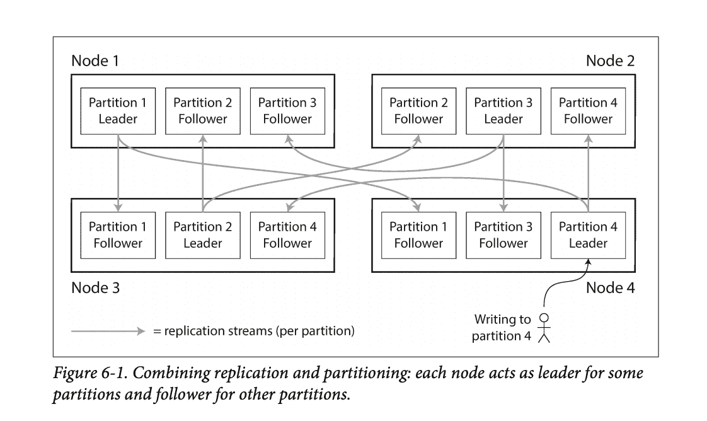
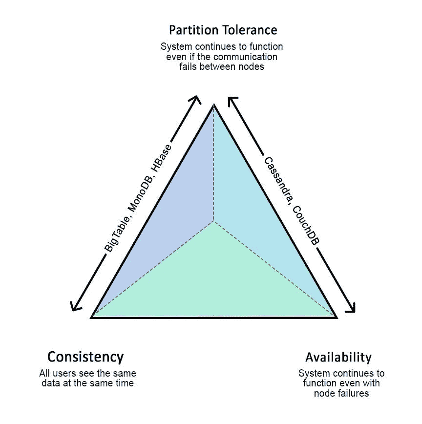

# 大型复杂系统入门

> 原文：<https://towardsdatascience.com/a-primer-to-big-complex-systems-3aba21849fb9?source=collection_archive---------53----------------------->

图片来自 [Pixabay](https://pixabay.com/photos/launch-pad-rocket-launch-night-67650/) 的 [WikiImages](https://pixabay.com/users/wikiimages-1897/?utm_source=link-attribution&utm_medium=referral&utm_campaign=image&utm_content=67650) 。

航天飞机、电信网络，甚至新的高科技创业公司都是大型复杂系统的家园。这些系统雇佣了不同团队的数千名软件开发人员。尽管大系统没有一个确切的科学定义，我们将包含多个服务的系统称为“大系统”通过大量的维基百科链接提供了额外的清晰度，但整体结构的灵感来自于[马丁·凯普曼](https://twitter.com/martinkl?ref_src=twsrc%5Egoogle%7Ctwcamp%5Eserp%7Ctwgr%5Eauthor)的“[设计数据密集型应用](https://www.amazon.com/Designing-Data-Intensive-Applications-Reliable-Maintainable/dp/1449373321)

这些系统可以[容错](https://en.wikipedia.org/wiki/Fault_tolerance)，这意味着一个部分偏离预期行为不一定会削弱系统的其余部分。它们还可以自我修复，即在某些意外情况下，系统服务可以自动恢复，无需人工干预。它们也可以是[幂等的](https://en.wikipedia.org/wiki/Idempotence)，这意味着在系统中多次运行输入不会比第一次运行相同的输入改变系统的状态。这些系统可以是无状态的，这意味着服务的任何实例都可以处理任何输入，或者相反是有状态的，这意味着一些实例专用于处理特定的输入。推荐无状态，因为它使我们的组件从令人头疼的协调中解脱出来，这将在后面讨论。

这些系统的输入满足一些先决条件。如果执行成功终止，它们的输出必须满足一组后置条件。这被称为合同[设计](https://en.wikipedia.org/wiki/Design_by_contract)，是系统所有[正确性](https://en.wikipedia.org/wiki/Correctness_(computer_science))测试的基础。

这些系统满足功能需求，这意味着系统应该做它应该做的事情。以 Airbnb 为例；列出西雅图所有的海滨别墅，点击应用程序的按钮时预订正确的海滨别墅是两个功能需求。

这些大系统也满足非功能性需求。非功能性需求依赖于应用程序的业务需求；它们包括(但不限于)[可用性](https://en.wikipedia.org/wiki/High_availability_software)、[可伸缩性](https://en.wikipedia.org/wiki/Scalability)、[可靠性](https://en.wikipedia.org/wiki/Reliability_engineering)、[一致性](https://en.wikipedia.org/wiki/Consistency)和[性能](https://en.wikipedia.org/wiki/Performance_engineering)(无论是[响应时间](https://en.wikipedia.org/wiki/Response_time_(technology))、[吞吐量](https://en.wikipedia.org/wiki/Throughput)，还是另一个度量)。例如，预订海滨别墅应该在可接受的时间内(可能不到 5 秒)，并且网站应该整天都在运行。

# 术语

*   *节点*是网络上的单台计算机(或设备)。
*   *系统状态*是指系统跟踪的[元数据](https://en.wikipedia.org/wiki/Metadata)。
*   *读请求*是在不改变系统状态的情况下从数据库中获取的一条信息。
*   *写请求*导致系统状态改变。

# 微服务的炒作

在本文中，我们讨论[“无共享”架构](https://en.wikipedia.org/wiki/Shared-nothing_architecture)，即那些依赖于[水平伸缩](https://en.wikipedia.org/wiki/Scalability#Horizontal_or_scale_out)的架构。这些系统通过一起添加更多节点来扩展，而不是用额外的资源(如 CPU、内存和硬盘)来增强同一个节点。这是业内使用的主要模式，并在[云计算](https://en.wikipedia.org/wiki/Cloud_computing)中使用。

到目前为止，我们将系统的不同部分称为组件。业内使用的术语是[微服务](https://en.wikipedia.org/wiki/Microservices)(早期[面向服务架构](https://en.wikipedia.org/wiki/Service-oriented_architecture)的更名)。很像[面向对象编程](https://en.wikipedia.org/wiki/Object-oriented_programming)中的[类](https://en.wikipedia.org/wiki/Class_(computer_programming))，微服务应该有一个单一的职责。我们不应该仅仅因为方便就把不相关的功能聚集到一个微服务中。

应用程序架构应将数据节点与控制节点(即数据库中的数据)和“计算”节点中的控制逻辑分开。数据确实比代码更长寿，所以如果我们需要修改系统，混合关注可能是一场噩梦。通常，代码应该准备好处理[向后](https://en.wikipedia.org/wiki/Backward_compatibility)和[向前](https://en.wikipedia.org/wiki/Forward_compatibility)兼容性，这有点棘手。

这些不同的微服务使用网络调用或队列进行交互，以满足功能需求。它们应该是模块化的和可维护的。这些微服务应该是可扩展的，即能够在系统变化最小的情况下提供 10 倍的流量，并且在纵向扩展系统时几乎没有明显的性能差异。

设计一个微服务很像设计一个[应用编程接口(API)](https://en.wikipedia.org/wiki/API) 。微服务应该在稳定且相对简单的抽象背后隐藏大量的实现细节。他们应该不惜一切代价避免意外的复杂性。

现在，这些微服务使用队列、数据库、缓存和协调服务来完成它们的工作。就像在编写程序时导入库一样，使用数据库或队列使设计服务变得更容易，因为您依赖于数据库或队列提供的保证。

# 数据库

我们使用术语“数据库”作为一个包罗万象的术语。使用这样的定义，几乎每个数据节点都可以被认为是一个数据库。数据库有不同的类型和风格，从[关系数据库](https://en.wikipedia.org/wiki/Relational_database)到[文档数据库](https://en.wikipedia.org/wiki/Document-oriented_database)，从[图形数据库](https://en.wikipedia.org/wiki/Graph_database)到[分布式缓存](https://en.wikipedia.org/wiki/Distributed_cache)。一些人认为，即使是[队列](https://en.wikipedia.org/wiki/Message_queuing_service)也是一种特殊的数据库。

通常，数据库的选择是根据应用程序中涉及的实体、它们的关系以及预期的加入流量来进行的。例如，一个图形数据库可以用一个关系模型来表示，该模型在各行之间有大量的连接，这降低了开发人员的工作效率和数据库的性能。

将密钥映射到硬盘的数据库模块称为存储引擎。通常使用[日志结构合并树(LSM)](https://en.wikipedia.org/wiki/Log-structured_merge-tree) 或 [B 树](https://en.wikipedia.org/wiki/B-tree)来实现。不管[索引](https://en.wikipedia.org/wiki/Database_index)是如何实现的，数据库都使用[预写日志(WAL)](https://en.wikipedia.org/wiki/Write-ahead_logging) 将事务写入磁盘，然后再将它们应用到数据库。它是用来在系统崩溃时恢复系统的。

一些数据库为[事务](https://en.wikipedia.org/wiki/Database_transaction)提供 [ACID](https://en.wikipedia.org/wiki/ACID) (原子、一致性、隔离和持久性)保证。原子的意思是“要么全部要么什么都没有”一致性高度依赖于应用程序对它的定义。隔离意味着一个事务独立于所有其他事务执行。持久性意味着在向应用程序确认成功之前，更改被持久保存在磁盘上(或复制到不同的节点)。

# 隔离级别

数据库异常源于应用程序的使用和隔离级别(数据库的保证)。对于某些应用程序，这些异常永远不会发生。异常情况的例子包括:

*   [脏读](https://en.wikipedia.org/wiki/Isolation_(database_systems)#Dirty_reads):一个事务读取一个已经被另一个事务修改过但还没有提交的记录。
*   脏写:一个事务写入一个已被另一个事务修改但尚未提交的记录。
*   [不可重复读取](https://en.wikipedia.org/wiki/Isolation_(database_systems)#Non-repeatable_reads):一个事务读取同一个记录两次，在整个事务中得到不同的结果。
*   [幻影读取](https://en.wikipedia.org/wiki/Isolation_(database_systems)#Phantom_reads):在交易过程中，记录被添加/删除。
*   [丢失更新](https://dzone.com/articles/what-is-a-lost-update-in-database-systems):一种[竞争条件](https://en.wikipedia.org/wiki/Race_condition)，其结果是由于一系列不受控制的事件造成的。例如，几个事务可能同时执行，因此一个写操作会覆盖另一个。
*   [写偏斜](https://stackoverflow.com/questions/48417632/why-write-skew-can-happen-in-repeatable-reads):基于陈旧数据的更新事务。

为了处理上面提到的一些异常情况，学术界和工业界的工程师提出了隔离级别。尽管这些隔离级别是标准的，但在尝试使用它们之前，最好多读几遍特定数据库的文档:

*   [提交读](https://en.wikipedia.org/wiki/Isolation_(database_systems)#Read_committed):允许无脏读和无脏写。
*   [快照隔离](https://en.wikipedia.org/wiki/Snapshot_isolation):写不阻塞读，读不阻塞写。每个事务都基于数据库的一致快照。
*   [可串行化](https://en.wikipedia.org/wiki/Isolation_(database_systems)#Serializable):即使使用了[多线程](https://en.wikipedia.org/wiki/Multithreading_(computer_architecture))，也能模拟串行执行。这种隔离模式处理所有数据库异常。实现方式有:串行执行，悲观锁:[两阶段锁](https://en.wikipedia.org/wiki/Two-phase_locking)，或者乐观锁。

# 缩放比例

扩展包括复制和分区。我们专门为每一个小节。

# 分身术

图片由来自 [Pixabay](https://pixabay.com/?utm_source=link-attribution&utm_medium=referral&utm_campaign=image&utm_content=927272) 的 [Herbert Bieser](https://pixabay.com/users/hbieser-343207/?utm_source=link-attribution&utm_medium=referral&utm_campaign=image&utm_content=927272) 提供。

分布式系统的第一条规则是节点失效。他们突然地、出乎意料地失败了。为了防止节点故障时数据丢失，我们使用复制，因为它提供了冗余。如果数据只存在于一个节点上，那么我们将需要手动干预来恢复数据并解除阻止试图从故障节点访问其帐户信息的用户。人工干预不利于非常理想的自愈。人工干预需要几个小时，自我修复只需几秒钟。

防止[单点故障(SPOF)](https://en.wikipedia.org/wiki/Single_point_of_failure) 的一种方法是将所有数据从一个节点复制到其他节点。复制还有助于提高读取流量性能，因为读取可以定向到更多节点，从而减轻了每个节点的压力。虽然复制是有益的，但它的困难在于保持数据与写请求同步。我们简要讨论三种复制模型。

## 单头复制

由于相对简单，这是主要的模型。这是在 [PostgreSQL](https://www.postgresql.org/) 、 [MySQL](https://www.mysql.com/) 和 [MongoDB](https://www.mongodb.com/) 以及其他许多应用中使用的模型。

读取请求可以定向到系统中的任何节点(称为读取副本)。另一方面，写请求必须指向在较早的时间点选出的领导者(或主机)。然后，领导者将更改流(复制日志)传递给其他节点。复制日志可以使用不同的方法实现，如[预写日志](https://en.wikipedia.org/wiki/Write-ahead_logging)或[基于语句的复制](https://dev.mysql.com/doc/refman/8.0/en/replication-sbr-rbr.html)。

一些系统使用主动反熵或读取修复在不同的节点上复制数据。主动反熵通过比较节点间的 [Merkle 树](https://en.wikipedia.org/wiki/Merkle_tree)、[哈希](https://en.wikipedia.org/wiki/Hash_function)的[树](https://en.wikipedia.org/wiki/Tree_(data_structure))来计算出哪些子树需要从一个节点复制到另一个节点。读取修复仅依赖于读取流量来复制不同节点上的数据。如果记录从未被读取，那么数据将无限期地保持陈旧。Riak 为用户提供了两种选择。

与我们之前讨论的 ACID 模型相比，复制滞后产生了 BASE(基本可用、软状态、最终一致性)。基本可用意味着读写流量尽可能可用。软状态意味着读取副本之间的状态可能略有不同。[最终一致性](https://en.wikipedia.org/wiki/Eventual_consistency)意味着最终(在没有额外的写入流量之后)，状态将在所有读取副本中保持一致。

非领导者并不重要，它的失败不会影响系统的状态。然而，领导者故障转移并不简单，必须小心实施。在检测到领导者的失败时，读取复制品应该选举新的领导者来接管。选举新领导人的过程被称为达成共识，我们将在本文稍后讨论。

## 多领导者复制

[网络分区](https://en.wikipedia.org/wiki/Network_partition)确实会发生，而且发生的范围很广。网络分区是指系统中的一些节点与网络中的其他节点断开连接。当单个领导者模型发生这种情况时，写入会被阻止。

这产生了多领导者架构，其中少数领导者可以处理写流量。这些系统更加复杂，需要领导者之间的协调。缺点是写入需要其他节点的一致同意。

## 无领导复制

对于无领导复制，没有节点是特殊的。我们必须写入许多节点(w；写仲裁)和从许多节点(r；read quorum ),其中 w + r > n(节点数),以获得一致的数据。

# 分割

Nuno Silva 在 [Unsplash](https://unsplash.com/?utm_source=unsplash&utm_medium=referral&utm_content=creditCopyText) 上拍摄的照片。

如果我们有一个包含数百万条记录的大型数据库，不可能将所有数据存储在一个节点上。我们必须按照我们坚持的“水平扩展”方法，在多个节点上以某种方式分割数据。每个节点可以有一个(或多个)分区。

有两种流行的分区方案:

**按键分区**

*   简单且易于实施
*   产生“热点”,其中大部分流量只被定向到一些节点
*   范围查询很简单

**通过关键字的散列进行分区**

*   不同版本之间的哈希函数必须一致
*   通过将节点更均匀地分散到多个节点，减少了“热点”
*   范围查询被传递给所有分区，就像在 MongoDB 中，对于其他数据库，像 Couch 和 Riak，它们不支持范围查询

# 复制和分区一起进行

在一个大系统中，复制和分区是齐头并进的。节点将有不同的分区副本，如下图所示。

该图来自“设计数据密集型应用程序”

# 大系统中的协调

协调不是系统的功能需求，而是设计选择。一些系统可以将协调问题外包给缓存、数据库、分布式锁管理器或 Zookeeper。

协调问题包括:

*   选举领导服务器(共识)
*   管理组成员资格
*   崩溃检测:跟踪可用的服务器
*   服务发现
*   将工作分配给节点
*   管理元数据，如分区和故障转移
*   分布式锁管理

尽管有处理[共识](https://en.wikipedia.org/wiki/Consensus_(computer_science))的算法，如 [Paxos](https://en.wikipedia.org/wiki/Paxos_(computer_science)) 和 [Raft](https://en.wikipedia.org/wiki/Raft_(algorithm)) ，但它们并不简单。实现很容易导致错误。外包给第三方系统(如 Zookeeper)只有在牢记第三方系统不可用时产生的运营开销时才有意义。

# 网络问题

文章开头提到，我们依靠[商品硬件](https://en.wikipedia.org/wiki/Commodity_computing)和网络来构建所谓的大系统。这种选择不是没有权衡的。网络不可靠，会导致以下问题:

*   消息延迟和网络分区:没有好的方法来区分网络延迟、网络分区、过载节点或节点崩溃。我们能使用的最好方法是心跳超时，假设一个节点关闭。
*   时钟漂移:即使使用[网络时间协议(NTP)](https://en.wikipedia.org/wiki/Network_Time_Protocol) ，节点也永远无法确定正确的时间。时钟漂移会导致各种各样的问题，从领导者不更新其领导地位，到拥有过期锁的节点认为它仍然有效。

在单领导者架构中，领导者认为自己是领导者，而它不再是领导者(由于网络分区或时钟漂移)，这可能导致[裂脑](https://en.wikipedia.org/wiki/Split-brain_(computing))，从而导致数据损坏。在这种情况下，可以使用击剑令牌。

# 过时的上限定理

尽管[已经过时了](https://martin.kleppmann.com/2015/05/11/please-stop-calling-databases-cp-or-ap.html)，[CAP 定理](https://en.wikipedia.org/wiki/CAP_theorem)指出人们只能从两个事物中选择一个，即[一致性](https://en.wikipedia.org/wiki/Consistency_model)或[可用性](https://en.wikipedia.org/wiki/High_availability_software)，因为网络分区一直在发生。一致性一般是一个模糊的术语，所以我们用单词“[可线性化](https://en.wikipedia.org/wiki/Linearizability)”来代替，一个非常强的一致性模型。

可线性化意味着如果操作 B 在操作 A 完成后开始，操作 B 必须将相同状态的系统视为完成 A 或更新的状态。它不同于 serializable，因为它不假设并发事务。

系统可以是 CP 或 AP；它们可以是一致的(可线性化的)或可用的，但不能同时是一致的和可用的。社交媒体等一些系统牺牲线性化来获得高可用性，而银行等其他应用牺牲可用性来获得线性化。

注意 CA 不可用，只有 CP 和 AP 模式可用。来源:亚斯敏·穆萨提供。

在本文中，我们讨论了具有“无共享”架构的大型系统。我们描述了我们希望在分布式系统中看到的期望属性，如可用性、可靠性和可伸缩性。我们还描述了不同类型的数据库及其隔离级别。然后，我们讨论了扩展系统的一些注意事项，如分区、复制和一致性。

构建一个大的复杂系统是令人兴奋的努力；现在你正在理解，甚至建立你自己的道路上。

这篇文章最初发表在[项目 Nash](https://www.projectnash.com/a-primer-to-big-complex-systems/) 上。