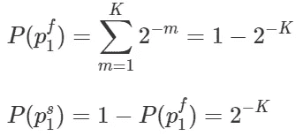

# 你最后一次网飞狂欢的概率

> 原文：<https://towardsdatascience.com/a-probabilistic-take-on-your-last-netflix-binge-86d5296b727f?source=collection_archive---------24----------------------->

## 随机过程的解析和数值/模拟分析

本文采用分析的方法来分析最近流行的网飞系列中的一款游戏——乌贼游戏。我们将制作陈述来描述游戏中涉及的概率，并将使用模拟分析来确认结果。

# **剧透警报**:

这篇文章揭示了网飞的鱿鱼游戏系列中的一些游戏的细节。我还将从总体上谈论剧情，这可能会揭示一些你只有在几个小时的紧张阅读之后才能了解的信息。如果你打算以后看乌贼游戏，我建议你把这篇文章收藏起来，只有在你看完之后再回来看。

美丽的秋天。由 [Marek Piwnicki](https://unsplash.com/@marekpiwnicki) 在 [Unsplash](https://unsplash.com/) 上拍摄的照片。

# 《鱿鱼游戏》

到今天为止，[乌贼游戏](https://en.wikipedia.org/wiki/Squid_Game)仍然是[网飞](https://www.netflix.com/)有史以来最受关注的系列。这部最近上映的韩国电视剧以一场比赛为特色，456 名深陷金融危机的玩家互相对战，争夺赢得约 10 亿₩45 奖金的机会。这场比赛包括 6 个主要的致命游戏，在此期间，不同数量的玩家被淘汰和死亡。我们后来发现，奖金和游戏，据说是通过投注金额放置的贵宾，一个秘密小组的外国人谁一直在游戏和球员打赌。

为了使 VIP 的下注过程尽可能令人兴奋，游戏被设置为玩家需要各种技能和力量来通过每场游戏。例如，体力和策略在第三款拔河游戏中扮演着重要的角色，在这款游戏中，失败的一方将从一个高高竖立的建筑物上跌落并摔死。或者在第一场比赛中，一场敏捷和专注的比赛，玩家需要快速和良好的平衡来逃避死亡。

# 第五场比赛

但也许唯一一个玩家的命运完全由机会决定，运气是唯一决定因素的游戏是第五个游戏，玻璃垫脚石。在这款游戏中，玩家需要穿过一座连接两个高架在地面上方的平台的桥梁。这座桥由几个部分组成，每个部分由两块并排放置的玻璃面板组成。玩家需要从一个区域跳到下一个区域，每次跳跃时，他们需要跳到两个玻璃面板中的一个上，要么是右边的，要么是左边的。这两块面板看起来完全一样。然而，一种是普通玻璃，会在玩家将它们送向灭亡的重量下破碎，另一种是钢化玻璃，更坚固，可以承受玩家的重量。每一个正确的跳跃到钢化玻璃面板上，并且每一次消除向剩余的玩家展示该部分的钢化玻璃。在游戏开始之前，通过随机过程给每个玩家分配一个等级。等级决定了他们登上舰桥的顺序。除此之外，所有玩家都被集体给予一定的时间过桥，否则将面临灭顶之灾。这个游戏显然对玩家不利，玩家一开始就去。但是他们比后面的玩家差很多吗？这就是我们在本文中要量化和衡量的。这个 [YouTube 视频](https://www.youtube.com/watch?v=QFSRkg-ZNic)展示了游戏的 VR 版本。

一座由五部分组成的桥。玩家无法分辨面板(图片由作者提供)。

在实际的系列赛中，在游戏的这一点上，只剩下 16 名玩家，每个人随机分配一个从 1 到 16 的数字，这决定了他们踩桥的顺序。这座桥由 18 部分组成(每部分有两块玻璃板)。任何成功通过所有 18 个部分而没有被淘汰的玩家走上平台并被拯救(暂时的！).

# 分析

我碰到一个 Python 模拟，计算每个玩家的生存概率，我觉得很有趣。我还编写了我的小 Python 模拟，并获得了类似的结果(见下一节)。然而，我决定对概率进行分析建模，为每个生存概率生成封闭形式的表达式，以便可以计算任意数量的玩家和区域的概率。在我们存在之前，让我们把我们的假设列表放在一起。

**假设**:我假设，

*   一旦一个步骤中的钢化玻璃被识别出来，它将被所有还没有到达那个步骤的玩家记住。
*   除了踩在玻璃板上，没有什么能显示这是普通玻璃还是钢化玻璃。
*   玩家根据他们的等级进行游戏，而不用走到另一个玩家站着的面板上。

符号:这里是我用来模拟概率的符号。

从首先站在桥上的不幸选手开始，1 号选手。让我们找出她生存的概率和她在任何阶段被淘汰的概率。

这意味着，对于参与人 1，被淘汰的概率，以及安全过桥的概率是，

对于参与人 2 来说，在阶段 *m* 被淘汰的概率是一个条件概率。

通过归纳，我们可以得出参与人 2 的如下一般陈述。

这意味着，对于参与人 2 来说，被淘汰的概率，以及安全过桥的概率是，

使用条件概率，通过归纳，我们可以发现 3 号和 4 号玩家在阶段 *k* 被淘汰的概率如下。

通过归纳，我们可以发现玩家等级 *r* 在阶段 *m* 被淘汰的概率如下。基于此，可以推导出玩家 *r* 在任一阶段被淘汰的概率，以及玩家 *r* 安全到达另一平台的概率。

**证明**:上述说法很容易用归纳法证明，假设 *r=K-1* 的概率，并在此基础上推导出 *r=K* 的概率，从而证明该说法。该证明的大致要点是，对于在第 *m* 段失败的玩家 *r* (其中 *m* 至少等于 *r* )，我们需要让所有的 *r-1* 玩家在 *m-1* 阶段的某处失败。发生这种情况有 *(m-1)C(r-1)* (二项式系数)种情况，每种情况的概率为 2 的 *-m* 。详细证明联系我！

基于以上结果，玩家 *r* 在任一阶段失败，并成功过桥的概率为，

*2F1(a，b；c；z)* 函数是超几何函数，它是广义超几何函数的一种特殊形式，描述如下:

要了解更多关于 Hypergoemetric 函数的信息，请参见[此链接](https://homepage.tudelft.nl/11r49/documents/wi4006/hyper.pdf)。

# 幸存者人数

我可以想象，当组织者为贵宾们安排比赛时，预期的幸存者人数一定发挥了作用。让我们定义离散随机变量 *X* 来表示每轮游戏中幸存的玩家数量。为了找到 *E(X)* ，我们需要计算出它的概率质量函数。对于 *N=16* 和 *K=18，*的博弈，可以推导出，

对于 *X、*的其他结果的概率，我们先来回顾一下结果 *X=1* 和 *X=2* 的概率，然后再进行推广。

总的来说，我们可以说，

**证明:**证明可以用归纳法构造。一般来说， *X=0* 、 *X=N* 和 *X > N* 的概率是不言自明的。对于剩下的选项，记住幸存的事件玩家 *k* 是幸存的事件玩家 *k+1* 的子集，以及被淘汰的事件玩家 *k+1* 是被淘汰的事件玩家 *k* 的子集是有益的。利用样本空间和事件的概率，你可以得出上面的结论。

幸存玩家的预期数量将会是，

这简化为，

换句话说，幸存玩家的期望数量是所有玩家成功概率的总和。在下一节中，我们将对上述结果进行数值分析。

# 数值分析

基于上面的闭合表达式，我们可以找到每个参与者的生存概率，其中有 *16* 个参与者，桥有 *K=18* 个阶段。Python 脚本如下所示。

当有 *K=18* 个区域时，每个玩家的结果如下所示。是的，前面的玩家比后面的玩家要差得多。最后 4 名队员生还概率高于 90%。

使用分析结果的 N=16 和 K=18 的生存概率。

这是当 *K=18* 时，16 个玩家中每一个的生存概率的可视化。

N=16，K=18 的生存概率(图片由作者提供)。

下面你可以看到 16 名玩家( *N=16* )生存概率的相同可视化，但是是针对不同数量的部分( *K* )。请注意，随着桥上增加更多的部分，概率会迅速下降。

N=16 和不同 K 值的生存概率(图片由作者提供)

对于这个具有 *N=16* 和 *K=18* (16 个玩家和 18 个区域)的特定游戏，以下是随机变量 *X* 的概率质量函数，代表幸存玩家的数量。

我们可以看到，该模式在 *X=7* 处，代表 7 个玩家以大约 0.185 的概率幸存。也许并不奇怪(注意对称性)，这个特定游戏中幸存玩家的预期数量也大约是 7，或者确切地说 *E(X)=7.000076294* 。如果贵宾们期望幸存玩家的数量在 7 左右，他们一定会惊讶地发现只有 3 名玩家在第 5 场比赛中幸存。

下表显示了不同场景下的 *E(X)* 的值，以及不同玩家数量和区域的值( *N* 和 *K* )。

不同 N 和 K 值下的预期幸存者人数(图片由作者提供)

以下可视化了不同的 *N* 和*k*值下幸存玩家的期望值趋势( *E(X)*

不同 N 和 K 值下的预期幸存者人数(图片由作者提供)

观察该图，我们可以看到，对于任何给定的玩家数量，增加阶段的数量将减少幸存玩家的预期数量。正如所料，对于相同数量的部分，更多的玩家意味着更高的幸存玩家数量。

# 生存模拟

有了足够多的迭代次数，我们还可以用不同的值 *N* 和 *K* 来创建一个模拟，以找到玩家存活的概率以及存活玩家数量的期望值。下面是我写的一个简单的函数，用来计算每个玩家的生存概率。

在对 16 个玩家、18 个区域和 1，000，000 次迭代(游戏回合)运行该函数后，我计算出的 16 个玩家的生存概率与我分析得出的结果几乎相同。

使用模拟的 N=16 和 K=18 的生存概率。

我只模拟了 N=16 和 K=18 情况下的预期幸存者人数。结果非常接近我上面的分析结果。我对 1，000，000 次复制的模拟产生了预期的 6.997991 个幸存者，而分析结果给出了 7.00076294。我没有模拟寻找其他值 *N* 和 *K* 的幸存玩家的预期数量，但我认为它们应该也非常接近。

# 分析结果与模拟

我们得出了不同的 *N* (玩家数量)和 *K* (阶段数量)的生存概率和期望生存人数的分析结果。我们还使用数值/模拟分析证实了这些结果。但是哪种方法更有效呢？

一般而言，分析结果往往比模拟结果更受青睐。分析结果特别有用，因为它们提供了分析中的通用性、计算速度和效率。除此之外，分析结果非常有助于产生数值结果和敏感性分析。然而，封闭形式的表达式并不总是可用或容易导出。在这些情况下，模拟可以提供相当准确的结果。在这个特定的模型中，相对容易得出分析结果。然而，如果以随机事件或玩家之间复杂交互的形式给系统增加更多的复杂性，那么导出封闭形式的概率表达式来捕捉生存概率和期望值将变得越来越困难。在这些情况下，模拟可以帮助我们更容易地获得结果。