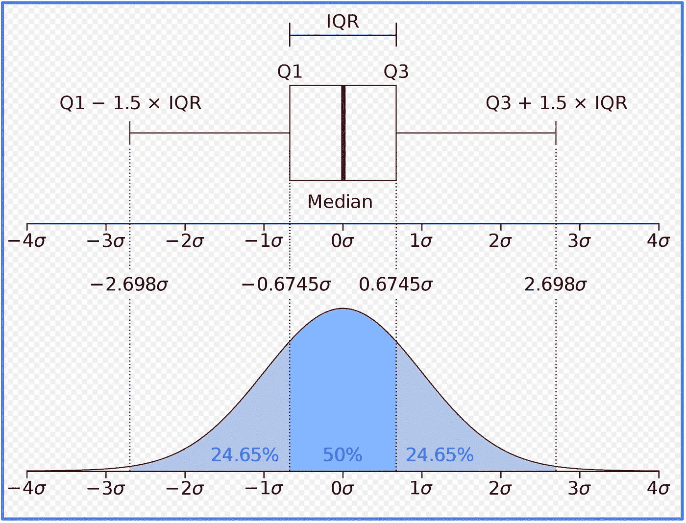
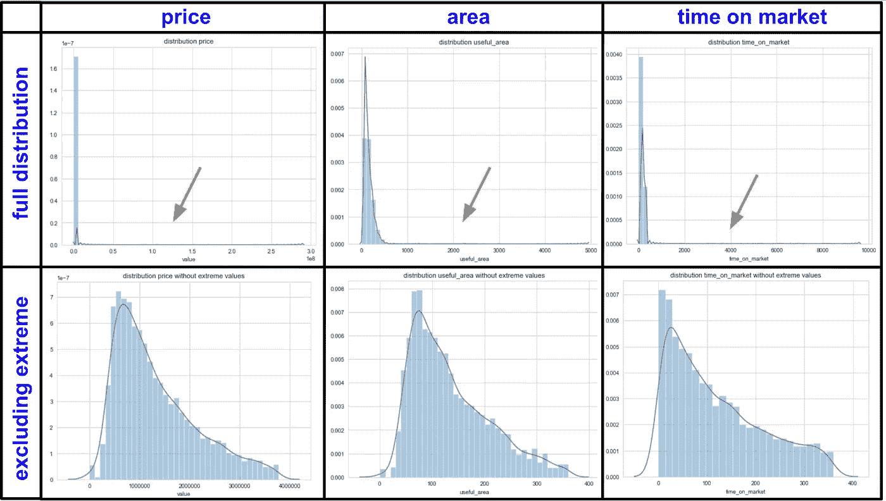
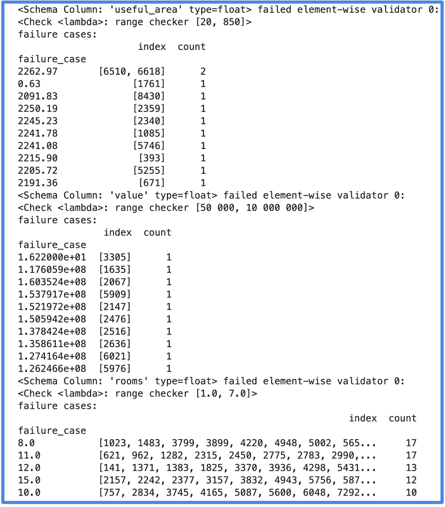

# 异常值检测和监控的生产就绪方法

> 原文：<https://towardsdatascience.com/a-production-ready-approach-for-outlier-detection-and-monitoring-5862a75ab4ad?source=collection_archive---------28----------------------->

一种从生产数据集中检测(并移除)异常值的方法。

# 介绍

威尔·梅尔斯在 https://unsplash.com 拍摄的照片

ML 项目中的生产数据经常受到异常(也称为离群值)的污染。这些异常值可能是由过程中的错误引起的，或者只是数据集的一部分。识别并纠正它们非常重要，因为它们会干扰您对数据的建模/解释。

在本文中，我们将介绍一种生产就绪的方法，以便检测和监控异常值，使您能够节省一些宝贵的时间来构建您的 ML 管道。

第一步，我们将展示一种使用四分位间距(IQR)检测列异常值的简单有效的方法。

第二步，我们将从多维角度(多列)处理离群值，并使用隔离林自动检测它们。

最后，我们将展示一种使用 pandera(一个统计数据验证工具包)监控数据库的有效方法。

本项目中使用的数据集可在 data demo outliers 获得。这是一个虚构的数据集，表示圣保罗的房地产数据。它包含 6 列，分别代表*房间*(房间数量)*车库*(车库数量)*有用面积*(单位面积)*价值*(单位价格)*室内质量*(单位室内质量)*上市时间*(出售单位所需时间)。我在 6 个专栏中介绍了几个异常，以展示下面介绍的方法的有效性。

这篇文章的代码可以在这个 [github 库](https://github.com/vbelz/Outliers_detection)上找到。
包括每个部分的 jupyter 笔记本示例(*)。/demo/Explore _ outliers _ per _ column . ipynb*，
*。/demo/Explore _ outliers _ multi _ columns . ipynb*，*。/demo/Monitor _ outliers _ pandera . ipynb*

# 使用 IQR 轻松检测列方向的异常值

Jhguch 的照片来自 [en.wikipedia](https://en.wikipedia.org/wiki/Interquartile_range)

四分位数间距(IQR)是统计离差的一种度量，等于第 75 个和第 25 个百分点之间的差值，
或者相当于上下四分位数之间的差值，IQR = Q3 Q1。

它可用于从我们的数据中提取每一列的最异常值。

一种方法是将 Q1-1.5 * IQR，Q3 + 1.5 * IQR 范围之外的每列数据视为潜在的异常值。

对于每一列，我们可以查看包含所有值的分布与排除这些异常值的分布。

当分布具有非常不同的形状时，它会突出显示列中异常值的存在，如下图所示。

**IQR**

在这里，我们可以在第一行看到市场上价格、面积和时间的完整分布。在第二行，我们在
绘制分布图之前应用了 IQR 滤波:

我们可以看到，在没有过滤的情况下，分布是高度偏斜的，突出了异常值的存在。

过滤后的图更能代表真实的数据分布。根据这些图和我们对数据的了解，我们可以决定每列可以接受的数据范围。

对于本例，我们预计价格不会超出 50 000–10 000 000 雷亚尔的范围，面积不会超出 20–850 平方米的范围，上市时间不会超出 0–400 天的范围
。我们可以为我们的每一列执行这种类型的异常值 EDA。这将有助于使用 pandera 为
部分中的每一列设置我们的业务规则，以便进行异常值监控。

# 隔离林用于检测多列中的异常值

**隔离林不同阈值的 PCA 图**

在很多情况下，需要从多维角度检测异常值。例如，您的模型可能依赖于许多特征。在这种情况下，检测每个特征的异常值(对于结构化表格数据是每个列)是不够的。你想要做的是多维度地对待异常值。隔离森林是识别这些异常点的理想工具。

隔离森林属于无监督学习算法的范畴。它将异常观察与样本的其余部分隔离开来，因为它们在特征空间中显得很遥远。这是一种建立在决策树基础上的树集成方法。该算法递归地生成分区，首先随机选择一个特征，然后在所选特征的最小值和最大值之间选择一个随机分割值。该过程继续进行，直到单个点被隔离或者达到指定的最大深度。一旦该算法遍历了整个数据，它就认为异常数据点比其他数据点采取的步骤更少而被隔离(需要更少的分裂来隔离它们)。

对于这个项目，我使用了来自 *Scikit-Learn* 库中的隔离林实现。训练之后，可以调用*预测*方法来了解特定样本是否是异常值。正常样本标记为 1，异常值标记为-1。为了可视化我们的高维数据，可以将 PCA 应用于特征以降低数据的维度(根据方差)。然后，我们可以绘制前三个组件，突出显示绿色正常数据和红色异常值。我们可以看到异常有远离主数据的趋势。这是对隔离森林算法的应用进行质量控制的一种有用的方法。识别异常和生成 PCA 图的代码可以在下面找到(更多细节可以在 [github 库](https://github.com/vbelz/Outliers_detection)获得)。

在某些情况下，控制您的异常阈值或您希望被视为异常的数据点的最大数量可能会很有用。为此，调用 *score_samples* 方法来获得数据集每个点的异常值是很有用的。然后，您可以在箱线图中显示这些分数(下图示例)，以便选择不同的阈值。分数越低，数据点就越不正常。选择较低的阈值将允许减少要检测的异常点的数量。

**异常分值的箱线图**

您甚至可以决定您希望被视为异常的数据集的百分比。所有这些行为的例子都在 jupyter 的笔记本上演示过。*/demo/Explore _ outliers _ multi _ columns . ipynb*，使用*中创建的函数。/demo/outliers_util.py* 。
我们为不同的异常阈值生成了 3D PCA 散点图，以创建 gif 插图。我们可以看到，对于异常值检测，我们可以决定更保守或更保守。
这是在您的 ML 管道中使用的一个非常强大的工具，因为数据集中异常的存在会干扰您的模型行为/性能。
通过使用隔离林自动检测和移除最异常的数据点，您可能会提高您的整体模型性能。特别是，如果您的生产数据包含大量样本(高维)，移除 0.5%最异常的样本(几乎没有额外成本)将是一个很好的生产实践。

# 用 pandera 监控你的数据:熊猫的统计数据验证工具包

在生产环境中，数据库会定期更新，并且应监控异常情况。现在我们已经了解了检测和消除生产数据中异常值的技术，我们将了解如何定期监控您的数据库，并使用 [Pandera](https://pandera.readthedocs.io/en/stable/) 执行统计验证检查。Pandera 提供了一个灵活且富有表现力的数据验证工具包，帮助用户对 pandas 数据结构进行统计断言。

基于您对数据的了解，您可以轻松地使用 Pandera 来实施规则，以检查要素中的类型和可接受范围。作为下面的例子，我们为演示数据集创建了一些规则。正如我们在异常值 EDA 中看到的，列*有用区域*应该是一个浮点值，我们不希望值超出 20–850 m2 的范围。
同样，我们为剩余的列 *value* (价格) *rooms* 、 *garages* 、 *time_on_market* 和 *interior_quality* 创建了规则。例如，列 *interior_quality* 应该包含 1、2、3、4 或 5 范围内的整数值。下面是我们演示数据集的代码示例。

基于数据集知识定义规则后，您可以定期运行 pandera 代码来识别数据库中的新异常。如果一些新数据点不遵守您定义的规则，它将输出一些警告消息，突出显示需要纠正的问题。这是确保数据库在不同时间段的数据质量的一种强大而简单的方法。

下面是一个例子，说明在我们没有从数据集中移除异常值的情况下，输出会是什么样子。

**输出 Pandera 警告**

# 结论

我们提出了一种从生产数据集中检测(和去除)异常值的方法。
首先，对于每一列，IQR 可用于探索、识别和移除异常数据点，如果您的分布形状受到异常值的影响，则使用分布图进行质量控制。
其次，从多列的角度，我们已经看到了如何使用隔离森林来自动检测特征空间中的异常观察值。在训练您的模型之前移除这些异常将提高您的 ML 管道的稳健性。

然后，我们提出了一种方法来监控您的生产数据，并在不同的时间段检测新的异常。Pandera 使统计数据验证变得容易，确保您的数据库定期无异常。

所有这些技术都有助于确保更好的数据质量，使您能够通过关注 ML 管道的其他领域来提高工作效率。

# 参考

> >刘、范晓东、丁肇中、、周志华。“基于隔离的异常检测。”《美国计算机学会数据知识发现汇刊》6.1 (2012): 3。
> [[https://cs . nju . edu . cn/Zhou zh/Zhou zh . files/publication/tkdd 11 . pdf](https://cs.nju.edu.cn/zhouzh/zhouzh.files/publication/tkdd11.pdf)
> 
> >刘、范晓东、丁肇中、、周志华。“隔离林。”数据挖掘，2008。08 年的 ICDM。第八届 IEEE 国际会议。
> [[https://cs . nju . edu . cn/Zhou zh/Zhou zh . files/publication/ICD m08 b . pdf？q =隔离森林](https://cs.nju.edu.cn/zhouzh/zhouzh.files/publication/icdm08b.pdf?q=isolation-forest)
> 
> >[[https://towards data science . com/outlier-detection-theory-visualizations-and-code-a4fd 39 de 540 c](/outlier-detection-theory-visualizations-and-code-a4fd39de540c)]
> 
> >[[https://www . pyo pensci . org/blog/pandera-python-pandas-data frame-validation](https://www.pyopensci.org/blog/pandera-python-pandas-dataframe-validation)]
> 
> >[[https://towards data science . com/how-automated-data-validation-make-me-more-productive-7d6b 396776](/how-automated-data-validation-made-me-more-productive-7d6b396776)]
> 
> >潘德拉文档:
> [[https://pandera.readthedocs.io/en/stable/](https://pandera.readthedocs.io/en/stable/)]