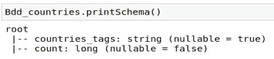
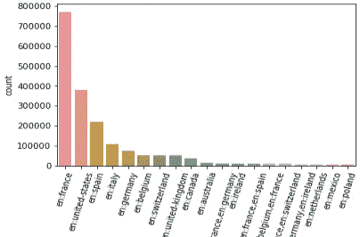

# 处理大于内存的数据集的 PySpark 示例

> 原文：<https://towardsdatascience.com/a-pyspark-example-for-dealing-with-larger-than-memory-datasets-70dbc82b0e98?source=collection_archive---------1----------------------->

## 一个关于如何使用 Spark 对大于内存的数据集执行探索性数据分析的分步教程。

使用 Jupyter 笔记本和 Pandas 数据框分析大于可用 RAM 内存的数据集是一个具有挑战性的问题。这个问题已经解决了(例如这里的[这里的](https://www.codementor.io/@guidotournois/4-strategies-to-deal-with-large-datasets-using-pandas-qdw3an95khttps://www.codementor.io/@guidotournois/4-strategies-to-deal-with-large-datasets-using-pandas-qdw3an95k)或者这里的[这里的](/how-to-handle-large-datasets-in-python-with-pandas-and-dask-34f43a897d55))，但是我在这里的目标有点不同。我将介绍一种对大型数据集进行探索性分析的方法，目的是识别和过滤掉不必要的数据。希望最终熊猫可以处理过滤后的数据集进行剩余的计算。

这篇文章的想法来自于我最近的一个项目，涉及对开放食品事实数据库的分析。它包含在世界各地销售的产品的营养信息，在撰写本文时，他们提供的 csv 出口量为 4.2 GB。这比我在 Ubuntu 虚拟机上的 3 GB 内存还大。然而，通过使用 PySpark，我能够运行一些分析，并且只从我的项目中选择感兴趣的信息。

为了在 Ubuntu 上设置我的环境，我采取了以下步骤:

1.  安装 Anaconda
2.  安装 Java openJDK 11: sudo apt-get 安装 openjdk-11-jdk。Java 版本很重要，因为 Spark 只能在 Java 8 或 11 上运行
3.  安装 Apache Spark(3 . 1 . 2 版本为 Hadoop 2.7 [此处](https://www.apache.org/dyn/closer.lua/spark/spark-3.1.2/spark-3.1.2-bin-hadoop2.7.tgz))并配置 Spark 环境(将 SPARK_HOME 变量添加到 PATH)。如果一切顺利，你应该可以在你的终端上启动 spark-shell 了
4.  安装 pyspark:conda install-c conda-forge pyspark

如果你有兴趣阅读 Spark 的核心概念，这是一个好的开始。如果没有，您可以打开 Jupyter 笔记本，导入 pyspark.sql 模块并创建一个本地 SparkSession:

我使用 sc.read 从我的 SparkSession 中的大型 csv 文件读取数据。尝试在只有 3 GB RAM 的虚拟机上加载 4.2 GB 文件不会出现任何错误，因为 Spark 实际上不会尝试读取数据，除非需要某种类型的计算。

结果是 pyspark.sql.dataframe 变量。重要的是要记住，此时数据并没有真正载入 RAM 存储器。只有在对 pyspark 变量调用一个操作时，才会加载数据，这个操作需要返回一个计算值。例如，如果我要求计算数据集中产品的数量，Spark 很聪明，不会为了计算这个值而尝试加载全部 4.2 GB 的数据(将近 200 万个产品)。

我使用 pyspark 的 printSchema 函数来获取一些关于数据结构的信息:列及其相关类型:

为了开始探索性分析，我计算了每个国家的产品数量，以了解数据库的组成:

BDD_countries 也是 pyspark 数据框架，其结构如下:

我可以过滤这个新的数据框，只保留数据库中记录了至少 5000 种产品的国家，并绘制结果:

例如，从这里我可以过滤掉所有在法国买不到的产品，然后在一个更小、更容易处理的数据集上执行其余的分析。

本文介绍了一种在 Python 中处理大于内存的数据集的方法。通过使用 Spark 会话读取数据，可以执行基本的探索性分析计算，而无需实际尝试将完整的数据集加载到内存中。当我们希望能够获得数据的第一印象并寻找识别和过滤掉不必要信息的方法时，这种类型的方法会很有用。