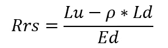
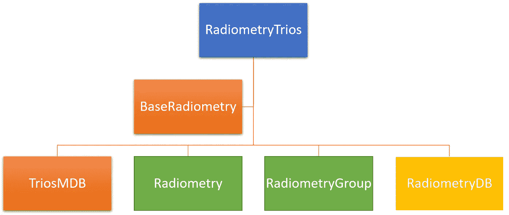
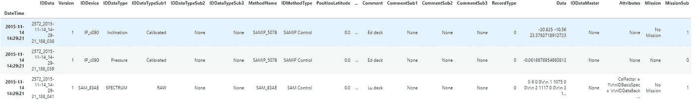
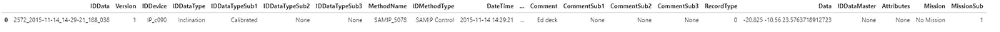
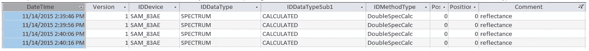
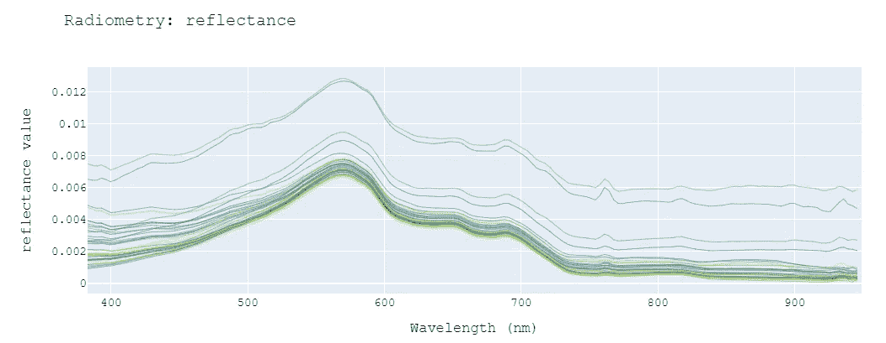
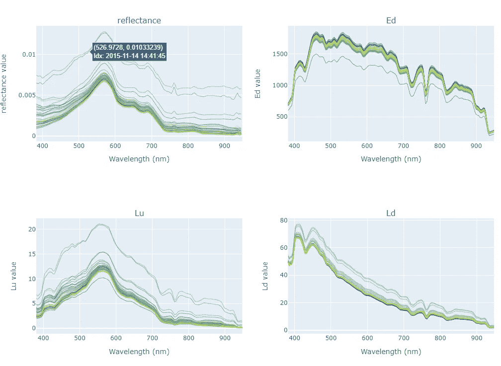
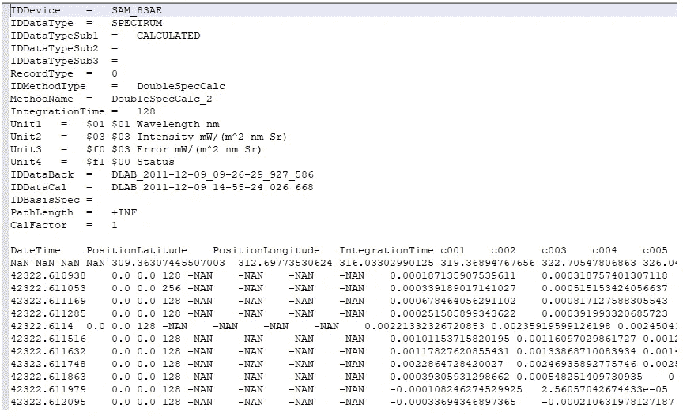

# 一个 Python 框架来检索和处理来自 TRIOS 传感器的超光谱场测量(MDSA 格式)

> 原文：<https://towardsdatascience.com/a-python-framework-to-retrieve-and-process-hyperspectral-field-measurements-from-trios-sensors-5e900158648e?source=collection_archive---------33----------------------->

## [思想和理论](https://towardsdatascience.com/tagged/thoughts-and-theory)


[哈利全](https://unsplash.com/@mango_quan?utm_source=medium&utm_medium=referral)在 [Unsplash](https://unsplash.com?utm_source=medium&utm_medium=referral) 上拍照

# 介绍

随着技术的快速发展，遥感在不同学科中有着广泛的用途，从森林火灾测绘到水质评估、三维表面建模等等。通过在一定距离上测量一个区域的反射和发射辐射来获得该区域的物理特性有许多优点。然而，实地测量与遥感数据同样重要，这样才能开展研究，将远距离“看到”的东西与地面真实情况联系起来。就多光谱遥感图像而言，重要的是使用高光谱传感器进行实地测量，以便校准最终结果。

## 语境

2021 年初，我的论文导师告诉我，我们需要恢复一些超光谱场测量数据。这些测量已经在世界各地的各种古代地形战役中完成。目标似乎很简单。我应该从 3 个现场传感器(辐照度和辐射度——上升流和天空传感器)检索测量值，以计算最终的反射率(方程式。1).所有的现场测量都是通过使用众所周知的传感器完成的，并且结果被存储在 Microsoft Access 文件中。mdb)。因为有专门的软件来管理。mdb 文件从制造商的传感器，称为 MDSA XE，我认为这将是一个“小菜一碟”。我大错特错了。



情商。1:遥感反射率公式，其中:Rrs =遥感反射率，Lu =上升辐射亮度，Ld =下降辐射亮度或天空辐射亮度，Ed =辐照度。

德国人以他们的工业和设备质量而闻名。那是毫无疑问的。然而，当谈到系统、用户界面或可用性时，似乎总是缺少一些东西。在 MSDA 的例子中，缺少了很多东西。即使像打开文件这样简单的任务也是一个奇怪的操作，需要重启应用程序。我不能依靠它来完成我的任务。

为此，我开发了一个名为`RadiometryTrios`的“非官方”框架，可用于 Python，这将使事情变得容易得多，不仅可以访问这种数据，还可以从中创建整个数据库。

# 框架

如前所述，该框架负责使用 TRIOS 设备处理来自野外活动的超光谱辐射测量数据。

操纵包括:

*   从 MSDA/TRIOS 格式的`.MDB`文件中提取辐射测量值。
*   辐射测量分析、数据清理和图表绘制
*   波长插值
*   反射率生成(来自辐射和辐照度测量)
*   不同格式的输入/输出

图 1 显示了`RadiometryTrios`框架的模式。



图 1:辐射测量 Trios 包模式。图片作者。

包中声明的类有:

*   BaseRadiometry :这个类拥有一些其他类通用的功能，比如绘图和插值功能。这个类的方法被声明为“静态的”,可以作为简单的函数使用。
*   **TriosMDB** :这个类负责连接到 access。mdb 文件并从中提取辐射度。可以过滤值，以便提取与感兴趣的测量值相对应。
*   **辐射度**:该类表示来自特定测量(单个传感器，但多次)的辐射度。它允许数据清理，过滤和绘图。
*   **辐射测量组**:如上所述，为了获得反射率，需要使用来自 3 个不同传感器的值。在这方面，RadiometryGroup 类存储了许多辐射度，并使同时对所有辐射度应用过滤器变得更加容易。它还支持绘图功能。
*   **RadiometryDB** :最后，最后一个类负责创建和维护一个辐射测量数据库，这个数据库来自于已经处理过的许多测量数据。

# **安装**

这个包可以在下面的 GitHub 库中找到:[https://github.com/cordmaur/RadiometryTrios](https://github.com/cordmaur/RadiometryTrios)

存储库包含关于安装和依赖项的详细信息，但是，总而言之，只需要克隆项目并安装它。

```
git clone https://github.com/cordmaur/RadiometryTrios.git
cd RadiometryTrios
pip install -e .
```

> 注意:`-e`选项将在开发者模式下安装这个包，这样可以更容易地对源代码(在项目文件夹中)进行修改，并且这些修改会自动应用，不需要重新安装。

要检查它是否安装正确，请在 python shell(或 Jupyter 笔记本)上运行以下命令:

```
import RadiometryTrios 
RadiometryTrios.__version__
'0.0.1'
```

# 包装使用

一旦我们成功安装了这个包，是时候学习如何使用它的许多功能了。

## TriosMDB

将涉及的第一类是`TriosMDB`类。在`nbs/`文件夹中的笔记本`00_TriosMDB.ipynb` 详细描述了如何使用它。

需要注意的是，`TriosMDB`类负责幕后的 ODBC 连接。这意味着您不必手动处理它，唯一的要求是安装`pyodbc`包，这是强制性的。让我们看看如何打开连接并显示摘要:

```
{'FileName': WindowsPath('../mdbs/trios_test.mdb'),
 'Records': 937,
 'IDDevice': "['IP_c090', 'SAM_83AE', 'SAM_83ba', 'SAMIP_5078', 'SAM_83B0', 'SAM_83BA']",
 'IDDataType': "['Inclination', 'Pressure', 'SPECTRUM', 'SAMIP']",
 'MethodName': "['SAMIP_5078', 'SAM_83AE', 'SAM_83B0', 'DoubleSpecCalc_2', 'SAM_Calibration_Station', None]",
 'IDMethodType': "['SAMIP Control', 'SAM Control', 'DoubleSpecCalc', 'SAM Calibration Station', None]",
 'Comment': "['Ed deck', 'Lu deck', 'Ld deck', 'reflectance', None]",
 'CommentSub1': "[None, 'factor 0.028']",
 'CommentSub2': '[None]'}
```

一旦一个`TriosMDB`对象被创建，它就用来自`tblData`表的所有内容填充一个熊猫`DataFrame` 。这可以通过`.df`属性来访问。`tblData`是三重奏/MSDA 格式的默认表格。要访问内容:

```
mdb.df.head(3)
```



分析 MDB 文件最基本的操作可能是执行查询。函数`exec_query`以列表或 pandas 数据帧的形式返回查询结果。`exec_query`也可用于检查 MDB 文件中的其他表格。让我们检查一下`**tblData**` (主表)的内容。结果输出可以是数据帧或列表，其中每一项都是一个表示表行的元组。

```
mdb.exec_query("select top 1 * from tblData", output_format='pandas')
```



或者结果可以显示为列表:

```
results = mdb.exec_query("select top 1 * from tblData", output_format='list')
results[0][:6]('2572_2015-11-14_14-29-21_188_038',
 1,
 'IP_c090',
 'Inclination',
 'Calibrated',
 None)
```

## 从 MDB 中选择辐射度

要检索 MDB 文件的测量值，必须指定所需辐射测量类型应满足的条件。这些条件可以是不同列/值的组合，并且必须在字典中指定。每个条件的组合将与一种辐射测量类型相关，也称为 **r 型。**例如，在这个 MDB 中，我们可以看到已经计算了反射率。检查 ACCESS 中的 MDB，我们可以看到这些反射率与一些 id 设备相关联:



要访问所需的辐射测量，我们首先需要创建一个字典，其中包含每种辐射测量类型的条件，如下所示。一旦`select_radiometries`被成功调用，如果**逻辑= '和'**，或者如果**逻辑= '或'**，它将检索与所有类型一致的时间，或者在 MDB 上找到的所有时间。每个辐射测量数据帧将被载入`.measurements`属性。这将在**访问测量值**部分进行解释。

```
DatetimeIndex(['2015-11-14 14:39:45', '2015-11-14 14:39:55',
               '2015-11-14 14:40:05', '2015-11-14 14:40:15',
               '2015-11-14 14:40:25', '2015-11-14 14:40:35',
               '2015-11-14 14:40:45', '2015-11-14 14:40:55',
               '2015-11-14 14:41:05', '2015-11-14 14:41:15',
               '2015-11-14 14:41:25', '2015-11-14 14:41:35',
               '2015-11-14 14:41:45', '2015-11-14 14:41:55',
               '2015-11-14 14:42:05', '2015-11-14 14:42:15',
               '2015-11-14 14:42:25', '2015-11-14 14:42:35',
               '2015-11-14 14:42:45', '2015-11-14 14:42:55',
               '2015-11-14 14:43:05', '2015-11-14 14:43:15',
               '2015-11-14 14:43:25', '2015-11-14 14:43:35',
               '2015-11-14 14:43:45', '2015-11-14 14:43:55',
               '2015-11-14 14:44:05', '2015-11-14 14:44:15',
               '2015-11-14 14:44:25', '2015-11-14 14:44:35',
               '2015-11-14 14:44:45', '2015-11-14 14:44:55',
               '2015-11-14 14:45:05', '2015-11-14 14:45:15',
               '2015-11-14 14:45:25', '2015-11-14 14:45:35',
               '2015-11-14 14:45:45', '2015-11-14 14:45:55'],
              dtype='datetime64[ns]', freq='10S')
```

## 将辐射度可视化

TriosMDB 类的目标基本上是从 Trios/MSDA mdb 中搜索和导出测量值。对于更高级的操作，如插值、反射率计算或数据清理，辐射测量类更合适。尽管如此，TriosMDB 还是提供了一些基本的绘图功能，以确保导出的内容有意义。

```
mdb.plot_radiometry('reflectance', min_wl=380, max_wl=950)
```



```
mdb.plot_radiometries(cols=2,  min_wl=380, max_wl=950)
```



## 导出辐射测量

最后一步是将辐射度量导出到文本文件。输出是 Trios/MSDA 格式的. txt 文件(类似于。
`create_measurement_dir`标志表示是否必须创建子目录。子目录名遵循 YYYYMMDD-mmss 格式，并且是`RadiometryDatabase`类使用的格式。
请记住，这种格式不容易被操纵。它旨在保持与 MSDA 输出文件的兼容性。
为了获得更加用户友好的格式，建议使用由`Radiometry`类提供的插值输出。

```
out_dir = mdb.export_txt(create_measurement_dir=True)Saving output file to ..\mdbs\20151114-1439
```

将返回输出目录。将它存储在一个变量中是一个很好的实践，因为它将用于打开`Radiometry`类。现在让我们检查一下已经保存的文件:

```
[file for file in out_dir.iterdir()]

[WindowsPath('../mdbs/20151114-1439/Ed_interpolated.bak'),  WindowsPath('../mdbs/20151114-1439/Ed_interpolated.csv'),  WindowsPath('../mdbs/20151114-1439/Ed_spectrum_LO.bak'),  WindowsPath('../mdbs/20151114-1439/Ed_spectrum_LO.txt'),  WindowsPath('../mdbs/20151114-1439/Fig_20151114-1439.png'),  WindowsPath('../mdbs/20151114-1439/Ld_interpolated.bak'),  WindowsPath('../mdbs/20151114-1439/Ld_interpolated.csv'),  WindowsPath('../mdbs/20151114-1439/Ld_spectrum_LO.bak'),  WindowsPath('../mdbs/20151114-1439/Ld_spectrum_LO.txt'),  WindowsPath('../mdbs/20151114-1439/Lu_interpolated.bak'),  WindowsPath('../mdbs/20151114-1439/Lu_interpolated.csv'),  WindowsPath('../mdbs/20151114-1439/Lu_spectrum_LO.bak'),  WindowsPath('../mdbs/20151114-1439/Lu_spectrum_LO.txt'),  WindowsPath('../mdbs/20151114-1439/reflectance_spectrum_LO.txt'),  WindowsPath('../mdbs/20151114-1439/Rrs_interpolated.bak'),  WindowsPath('../mdbs/20151114-1439/Rrs_interpolated.csv')]
```

检查反射文件的内容。我们可以在记事本或任何其他文本编辑器中打开它:



如前所述，我们可以看到，这种格式对于在 Excel 或 Pandas DataFrame 中打开是不友好的。辐射测量类提供的`interpolated .csv`输出更适合这些目的。

# 笔记本

在`/nbs/00_TriosMDB.ipynb`笔记本上可以找到包含更多示例的所有代码:

# 结论

在第一部分中，我们已经看到了如何使用`TriosMDB` 类从。MSDA/Trios 格式的 mdb 文件。提供了基本的过滤功能来定位内部的精确测量值。mdb 文件并将其导出到文本文件。更高级的操作功能，如数据清理、过滤、插值等。由`Radiometry` 和`RadiometryGroup`类提供，但是它们将在下一部分中讨论。

谢谢，到时见。

*如果你喜欢这篇文章，并且想继续无限制地阅读/学习，可以考虑成为* [*中等会员*](https://cordmaur.medium.com/membership) *。如果你使用下面的链接，我会收到你的一部分会员费，不需要你额外付费。*

[https://cordmaur.medium.com/subscribe](https://cordmaur.medium.com/subscribe)