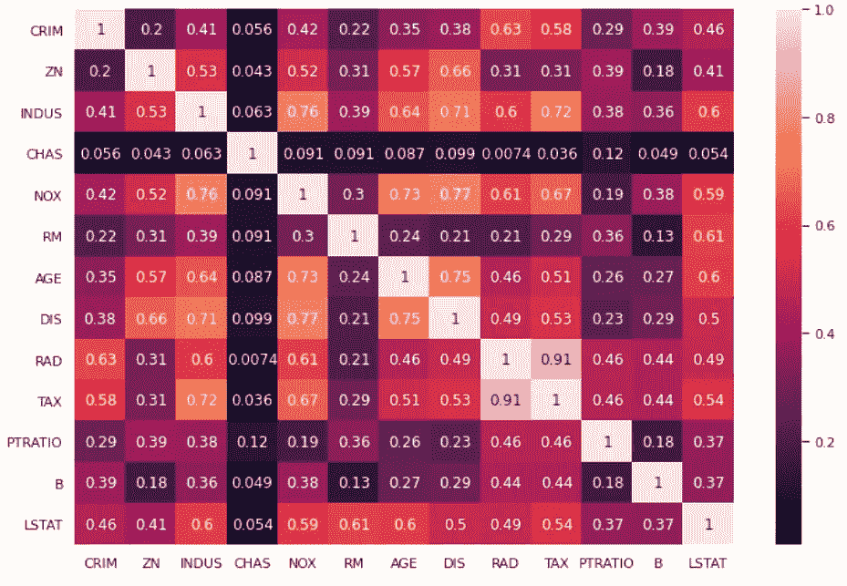
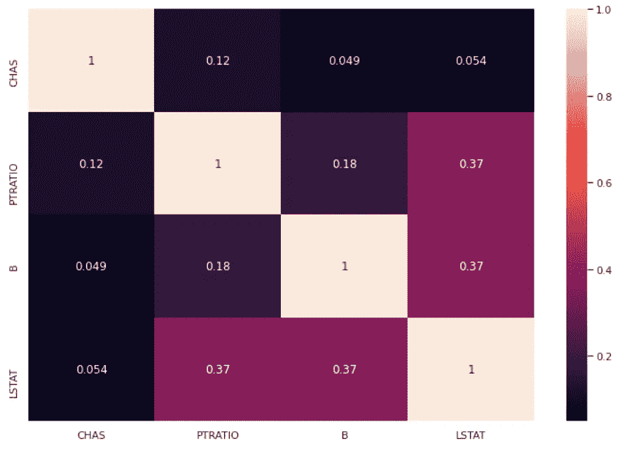
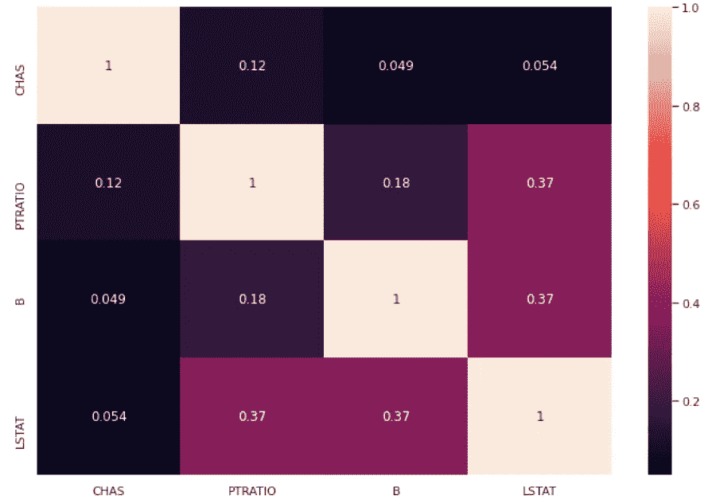

# 消除共线性的 Python 库

> 原文：<https://towardsdatascience.com/a-python-library-to-remove-collinearity-5a4eb05d3d73?source=collection_archive---------10----------------------->

## 一个处理共线变量的简单 Python 库



作者图片

共线性是机器学习项目中非常普遍的问题。它是数据集特征之间的相关性，它会降低我们模型的性能，因为它增加了方差和维数。当你不得不处理无人监督的模型时，情况变得更糟。

为了解决这个问题，我创建了一个移除共线要素的 Python 库。

# 什么是共线性？

共线性通常称为多重共线性，是一种当数据集的要素显示彼此高度相关时出现的现象。通常用皮尔逊相关系数来衡量。如果相关矩阵显示出绝对值较高的非对角元素，我们就可以讨论共线性。

共线性是一个非常大的问题，因为它增加了模型方差(特别是对于线性模型)，它增加了维数而没有增加信息，此外，它扭曲了我们解释模型的能力。如果两个要素共线，则不应将它们放在一起考虑，只应考虑信息最丰富的要素。

我多年来一直在处理共线性问题，最终决定创建一个 Python 库来帮助像我一样的其他数据科学家高效地处理这个问题。

# 如何消除共线性

首先，我们必须为相关系数的绝对值定义一个阈值。适当的探索性数据分析可以帮助我们在我们的数据集中确定这样一个阈值，但对于一个通用项目，我的建议是使用 0.4。它适用于多种类型的关联，尽管我再次建议执行适当的 EDA 来找到适合您的数据集的值。

一旦设置了阈值，我们需要相关矩阵只包含绝对值小于该阈值的非对角线元素。

对于无监督的问题，想法是计算相关矩阵，并移除所有那些产生绝对值大于该阈值的元素的特征。我们可以从不太相关的对开始，并且只要考虑阈值，就继续添加特征。这给了我们一个不相关的数据集。

对于有监督的问题，我们可以使用例如单变量方法来计算特征重要性。我们可以考虑最重要的特征，然后按照它们的重要性不断添加特征，从最重要的特征到不太重要的特征，只有在考虑阈值约束的情况下才选择它们。

这个想法是，通过添加一个特征，我们在相关矩阵中添加了一个新行和一个新列，所以我们必须小心。这就是为什么我创建了我的图书馆。

# “共线性”包

我们可以使用 pip 轻松安装我的“共线性”库。

```
!pip install collinearity
```

让我们看看 Python 中的动作。

首先，我们需要导入*共线性*包的*选择非共线性*对象。

```
from collinearity import SelectNonCollinear
```

这是执行特性选择和实现 sklearn 对象的所有方法的对象。

现在，让我们导入一些有用的库和*波士顿*数据集。

```
from sklearn.feature_selection import f_regression 
import numpy as np 
import pandas as pd 
import seaborn as sns 
from sklearn.datasets import load_boston sns.set(rc={'figure.figsize':(12,8)})
```

让我们从无监督方法开始，在这种方法中，我们不知道目标变量，只想减少聚类问题的特征数量，

让我们导入数据集并计算关联热图。

```
X,y = load_boston(return_X_y=True) 
features = load_boston()['feature_names'] 
df = pd.DataFrame(X,columns=features) 
sns.heatmap(df.corr().abs(),annot=True)
```


作者图片

如我们所见，我们有几个共线的变量(即热图中颜色较浅的变量)

我们现在可以创建一个 *SelectNonCollinear* 对象的实例，并将阈值设置为 0.4。

```
selector = SelectNonCollinear(0.4)
```

与每个 scikit-learn 对象一样，我们有 *fit* 、 *transform* 和 *fit_transform* 方法。我们还有 *get_support* 方法，它为我们提供了所选特性的数组掩码。

让我们来拟合对象，并获取所选特征的蒙版。

```
selector.fit(X,y) 
mask = selector.get_support()
```

现在，我们可以只考虑选定的功能，并再次绘制关联热图:

```
df2 = pd.DataFrame(X[:,mask],columns = np.array(features)[mask]) 
sns.heatmap(df2.corr().abs(),annot=True)
```



作者图片

所选要素现在显示出比原始集合更低的共线性，并且没有系数如预期的那样大于 0.4。

对于有监督的方法，我们需要设置得分函数，该函数用于计算一个特性相对于给定目标的重要性。对于像这样的回归问题，我们可以使用 *f_regression* 。对于分类问题，我们可能要用 *f_classif。*

我们需要在实例的构造函数中设置这个值。然后我们可以重新安装我们的选择器。

```
selector = SelectNonCollinear(correlation_threshold=0.4,scoring=f_regression) selector.fit(X,y) mask = selector.get_support()
```

我们现在可以计算新的热图，在这个例子中，它与无监督的情况相同。

```
df3 = pd.DataFrame(X[:,mask],columns = np.array(features)[mask]) 
sns.heatmap(df3.corr().abs(),annot=True)
```



作者图片

如果我们只想过滤我们的数据集，我们可以很容易地调用*转换*方法。

```
selector.transform(X) 
# array([[ 0\. , 15.3 , 396.9 , 4.98], 
# [ 0\. , 17.8 , 396.9 , 9.14], 
# [ 0\. , 17.8 , 392.83, 4.03], 
# ..., 
# [ 0\. , 21\. , 396.9 , 5.64], 
# [ 0\. , 21\. , 393.45, 6.48], 
# [ 0\. , 21\. , 396.9 , 7.88]])
```

这允许我们在 sklearn 的管道中使用 *SelectNonCollinear* 对象。

```
pipeline = make_pipeline( SelectNonCollinear(correlation_threshold=0.4,scoring=f_regression), LinearRegression() ) 
pipeline.fit(X,y)
```

这样，我们可以毫不费力地在 ML 管道中实现这个对象。

# 结论

我实现了这个库来消除无监督和有监督机器学习项目的共线性。阈值的值应该根据适当的 EDA 来设置。对于像本例中使用的数据集这样的数据集，可能会出现这样的情况:在无监督和有监督方法之间，所选的要素是相同的。我的建议是根据我们的问题使用正确的方法。

如果您有任何意见、问题或建议，请随时使用我的 GitHub repo:[https://github.com/gianlucamalato/collinearity](https://github.com/gianlucamalato/collinearity)

*原载于 2021 年 6 月 28 日 https://www.yourdatateacher.com**[*。*](https://www.yourdatateacher.com/2021/06/28/a-python-library-to-remove-collinearity/)*