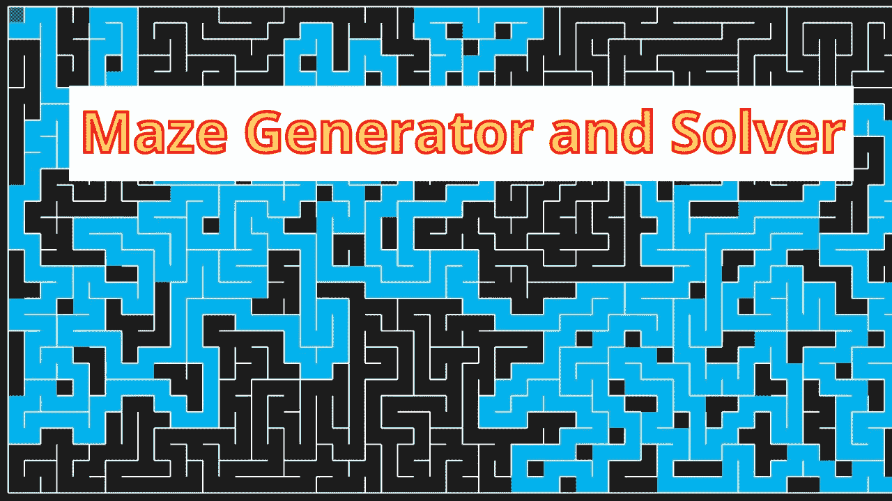
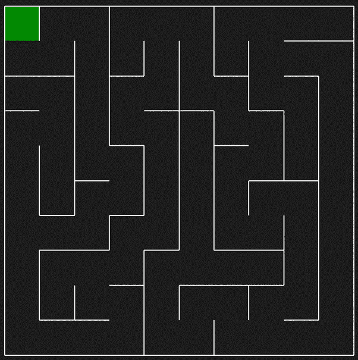
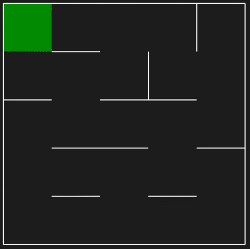
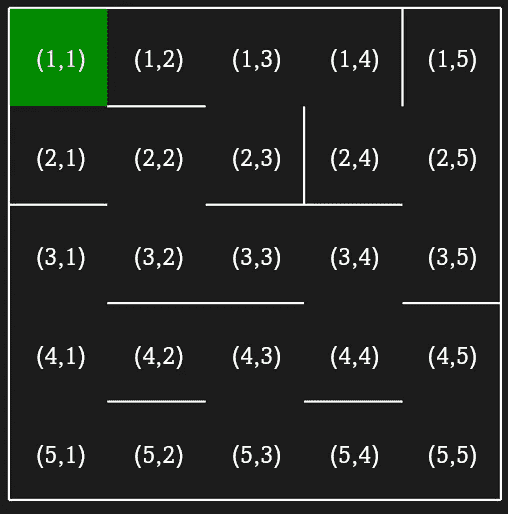
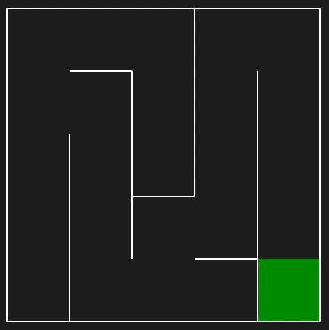
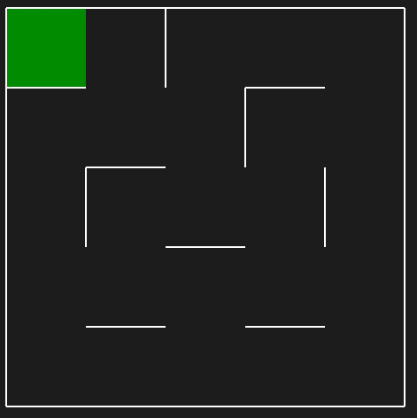
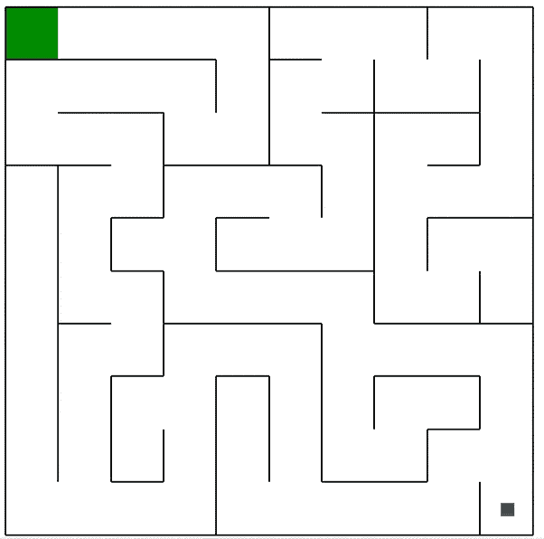
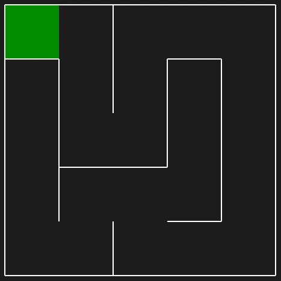

# 迷宫搜索算法的 Python 模块

> 原文：<https://towardsdatascience.com/a-python-module-for-maze-search-algorithms-64e7d1297c96?source=collection_archive---------1----------------------->

# **Python 迷宫世界 pyamaze**

【pyamaze 模块是为方便随机迷宫的生成而创建的，可以有效地应用不同的搜索算法。



这个模块 **pyamaze** 的主要思想是帮助创建可定制的随机迷宫，并能够在此基础上工作，就像轻松应用搜索算法一样。通过使用这个模块，你不需要编写 GUI 程序，也不需要面向对象的程序，因为这个模块会为你提供支持。这个模块使用 Python 内置的 **Tkinter** GUI 框架，使用这个模块你不需要安装任何框架。

关于该模块的详细信息如下所示，在本[视频](https://youtu.be/McMU-WuJwG0)中也有解释

**安装软件包:**

在命令提示符下运行以下命令:

```
pip install pyamaze
```

或者你可以访问 GitHub [链接](https://github.com/MAN1986/pyamaze/blob/main/pyamaze/pyamaze.py)并将模块代码复制为 Python 文件，命名为 **pyamaze.py**

**以下是如何使用模块**的详细说明

**生成迷宫:**
要简单地生成一个迷宫，你需要创建迷宫对象，然后应用 **CreateMaze** 函数。最后一条语句将应用函数 **run** 来运行模拟。

```
from pyamaze import mazem=maze()m.CreateMaze()m.run()
```

一个随机的 10x10 迷宫将会这样生成:



随机生成一个 10x10 的迷宫

左上角的单元格是迷宫的目标，我们可以通过多种方式将目标更改为任何单元格。此外，默认情况下，会生成一个**完美迷宫**，这意味着迷宫的所有单元都是可访问的，并且从任何单元到目标单元都有且只有一条路径。因此，任何单元格都可以被视为起始单元格，因此不会突出显示。在内部，最后一个单元，即最后一行和最后一列单元被设置为起始单元。所以，总的任务是找到从右下角的单元格到左上角的单元格的路径。

我们可以在创造迷宫的时候改变它的大小。例如，5x5 迷宫可以生成为:

```
from pyamaze import mazem=maze(5,5)m.CreateMaze()m.run()
```



随机的 5x5 迷宫

**CreateMaze** 函数的第一个参数是行号，第二个参数是列号。要生成大小为 15x20 的迷宫，您应该使用 m.CreateMaze(15，20)函数。

为了在程序中使用迷宫参数，了解这些参数是很重要的。首先，迷宫的单元有两个索引，一个用于行，另一个用于列。之前生成的 5x5 迷宫的指数如下所示:



迷宫细胞的指数

**create maze 的可选参数:**

为了定制生成的迷宫，我们可以使用不同的可选输入参数。
**目标(x 和 y):** 要将目标单元格从(1，1)更改为其他单元格，我们可以提供可选参数 **x** 和 **y** 作为目标。例如，为了使单元格(2，4)成为目标，我们将使用函数 CreateMaze(2，4)

**图案:**我们可以生成一个水平(或垂直)的图案迷宫。水平模式迷宫意味着与垂直线相比，迷宫将具有更长的水平线，类似地，对于垂直模式，垂直迷宫线将更长。我们可以将可选的参数模式设置为 ***h*** 或 ***H*** 用于水平模式，将 ***v*** 或 ***V*** 用于垂直模式。
例如，要生成一个目标为单元格(5，5)的垂直图案 5x5 迷宫，我们将使用如下函数:

```
m.CreateMaze(5,5,pattern=’v’)
```

样本生成的迷宫是:



垂直模式迷宫

**多路径迷宫:**

默认情况下，生成的迷宫是**完美迷宫**，这意味着从任何单元格到目标单元格只有一条路径。但是，我们可以通过将可选参数 ***loopPercent*** 设置为某个正数来生成一个具有多条路径的迷宫。 ***loopPercent*** 设为最高值 **100** 表示迷宫生成算法将最大化多条路径的数量，例如:

```
m.CreateMaze(loopPercent=100)
```

生成的迷宫如下所示:



多路径迷宫(环路)

**保存生成的迷宫:**

也有可能保存任何生成的迷宫供将来使用。为此，我们需要将可选参数 **saveMaze** 设置为 **True** 。随机生成的迷宫将作为 **CSV 文件**保存在工作文件夹中。CSV 文件将包含迷宫内所有单元格的信息以及东西南北方向打开和关闭的墙的信息。1 表示路径在该方向打开，0 表示路径关闭。

通过使用 **loadMaze** 选项并提供 CSV 文件，我们可以稍后使用 CSV 文件生成相同的旧迷宫。

有了这个特性，我们还可以通过更改 CSV 文件来手动定制迷宫。要从迷宫中添加或删除一面墙，我们应该更改 CSV 文件的两个值。
从 CSV 文件加载迷宫时，创建迷宫时迷宫的大小无关紧要，因为关于大小的信息也是从 CSV 文件加载的。

**主题:**

迷宫的默认主题是**黑暗**主题，我们可以通过使用参数 ***主题*** 并将其设置为光明主题，将其更改为**光明**主题。我们在 **pyamze** 模块中也有一个 ***COLOR*** 类来管理不同的颜色。要将主题设置为 light，我们可以将其设置为一个 **COLOR** class 对象，如下所示:

```
m.CreateMaze(theme=COLOR.light)
```

或者我们也可以提供字符串形式的值，如下所示:

```
m.CreateMaze(theme=”light”)
```

**将代理放入迷宫:**

我们可以在迷宫中放置**代理**(一个或多个)。一个代理可以被认为是一个像机器人一样的物理代理，或者它可以简单地用于在迷宫中突出或指出一个细胞。
为此，我们在 ***pyamaze*** 模块中有 ***代理*** 类。导入代理类后，我们可以创建代理对象，我们应该提供父迷宫作为第一个输入参数。默认情况下，代理将被放置在迷宫的起始单元格(最后一个单元格)上。

下面是在默认大小的迷宫上创建一个带有灯光主题的代理的完整代码:

```
from pyamaze import maze,COLOR,agentm=maze(10,10)m.CreateMaze(theme=COLOR.light)a=agent(m)m.run()
```



灯光主题迷宫中的代理人

现在让我们看看代理类的不同可选参数。

**代理的位置:**代理的默认位置是迷宫的开始单元，即迷宫的右下角。您可以通过设置单元格的值 ***x*** 和 ***y*** 来更改位置。

代理对象有两个属性 ***x*** 和 ***y*** ，您可以在创建代理后访问和设置这些属性。此外，代理将属性 ***位置*** 设置为元组 **(x，y)** ，该元组提供完整的 ***x*** 和 ***y*** 信息作为一个参数。您也可以将其设置为其他值来更改代理的位置。

**代理的目标:**代理的默认目标是迷宫的目标，这意味着代理的目标是到达迷宫的目标。但是，如果要改变代理的目标，可以在创建代理时设置参数 ***目标*** 来实现。应该将二值元组指定为代理的目标。

**代理的大小:**默认情况下，代理的大小小于单元格的尺寸。您可以将参数 ***填充*** 设置为 ***真*** ，代理将填充整个单元格。

**代理的形状:**默认情况下，代理为方形，还有第二个形状选项**箭头**，可以设置为 ***形状*** 参数，代理将为箭头形状。这将区分代理的正面和其他面。如果形状设置为箭头，参数 ***填充*** 无效。

**看脚印:**当你要实现一些搜索算法，智能体要在迷宫中移动的时候，可以要求可视化完整的路径轨迹。为此，我们可以将可选参数***footprint***更改为 ***True*** 并且每当代理改变其位置时，脚印的印象将被强加到先前的位置上。脚印只是代理的形状，但颜色不同。查看这段代码的输出:

```
from pyamaze import maze,COLOR,agentm=maze(5,5)m.CreateMaze()a=agent(m,shape=’arrow’,footprints=True)a.position=(5,4)a.position=(5,3)a.position=(5,2)m.run()
```

**迷宫类的其他属性:**

为了实现某种搜索算法，您应该知道迷宫类的一些属性:

**行数:** ***m.rows*** 给出迷宫的行数 ***m*** 。
**列:** ***m.cols*** 给出迷宫的列数 ***m*** 。
**网格:** ***m.grid*** 是从(1，1)到最后的所有单元格的列表。
**迷宫地图:**随机生成一个迷宫。知道迷宫的不同打开和关闭的墙壁的信息是重要的。该信息在属性 ***迷宫 _ 地图*** 中可用。它是一个字典，其中键作为迷宫的单元格，值作为另一个字典，其中包含该单元格在四个方向上的四面墙的信息；东西南北。

您可以看到该属性的值，并使用生成的迷宫确认这些值，如下所示:

```
print(m.maze_map)
```

生成的示例迷宫和 ***迷宫 _ 地图*** 的值如下所示:



示例迷宫和迷宫 _ 地图如下所示

```
maze_map = {(1, 1): {‘E’: 1, ‘W’: 0, ’N’: 0, ‘S’: 0}, (2, 1): {‘E’: 0, ‘W’: 0, ’N’: 0, ‘S’: 1}, (3, 1): {‘E’: 0, ‘W’: 0, ’N’: 1, ‘S’: 1}, (4, 1): {‘E’: 0, ‘W’: 0, ’N’: 1, ‘S’: 1}, (5, 1): {‘E’: 1, ‘W’: 0, ’N’: 1, ‘S’: 0}, (1, 2): {‘E’: 0, ‘W’: 1, ’N’: 0, ‘S’: 1}, (2, 2): {‘E’: 0, ‘W’: 0, ’N’: 1, ‘S’: 1}, (3, 2): {‘E’: 1, ‘W’: 0, ’N’: 1, ‘S’: 0}, (4, 2): {‘E’: 1, ‘W’: 0, ’N’: 0, ‘S’: 1}, (5, 2): {‘E’: 0, ‘W’: 1, ’N’: 1, ‘S’: 0}, (1, 3): {‘E’: 1, ‘W’: 0, ’N’: 0, ‘S’: 1}, (2, 3): {‘E’: 0, ‘W’: 0, ’N’: 1, ‘S’: 1}, (3, 3): {‘E’: 0, ‘W’: 1, ’N’: 1, ‘S’: 0}, (4, 3): {‘E’: 1, ‘W’: 1, ’N’: 0, ‘S’: 1}, (5, 3): {‘E’: 1, ‘W’: 0, ’N’: 1, ‘S’: 0}, (1, 4): {‘E’: 1, ‘W’: 1, ’N’: 0, ‘S’: 0}, (2, 4): {‘E’: 0, ‘W’: 0, ’N’: 0, ‘S’: 1}, (3, 4): {‘E’: 0, ‘W’: 0, ’N’: 1, ‘S’: 1}, (4, 4): {‘E’: 0, ‘W’: 1, ’N’: 1, ‘S’: 0}, (5, 4): {‘E’: 1, ‘W’: 1, ’N’: 0, ‘S’: 0}, (1, 5): {‘E’: 0, ‘W’: 1, ’N’: 0, ‘S’: 1}, (2, 5): {‘E’: 0, ‘W’: 0, ’N’: 1, ‘S’: 1}, (3, 5): {‘E’: 0, ‘W’: 0, ’N’: 1, ‘S’: 1}, (4, 5): {‘E’: 0, ‘W’: 0, ’N’: 1, ‘S’: 1}, (5, 5): {‘E’: 0, ‘W’: 1, ’N’: 1, ‘S’: 0}}
```

**从起点到目标的路径:****py amaze**模块**(递归回溯器)**中使用的迷宫生成算法，不仅仅是生成一个随机的迷宫，还具有从起点到目标的路径信息。这些信息可以在迷宫的属性路径中作为字典获得。路径的关键是一个单元格，而值也是一个单元格，表示为了达到目标而从关键单元格到值单元格的移动。

**在一条路径上移动代理:**在创建一个迷宫和迷宫内的代理(一个或多个)后，我们可以让代理在特定的路径上移动。最好将代理移动到迷宫的***路径* * *属性上。为此，我们在迷宫类中有一个名为 ***tracePath*** 的方法，它将一个字典作为输入参数。字典的关键字是代理，值是我们希望代理遵循的路径。 ***tracePath*** 方法将模拟代理在路径上移动。

运行这段代码并亲自查看模拟。

```
from pyamaze import maze,agentm=maze(20,20)m.CreateMaze(loopPercent=50)a=agent(m,filled=True,footprints=True)m.tracePath({a:m.path})m.run()
```

**我们有三种方法可以指定代理要遵循的路径。**

**作为字典的路径:**如上所示，路径可以是一个字典，其中的键-值对表示从键-单元格到值-单元格的移动。
**路径作为列表:**也有可能提供路径作为单元格列表。然后，代理将遵循从列表中的第一个单元格到最后一个单元格的路径。

**tracePath 方法中的可选参数:**

对于 *tracePath* 方法，还有几个可选的参数。

**击杀代理:**在代理完成路径后可以击杀代理。通过设置参数 ***杀死*** 到 ***真*** ，代理将在完成路径后 300 毫秒后被杀死。
**移动速度:**我们可以使用参数*控制代理的移动速度，默认值为 300 毫秒。它是代理的移动步骤之间的时间延迟。
**标记一些单元格:**对于不同的演示，可能需要标记一些单元格。为此，有一个 ***显示标记*** 的选项可以设置为 ***真*** ，如果代理经过迷宫 ***标记单元格*** 列表中出现的任何单元格都会被标记。
**不同路径上的多个代理:**也有可能在各自的路径上移动多个代理。为此，我们可以在输入字典中为 ***tracePath*** 方法提供更多的代理路径信息。将会针对字典中提供的所有代理路径对进行移动。*

*而且，我们可以多次使用 ***tracePath*** 方法。在这种情况下，首先第一次提供的所有代理-路径将完成它们的路径，然后第二次在 ***tracePath*** 中提供的其他代理-路径对将开始它们的移动，依此类推。*

***用键盘控制代理***

*最后，还有用键盘按键控制代理的可能性。为此，您可以使用迷宫类方法***enable arrow key***并作为输入参数，用箭头键提供要控制的代理。同样，可以使用 ***enableWASD*** 方法通过按键 WASD 来控制代理。*

*观看此视频了解更多细节。*

***结论:***

*创建这个模块的主要想法是为了方便生成任何大小和不同图案的迷宫。此外，我们可以在迷宫上放置代理并控制它们。这将有助于实现不同的迷宫搜索算法，你的重点将是搜索算法，而不是努力生成和显示迷宫。您可以实现任何迷宫搜索算法，如深度优先搜索、宽度优先搜索、最佳优先搜索、A-star 搜索、Dijakstra 算法、一些强化学习、遗传算法或任何您能想到的解决迷宫的算法。*

*这是使用 **pyamaze** 模块实现不同迷宫搜索算法的[播放列表](https://youtube.com/playlist?list=PLWF9TXck7O_zsqnufs62t26_LJnLo4VRA)。*