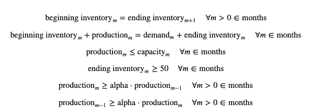
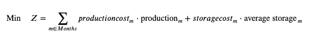
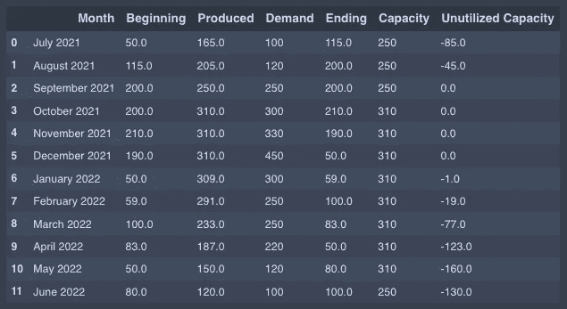

# 季节性库存计划的 Python 或-Tools 模型

> 原文：<https://towardsdatascience.com/a-python-or-tools-model-for-seasonal-inventory-planning-483aaf5aa8b?source=collection_archive---------19----------------------->

## 如何在 SCIP 求解器中使用 Google 的 ortools python 包进行数学优化


内森·莱蒙在 [Unsplash](https://unsplash.com?utm_source=medium&utm_medium=referral) 上拍摄的照片

# **为什么会有季节性库存？**

生产设施可能没有能力在重要季节生产季节性产品。在换季前建立额外的库存通常比购买额外的工具和空间更便宜。例如:

*   如果季节性产品是制造商业务的重要组成部分，那么在淡季安排生产可以在更长的时间内平衡资源。这使得工厂能够配备全职员工，而不是依赖季节性劳动力。
*   即使这些设施能够激增产能以满足需求，也可能导致额外的管理费用，包括加班费。将产品储存在库存中的成本可能低于这一增加的成本。

采用季节前构建方法时，有几个问题需要回答:

*   在季节开始之前，要生产的产品数量是多少？
*   假设随着时间的推移，随着生产计划的顺利进行，库存会逐渐增加，那么制造业需要在什么时候开始生产过剩的库存来为旺季储存呢？

虽然可以用纸和笔设计出一个简单的模型，但这个模型提供了一个可扩展的框架，可以在竞争能力有限的情况下为多种产品提供基础。

# 模型设置

在创建此多期库存模型之前，请使用 pip 安装或工具。

```
pip install ortools
```

接下来，导入包并使用数据设置模型。该模型的数据表示从 2021 年 7 月到 2022 年 6 月的月份。

*   产品需求累计至每月周期
*   对每月能生产的产品数量的[生产能力]限制
*   生产和储存成本
*   初始库存，尽管库存通常会被建模为变量

# 使用 python 和 ortools 的优化模型

Google 有很好的文档和对 python 和其他一些语言的介绍。该模型遵循该框架，但对多期库存模型进行了更详细的描述。

声明是大多数优化模型的第一步。我们声明要使用的求解器( [SCIP](https://www.scipopt.org/) )和算法用来确定最优解的决策变量。

一般来说，编写比“p”代表产量，“b”代表期初库存，“e”代表期末库存更多的描述性变量是一种好的做法，但格式化代码使代码不换行也是一种好的做法。因此，没有一种风格适合所有情况。

产量是决策变量，期初和期末库存变量受产量和需求的影响。

输出:

```
Number of variables = 36
```

接下来是约束条件。这个模型着眼于 12 个月，从 2021 年 7 月到 2022 年 6 月。库存模型的细微差别是将本期的期末库存与下一期的期初库存联系起来。其他约束条件是标准供应链约束条件，用于:

*   在不超出产能的情况下满足客户需求
*   从一个时期到下一个时期的平稳生产水平(对于该模型，0.8 的 alpha 用于将每月的变化限制在 20%以内)



输出:

```
Number of constraints = 70
```

模型的最后一部分是目标函数，以最小化总成本。总成本是生产成本和库存储存成本的总和。



输出:

```
Total cost =  29812 

Solver wall time =  4134680
Problem solved in 40 iterations
```

# 分析结果

该模型的最优值是总成本 29812。这有意义吗？

如果将 12 个月的总需求(减去初始库存)乘以 10，预测需求的最低生产成本为 27，400，这是单位生产成本。然而，额外的限制，如最低库存水平、生产平稳性和库存持有成本会导致更高的成本。所以 29812 是合理的。

要查看解决方案，让我们格式化熊猫数据框中的数据。

输出:



这张表可以让你很容易地找到许多问题的答案。除了看到变量(期初库存、产量、期末库存)，下面也很容易看到:

*   根据要求，库存没有减少到 50 件以下
*   需求得到了满足。如果由于模型的当前公式而导致需求未得到满足，则该模型将*不可行*。
*   最大容量在 12 月的高峰期得到了充分利用，但也可以追溯到 11 月、10 月和 9 月。

因此，在 8 月份开始生产过剩库存可能是明智的，这是为了预防一切都不尽如人意的情况。如果生产落后于 8 月份以后，就不可能赶上了。虽然这是一个很好的快速工具，用于调整和战略讨论，但对于战术或运营计划，每周和每天的视图将是必不可少的。

# 模型限制

这种库存计划模型有许多局限性。这里有几个例子。

1.  该模型直到 12 月需求高峰时都有效。模型中使用的数据旨在帮助理解在旺季之前*需要建立多少季节性库存。如您所见，在提供的数据结束时，结果将库存减少到零。由于在 12 月份达到高峰之前，该模型不用于对季节性库存准备之外的生产进行建模，因此建议只显示 12 月份的结果。*
2.  该模型不包括通过加班增加产能的可能性，尽管可变成本结构旨在缓解这种情况下的过渡。
3.  该模型没有考虑需求的不确定性。
4.  该模型不考虑库存能力、吞吐量能力或装货码头能力。这个模型只考虑了生产能力。

# 结论

Google 的 ortools 是一种很好的方式来扩展数学优化问题，以便与 SCIP 这样的开源解决方案一起使用。使用 python 进行优化建模还有其他选择，比如 pulp 或 pyomo。这位作者发现，根据不同的模型，哪种方法效果最好存在差异。每一个都有特别吸引人的特性，比如带有 ortools 约束编程的 [NextSolution](https://developers.google.com/optimization/cp/original_cp_solver) 功能。

优化建模通常用于有大量节约成本机会的复杂问题。但是随着开源选项和易用性的增长，优化也可以用于扩展和自动化更简单的问题。