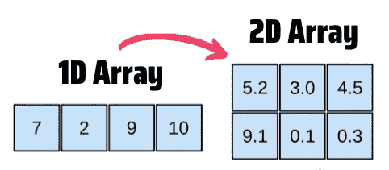
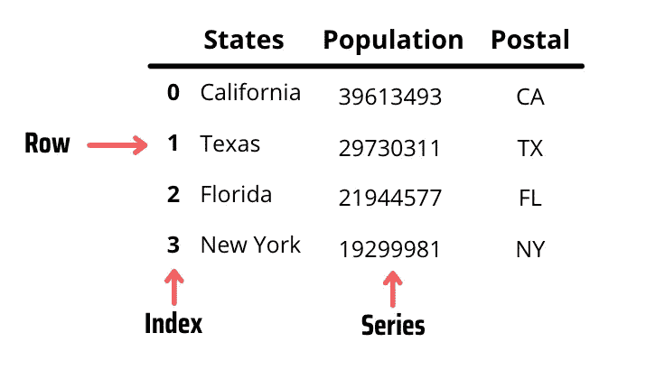
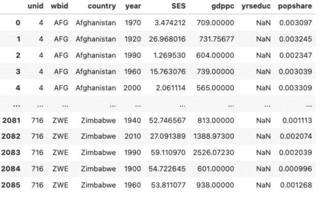
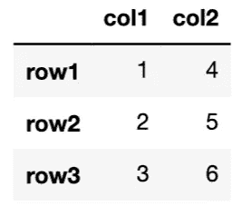
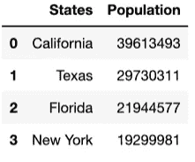

# Python 熊猫对 Excel 用户的介绍

> 原文：<https://towardsdatascience.com/a-python-pandas-introduction-to-excel-users-1696d65604f6?source=collection_archive---------2----------------------->

## 从 Excel 迁移到 Python 之前您需要知道的核心概念


[Bruce Hong](https://unsplash.com/@hongqi?utm_source=medium&utm_medium=referral) 在 [Unsplash](https://unsplash.com?utm_source=medium&utm_medium=referral) 上拍照

Pandas 可能是用 Python 进行真实世界数据分析的最佳工具。它允许我们清理数据、争论数据、进行可视化等等。

你可以把熊猫想象成一个超级强大的微软 Excel。你可以在 Excel 中完成的大多数任务也可以在 Pandas 中完成，反之亦然。也就是说，熊猫在许多领域表现出色。

在对 Pandas 的介绍中，我们将比较 Pandas 数据框架和 Excel 电子表格，学习创建数据框架的不同方法，以及如何制作数据透视表。

注意:在学习熊猫之前，你应该知道至少了解 Python 的基础知识。如果你是 Python 的新手，[看一下我做的这个指南](/python-core-concepts-for-data-science-explained-with-code-decfff497674)，马上就能开始使用 Python。

```
**Table of Contents** 1\. [Why Excel Users Should Learn Python/Pandas](#f35d)
2\. [Pandas DataFrames & Excel Spreadsheets](#7ef2)
3\. [How to Create a Dataframe](#e7d4)
 - [Creating a dataframe by reading an Excel/CSV file](#aed5)
 - [Creating a dataframe with arrays](#1740)
 - [Creating a dataframe with a dictionary](#dfa2)
```

# Excel 用户为什么要学习 Python/Pandas

数据清理、数据标准化、可视化和统计分析等任务可以在 Excel 和 Pandas 上执行。也就是说，Pandas 比 Excel 有一些主要优势。仅举几个例子:

*   大小限制:Excel 可以处理大约 100 万行，而 Python 可以处理数百万行(限制在于 PC 的计算能力)
*   复杂的数据转换:Excel 中的内存密集型计算会导致工作簿崩溃。Python 可以处理复杂的计算，没有任何大问题。
*   自动化:Excel 不是为自动化任务而设计的。你可以创建一个宏或使用 VBA 来简化一些任务，但这是极限。然而，Python 可以超越这一点，提供数百个免费库。
*   跨平台能力:在 Excel 上，你可能会发现 Windows 和 macOS 中的公式不兼容。当与不将英语作为其 Microsoft Excel 版本默认语言的人共享 Excel 文件时，也会发生这种情况。相比之下，不管计算机上的操作系统或语言设置如何，Python 代码都保持不变。

在向您展示如何用 Pandas 替换 Excel(创建数据透视表、可视化等)之前，我将向您解释 Pandas 的核心概念。在整个指南中，我将提到 Excel 来提供一些示例，并将其与熊猫进行比较。Excel 是最流行的电子表格，所以一些类比将帮助你快速掌握熊猫的概念。

我们开始吧！

# 熊猫数据框架和 Excel 电子表格

Pandas 中的两个主要数据结构是序列和数据帧。第一个是一维数组，第二个是二维数组。



作者图片

在熊猫中，我们主要处理数据帧。熊猫数据框架相当于 Excel 电子表格。熊猫数据框架——就像 Excel 电子表格一样——有两个维度或轴。

数据帧有行和列(也称为系列)。在数据框架的顶部，您将看到列的名称，在左侧是索引。默认情况下，熊猫的索引从 0 开始。

行和列的交集称为数据值或简称为数据。我们可以存储不同类型的数据，如整数、字符串、布尔值等等。

这是一张显示美国各州人口排名的数据图表。稍后我将向您展示创建这样一个数据帧的代码，但现在让我们来分析这个数据帧。



作者图片

列名(州、人口和邮政)也称为特征，而每个行值称为观察值。我们可以说有 3 个特征和 4 个观察值。

请记住，单个列应该具有相同类型的数据。在我们的示例中，`states`和`postal`列只包含字符串，而 population 列只包含整数。当试图将不同的数据类型插入到一个列中时，我们可能会得到错误，所以要避免这样做。

总结一下，这就是熊猫和 Excel 之间的术语翻译。

到目前为止，我们还没有谈论太多关于空单元格的内容，但是知道在 Python 中缺失数据用`NaN`表示是有好处的，它代表“不是一个数字”。只要数据帧中有空值，就会看到一个`NaN`。

# 如何创建数据框架

创建数据帧有多种方法。我们可以通过读取 Excel/CSV 文件、使用数组以及字典来创建数据帧。

但是在创建数据框架之前，要确保已经安装了 Python 和 Pandas。如果你是 Python 的新手，你可以通过观看[这个视频](https://youtu.be/n83J8cBytus)来安装它。

要安装熊猫，在终端或命令提示符下运行命令`pip install pandas` 。如果您有 Jupyter 笔记本，您可以通过运行`!pip install pandas`从代码单元安装它

## 通过读取 Excel/CSV 文件创建数据帧

毫无疑问，这是在熊猫身上创建数据帧最简单的方法。我们只需要导入 pandas，使用 read_csv()方法，并将 Excel/CSV 文件的名称写在括号内。

让我们来读一个包含世界各国 GDP 数据的 CSV 文件(你可以在这个[链接](https://drive.google.com/drive/folders/12hFh6RPlX5bWzSqpoMvAeT94RCjCvHw5?usp=sharing)上找到这个文件)

```
**import pandas as pd**
df_gdp **=** pd**.**read_csv('gdp.csv')
df_gdp
```

在上面的代码中，我们将 pandas 重命名为“pd”这只是给熊猫命名的惯例。运行上面的代码后，您将看到下面的数据帧。



作者图片

这就是创建数据框架所需的全部内容！现在你可以通过观看我下面的视频教程开始从这个数据框架创建一个数据透视表。

## 用数组创建数据帧

要创建带有数组的数据帧，我们需要首先导入 Numpy。让我们导入这个库，并用随机数创建一个数组。

```
**import numpy as np**
data = np.array([[1, 4], [2, 5], [3, 6]])
```

也就是说，如果您还不习惯使用 Numpy，您可以使用列表符号创建相同的数组。在下一步创建数据帧时，结果将是相同的。

```
data = [[1, 4], [2, 5], [3, 6]]
```

为了创建一个数据帧，我们导入 pandas 并使用`.Dataframe()`方法。在括号内，我们可以添加`index`和`columns`参数来指定名称。

```
**import pandas as pd**
df = pd.DataFrame(data, index=['row1', 'row2', 'row3'],
                 columns=['col1', 'col2'])
```

`df`是数据帧的标准名称。如果我们打印这个`df`对象，我们得到如下结果:



作者图片

## 用字典创建数据帧

我们也可以从字典中创建一个数据框架。这是我最喜欢的选择，因为字典可以让我们正确地组织数据。您可能还记得，字典由一个键和值组成。我们可以将列表设置为数据值，将键设置为列名。

让我们在使用字典之前创建一个人口数据框架。首先，我们创建两个列表:州和人口。

```
# data used for the example (stored in lists)
states = ["California", "Texas", "Florida", "New York"]
population = [39613493, 29730311, 21944577, 19299981]
```

现在我们创建一个字典，将字符串`States`和`Population`设置为键，将之前创建的列表设置为数据值。

```
# Storing lists within a dictionary
dict_states = {'States': states, 'Population': population}
```

一旦创建了字典，创建 dataframe 就像使用`.Dataframe()`方法一样简单，但是这次我们不需要指定列参数，因为它已经在键中指定了。

```
df_population = pd.DataFrame(dict_states)
```

如果你打印`df_population`，你会得到这个数据帧:



作者图片

<https://frankandrade.ck.page/bd063ff2d3>**加入我的电子邮件列表，与 3000 多人一起获取我在所有教程中使用的 Python for Data Science 备忘单**

**如果你喜欢阅读这样的故事，并想支持我成为一名作家，可以考虑报名成为一名媒体成员。每月 5 美元，让您可以无限制地访问数以千计的 Python 指南和数据科学文章。如果你使用[我的链接](https://frank-andrade.medium.com/membership)注册，我会赚一小笔佣金，不需要你额外付费。**

**<https://frank-andrade.medium.com/membership> **