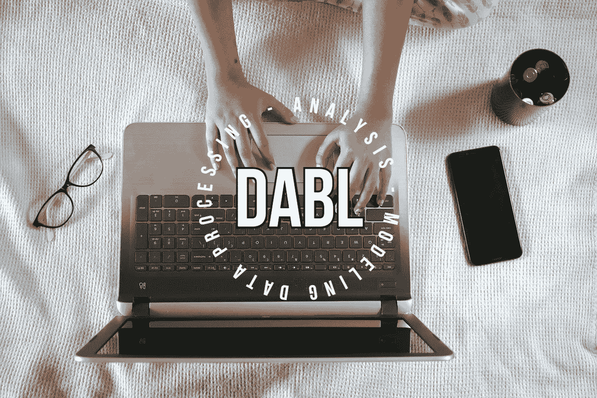
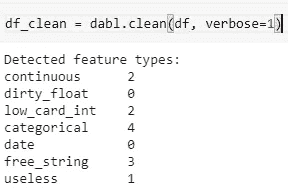
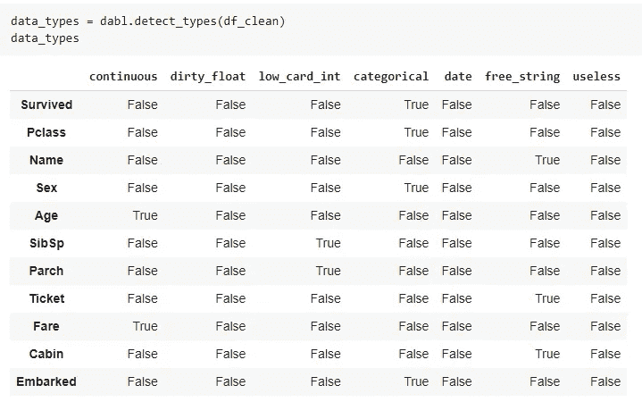
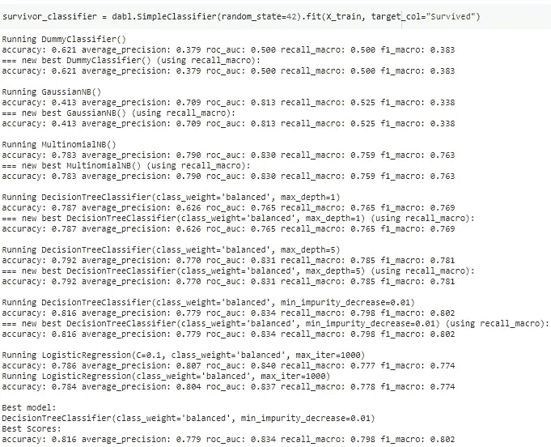

# 用几行代码实现数据处理、分析和 ML 自动化的 Python 工具

> 原文：<https://towardsdatascience.com/a-python-tool-for-data-processing-analysis-and-ml-automation-in-a-few-lines-of-code-da04b3ba904f?source=collection_archive---------10----------------------->

## dabl 图书馆基本指南



图片来自[皮克斯拜](https://pixabay.com/?utm_source=link-attribution&amp;utm_medium=referral&amp;utm_campaign=image&amp;utm_content=5115827)的拉胡尔·潘迪特

数据科学模型开发管道涉及各种组件，包括数据收集、数据处理、探索性数据分析、建模和部署。在训练机器学习或深度学习模型之前，必须清理或处理数据集，并使其适合训练。处理缺失记录、移除冗余要素和要素分析等过程是数据处理组件的一部分。

通常，这些过程是重复的，并且涉及大部分的模型开发工作时间。各种开源的 Auto-ML 库在几行 Python 代码中实现了整个流水线的自动化，但是它们中的大多数表现得像一个黑盒，并且没有给出关于它们如何处理数据集的直觉。

为了克服这个问题，我们有一个名为 dabl 的开源 Python 库——数据分析基线库，它可以自动化机器学习模型开发管道的大部分部分。本文将介绍 dabl 包的实际实现，包括数据预处理、特性可视化和分析，然后是建模。

# dabl:

**dabl** 是一个 ***数据分析基线库*** ，它使监督机器学习建模对于初学者或没有数据科学知识的人来说更加容易和容易。dabl 的灵感来自 Scikit-learn 库，它试图通过减少样板任务和自动化组件来民主化机器学习建模。

dabl 库包括各种特性，使得用几行 Python 代码处理、分析和建模数据变得更加容易。

## 开始使用:

dabl 可以从 PyPI 安装，使用

```
**pip install dabl**
```

> 我们将使用从 Kaggle 下载的 Titanic 数据集来实现这个库。

# (1.)数据预处理:

dabl 用几行 Python 代码自动化了数据预处理管道。dabl 执行的预处理步骤包括识别缺失值、移除冗余特征以及了解特征的数据类型，以便进一步执行特征工程。

dabl 检测到的特征类型列表包括:

```
***The list of detected feature types by dabl includes:***
1\. **continuous
2\. categorical
3\. date
4\. Dirty_float
5\. Low_card_int
6\. free_string
7\. Useless**
```

dabl 使用一行 Python 代码将所有数据集要素自动分类为上述数据类型。

```
**df_clean = dabl.clean(df, verbose=1)**
```



(按作者分类的图片)，每个功能的自动检测数据类型

原始泰坦尼克号数据集有 12 个特征，它们被 dabl 自动分类为上述数据类型，以进行进一步的特征工程。dabl 还提供了根据需求改变任何特性的数据类型的能力。

```
**db_clean = dabl.clean(db, type_hints={"Cabin": "categorical"})**
```

用户可以使用`**detect_types()**`功能查看每个特征的指定数据类型。



(图片由作者提供)，自动检测每个要素映射的数据类型

# (2.)探索性数据分析:

EDA 是数据科学模型开发生命周期的重要组成部分。Seaborn、Matplotlib 等是执行各种分析以更好地理解数据集的流行库。dabl 使 EDA 变得非常简单，节省了工作时间。

```
**dabl.plot(df_clean, target_col="Survived")**
```

dabl 中的`**plot()**` 功能可以通过绘制各种图来实现可视化，包括:

*   目标分布条形图
*   散点对图
*   线性判别分析

dabl 自动对数据集执行 PCA，并显示数据集中所有特征的判别 PCA 图。它还显示通过应用 PCA 保留的差异。

# (3.)造型:

dabl 通过在训练数据上训练各种基线机器学习算法来加速建模工作流，并返回性能最佳的模型。dabl 做出简单的假设，并为基线模型生成指标。

使用 dabl 中的`**SimpleClassifier()**`函数，一行代码就可以完成建模。



(图片由作者提供)，使用 dabl 进行基线建模的性能指标

dabl 几乎很快就返回了最佳模型(决策树分类器)。dabl 是最近开发的库，提供了模型训练的基本方法。

# 结论:

Dabl 是一个方便的工具，使监督机器学习更加容易和快速。它用几行 Python 代码简化了数据清理、要素可视化和开发基线模型。dabl 是最近开发的库，需要很多改进，不推荐用于生产。

# 参考资料:

[1]dabl GitHub:[https://github.com/amueller/dabl](https://github.com/amueller/dabl)

> 感谢您的阅读