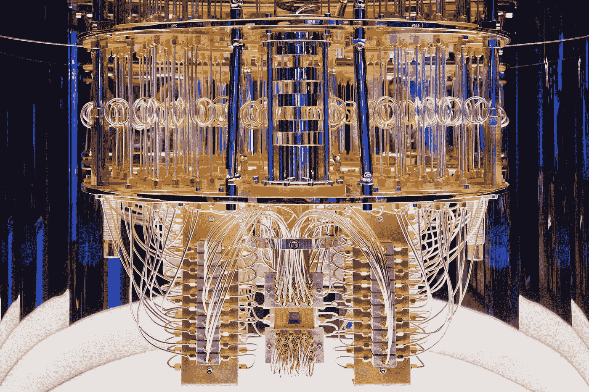
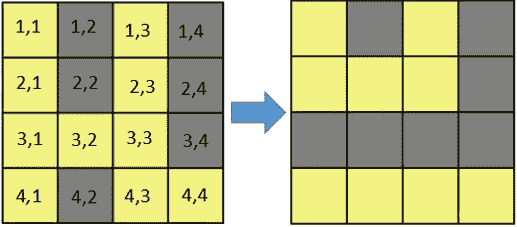
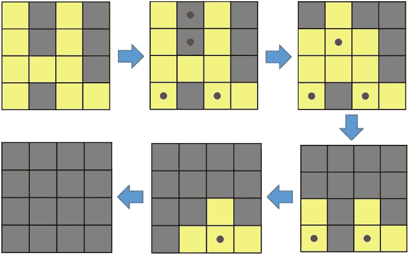
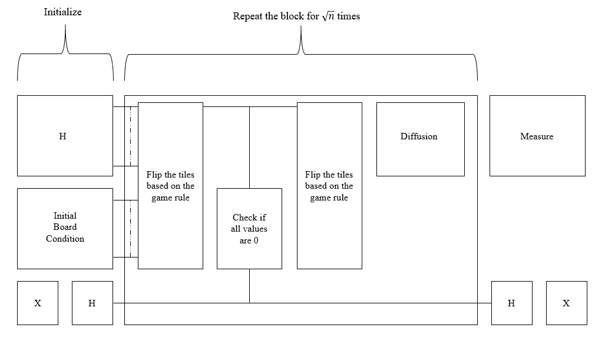
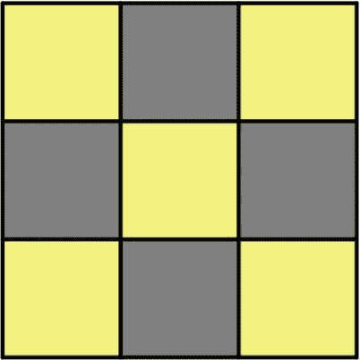
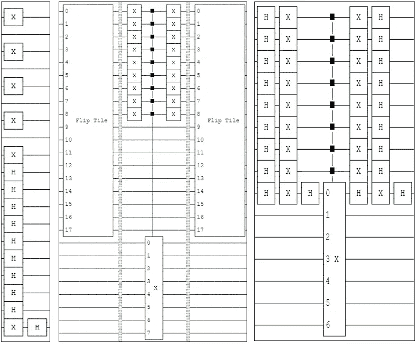
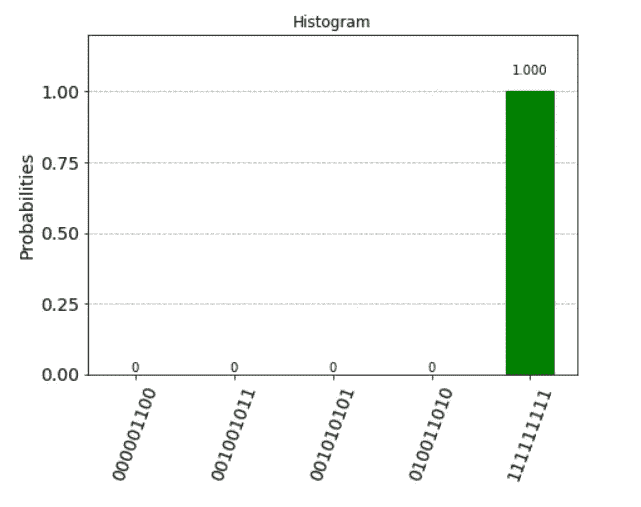

# 解决熄灯问题的量子变量

> 原文：<https://towardsdatascience.com/a-quantum-variant-for-solving-lights-out-problem-a0b5c364f91e?source=collection_archive---------23----------------------->

## “量子熄灯求解器”——解决组合问题的独特方法

图 1:[https://pixabay.com/images/id-567757/](https://pixabay.com/images/id-567757/)

我们正在见证“量子计算”这个时髦词汇的空前激增。这种炒作驱动的好奇心始于 2019 年谷歌在量子世界创造历史之时。它声称并展示了基于超导架构的 53 量子位量子处理器 Sycamore 的量子优势。这是量子计算机第一次胜过经典计算机。从那天起，这个领域见证了算法优化、硬件增强和基于光子学的体系结构的演变的巨大发展。

那么什么是量子计算呢？

量子计算是对量子设备进行编程，使得不需要的状态相消干涉，而需要的状态相长干涉，给出它们作为输出。为了达到这个目的，三个不可或缺的性质被用来操控量子位元的状态。这些就是叠加，纠缠，干涉。

1.  量子叠加:量子叠加是量子力学中的一个基本性质。在经典力学中，波可以表示为多个频率的叠加。同样，在量子力学中，叠加态可以代表所有不同量子态的线性组合。
2.  量子纠缠:两个或两个以上的量子比特在不能表示为独立状态时纠缠在一起。当量子比特纠缠在一起时，它们之间存在一个特殊的键。一个状态的结果直接取决于另一个状态的测量。当纠缠对中的一个量子位被测量时，它会导致另一个量子位瞬间坍缩到可以根据第一个量子位的状态 100%确定预测的状态。即使相隔更远的距离，他们也遵循这一原则。这个想法遭到了有史以来最杰出的科学家的强烈批评。爱因斯坦也厌恶这个想法，表达了一句警句“*幽灵般的超距作用*”。他著名的 EPR 悖论也完全否定了这种现象的存在。在那个时期，这个概念只是理论上的，没有任何实际证明。然而，今天量子纠缠是一个被精确证实的和公认的概念。
3.  量子干涉:量子态可以经历类似经典波的干涉。当两个或两个以上的波同相时，它们的振幅增加，而当它们相差 180 度时，它们的振幅相互抵消；因此，量子计算就是设计一种算法，使得所有不太可能的解的振幅相消干涉，而正确的解相长干涉，从而给出正确的答案。

这三个性质构成了任何量子算法不可或缺的一部分。

图 IBM 量子计算系统内部。鸣谢:IBM(来源[https://www . Flickr . com/photos/IBM _ research _ Zurich/50252942522/size/k/](https://www.flickr.com/photos/ibm_research_zurich/50252942522/sizes/k/))

量子算法解决了大量的问题，如蛋白质折叠，药物开发，组合游戏，如数独，国际象棋等等。熄灯就是这种可以用量子计算机解决的组合问题之一。本文描述并阐述了算法，称为“量子熄灯解算器”，它利用量子现象来解决量子设备上的熄灯问题。它成功地将问题转化到量子域中，并提供了问题的有效解决方案。它利用了一个反直觉的概念称为格罗弗算法，使用叠加和振幅放大技巧有效地解决了这个问题。但在进入算法之前，让我们先熟悉一下熄灯问题。

**熄灯**

熄灯问题是一个经典的组合问题，由 Tiger Electronics 于 1995 年开发。它由一块板组成，灯固定在 n*m 网格的方形瓷砖上。在开始位置，随机的灯被打开，我们的最终目标是关闭网格上的所有灯。这个游戏的规则是:

1.  按下任何一个方块将会切换该方块上的灯以及相邻方块上的灯。这里，相邻的瓦片指的是顶部、底部、左侧、右侧的瓦片。对角瓷砖不被视为邻居。此外，切换意味着改变灯光的状态，而不考虑当前状态。例如，如果灯是开着的，它将被关闭，反之亦然。下图显示了按下图块(3，2)时的电路板配置。
2.  按两次按钮相当于根本不按。因此，对于任何给定的配置，我们只需要考虑每个按钮按下不超过一次的解决方案。
3.  解决方案状态与路径无关。因此，压瓷砖的顺序并不重要。

图 3:按压(3，2)瓷砖后的电路板配置

对上述情况的解决方案概括如下。瓷砖中心的圆点表示解决方案(即待压瓷砖)。

图 4:图 3 中问题的解决方案

习惯了问题之后，我们再推进到实际的算法。我会尽量把数学放在一边，集中精力解决熄灯问题。

**量子熄灯解算器**

该算法使用 IBMs Qiskit 编程语言。IBMQ 有各种各样的量子设备可以在他们的云上使用。唯一的问题是，量子计算机的最大可能量子位是 15。这些量子设备不能用于执行该算法，因为该算法期望 26 个量子位和 9 个经典位来求解 3*3 板配置。因此，该算法在一个名为 ibmq_qasm_simulator(版本 0.1.547)的量子模拟器上执行。它最多支持 32 个量子位。因此，使用建议的算法，我们可以使用模拟器解决 3*3 板配置问题。对于 4*4 板配置，根据该算法需要 40 个量子位和 16 个经典位，这远远超出了 Qasm 模拟器的能力。

最近，IBMQ 又向云添加了一些量子设备模拟器，即稳定器模拟器和扩展稳定器模拟器，最大量子位容量可达 5000 量子位。但是，如果算法由具有许多非 Clifford 门的较小电路组成，那么状态向量方法可能会比扩展稳定器表现得更好。由于所提出的算法包含许多非 Clifford 门，当考虑计算精度时，扩展的模拟器可能不是更好的选择。虽然，在扩展模拟器上解算法还是值得一试的。更大的板配置可以使用更多的量子位来解决。因此，我们将暂时坚持使用 Qasm 模拟器来解决 3*3 板排列的问题。

在深入研究该算法之前，让我们先回顾一下 Grovers 算法如何帮助找到问题的正确解决方案的基本思想。如果你不熟悉 [Grovers 算法](https://qiskit.org/textbook/ch-algorithms/grover.html)或者幅度放大和 oracle 函数，强烈建议你去过一次。

在经典算法中，我们一次一个状态地搜索解空间，当我们遇到正确的状态时，我们输出解。有很多不同的技术可以达到这种最终状态。与经典算法相反，Grover 算法使用称为 Hadamard 门的叠加门同时搜索所有可能的输出状态。正确的门标有相位翻转，这意味着将负号加到正确状态的幅度上。由于所有的状态都是同时访问的，所以到这个阶段为止算法的复杂度是 O(1)。现在，你会质疑为什么此时不输出标记的状态？我们还不能输出标记的状态。如果我们测量这一刻的量子态，会得到任意一个态作为输出。这是因为某个状态的输出概率是振幅的平方。例如，考虑 1/2 和-1/2 是两个状态的振幅。1/2 的平方等于-1/2。因此，即使期望状态具有负振幅，两个状态也具有相同的输出概率。由于这个原因，绝对幅度值需要增加，而不仅仅是符号翻转。我们的下一个任务是增加期望状态的幅度，减少不期望状态的幅度。这是通过振幅放大技巧，利用甲骨文和扩散电路实现的。完整的电路在下面的 GitHub 链接上。

用于解决该问题的算法框图如下所述。

图 5:解决熄灯问题的框图

该算法主要分为 3 个阶段:

1.  初始化块:

该块接受用户输入，即 3*3 问题中所有 9 个区块的初始配置。用户以 0 和 1 的字符串的形式提供该输入，其中 0 表示灯关闭，1 表示灯打开。在解释算法的同时，让我们同时解决一个 3*3 的问题，以便更好地理解。作为算法输入的字符串是 101010101。该字符串表示如下所示的板配置，

图 6:算法的输入

在上图中，黄色表示开启，灰色表示关闭状态。除了为算法提供初始棋盘条件，所有需要的量子位和经典位都被初始化。总共 26 个量子位和 9 个经典位用于计算。在这 26 个量子位中，9 个用于接受用户输入作为板条件，在框图中显示为“初始板条件”。其他 9 个量子位用‘H’表示的叠加态初始化。这意味着阿达玛门应用于这些量子位。这将量子位设置为叠加态。这一点的重要性将在下一阶段解释。被称为‘Oracle-qubit’的单量子位被声明，它从所有可能的状态中标记出正确的状态。剩余的 7 个量子位(在框图中未示出)是用于辅助目的的临时量子位。

2.甲骨文和扩散函数；

在这个模块中有两个关键的部分，它们是，预言电路和扩散电路。Oracle circuit 在给定的输入状态下同时执行所有可能的操作(即执行所有可能的瓷砖翻转)。这是可能的，因为在 9 个量子位上应用了哈达玛门。检查所有这些翻转的输出是很重要的。让所有灯熄灭的那组动作是我们解决问题的方法。检查这种状态，然后使用 Oracle 量子位标记负振幅。如上所述，在这一点上，我们不能测量叠加态。因此需要振幅放大。这是在扩散回路中完成的。

在扩散电路中，被标记状态的幅度被放大，从而减小了其他不期望状态的幅度。在这篇文章中，我不打算探究他的放大是如何工作的。这本身可能就是一个完整的主题。

这两个电路结合起来就形成了这个模块。整个块重复一定的次数(在我们的例子中，17 次)。这是我们想要的 3*3 板配置的最佳可能数量。这个数字取决于用来表示解空间的量子位的数量。在我们的例子中，它是 9 个量子位。因此，要执行的迭代次数计算如下:

π/4 * √2⁹ ∼ 17.27 ∼ 17

每当我们重复这个方块时，振幅就会增加一点。最后，在 17 次迭代之后，与其他状态相比，期望输出的幅度急剧增加。因此，如果我们在这个阶段测量叠加，我们将以非常高的概率(99.95%)得到想要的状态。下图显示了初始化模块、Oracle 和扩散电路的电路。

图 7:左边是初始化电路，中间表示 Oracle 函数，右边方框表示扩散。

3.测量:

该模块测量输出量子位，并将该值复制到 9 个经典位进行可视化。

与确定性的经典计算不同，量子计算本质上是概率性的。因此，强烈建议对大于 100 的镜头执行此算法。Shots 是运行时给量子器件的参数，表示电路执行了多少次。例如，如果 shots=1000，则该电路被执行 1000 次，并且输出被记录该次数。为了执行这个算法，我已经使用了 8188 个镜头。执行该算法后的结果如下图所示。

图 8:8188 个镜头的输出用直方图表示

可以看出，8188 个镜头中，8184 次正确状态是输出(111111111)。但是有 4 次，输出不是要求的状态。因此，该算法在 99.95%的情况下输出正确的状态。

**结果和讨论**

1.  这种搜索算法将搜索解空间的时间复杂度从 O(N)降低到 O(√N)。
2.  由于量子世界是概率性的，大多数时候，确定性的答案并不总是可能的。因此，该算法在 99.95 %的情况下输出正确的状态。

量子电路的完整代码可在 [GitHub](https://github.com/Atharva-Vidwans/LightsOut) 上获得。

**参考文献**

1.  https://qi skit . org/documentation/locale/FR _ FR/tutorials/simulators/6 _ extended _ stabilizer _ tutorial . html
2.  卡米洛·萨帕塔，肖扬，“格罗弗的算法”，苏黎世联邦理工学院演讲[在线]，数据:2016 年 8 月
3.  L.K. Grover，“用于数据库搜索的快速量子力学算法”，第 28 届 ACM 计算理论年会论文集，1996 年，arXiv:quant-ph/9605043v3
4.  IBM Quantum，“使用 Qiskit 学习量子计算:Grover 的算法”[在线]可用:https://qiskit.org/textbook/ch-algorithms/grover.html
5.  A.B. Mutiara，R.Refianti，“Grover 算法量子搜索在经典计算机中的模拟”，(IJCSIS)《国际计算机科学与信息安全杂志》，第 8 卷第 9 期，日期:2010 年 12 月
6.  “维基百科:熄灯(游戏)”，2021 年 1 月，[在线]可用:https://en。wikipedia.org/wiki/Lights_Out_(游戏)