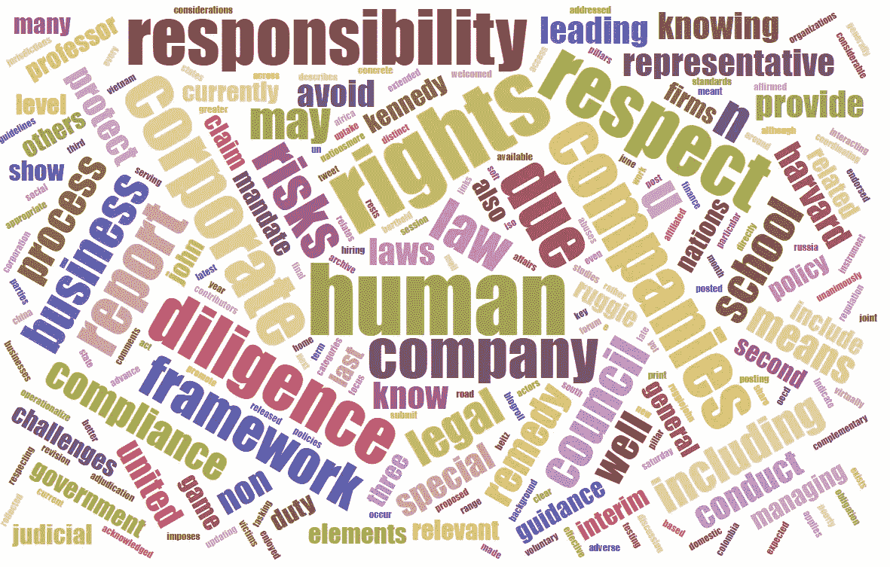
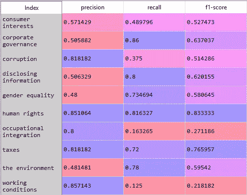
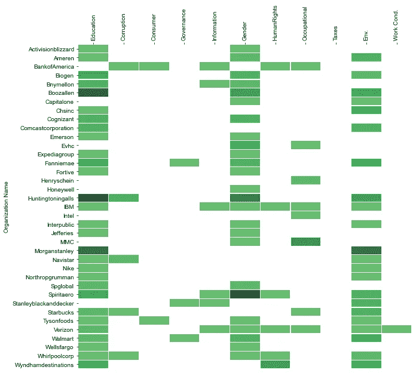

# 一个价值一千个模型的查询

> 原文：<https://towardsdatascience.com/a-query-worth-a-thousand-models-48be1f414bf5?source=collection_archive---------37----------------------->

## [实践教程](https://towardsdatascience.com/tagged/hands-on-tutorials)

## 尝试从结构化查询搜索中构建分类器


图片由[迪安·莫里亚蒂](https://pixabay.com/users/terimakasih0-624267/?utm_source=link-attribution&utm_medium=referral&utm_campaign=image&utm_content=2341784)从[皮克斯拜](https://pixabay.com/?utm_source=link-attribution&utm_medium=referral&utm_campaign=image&utm_content=2341784)拍摄

数据科学家面临的最大问题是什么？

为了回答这个问题，我们可能会争论一整天。虽然有很多候选，但对我来说最重要的是访问新用例的标记数据。

举个例子，一个经理打电话来说:

> “我们需要能够自动识别收到的邮件是应该转到应收帐款部门还是客户服务部，这样我们就可以降低管理成本。”
> 
> 数据科学家:
> 
> "我能拿到他们放在每个桶里的邮件吗？"
> 
> 经理:
> 
> “没有”
> 
> 数据科学家:
> 
> *smh

几乎所有的数据科学家都以某种形式面临这个问题。事实上，这个问题如此之大，以至于整个行业都在致力于帮助数据科学家解决这个问题。最近的一份[报告](https://www.grandviewresearch.com/industry-analysis/data-collection-labeling-market)估计该行业的收入在“13.077 亿美元”的范围内。是的，再读一遍那个数字。不是大，是巨。

这个行业如此之大，部分是因为人类很昂贵。因此，人工标记数据也很昂贵。当然，公司已经尝试使用免费劳动力来解决这个“昂贵的人力”问题的某些方面。不，我不是在说奴役人民。我在这里指的是验证码。如果你没有意识到，验证码不仅仅是用于安全，它们也是公司让人们免费标记他们数据的一种方式。

但是，如果有一种方法，我们可以提供一个更自动化的方法来标记数据呢？如果我们可以使用现有的数据和为我们提供这些数据的智能作为代理来创建标签，然后用于训练模型，会怎么样？

在本文中，我尝试了一种自动标记数据的方法，来训练一个可以用来对新数据进行评分的模型。剧透警报，使用 Google I 背后的智能开发结构化查询来获取训练数据和训练标签。一个查询抵得上一千个模型吗？让我们来了解一下！

# 问题空间

在这次演示中，我们将尝试对文本进行分类。更具体地说，我们希望能够对网站文本进行分类，以识别公司网站是否涵盖感兴趣的特定主题。

假设你有一个客户对更好地识别企业社会责任项目感兴趣。目标是确定公司可能在其网站上描述 CSR 计划的地方。问题是，尽管大多数财富 500 强公司确实使用某种类型的网址来提供有关其 CSR 计划的信息，但细节却很难确定。

以[微软](https://www.microsoft.com/en-us/corporate-responsibility)为例。他们的企业社会责任网站通常被称为“……企业责任”但进一步审查后，我们看到他们的登录页面链接到几个不同的，更详细的计划。现在想象一下为财富 500 强的所有 500 家公司做这件事。可能需要一分钟。

为了节省一些时间并测试出解决这个问题的数据科学解决方案，我利用谷歌来捕获训练数据，并将它们分配给标签，这些标签可用于训练一个模型来对新文本进行评分，以进一步对该网站文本的内容进行分类。以下是该解决方案的简要概述:

> 1.从结构化查询中获取前 N 名的 Google 页面结果
> 
> 2.从每个登录页面抓取文本数据
> 
> 3.从查询中为每个登录页面创建分类标签
> 
> 4.训练多类分类模型
> 
> 5.保存模型并在财富 500 强公司的页面上评分，以确定具体的 CSR 计划
> 
> 6.可视化结果

# 从结构化查询构建标记数据

为了测试我们的解决方案，我们首先需要构建训练数据，并将它们与标签相关联。在这种情况下，我们对作为标签的 CSR 类别感兴趣。快速的网络搜索和[这篇](https://www.researchgate.net/publication/258126583_Which_CSR-Related_Headings_Do_Fortune_500_Companies_Use_on_Their_Websites)研究论文给了我一些寻找不同潜在类别的想法。



作者图片

这里，我们重点关注以下 CSR 类型，作为我们数据的标签:

> 人权
> 
> 使用条件
> 
> 环境
> 
> 腐败
> 
> 披露信息
> 
> 公司治理
> 
> 消费者利益
> 
> 性别平等
> 
> 职业融合
> 
> 赋税

# 计算环境

> Windows 10 操作系统
> 
> Python 3.7

## 图书馆

用 Carbon.now 创建的代码图像

## 密码

第一组代码使用了 python 中可用的 [googlesearch-python](https://pypi.org/project/googlesearch-python/) 库。我们从 googlesearch-python 库中导入“search ”,并构建一个传递查询字符串并返回前 50 个结果的函数。请注意，这 50 个结果可以根据您的需要进行调整，但该函数的默认设置是返回前 50 个 Google 搜索链接。

```
import pandas as pd
import numpy as np
from googlesearch import searchdef Gsearch(query, num_res = 50):
    results = []
    for i in search(query=query,tld=’co.in’,lang=’en’,num=num_res,stop=num_res,pause=5):
        results.append(i)
    return results
```

在定义了我们的搜索函数之后，我们开发代码来迭代每个 CSR 类型以构造一个查询，我们将这个查询传递给 googlesearch API，返回一个包含 CSR 标签和前 50 个结果列表的元组。

```
#develop queriescsr = [‘human rights’,’working conditions’,’the environment’,’corruption’,
 ‘disclosing information’,’corporate governance’,’consumer interests’,
 ‘gender equality’,’occupational integration’,’taxes’]results = [(c, Gsearch(‘corporate responsibility and ‘+c)) for c in csr]
```

# 内脏检查

这是一般的思考过程，因为 Google 擅长返回与查询相关的信息，通过传递一个特定的和结构良好的查询，我们应该能够返回与我们的查询所代表的标签更具体相关的数据。通过提供一些不同的查询，我们应该能够训练一个模型，该模型能够识别语言数据何时更好地表示一个类而不是另一个类。

# 返回代码

一旦我们的搜索代码完成了，下一步就是把所有的东西放入熊猫的数据框架中，以便可视化我们到目前为止的结果。有用的“explode”方法允许我们将每个链接结果放到数据帧中它自己的行中。

但是链接本身并不足以训练一个模型。下一步是访问每个链接，从登录页面中抓取文本。为了完成下一步，我们使用 Python 中的“requests”和“bs4”(beautiful soup)库(注意:这一部分可能需要一段时间)。

```
df = pd.DataFrame(results, columns=[‘label’,’links’]).explode(‘links’)#get website text
import requests
from bs4 import BeautifulSoup
import redef website_text(URL):
 #USER_AGENT = “Mozilla/5.0 (Macintosh; Intel Mac OS X 10.14; rv:65.0) Gecko/20100101 Firefox/65.0”
 #headers = {“user-agent” : USER_AGENT}
    headers = {‘User-Agent’: ‘Mozilla/5.0 (Macintosh; Intel Mac OS X 10_11_6) AppleWebKit/537.36 (KHTML, like Gecko) Chrome/61.0.3163.100 Safari/537.36’,’Accept-Encoding’: ‘gzip, deflate, br’,’Accept-Language’: ‘en-US,en;q=0.9,hi;q=0.8’} try:
       resp = requests.get(URL, headers=headers)
       if resp.status_code == 200:
           soup = BeautifulSoup(resp.content, “html.parser”)
           for script in soup([“script”, “style”]):
             script.extract() 

           text = soup.get_text()
           lines = (line for line in text.splitlines())
           chunks = (phrase for line in lines for phrase in line.split(“ “))
           text = ‘ \n’.join(chunk for chunk in chunks if chunk) 
           clean_output = re.sub(r’<.+?>’, ‘ ‘, text) 
        else:
           clean_output = ‘failed to retreive text’
     except:
        clean_output = ‘failed to retreive text’

     return clean_outputdf[‘website_text’] = df[‘links’].apply(website_text)
df = df.loc[df[‘website_text’] != ‘failed to retreive text’]
```

现在我们有了一个包含标签、链接和这些链接的文本的数据框架。下一步是获得网站文本的“肉”,以提高我们捕捉有意义的语言数据的机会。此外，我们还希望快速清理文本数据，以增加至少一个基本的标准化级别。以下代码使用“nltk”库对句子进行标记化，删除任何少于 7 个单词的句子，并执行一些轻量级清理(例如，小写、删除停用词、删除字符/数字)。

```
#clean the website text
import nltk
from nltk.corpus import stopwords
stop_words = set(stopwords.words(‘english’))def clean_sentences(text):
    sent_text = nltk.sent_tokenize(text)
    sentences = [s for s in sent_text if len(s.split()) > 6]
    if sentences:
        sentences = ‘ ‘.join(sentences)
        low = sentences.lower()
        no_num = re.sub(r’\d+’, ‘’, low)
        no_char = re.sub(r’[\W_]+’, ‘ ‘, no_num)
        tokens = nltk.word_tokenize(no_char)
        stop_words = set(stopwords.words(‘english’))
        no_stop = [i for i in tokens if not i in stop_words]
        return no_stopdf[‘clean_text’] = df[‘website_text’].apply(clean_sentences)
df = df.dropna(subset=[‘clean_text’])
```

快到了。

现在我们需要训练一个模型。在这种情况下，我们将利用流行的“scikit-learn”库来训练一个简单的文本分类模型。由于我们有一个多类输出问题，我们将利用随机森林模型。

这里，我们遵循使用语言数据进行模型训练的标准步骤；使用 term-frequency-inverse-document-frequency([tfi df](https://en.wikipedia.org/wiki/Tf%E2%80%93idf))过程构建将单词映射到整数的 vocab，将数据分成训练和测试数据集，将模型拟合到训练数据，并检查测试数据的准确性。

```
#set up data for ML
from sklearn.feature_extraction.text import TfidfVectorizer 
from sklearn.model_selection import train_test_split 
from sklearn.ensemble import RandomForestClassifierdef dummy_fun(doc):
 return doctfidf = TfidfVectorizer(max_features=600, tokenizer = dummy_fun, 
 preprocessor=dummy_fun, token_pattern=None, 
 ngram_range=(1,2))X = tfidf.fit_transform(df[‘clean_text’])
y = df[‘label’]X_train, X_test, y_train, y_test = train_test_split(
 X, y, test_size=0.33, random_state=42)clf = RandomForestClassifier(max_depth=3, random_state=0)
clf.fit(X_train, y_train)y_pred_test = clf.predict(x_test)
print('Accuracy: '+str(accuracy_score(y_pred_test, y_test))
>>> 'Accuracy: 0.60'
```

我们表现如何？

准确性不好，但这只是冰山一角。我们可以采取许多额外的步骤来进一步优化我们的方法并提高模型性能。这里只是将这个解决方案提升到下一个级别的一些附加想法；

> 使用更精确查询语言，
> 
> 包括单词嵌入作为特征，
> 
> 对词类应用更详细的清理过程，
> 
> 尝试不同的模型类型，
> 
> 打开一瓶威士忌，站在我们的头上，让 60%的准确率看起来像 90%的准确率。

要获得更详细的信息，我们可以利用 scikit-learn 提供的分类报告，该报告有助于我们更好地评估我们的模型在哪些方面表现良好，在哪些方面表现不佳。下面是在对整个数据集(训练+测试)的模型进行评分后，我们如何将报告放入一个易于阅读或保存的 Pandas 数据框架中:

```
y_pred = clf.predict(X)
report = classification_report(y, y_pred, output_dict=True)
r = pd.DataFrame(report).transpose()
```

我们当前解决方案的细节显示，我们在识别人权方面有相当好的表现，但在工作条件方面不太好。



作者图片

考虑到 60%的总体准确率并不可怕，我们采取下一步措施，在新的网站实例上对模型进行评分，以对财富 500 强公司的 CSR 计划进行分类。为了做到这一点，我们[拉出](https://dofo.com/blog/fortune-500-domain-names/)财富 500 强的登陆页面，使用与上面类似的代码，我们抓取每个链接，访问这些链接，并拉出相关的文本。这有助于为我们的模型创建数据集，数据集的设置方式与我们的训练数据的设置方式相同。

一旦 dataframe 设置了公司名称列、链接列和网站文本列，我就可以用这个模型给每个网站打分了。为了实现评分，我将数据预处理和模型评分打包到一个简单方便的函数中，该函数输出预测的标签以及与该标签相关联的概率。

```
def score_csr_model(text, tfidf_model, model):
    clean = clean_sentences(text)
    tfidf = tfidf_model.transform([clean])
    pred = model.predict(tfidf)
    pred = pred[0]
    pred_proba = np.amax(model.predict_proba(tfidf))
    return pred, pred_probadf[‘predicted’] = df[‘website_text’].apply(score_csr_model, 
 args = [tfidf,clf])
```

在最后一步，我根据每类公司的平均预测概率，从公司样本中构建一个热图，以估计每家公司包含与每项 CSR 计划相关的信息的程度。为了生成热图，我首先需要根据公司名称和我们模型中该页面上确定的 CSR 计划类型对数据进行分组。作为此代码的一部分，我对模型中每个标签的预测概率进行了平均。

```
import seaborn
import matplotlib.pyplot as plt#unpack predicted column into two columns 
df[[‘predicted’,’proba’]] = pd.DataFrame(df[‘predicted’].tolist(),index=df.index).drop(columns = [‘predicted’])dfsub = df[['label','predicted','proba']].groupby(['label','predicted'])['proba'].mean().reset_index()
dfsub= dfsub.pivot(index='label', columns='predicted', values='proba')figure, ax = plt.subplots(figsize=(10,10))
ax.xaxis.tick_top() # x axis on top
ax.xaxis.set_label_position('top')
ax.set_xticklabels(list(dfsub.columns), size=14)
ax.set_yticklabels(list(dfsub.index.values), size=14)
#sns.set(font_scale=5)
svm = sns.heatmap(dfsub, mask=(df_sub==0), center=0, cmap='Greens', cbar=False, 
                  xticklabels=True, yticklabels=True, linewidths=.1,ax=ax)figure = svm.get_figure()figure.savefig('path/to/save/csr_svm_conf.png', orientation='landscape',
               transparent=True,format='png', pad_inches=.1)
```

调查结果中最明显的一点是，在消费者利益和工作条件方面，覆盖面似乎存在很大差距。在模型中，我们预测工作条件和消费者兴趣的准确性都很低，所以我们可能只是看到了这里表现的模型性能差。然而，有趣的是，我们的模型在识别人权倡议方面表现更好，但似乎更少的公司在其 CSR 沟通中关注人权倡议。



作者图片

尽管只是一个演示，这里收集和分析的数据可能有一些有价值的用途。

对于企业来说，也许你想与这些大公司中的一家合作，来领导与 CSR 类别之一相关的推广工作或产品。了解这些公司如何与这些努力保持一致，可以用来帮助关注最合适的人选。

对于消费者来说，知道哪些公司符合你的价值观有助于我们知道我们想要支持哪些公司并向其购买产品。

对于股东来说，投资于具有强大企业社会责任的盈利性公司的资金需要知道这些优先事项得到了有效的沟通。

对于监管者来说，了解企业社会责任倡议在不同行业的差异可能有助于支持那些需要更多关注企业社会责任倡议的行业的政策变化。

# 结论

构建包含模型标签的训练数据是一项挑战，自该行业诞生以来一直困扰着数据科学家。在这个演示中，我使用 Google 搜索查询来帮助建立训练数据和相关联的标签，而不需要人工干预。

无论采用哪种方法，这篇文章都代表了一种尝试为分类任务自动标记有价值的训练数据的可能方法。

比如参与学习更多关于数据科学、职业发展或糟糕的商业决策的知识？[加入我](https://www.facebook.com/groups/thinkdatascience)。