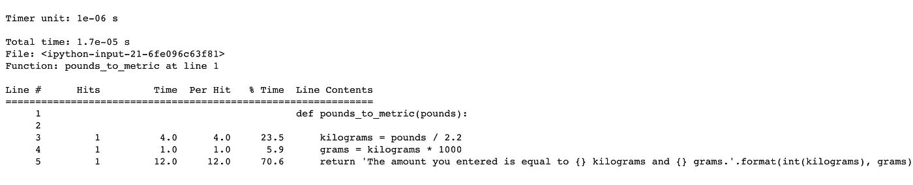

# Python 中代码剖析的快速简易指南

> 原文：<https://towardsdatascience.com/a-quick-and-easy-guide-to-code-profiling-in-python-58c0ed7e602b?source=collection_archive---------19----------------------->

## 编程；编排

## 使用线路分析器查找函数中的瓶颈


来源:unDraw.co

## **简介**

作为一名数据科学家，你的大部分时间应该花在数据争论和/或训练机器学习模型等任务上。然而，您会发现，当您的代码似乎永远无法执行时，这种情况很快就会消失。出于这个原因，当您需要评估应用程序中的瓶颈并节省您的宝贵时间时，代码剖析就来了。我们今天文章的主角将是 [line_profiler](https://pypi.org/project/line-profiler/) 包，我们将使用它来逐行剖析一个函数的运行时，这样我们就可以让您更接近代码效率天堂。开始侧写吧！

注意，对于本文，我将使用 python 笔记本(。ipynb ),因为我发现它们非常适合于实验，这使它们成为一个很好的代码剖析工具，因为您会频繁地对更高效的代码进行修改。

## 什么是代码剖析？

简而言之，代码分析是一种用于检测每个函数或代码行运行时间以及执行频率的方法。这是找到代码中的瓶颈，从而理解如何优化代码的重要一步。我们的方法本质上是定量的，因为它在代码的各个行上产生汇总统计。因此，它为您的代码的哪些部分需要进一步优化提供了可操作的见解。

## 如何分析一个函数

探索如何分析我们的代码的最好方法是用一个例子。假设我们有一个简单的函数，将磅转换为千克和克，如下所示:

```
def pounds_to_metric(pounds):
  kilograms = pounds / 2.2
  grams = kilograms * 1000
  return 'The amount you entered is equal to {} kilograms and {} grams.'.format(int(kilograms), grams)
```

**快速肮脏的方法:%timeit**

如果我们想得到这个函数的估计运行时间，我们可以使用 IPython 的 timeit [神奇函数](https://ipython.readthedocs.io/en/stable/interactive/magics.html)，它将给出总的执行时间。

```
%timeit pounds_to_metric(115)
```

> 跑得最慢的人比跑得最快的人多花了 11.57 倍的时间。这可能意味着正在缓存中间结果。1000000 次循环，最佳 5 次:每次循环 1.27 秒

从输出中，我们可以看到执行了多次运行和循环。% time 它多次运行示例代码，并提供对代码执行时间的估计，使其更准确地表示实际运行时间，而不仅仅依赖于一次迭代。输出中显示的平均值是考虑到多次运行中的每一次运行的运行时间的汇总。

**严格的方法:线路剖面仪**

因为%timeit 只对一行代码计时，所以当我们想要快速评估一个函数的运行时性能时，它就派上了用场。然而，不难看出为什么这不能很好地扩展到更大的代码块。因此，如果我们想知道函数中的每一行运行了多长时间，这就是 line profiler 包派上用场的地方。

因为这个包不是 Python 标准库的一部分，我们需要单独安装它。这可以通过 pip install 命令轻松完成。接下来，我们将它加载到会话中，如下所示。

```
%load_ext line_profiler
```

我们现在可以使用 line profiler 的神奇命令%lprun 来评估 pounds_to_metric 函数中特定代码行的运行时。首先，我们使用-f 标志来指定我们要分析的函数，后跟我们要分析的函数。注意，函数名的传递不带任何括号。最后，我们指定我们想要分析的确切函数调用，以及任何必需的参数。我会像之前一样用 115 作为磅数。

```
%lprun -f pounds_to_metric pounds_to_metric(115)
```

## 分析统计数据

运行前面一行代码会生成一个总结分析统计信息的表，如下所示。



作者图片

现在，让我们浏览一下汇总表的各个列！

首先，显示指定函数**行号**的列，随后是显示该行被执行次数的**命中**列。接下来，**时间**列显示了每一行执行所花费的总时间。该列使用一个特定的计时器单位，可以在输出的第一行中找到。这里，计时器单位使用科学记数法(1e-06)以微秒为单位列出。例如，我们可以看到第五行花了 12 个定时器单位，或者说，大约 13 微秒来运行。

此外, **Per Hit** 列给出了执行一行所花费的平均时间，通过将 time 列除以 Hits 列来计算。假设我们在这个函数中的所有点击都等于 1，那么 Time 和 Per Hit 列显示了类似的结果。 **%这可以帮助我们检测在函数中占用最多时间的代码行。最后，在**行内容**列中显示每一行的源代码。很整洁，是吧？**

[Giphy](http://gph.is/1Z8bdu6)

## 结论

至此，我们总结了 Python 中代码剖析的快速简单指南。回想一下，我们讨论了如何使用 line-profiler 模块评估函数的性能，以及为什么这种方法比使用%timeit 更好。我希望这篇文章对你有用，欢迎在评论中提问。如果你喜欢这篇文章，一定要看看我在 Medium 上的其他文章。快乐剖析！