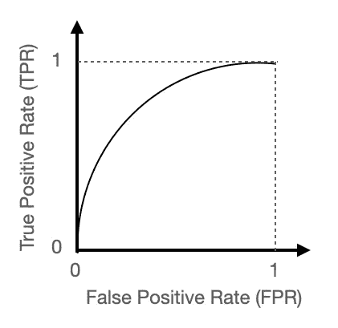
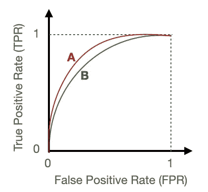
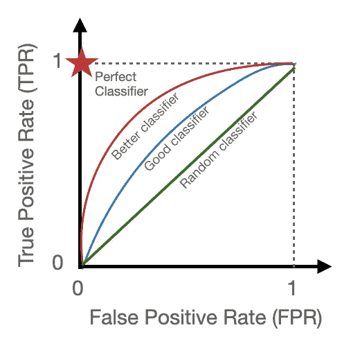

# 机器学习模型中 AUC-ROC 的快速指南

> 原文：<https://towardsdatascience.com/a-quick-guide-to-auc-roc-in-machine-learning-models-f0aedb78fbad?source=collection_archive---------27----------------------->

## 比较分类模型有效性的简单且健壮的方法不应该由于太多不同的定义而变得复杂。

机器学习最常见的应用之一是将实体分为两个不同的、不重叠的类别。这些年来，人们已经设计出了几种方法，从非常简单的[到更加复杂的](https://en.wikipedia.org/wiki/Linear_classifier)[到近乎于](http://scikit-learn.org/stable/modules/generated/sklearn.tree.DecisionTreeClassifier.html)[的黑箱](http://scikit-learn.org/stable/modules/neural_networks_supervised.html)。在处理几乎任何类型的模型时，一个常见的问题是如何比较不同方法的性能，或者不同的参数调整。幸运的是，在二元分类器的情况下，有一个简单的度量抓住了问题的本质:它是[接收器操作特性](https://en.wikipedia.org/wiki/Receiver_operating_characteristic)的曲线(*即*积分)下的面积，因此缩写为 AUC-ROC 或简称为 ROC。

## 处理你的错误

为了便于讨论，假设一个 *tiger vs cat* 二元分类器将实体识别为属于**真阳性** ( *tiger* ，*接受*)或**真阴性** ( *cat* ，*拒绝*)情况。分类器给每个实体分配一个 0 到 1 之间的数字，如果该数字大于给定的阈值(比如 0.5)，则该实体被接受，否则被拒绝。没有一个分类器是完美的，这意味着不到 100%的情况会被正确识别。大多数情况下，它会因为许多原因而误识别事物，特别是小的训练数据集大小和模型的内在限制。很多情况下，我们也在努力拒绝某种形式的“背景噪音”(这里:*猫*)。

传统上，分类错误分为两类，我在下文中将其称为**假阴性** ( *即*老虎被分类为*猫*)和**假阳性** ( *即*猫被识别为*老虎*)。不言而喻，将猫识别为老虎远没有将老虎识别为猫危险:这两种类型的错误通常不会被同等对待，并且根据问题的不同，分类器的参数被优化以最小化任何一种类型。

## ROC 曲线

说了这么多，我们想找到一种简洁的方法来总结分类器的性能。直观地，人们很容易认识到，给定的模型位于参数空间中的一个折衷点，平衡了真阳性(TP)、假阳性(FP)、假阴性(FN)和真阴性(TN)的数量。一旦模型被训练，我们被允许改变的唯一参数是输出概率的阈值。因此，我们从 0 到 1 扫描这个数字，看看性能如何相应地变化。然而，4D 参数空间几乎是直观的！然而，事实证明这些数字中只有四分之二实际上是独立的，所以更容易将它们组合成其他东西来使用。长话短说，这是一个可能的组合:

**真阳性率(TPR)** = TP / (TP + FN) =识别信号的效率(εₛ)(也称**回忆**或**灵敏度** )
**假阳性率(FPR)** = FP / (FP + TN) =低效率(ε_B)拒绝背景

ROC 曲线无非是 TPR 对 FPR，作为产出概率的函数来扫描。通常，它看起来有点像这样:



典型的[接收器工作特性](https://en.wikipedia.org/wiki/Receiver_operating_characteristic) (ROC)曲线示例。图片作者。

另类组合怎么样？当然，如果你看一看[维基百科页面](https://en.wikipedia.org/wiki/Receiver_operating_characteristic)，你会发现关于[敏感度](https://en.wikipedia.org/wiki/Sensitivity_(test))、[召回率](https://en.wikipedia.org/wiki/Precision_and_recall#Recall)、[命中率](https://en.wikipedia.org/wiki/Hit_rate)，或[真阳性率](https://en.wikipedia.org/wiki/Sensitivity_(test))、[特异性](https://en.wikipedia.org/wiki/Specificity_(tests))、[选择性](https://en.wikipedia.org/wiki/Specificity_(tests))或[真阴性率](https://en.wikipedia.org/wiki/Specificity_(tests))、[精确度](https://en.wikipedia.org/wiki/Information_retrieval#Precision)或[阳性预测值](https://en.wikipedia.org/wiki/Positive_predictive_value)、[阴性预测值](https://en.wikipedia.org/wiki/Negative_predictive_value) [脱落](https://en.wikipedia.org/wiki/False_positive_rate)或[假阳性率](https://en.wikipedia.org/wiki/False_positive_rate)、[假发现率](https://en.wikipedia.org/wiki/False_discovery_rate)、[假遗漏率](https://en.wikipedia.org/wiki/Positive_and_negative_predictive_values)、[流行阈值](https://en.wikipedia.org/wiki/Prevalence_threshold)、威胁分值(TS)或关键成功指数(CSI)、[准确度](https://en.wikipedia.org/wiki/Accuracy)、平衡准确度、[马修斯相关系数](https://en.wikipedia.org/wiki/Matthews_correlation_coefficient)、[福尔克斯-马洛指数](https://en.wikipedia.org/wiki/Fowlkes%E2%80%93Mallows_index)、[信息量](https://en.wikipedia.org/wiki/Informedness)或庄家 所有这些都是为了说明不同的背景可能需要不同的定义，但这些不一定像 TPR vs FPR 那样直观。

## 解释 ROC 曲线下的面积

假设我们有两个分类器 *A* 和 *B* 。他们的 ROC 曲线如下图所示。哪个性能更好？



两种不同模型的比较。图片作者。

在回答这个之前，我们想做一些考虑。两个分类器都具有在 0 和 1 之间的输出，但是通常两个分类器对于相同的 TFP 或 FPR 值将具有不同的阈值。因此，我们可能想要一个不依赖于阈值的度量，除非我们设计分类器来最小化 FP 或 FN 类型的误差。此外，我们想要一个归一化的数字，*即*可以直接在两者之间进行比较。如果我说分类器 *A* 的分数是 122，分类器 *B* 的分数是 72，那就不好说了……但是如果我们知道分数是在 0 和 1 之间归一化的，那么直接比较就很容易了。

具有这种特性的一个简单函数是——猜猜看？——曲线下的面积，*，即*积分。因为 FPR 和 TPR 都在 0 和 1 之间，所以面积不能小于 0，也不能大于 1。

由于一张图片胜过千言万语，下面这张图片展示了如何通过查看 AUC-ROC 来发现不同分类器的性能:



如何一眼看出哪个是最好的分类器的总结？图片作者。

在实践中，您可能最终会使用某个预定义库中的函数，比如来自 [scikit-learn](https://scikit-learn.org/stable/modules/generated/sklearn.metrics.roc_auc_score.html) 的函数。该函数需要真实标签，以便将阈值扫描的结果与真实情况进行比较。

```
from sklearn.datasets import load_breast_cancer
from sklearn.linear_model import LogisticRegression
from sklearn.metrics import roc_auc_score
X, y = load_breast_cancer(return_X_y=True)
clf = LogisticRegression(solver="liblinear", random_state=0).fit(X, y)
roc_auc_score(y, clf.predict_proba(X)[:, 1])
0.99
```

这也适用于多类吗？的确是这样:只要画出一个类与其他类的对比图。

## 结论

计算[接收器工作特性](https://en.wikipedia.org/wiki/Receiver_operating_characteristic)曲线下的面积是比较不同分类器有效性的最直观的工具。虽然有一些已知的限制，例如，当你想最小化某些类型的错误时，这可能是说服任何人分类器比随机选择答案做得更好的最有效的方法。需要注意的是，比较不同的分类器，特别是属于不同类别的分类器，通常需要更加仔细的思考，例如，训练决策树所需的数据集可能比训练深度神经网络所需的数据集小，但它们在某些特定边缘情况下的效率可能很微妙，仅通过查看单个数字(如 AUC-ROC)很难发现。