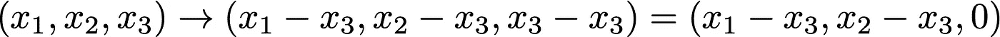

# 交叉熵损失函数快速指南

> 原文：<https://towardsdatascience.com/a-quick-guide-to-cross-entropy-loss-function-8f3410ec6ab1?source=collection_archive---------35----------------------->

## [实践教程](https://towardsdatascience.com/tagged/hands-on-tutorials)

## 多类别分类是机器学习中的常见问题。让我们深入研究一下最常用的损失函数的定义。

机器学习历来擅长的最突出的任务之一是将项目(*例如*图像、[文档](/classifying-scientific-papers-with-universal-sentence-embeddings-4e0695b70c44)，声音)分类成不同的类别。特别是近年来，能够执行数学模型的硬件的进步，如[卷积](https://en.wikipedia.org/wiki/Convolutional_neural_network)神经网络(CNNs)和[递归神经网络](https://en.wikipedia.org/wiki/Recurrent_neural_network) (RNNs，LSTMs)，使得在性能上实现量子飞跃([有时](https://www.tensorflow.org/quantum/tutorials/qcnn)字面意思)成为可能。然而，定义模型只是故事的一半。为了找到执行这一任务的最佳参数，还需要定义一个成本或损失函数，该函数捕捉我们想要优化的本质，并执行某种形式的梯度下降以达到一组合适的参数。

Jan Antonin Kolar 通过 Unsplash.com 拍摄的照片。

## 从多项式概率分布到交叉熵

首先，我们需要定义一个描述我们问题的统计框架。通常情况下，属于一个系统的每个项目(*例如*一只宠物的图片)可以被唯一地分配到 *C* ≥ 2 个可能的离散类别(*例如*猫、狗、金鱼)中的一个。对于每个训练示例 *i* ，我们都有一个基础事实标签( *t_i* )。此外，我们的模型输出一个由 *C* 个数字组成的向量，这个向量必须被解释为 j ∈ [1，…， *C* 是正确的类别的概率。总结一下:

1.  每个观察都有离散的可能结果；
2.  对于每个观察值，每个类别都有一个给定的发生概率( *p* _1、…、 *p* _ *C* )，使得*p*_ 1+…+*p*_*C*= 1，并且对于所有*j**p _ j*≥0；
3.  有 *N 个*观测值，每个观测值都是相互独立的；

如果是这样的话，那么，你很幸运！每个可能的结果都由所谓的[二项式](https://en.wikipedia.org/wiki/Binomial_distribution)概率分布来描述，每个独立试验类别 *j* 中的*即*是具有概率 *p_j* 的正确结果。当我们将试验扩展到*C*2 类时，相应的概率分布称为[多项式](https://en.wikipedia.org/wiki/Multinomial_distribution)。为了简单起见，忽略归一化因子，它看起来是这样的:

多项式概率分布的定义，直到一个归一化因子。图片作者。

正如优化问题中经常出现的情况，当算法在计算机中实现时，处理乘积的最大值可能会引起数值问题。相反，最好使用前面带负号的同一个函数的对数，在参数空间中搜索它的*最小值*。这通常被称为[对数可能性](https://www.statlect.com/glossary/log-likelihood)。记住 log 函数的[属性，该公式转化为:](http://dl.uncw.edu/digilib/Mathematics/Algebra/mat111hb/EandL/logprop/logprop.html)

多项式概率分布的对数似然，直到一个常数，它可以被重新吸收到优化问题的定义中。图片作者。

一些读者可能已经认识到这个功能:它通常被称为[交叉熵](https://en.wikipedia.org/wiki/Cross_entropy)，因为它与从[信息论](https://en.wikipedia.org/wiki/Entropy_(information_theory))中已知的一个量相关，以编码一个人需要多少内存*例如*来传输一条消息。

简而言之，我们将优化我们的模型的参数，以最小化上面定义的交叉熵函数，其中输出对应于 *p_j* ，真实标签对应于 *n_j* 。值得注意的是，真正的标签通常由一个[独热编码](https://en.wikipedia.org/wiki/One-hot)、*即*向量来表示，该向量的元素除了在对应于正类的索引处的元素之外都是 0。在我们的例子中，`cat=(1,0,0)`、`dog=(0,1,0)`和`goldfish=(0,0,1)`。这意味着总和`logP`减少到单个元素`n_m log p_m`，其中 *m* 是正类的索引。

## 将模型输出转换成概率向量

一般来说，ML 模型的输出( *logits* )不能被解释为不同结果的*概率*，而是一组浮点数。如何解读这个元组就看我们自己了。如上所述，为了成为概率向量，*p*_ 1+…+*p*_*C*= 1 且 *p_j* ≥ 0 对于所有 *j* 。

在**二元分类的情况下，**用于将*唯一输出数*转换成概率的最常用函数是 [sigmoid 函数](https://en.wikipedia.org/wiki/Sigmoid_function)，也称为*逻辑曲线*:

s 形函数的定义。图片作者。

*s 形管*“挤压”接近 0 的负值和+1 的正值:

范围从-10 到 10 的 Sigmoid 函数。图片由作者提供，用 [Wolfram:Alpha](https://www.wolframalpha.com/input/?i=plot+1%2F%281%2Be%5E-x%29+from+-10+to+10) 制作。

在**多类**的情况下，需要一个扩展 sigmoid 的函数，以便处理代表跨越 *C* 可能类的概率的向量。最常用的函数叫做 *Softmax:*

Softmax 函数的定义。图片作者。

可以看到，每个元素依赖于所有剩余的 *N_C-1* 元素的值。这很好，因为我们希望概率被标准化。事实上，由于指数函数的[属性， *softmax* 强制所有元素为*x _ I*0，并且所有元素的总和为 1。这样，应用于*逻辑*的 *softmax* 的输出可以被解释为跨可能类别的概率向量。](https://byjus.com/maths/exponential-functions/)

然而，需要注意的一点是，指数函数可能会使大数字变得更大，以至于它们可能不再适合计算机的内存。幸运的是，有一个常用的技巧来避免这种情况。在我们只有三个类别的情况下，更容易看到它的作用。

Softmax 函数应用于具有三个元素的 logit 向量。

首先，我们确定向量的最大元素。假设是 *x_3* 。然后，我们将 logits 向量转换如下:

记住 e⁰=1，我们现在应用 *softmax* :

如果你不相信这个向量与没有减去 *x_3* 的向量相同，看看第三个元素:

因此，由于指数函数的一个属性，我们可以从 *softmax* 的计算中“移除”最大的元素，并可能避免内存问题。我觉得这个解决方案至少非常优雅！

这里有一个利用 [NumPy](https://numpy.org/) 的快速 python 实现:

softmax 的 Python 实现，使用 NumPy 计算指数。

## **结论**

我经常发现交叉熵的大多数解释令人困惑，因为他们把车放在了马的前面。事实上，我们可以从函数定义开始，然后让读者相信这是正确的，但是我更喜欢从头开始。

我希望这篇帖子澄清为什么我们在多类分类任务中需要这样的函数，为什么我们不能只在损失函数中使用模型输出。