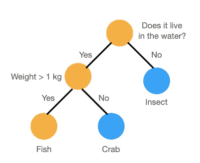
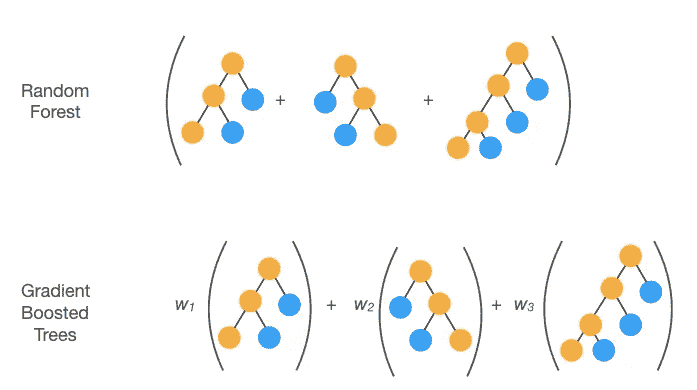

# 决策树快速指南

> 原文：<https://towardsdatascience.com/a-quick-guide-to-decision-trees-bbd2f22f7f18?source=collection_archive---------34----------------------->

## 很容易迷茫，只见树木不见森林。让我们仔细看看机器学习中的一些最常见的方法，以分析分类和回归任务的异构数据。

决策树是一种非常常见、直观且易于解释的数据分析方法，其目标是将实体分成不同的组(分类)或预测数量(回归)。DT 在处理异质的非标准化输入特征方面也很出色(*例如*分类的和连续的)。

有什么不喜欢的？


由[汤姆·帕森斯](https://unsplash.com/@tomzzlee?utm_source=unsplash&utm_medium=referral&utm_content=creditCopyText)在 [Unsplash](https://unsplash.com/s/photos/forest-fork?utm_source=unsplash&utm_medium=referral&utm_content=creditCopyText) 拍摄的照片

首先，一个简单的**决策树** (DT)是一系列的二元决策，接受一组输入特征，并基于这些特征分割输入数据，其方式类似于流行的游戏，如 *10 个问题*或*猜猜我是什么动物*。二元问题/答案对的路径可以存储为图形或一组规则。



基本决策树的例子。图片作者。

可以创建具有多个最大可能节点的单个决策树，然后对其进行训练以优化目标函数。有许多常见的算法，如[c 4.5](https://en.wikipedia.org/wiki/C4.5_algorithm)(ID3 的继承者)和 [CART](https://machinelearningmastery.com/classification-and-regression-trees-for-machine-learning/) (分类和回归树)。例如，在 CART 中,[基尼指数](https://www.learnbymarketing.com/481/decision-tree-flavors-gini-info-gain/#:~:text=Summary%3A%20The%20Gini%20Index%20is,2)%20of%20that%20class%20probability.)被用作成本函数来测量分裂样本的“纯度”,而 C4.5 利用[信息熵](/entropy-how-decision-trees-make-decisions-2946b9c18c8)来丰富任一类的叶子。所有算法都实现了一个停止条件，例如每个叶子中元素的最小数量(例如上图中的*【昆虫】)或者是否达到了节点的最大数量(例如上图中的*【鱼】和【蟹】)。在一个树被训练后，一个[修剪程序](https://en.wikipedia.org/wiki/Decision_tree_pruning)通常被应用来减少节点的数量:更简单的树是优选的，因为它们不太可能过度拟合数据，并且可以说花费更少的时间来执行。**

**虽然决策树简单且易于解释，但它们往往会过度拟合数据。然而，优势在于数量:boosting 和 ensemble 方法可以有效地克服这个问题。**

****决策树**顾名思义，是从一组简单的决策树中构建的，这些决策树被用作“弱”分类器。根据树的组合方式定义了不同的方法。**

**[**随机森林**](https://en.wikipedia.org/wiki/Random_forest)**【RF’s】**，这大概是最直观的，在分类中利用多数票或者在回归中平均。在这种情况下，每棵树输出*，例如*类别索引(0 或 1)。最常见的答案作为最终结果。为了避免过度拟合，每个弱分类器在数据的子样本(具有替换)上被训练，并且仅利用输入特征的子集。这种双重欠采样过程简称为 [*自举聚合*](https://en.wikipedia.org/wiki/Bootstrap_aggregating) 或*打包*。在不平衡数据集的情况下，应用类权重是一个常见的过程。有趣的是，随机森林也用于创建输入要素的稀疏[矢量嵌入](https://www.pinecone.io/learn/vector-embeddings/)。[的基本思想](https://scikit-learn.org/stable/modules/generated/sklearn.ensemble.RandomTreesEmbedding.html)是对节点序列进行矢量化，并将它们保存在二进制元素的向量中。根据停止标准，向量的大小为`n_estimators * max_nodes`或`n_estimators * max_depth`。这种向量可以通过非常高效的线性分类器进行分析*，例如*(例如参见 scikit-learn 网站上的[本教程](https://scikit-learn.org/stable/auto_examples/ensemble/plot_random_forest_embedding.html))。**

**另一方面， [**梯度提升树**](https://en.wikipedia.org/wiki/Gradient_boosting#Gradient_tree_boosting)**【GBDT】**为每个“弱分类器”*【h(x)*分配不同的非负权重 *w* ( *即*一个相对重要性)，最终判决为 *w_i * h_i(x)* 之和。 *boosting* 其实就是把很多顺序连接的弱学习者组合起来，达到更好的效果。在这种方法中，通过添加越来越好的树来提高每一步的分类精度，从而最小化目标函数。为此，第 *i* 第 *F_i* 在第 *(i-1)* 第*树 F _(I-1)*y—F _(I-1)*的残差上被训练。权重序列(*w1*、*w2*、…、 *w_N* )结果是递减的，*即*每棵树都是泰勒级数展开中的一种高阶修正。有关更多详细信息，请参考 [xgboost](https://xgboost.readthedocs.io/en/latest/tutorials/model.html) 库的文档，这可能是该算法最常见的实现。有趣的是，增强决策树在实验物理学中扮演着重要的角色，例如在欧洲核子研究中心对基本粒子属性的测量。***

**

*两种最流行的集成方法的视觉总结:随机森林(上)和梯度增强树(下)。图片作者。*

*在我们结束这场讨论之前，值得一提的是，自 2021 年 5 月下旬以来，谷歌的机器学习库 [TensorFlow](https://www.tensorflow.org/) 也提供了一个决策森林和梯度提升的实现，被恰当地称为 [TensorFlow 决策森林(TF-DF)](https://blog.tensorflow.org/2021/05/introducing-tensorflow-decision-forests.html) 。按照网站上的例子和 [Colab 笔记本](https://www.tensorflow.org/decision_forests/tutorials/beginner_colab)，人们可以创建一个决策森林，并非常容易地适应[熊猫数据框架](https://pandas.pydata.org/docs/reference/api/pandas.DataFrame.html)，*例如*:*

```
*# Install TensorFlow Decision Forests
!pip install tensorflow_decision_forests

# Load TensorFlow Decision Forests
import tensorflow_decision_forests as tfdf

# Load the training dataset using pandas
import pandas
train_df = pandas.read_csv("dataset.csv")

# Convert the pandas dataframe into a TensorFlow dataset
train_ds = tfdf.keras.pd_dataframe_to_tf_dataset(train_df, label="category")

# Train the model
model = tfdf.keras.RandomForestModel()
model.fit(train_ds)*
```

*有趣的是，该库还提供了一些可视化工具来检查模型，*例如* `tfdf.model_plotter.plot_model_in_colab(model, tree_idx=0)`。*