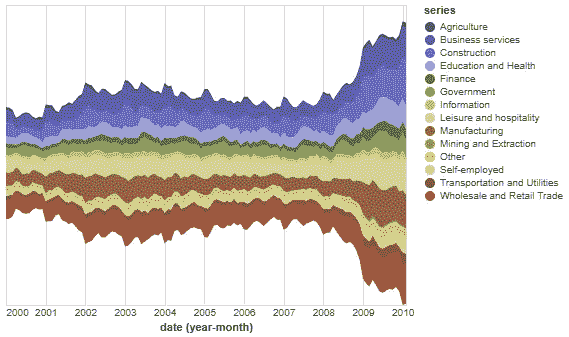

# Python 流图快速入门

> 原文：<https://towardsdatascience.com/a-quick-introduction-into-stream-graphs-with-python-33ff4493ccc?source=collection_archive---------32----------------------->

## 使用 altair 可视化库


杰夫·塞奇威克的图片来自 [Unsplash](https://unsplash.com/)

# 什么是流图？

**河流图**是堆叠面积图的变体，通过使用流动的有机形状来显示不同类别的数据随时间的变化，从而创造出美观的河流/溪流外观。与堆积面积图不同，堆积面积图在固定的直轴上绘制数据，而流图的值在变化的中心基线周围移动。

流图中的每个单独的流形状与其类别的值成比例。颜色既可以用来区分每个类别，也可以通过改变颜色深浅来显示每个类别的附加定量值。

> 流图非常适合于显示大量数据集，以便发现各种类别随时间变化的趋势和模式。

流图的缺点是类别可能会被大型数据集弄得杂乱无章，使它们难以阅读和理解。

因此，流图应该留给不打算破译或探索数据细节的读者。流图更适合给出更全面的概述。

*更多关于流图的阅读，请查看以下链接:*

<https://www.data-to-viz.com/graph/streamgraph.html#:~:text=A%20Stream%20graph%20is%20a%20type%20of%20stacked%20area%20chart.&text=Contrary%20to%20a%20stacked%20area,a%20flowing%20and%20organic%20shape>  <https://en.wikipedia.org/wiki/Streamgraph>  

# 用 Python 制作流图

对于这个例子，我们将使用 Altair，它是 python 中的一个图形库。Altair 是一个声明式统计可视化库，基于 Vega 和 Vega-Lite。源代码可以在 [GitHub](http://github.com/altair-viz/altair) 上获得。

<https://altair-viz.github.io/>  

为了开始创建我们的流图，我们需要首先安装 *Altair* 和 *vega_datasets* 。

```
!pip install altair
!pip install vega_datasets
```

现在，让我们使用*牛郎星*和*织女星数据集*创建一个交互式**流图**来查看多个行业 10 年间的失业数据。

```
**import** **altair** **as** **alt**
**from** **vega_datasets** **import** data

source = data.unemployment_across_industries.url

alt.Chart(source).mark_area().encode(
    alt.X('yearmonth(date):T',
        axis=alt.Axis(format='%Y', domain=**False**, tickSize=0)
    ),
    alt.Y('sum(count):Q', stack='center', axis=**None**),
    alt.Color('series:N',
        scale=alt.Scale(scheme='category20b')
    )
).interactive()
```

使用上面的代码后，您应该能够看到类似这样的内容。



牛郎星流图

这里的流图允许我们快速解释数据中的比例变化。总的来说，我们可以看到 2008 年后所有行业的失业率都在上升。

# 结论

就是这样！现在前进，创建您自己的流图数据可视化。更多关于流图的资源和教程，请点击下面的链接。

  <https://www.r-graph-gallery.com/154-basic-interactive-streamgraph-2.html>  <http://bl.ocks.org/mbostock/582915>  

# 有关系的

</making-it-rain-with-raincloud-plots-496c39a2756f>  <https://medium.com/geekculture/visualizing-human-motion-capture-data-with-d3-js-2acca2a49cff>  <https://medium.com/new-health/visualizing-brain-waves-with-python-24847de94266>  

# 感谢您的阅读！！